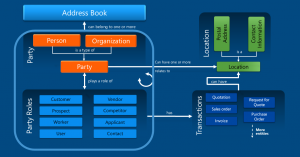

---
# required metadata

title: Global address book
description: The global address book can help you understand the relationships among people and organizations that are associated with your organization. For example, a customer may also be a vendor in a marketing campaign, or a worker in your organization may also be a vendor.
author: ShivamPandey-msft
manager: AnnBe
ms.date: 07/05/2017
ms.topic: article
ms.prod: 
ms.service: dynamics-ax-applications
ms.technology: 

# optional metadata

ms.search.form: DirPartyTable, DirPartyTableRoles
# ROBOTS: 
audience: IT Pro
# ms.devlang: 
ms.reviewer: kfend
ms.search.scope: Core, Operations
# ms.tgt_pltfrm: 
ms.custom: 23521
ms.assetid: bb6c02fa-cd91-4ca8-a58c-020502b19074
ms.search.region: Global
# ms.search.industry: 
ms.author: shpandey
ms.search.validFrom: 2016-02-28
ms.dyn365.ops.version: AX 7.0.0

---

# Global address book

[!include[banner](../includes/banner.md)]

The global address book is a centralized repository for master data that must be stored for all internal and external persons and organizations that the company interacts with. The data that is associated with party records includes the party's name, address, and contact information. Other details vary, depending on whether the party is a person or an organization. Each party record is assigned to a party, and each party can be associated with one or more party roles in a company. Party roles include customer, prospect, worker, user, vendor, competitor, applicant, and contact. For example, the organization party First Up Consultants, can be associated with customer, business relation, and vendor roles in the CEE company, and can also be associated with the vendor role in the CEU company. Here are some of the benefits of this shared data:

-   The data shows the relationships that people and organizations have with other areas of the company. The relationship between two organizations changes when one organization has multiple roles, such as vendor and customer. Communication between the two organization also changes. There might be special agreements that can be negotiated to encourage a closer partnership with the other organization.
-   Setup and maintenance are easier. For example, when an address changes, the update must be made in only one place. All the other associated records are updated automatically.

## How the global address book works
The following illustration shows how party records, party roles, locations, and transactions interact and relate to an address book. As the illustration shows, a party record can belong to one or more address books. Each party record can store one or more locations, or addresses, and is assigned a party role. The role that is assigned to the party record can have specific transactions types associated with it. The following sections provide more information about party roles, locations, and transaction types. The following image is a graphical representation of the ways that parties, party roles, locations, and transactions interact in relation to the global address book.

 

### Party roles

Roles that are associated with party records are referred to as party roles. There are several party roles, and they can be assigned to both party types, person and organization. Here are the definitions for each party role:

-   **Customer** – Individuals, companies, or other entities who purchase goods and services that are produced by other individuals, companies, or entities.
-   **Prospect** – A party that might provide a service or benefit to a legal entity.
-   **Worker** – A person who assumes the role of an employee or a contractor, and who is paid in exchange for services.
-   **User** – A person who is a user of the system.
-   **Vendor** – A party that supplies products to one or more legal entities in exchange for payment.
-   **Competitor** – A person or organization that provides goods or services that are similar to the goods or services that your business provides.
-   **Applicant** – A person who makes a formal written or electronic request to work for or fill an open position in an organization.
-   **Contact** – A person, either inside or outside your organization, that you have created an entry for. In this entry, you can save information such as the person's street and email addresses, telephone and fax numbers, and webpage URLs.

### Creating new party records

There are two ways to enter party records in the global address book:

-   **Creating a party record when you don't know the role** – When you create a party record and don't know the role type (for example, you don't know whether the party is a customer or an opportunity), you create the record in the global address book. You can select the role type later.
-   **Creating a party record when you know the role** – If you know the role type for the party, you can create a record on the appropriate page for that type. For example, if the party is a customer, you create a record on the **Customer** page. When you create and save a record by using the page for the party's role type, the record is automatically created in the global address book.

### Party roles and transactions

For transactions that are a part of the business processes, multiple parties might be associated with each transaction. An example is a customer that needs to be referenced on project quotations.

### Parties locations, addresses, and contact information

Each party record’s addresses, locations, and contact information are shared across all the party roles that are associated with that party. Therefore, when any of this information is changed, all other associated records are updated accordingly.

### Locations and transactions

When a party role is included in a transaction, the location, address, or contact information of the party can be accessed when transaction details are entered.
