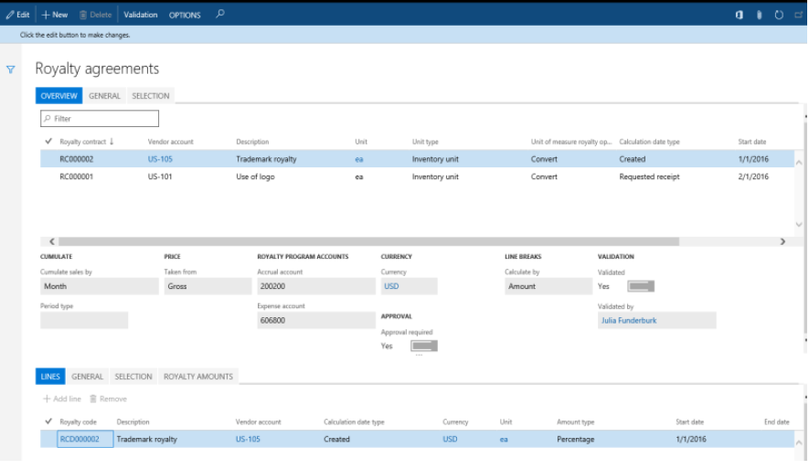

---
# required metadata

title: Royalty contract management
description: This topic describes royalty contract management for Microsoft Dynamics 365 for Finance and Operations.
author: t-benebo
manager: AnnBe
ms.date: 08/02/2018
ms.topic: article
ms.prod: 
ms.service: dynamics-ax-platform
ms.technology: 

# optional metadata

# ms.search.form:  
audience: IT Pro
# ms.devlang: 
ms.reviewer: margoc
ms.search.scope: Operations
# ms.tgt_pltfrm: 
# ms.custom: 
ms.search.region: Global
# ms.search.industry: 
ms.author: t-benebo
ms.search.validFrom: 2018-01-31
ms.dyn365.ops.version: July 2017 update
---

# Royalty contract management

[!include [banner](../includes/banner.md)]

Royalty contract management is intended for companies that exercise the right to use a third party's assets and/or intellectual property. It helps companies better manage their royalty agreements by automating tasks that are involved in administering, tracking, and making royalty payments.

This topic provides a broad overview of the typical process for handling royalty fees:

- Register details of the negotiated royalty contract.
- Run negotiated contracts through ongoing sales, and generate royalty claims.
- Approve and process the generated claims, so that they can be passed on to Accounts payable (A/P) for payment.

## Audience and purpose

The information in this topic is intended for business decision makers in enterprise companies, in capacities such as sales manager, accounting manager, and A/P manager, who have the following responsibilities:

- Negotiating contracts with the licensor
- Recording royalty agreement terms and fee rates in the system
- Managing staff that processes royalty claims and makes fee payments

People in these roles are looking for ways to achieve these goals:

- Flexibly accommodate different definitions of royalty contracts and their conditions.
- Reduce the administrative burden and errors that are associated with tracking and processing royalty claims.
- Improve cash flow forecasts by accruing for future payables and avoiding interest on delayed payments.

## Review the details of a royalty contract

A royalty contract is a record of an agreement with an asset or intellectual property owner. It specifies the negotiated terms and conditions for the licensor to qualify for a monetary reward when the licensee uses its property to obtain revenue.

Royalty contracts are registered on the **Royalty contracts** page. To open the **Royalty contracts** page, select **Accounts payable \> Broker and royalties \> Royalty agreements**.

The **Selection** tab in the lower part of the page shows the products that qualify for a royalty fee.

On the **General** tab in the upper part of the page, several fields provide more details about the agreement's conditions as they were negotiated with the licensor:

- The **Cumulate sales by** field indicates the period that a royalty amount will be calculated for, based on cumulative sales. For example, the period might be a month.
- If the **Approval required** option is set to **Yes**, a royalty program owner must approve the claims before a royalty can be turned into an invoice that is payable to the licensor.
- The **Accrual account** and **Expense account** fields must specify account numbers that will receive accrued amounts during the intermediate stage between approval and processing.

Alternatively, to calculate the royalty amount every time that a sales order line is invoiced, select **Invoice**.

## Identify products that qualify for a royalty fee and generate a claim

When a sales processor creates a sales order for a product that the company has a royalty contract for, if the order line's details qualify for the royalty, the program identifies the future royalty fee.

To see whether an order qualifies for a royalty fee, on **All sales orders** page, find the order. Select the order line, and then select **Sales order line \> View \> Price details**. On the **Price details** page, select the **Royalty** FastTab.

On the **Price details** page, you can see the fee from the valid contract code that is applied to a line. Additionally, on the **Detail** FastTab, under **Margin estimation**, the **Royalty amount** field shows the royalty fee per product unit.

> [!NOTE]
> On the **Procurement and sourcing parameters** page, on the **Prices** tab, verify that the **Enable price details** option is set to **Yes**. If the option is set to **No**, you won't be able to view the rebates.

## Process claims and pass them as payable to A/R

Royalty claims that are generated represent future payments to the licensor. The contract owner cumulates the claims for the relevant period and then creates an interim liability to the licensor by approving those claims.

To view and navigate through a claim, find it in the royalty claim list, and then, on the Action Pane, select **Royalty transactions**. On the Action Pane, select **Accrual journal**. Then, on the journal page, select **Lines**.

Finally, to process a claim, select the claim in the royalty claim list, and then, on the Action Pane, select **Process**.
