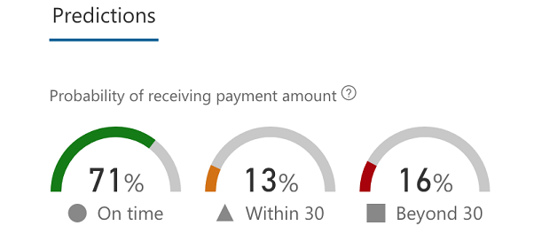
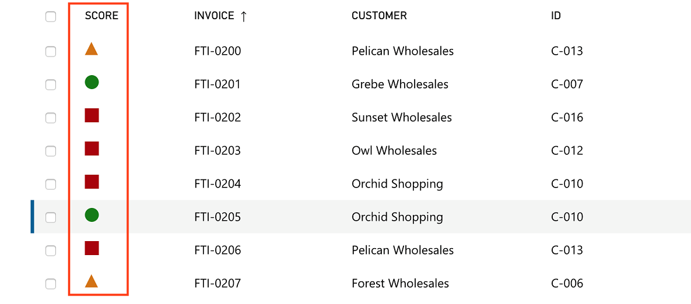
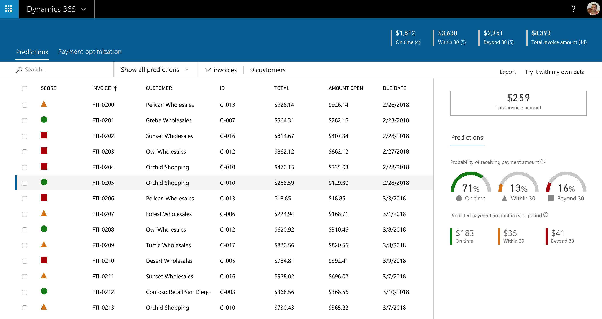
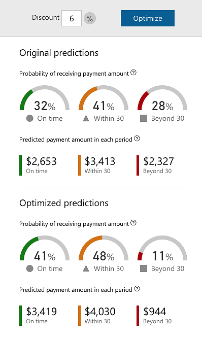
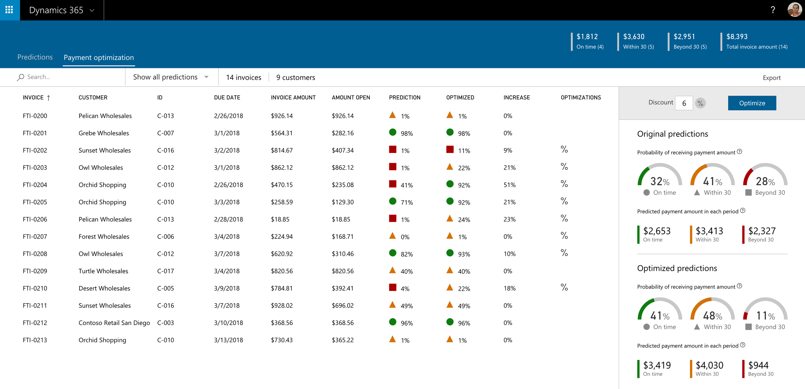

---
# required metadata

title: Customer payment insights
description: This topic describes how Customer payment insights can help predict when an invoice will be paid and help organizations to
create optimization strategies that improve the probability of being paid on time.
author: ShivamPandey-msft
manager: AnnBe
ms.date: 03/27/2018
ms.topic: article
ms.prod: 
ms.service: dynamics-ax-applications
ms.technology: 

# optional metadata

ms.search.form: 
# ROBOTS: 
audience: Application User
# ms.devlang: 
ms.reviewer: twheeloc
ms.search.scope: Core, Operations
# ms.tgt_pltfrm: 
ms.custom: 14531
ms.assetid: e7837cf6-ec69-44b4-8d47-eba38d5c7b1f
ms.search.region: Global
# ms.search.industry: 
ms.author: shpandey
ms.search.validFrom: 2018-04-02
ms.dyn365.ops.version: AX 7.0.0

---

# Customer payment insights

[!include[banner](../includes/banner.md)]

> [!IMPORTANT]
> This feature is part of a targeted release and is only available to users who have opted into the Private Preview. This feature will be included in an upcoming general availability release.

# Overview
========

Organizations often find it challenging to predict when a customer will pay their invoices. This lack of insight leads to less accurate cash flow forecasts, collections processes are started too late, and orders released to customers who may default on their payment. Customer payment insights (preview) enable organizations to predict when an invoice will be paid and helps organizations to create optimization strategies that improve the probability of being paid on time.

## Predictions
===========

Payment predictions will enable organizations to improve their business processes by helping:

-   to easily identify the invoices that are predicted to be paid late

-   to take appropriate measures to improve chances of getting paid on time

Customer payment insights (preview) uses machine learning to predict when a customer will pay for an invoice. It learns from historical invoices, payments and customer data and then creates a machine learning model that is used to predict when an invoice will be paid by a customer.

For each open invoice, Customer payment insights (preview) predicts three payment probabilities:

1.  Probability of payment being made on time (within the invoice due date)

2.  Probability of payment being made within the 30 days of the invoice due date

3.  Probability of payment being made beyond the 30 days of the invoice due date

The probability of payments can be viewed in the prediction section.

Also, each invoice is assigned a winning probability of payment using one of the three predicted payment probabilities buckets defined above. The bucket with the highest probability of payment is the winning bucket.

For example, let’s assume for an invoice the prediction shows a 71% probability the invoice will be paid on time, 13% probability the invoice will be paid within 30 days of due date and 16% probability the invoice will be paid beyond 30 days of due date. The highest probability shows that the invoice will be in the on time bucket, hence the invoice will be tagged with the probability of being paid on time.

## Optimization strategies

In addition to payment predictions, the Customer Payment Insights (preview) can use optimization strategies to improve the chances of getting paid on time. It lets organizations do “What-if” analysis by allowing users to adjust invoice and customer parameters and then compare the corresponding effect on the probability of receiving payment on invoices on time.

For example, an organization may want to evaluate the effect of updating the cash discount on invoices on the probability of receiving the payment on time. When the invoices are optimized to use the new discount, the users can review the effect of applying the discount on the invoice. If the cost of applying the discount is minimal when compared to the benefit of collecting the payment on time, the organization may choose to apply the selected discount to all future open orders.

> [!NOTE] 
> Currently, only discount is available as an optimization strategy for the Customer payment insights (preview).

## How to get Customer payment insights (preview)
==============================================

Please email following \<**alias**\> if you are interested in trying Customer payment insights (preview).

## Privacy Notice
==============

Previews store customer data in the United States. In addition, previews (1) may utilize less privacy and security measures than the Dynamics 365 for Finance and Operations service, (2) are not included in the service level agreement for this service, (3) should not be used to process personal data or other data that is subject to legal or regulatory compliance requirements, and (4) has limited support.
