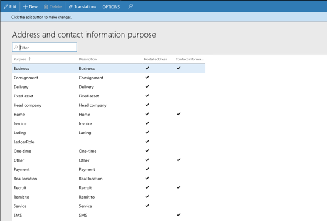
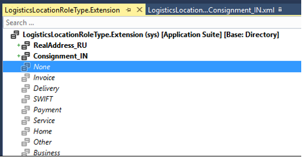
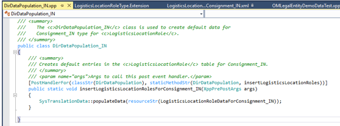
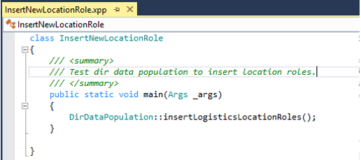
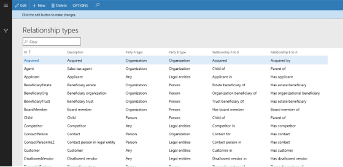
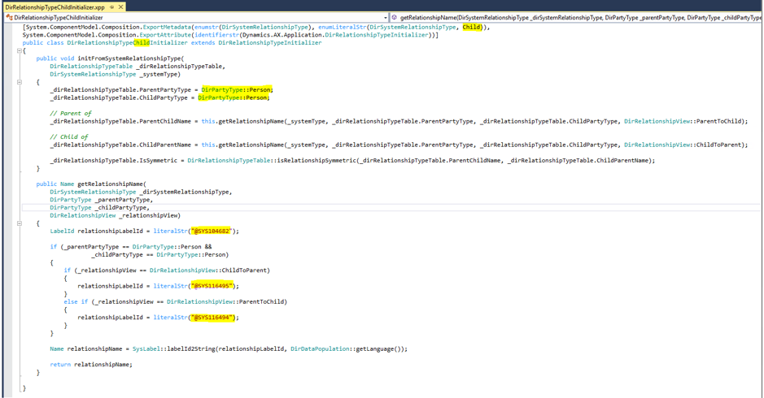
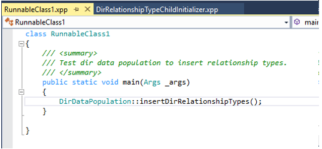

---
# required metadata

title: How to add a new location and party relationship type
description: This article explains how to add a new location and party relationship type.
author: ShivamPandey-msft
manager: AnnBe
ms.date: 05/01/2018
ms.topic: article
ms.prod: 
ms.service: dynamics-ax-applications
ms.technology: 

# optional metadata

ms.search.form: 
# ROBOTS: 
audience: Application User
# ms.devlang: 
ms.reviewer: twheeloc
ms.search.scope: Core, Operations
# ms.tgt_pltfrm: 
ms.custom: 13991
ms.assetid: 2a0a4789-8619-4974-bef9-0923cc848420
ms.search.region: Global
# ms.search.industry: 
ms.author: shpandey
ms.search.validFrom: 2018-05-02
ms.dyn365.ops.version: AX 8.0.0

---

# How to add new location roles, (Address and contact information purpose), and party relationship types 

## Add new location roles (Address and contact information purpose) 

There are two ways to add a new location role:

1.  Add it through the **Address and contact information purpose** page. The new role will be saved into LogisticsLocationRole table with type = 0, which indicates the role is not a system role define in LogisticsLocationRoleType enum and its extensions. A user will be able to use it when creating address or contact information.

    

2.  Add it to LogisticsLocationRoleType enum extension, and let it populate through the dbsync process.

    1.  Create an extension to LogisticsLocationRoleType enum and add the new role in the extension. 
  
        

    2. Create a new resource file for the new role, and then assign value for its properties.
     
     
        
    3.  Create data population class and provide a handler method to populate the new role. 

        

    4.  To test populating the new location role, you can create a runnable class, and call DirDataPopulation::insertLogisticsLocationRoles() in Main(). After it is completed, you should be able to see the new role populated in LogisticsLocationRole table with type \> 0, and the new role will show on the **Address and contact information purpose** page.

        

## Add new party relationship types 

There are 2 ways to add a new relationship type:

1.  Add it through the **Relationship types** page. The new relationship will be saved to DirRelationshipTypeTable with systemtype = 0.

    

2.  Add it to extension of DirSystemRelationshipType enum, and let it populate through DB sync process.

    1.  Create an extension to enum DirSystemRelationshipType and add the new relationship type.

    2. Create an initializer to this new type. You can find several examples in the core code, one of them is  DirRelationshipTypeChildInitialize. This is an initializer class for party relationship type “Child”. You can start with your initializer by copying and pasting this code and then update the highlighted areas.
    
    

    3.  To test populating the new relationship type, you can create a runnable class, and call DirDataPopulation::insertDirRelationshipTypes() in Main(). You should be able to see the new relationship type in the DirRelationshipTypeTable, and the new relationship type will be available in the **Relationship types** page.

        
