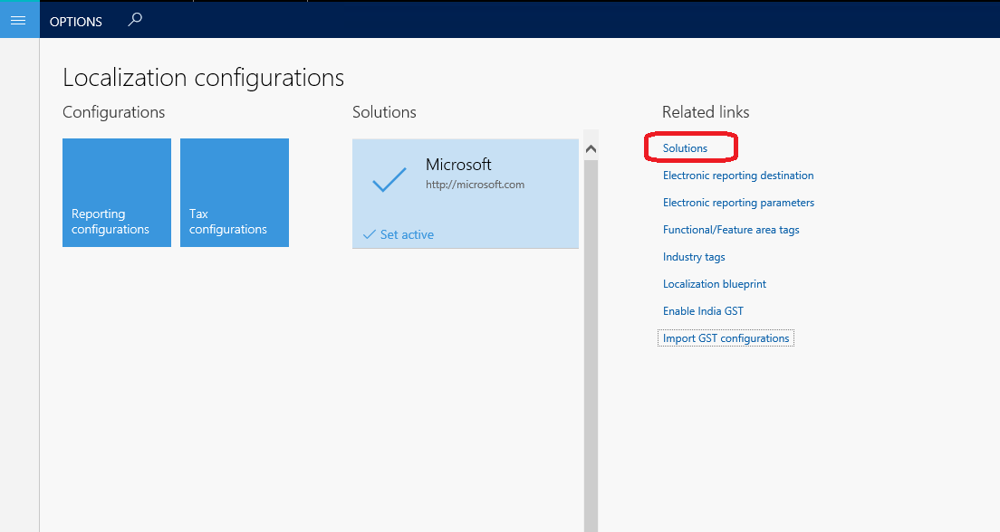
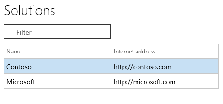
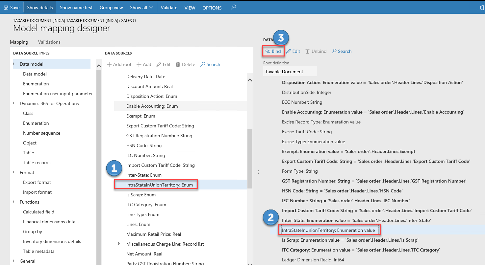
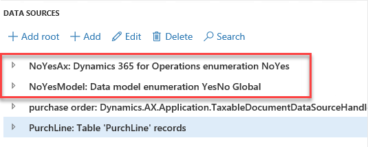
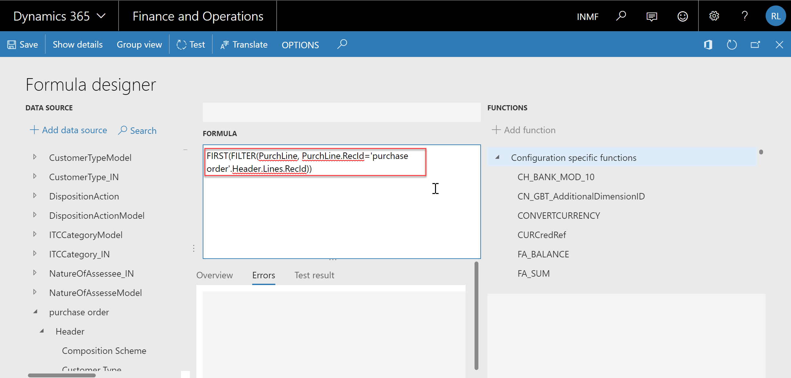
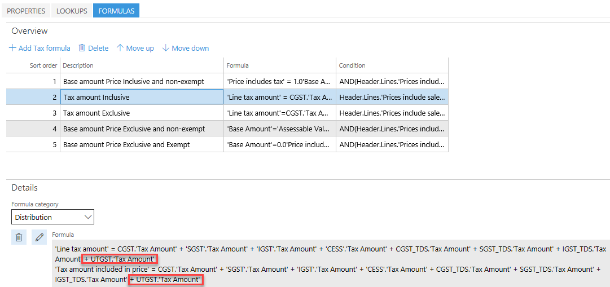
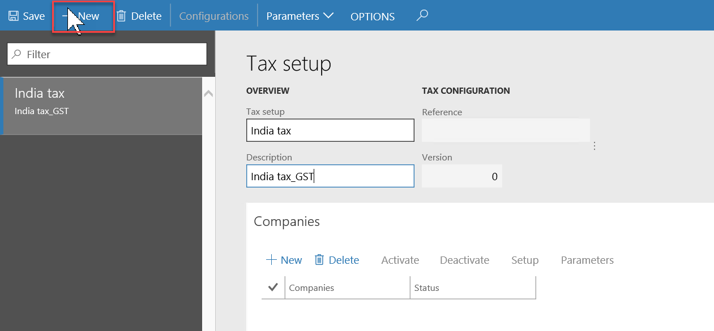
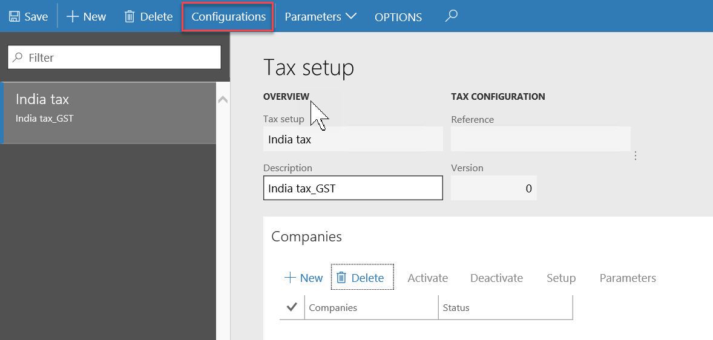
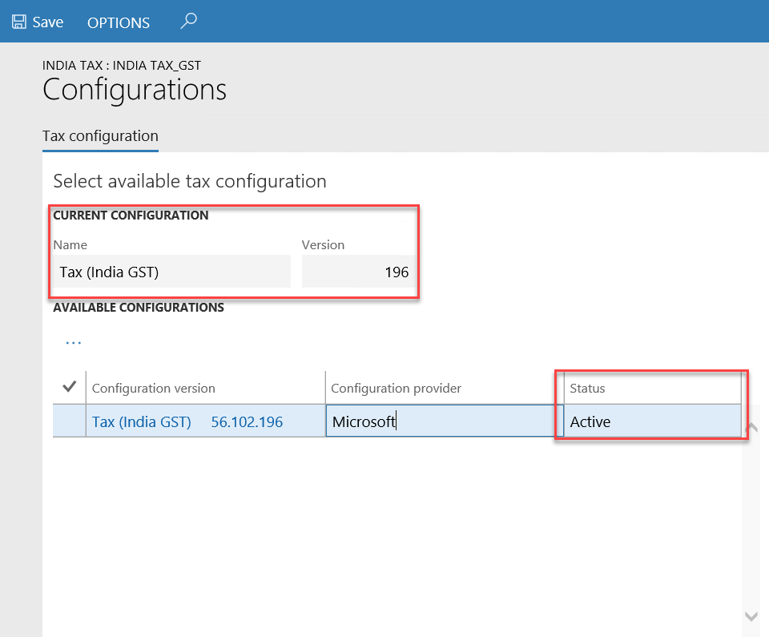
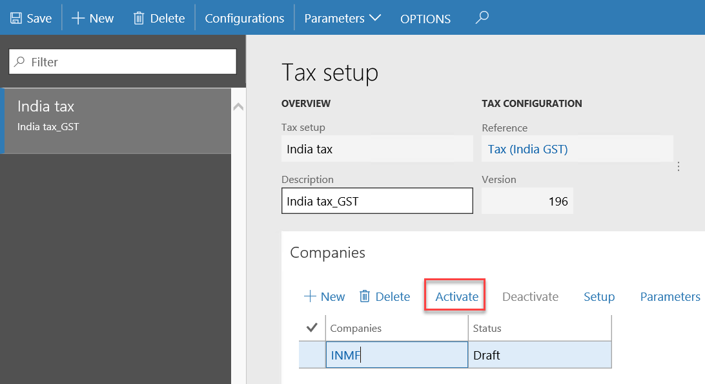

---
# required metadata

title: Tax engine
description: This topic provides information about extending tax engine configurations.
author: yijialuan
manager: AnnBe
ms.date: 12/01/2017
ms.topic: article
ms.prod: 
ms.service: dynamics-ax-applications
ms.technology: 

# optional metadata

#ms.search.form: 
audience: Application User
# ms.devlang: 
ms.reviewer: shylaw
ms.search.scope: Core, Operations
# ms.tgt_pltfrm: 
ms.search.region: Global
# ms.search.industry: 
ms.author: riluan
#ms.search.validFrom:
#ms.dyn365.ops.version: 

---

# Extending tax engine configurations

[!include[banner](../includes/banner.md)]


The Tax Engine (GTE) lets you configure tax rules that determine tax applicability, calculation, posting, and settlement, based on legal and business requirements.

In this topic, you will learn the GTE configuration extension process using the following example scenarios.

-	Extend the GTE configuration for UTGST
-	Apply tax rate of BCD for import order of goods from different countries/regions (Usage of Reference Model)


## Activate the tax configuration

1.	Navigate to **Organization administration** > **Workspaces** > **Electronic reporting** > **Tax configurations**.
2.	Click **Exchange** > **Load from XML files**.

3. Select the configuration file and click **OK** to load the configuration. Repeat step 2 and 3 for Taxable document, Taxable document (India) and Tax (India GST) in sequence.

4.	Click **Solutions**.

5.	Create a new solution and enter the required information.

6. Click **Set active** to activate the new solution.


## Scenario 1: Extend the GTE configuration for UTGST


For union territories that don’t have a legislature, the GST Council introduced UTGST, which is on a par with SGST. UTGST applies to the following union territories of India:

-	Chandigarh
-	Lakshadweep
-	Daman and Diu
-	Dadra and Nagar Haveli
-	Andaman and Nicobar Islands

However, SGST can also be applied in union territories such as New Delhi and Puducherry, which have their own legislatures and can be considered “states” per the GST process.

For UTGST, the following combinations of taxes can be applied for any transaction:

-	Supply of goods and services within a state (intrastate): CGST + SGST
-	Supply of goods and services within union territories (intra-UT): CGST + UTGST
-	Supply of goods and services across states or union territories (interstate/inter-UT): Integrated GST (IGST)

The order of utilization for the Input Tax Credit of UTGST is the same as it is for the Input Tax Credit of SGST. Therefore, Input Tax Credit of SGST or UTGST is first set off against SGST or UTGST, respectively. The Output Tax liabilities and any balance can be set off against IGST Output Tax liabilities.

To support the scenario, the following must be done:
1.	Extend the taxable document so that it includes the **IntraStateInUnionTerritory** flag.
2.	Do data mapping for the extended taxable document to get the value from transaction to GTE
3.	Change the applicability of State GST (SGST).
4.	Add and configure UTGST.
5.	Import the extended configuration and deploy it to a specific company. 


### Task 1: Create extension configurations

#### Task 1.1: Create a new taxable document that is derived from Taxable Document (India)

1. On the **Localization configurations** workspace (**Organization administration** > **Workspaces** > **Electronic reporting**), click **Tax configurations**.
2. In the tree, find the **Taxable Document (India)** configuration, and then click **Create configuration**.
3. Select the **Derive from Taxable document model** option, and then enter a name and description for the derived taxable document. For this example, enter the name **Taxable Document (India Contoso)**.
4. Click **Create configuration**.

#### Task 1.2: Create a new tax document that is derived from Tax (India GST)

1. Navigate to the **Tax (India GST)** configuration, and then click **Create configuration**.
2. Select the **Derive from Tax configuration** option, and then enter a name and description for the derived tax document. For this example, enter the name **Tax (India GST Contoso)**.
3. Click **Create configuration**.

### Task 2: Add the IntraStateInUnionTerritory flag to Taxable Document (India Contoso)

 1. In the tree, find the **Taxable Document (India Contoso)** configuration that you created in task 1.1, and then click **Designer**.
 2. In the tree, go to **Taxable document** \> **Header** \> **Lines**, and then click **New** to create a new node.
 3. Enter a name for the node, and select the item type:
	-	**Name:** IntraStateInUnionTerritory
	-	**Item type:** Enum

	

 4. Click **Add**.
 5. On the **Node** FastTab, click **Switch item reference**.
 6. Select **NoYes** in the tree, and then click **OK**.
 7. Save the configuration, and close the designer.
 8. In the **Configurations** workspace, click **Change status** > **Complete**.

	

 9. Enter a description such as **UTGST**, and then click **OK**.
 10. If there are any errors, open the designer, click **Validate**, and fix the errors.
 11. After the status is updated to **Complete**, the configuration is ready for deployment.
### Task 3: Do data mapping for the extended taxable document
There are data mappings for each taxable document (purchase order, sales order, etc.) and reference mode in taxable document. The purpose of data mapping is to get the value from taxable transactions and pass it into GTE for tax applicability, tax calculation, etc. 
For convenience, there is a special data source called Taxable document source which encapsulates most common tax relevant fields like Assessable Value, HSN, SAC, etc. So, there are following two approaches to fetch and map the value of the additional field to your extended taxable document.

 1. Enable the additional field into the existing Taxable document
     source
 2. Use pure ER (Electronic Reporting) data mapping which you can map any Finance and Operations field by using table records, class,
     etc.
#### Task 3.1: Data mapping by Taxable document source
Before you start this task, be sure to read the **Tax Engine Integration** document where you can find all the details. GTE must determine whether a state is a union territory. Therefore, in this scenario, you will modify the data provider so that it provides this information to GTE.
##### Task 3.1.1: Check the system name of the Union Territory of State master
Go to **Organization administration >Global address book> Addresses > Address setup**. Right-click the **Union territory** column, and then click **Form information>Form Name: LogisticsAddressSetup**. You will see that the system name for the column is **LogisticsAddressState.UnionTerritory_IN**.

##### Task 3.1.2: Add a tax engine model field for intrastate transactions in a union territory
In the AOT, open **Classes > TaxableDocRowDataProviderExtensionLine**, add a const str for intrastate transactions in a union territory.
```
public class TaxableDocRowDataProviderExtensionLine extends TaxableDocumentRowDataProviderExtension
{
    public static const str IsIntraStateInUnionTerritory = 'IntraStateInUnionTerritory';
```
##### Task 3.1.3: Implement logic to determine whether a transaction is an intrastate transaction in a union territory
Add a new method for the **TaxableDocRowDataProviderExtensionLine** class, and implement the determination logic in the method.
```
private NoYes IsIntraStateWithUnionTerritory(TaxableDocumentLineObject _lineObj)
{
    boolean                     isIntraStateWithUnionTerritory = NoYes::No;
    LogisticsPostalAddress      partyAddress;
    LogisticsPostalAddress      taxAddress;
    LogisticsAddressState       partyState;
    SalesPurchJournalLine       documentLineMap;
    TaxModelTaxable_IN          taxModelTaxable;
    documentLineMap = SalesPurchJournalLine::findRecId(_lineObj.getTransactionLineTableId(), _lineObj.getTransactionLineRecordId());
    taxModelTaxable = TaxModelDocLineFactory_IN::newTaxModelDocLine(documentLineMap);
    partyAddress = taxModelTaxable.getPartyLogisticsPostalAddress();
    taxAddress = taxModelTaxable.getTaxLogisticsPostalAddressTable();
    if (partyAddress && taxAddress
        && partyAddress.CountryRegionId == taxAddress.CountryRegionId
        && partyAddress.State != ''
        && taxAddress.State != ''
        && partyAddress.State == taxAddress.State)
    {
        partyState = LogisticsAddressState::find(partyAddress.CountryRegionId, partyAddress.State);
        isIntraStateWithUnionTerritory = partyState.UnionTerritory_IN;
    }
    return  isIntraStateWithUnionTerritory;
}
```
##### Task 3.1.4: Pass the flag to GTE in TaxableDocRowDataProviderExtensionLine.fillInExtensionFields()
```
_lineObj.setFieldValue(IsIntraStateInUnionTerritory, this.IsIntraStateWithUnionTerritory(_lineObj));
```
##### Task 3.1.5: Add the new field in TaxableDocumentRowDataProviderLine. initValidFields ()
```
validFields.add(TaxableDocRowDataProviderExtensionLine::IsIntraStateInUnionTerritory, Types::Enum, enumNum(NoYes));
```
##### Task 3.1.6: Do the data binding in the Designer
1.	Navigate to the **Taxable Document (India Contoso)** configuration, and then click **Designer**.

2.	Click **Map model to datasource**
3.	You will find there are lots of data mapping per each taxable document and reference model, like purchase order, sales order, etc. You need to do your data mapping per your business requirement. Let’s take sales order as an example. Select Sales Order line and click 
**Designer**.

4.	With Task 3.1.1~ 3.1.5, now you should be able to see field IntraStateInUnionTerritory in data source of Sales order\Header\Lines, following the steps in the screen shot below to do the data binding.

5.	Do Task 2 (7~10) to complete the change
#### Task 3.2: Data mapping by pure ER model mapping designer
You should be familiar with the table relation, class, method, etc. so you can use ER model mapping designer efficiently.
1.	Open the model mapping design of purchase order, add table records **PurchLine** as a root data source

2.	Add Data model\Enumeration **YesNo Global** and Dynamics 365 for Operations\Enumeration **NoYes**

3.	Add a calculated field **$PurchLine** in **purchase order** to build the connection between existing taxable document **purchase order** and the table records **PurchLine**, click **Edit formula**.

4.	Input formula which describe the relation between **PurchLine** and **purchase order**

5.	Click **Save**, and close the page
6.	Add calculated field **\$IsIntraStateInUnionTerritory** in **$PurchLine**, the formula is 
```
AND('purchase order'.'$PurchLine'.'initTaxModelDocLine_IN()'.getPartyLogisticsPostalAddress.'>Relations'.State.StateId = 'purchase order'.'$PurchLine'.'initTaxModelDocLine_IN()'.getTaxLogisticsPostalAddress.'>Relations'.State.StateId, 'purchase order'.'$PurchLine'.'initTaxModelDocLine_IN()'.getPartyLogisticsPostalAddress.'>Relations'.State.UnionTerritory_IN = NoYesAx.Yes, 'purchase order'.'$PurchLine'.'initTaxModelDocLine_IN()'.getTaxLogisticsPostalAddress.'>Relations'.State.UnionTerritory_IN = NoYesAx.Yes)
```
7.	Do the data mapping in designer, select **$IntraStateInUnionTerritory** in DATA SOURCES and **IntraStateInUnionTerritory** in DATA MODEL, click **Edit**.

8.	Input formula below to convert Boolean value to the enumeration value which is used by the extended taxable document field IntraStateInUnionTerritory.
```
CASE('purchase order'.'$PurchLine'.'$IsIntraStateInUnionTerritory', true, NoYesModel.Yes, false, NoYesModel.No)
```
9.	Click Save and close the page.
10. Do Task 2 (7~10) to complete the change

### Task 4: Change the data model of Tax (India GST Contoso)

1. Navigate to the **Tax (India GST Contoso)** configuration that you created in task 1.2, and then click **Designer**.
2. Click **Tax document**, and then select **Taxable Document (India Contoso)** as the data model and **1** as the data model version.

	

3. Click **Save** to save the configuration.

### Task 5: Change the applicability of SGST

1. Navigate to the **Tax (India GST Contoso)** configuration, select the version that has a status of **Draft**, and then click **Designer**.
2. Navigate to **Tax document** \> **Header** \> **Lines** \> **GST** \> **SGST**, and then click the **Lookup** tab.
3. Click **Columns**.
4. Select **IntraStateInUnionTerritory** as the lookup column, and then click the right arrow button.
5. For the **IntraStateInUnionTerritory** column, select **No**.
6. Click **Save** to save the configuration.

### Task 6: Configure the UTGST tax component

#### Task 6.1: Add the UTGST tax component

1. Navigate to **Tax document** \> **Header** \> **Lines** \> **GST**, click **Add**, and then select **Tax component**.
2. Enter a name and description for the UTGST tax component, and then click **OK**.

#### Task 6.2: Configure tax measures for the UTGST tax component

1. Expand the tax document tree, and click the UTGST tax component to create a measure for.
2. Click **Add**, and then select **Tax measure**.
3. All the logic (properties, lookups, formulas, postings, accounting, and so on) except applicability of UTGST is the same as it is for SGST. Therefore, add all the tax measures that SGST uses by selecting the existing measures in the list.

	

#### Task 6.3 Configure rate/percentage lookups

1. Expand the **UTGST** tax component node.
2. Select the measure of the **Rate/Percentage** type to create a rate/percentage lookup.
3. Click **Columns** to see a list of the attributes that are relevant to the tax rate/percentage value.
4. Select the same attributes that SGST uses.

	> [!Note]
	> Don’t click **Add**. Values that you enter here have no effect on the actual rate table. That table should be completed at **Tax** \> **Tax configuration** \> **Tax setup**.

5. Save the tax document.

#### Task 6.4: Configure properties

1. Navigate to **Tax document** \> **Header** \> **Lines** \> **GST** \> **UTGST**, and then click the **Properties** tab.
2. Click **Edit** (the pencil symbol) next to **Condition**.
3. Enter the same condition that SGST uses.

	

4. Save the tax document.

#### Task 6.5: Configure tax applicability lookups

1. Navigate to **Tax document** \> **Header** \> **Lines** \> **GST** \> **UTGST**, and then click the **Lookup** tab.
2. Click **Columns**.
3. Select **Import Order** and **IntraStateInUnionTerritory** as lookup columns.
4. Select **Configuration** as the source type, and select **No** for the **Import Order** column and **Yes** for the **IntraStateInUnionTerritory** column.	
5. Save the tax document.

#### Task 6.6 Configure formulas

Formulas can be configured at either the group node level (line, tax component, or tax type) or the measure node level. However, we recommend that you always configure tax calculation formulas at the group node level. Tax amount distribution formulas can be configured at either the group node level or the measure node level.

1. Navigate to **Tax document** \> **Header** \> **Lines** \> **GST** \> **UTGST**, and then click the **Formula** tab.
2. Click **Add Tax formula**.
3. On the **Details** FastTab, select **Formula** as the category, and then click **Edit** (the pencil symbol) to enter the formula and condition.
4. Repeat steps 2 through 3 until the UTGST tax component has all the same formulas as SGST.
5. Save the tax document.

### Task 6.7 Configure a posting profile

Only nodes of the **Tax Component** type support a posting profile definition.

1. Navigate to **Tax document** \> **Header** \> **Lines** \> **GST** \> **UTGST**, and then click the **Postings** tab.
2. Click **Add Posting Profile** to create a new posting profile definition.
3. On the **Details** FastTab, enter the accounting treatment for the various tax measures that you defined in the previous task, and provide the names of the Debit and Credit accounting subledgers.
4. Click **Edit** (the pencil symbol) to enter a condition.
5. Optional: Enter a description for the posting profile.
6. Repeat steps 2 through 5 until the UTGST tax component has all the same posting profiles as SGST.
7. Save the tax document.

#### Task 6.8 Configure accounting lookups

Only nodes of the **Tax Type** and **Tax Component** types support an accounting lookup definition.

1. Navigate to **Tax document** \> **Header** \> **Lines** \> **GST** \> **UTGST**, and then click the **Accounting** tab.
2. Click **Columns** to see a list of the attributes that can be used to determine the main accounts that will be used for accounting taxes.
3. Select the same attributes that SGST uses.

	> [!NOTE]
	> Don’t click **Add**. Values that you enter have no effect on the actual tax main accounts decision table. That table should be completed at **Tax** \> **Tax configuration** \> **Tax setup**.

4. Save the tax document.

#### Task 6.9 Configure credit pools

Only nodes of the **Tax Component** type support a credit pool definition.

1. Expand the **UTGST** tax component node, and then click the **Credit Pool** tab.
2. Click **Columns** to see a list of the attributes that are relevant to the tax settlement of this component. Typically, the selected column is the appropriate tax registration number, like **GST Registration Number**.
3. Select the same attributes that SGST uses.

	> [!NOTE]
	> Don’t click **Add**. Values that you enter here have no effect on the actual rate table. That table should be completed at **Tax** \> **Tax configuration** \> **Tax setup**.

4. Save the tax document.

### Task 7: Modify the formulas of lines so that they reflect UTGST

1. Navigate to **Tax document** \> **Header** \> **Lines**, and then click the **Formulas** tab.
2. Change any formulas that contain the **Base Amount**, **Line tax amount**, and **Tax amount included in price** measures, so that the formulas reflect UTGST.
	For example, change the **Tax amount Inclusive** formula as shown here.

3. Save the tax document.
4. Close the designer.

### Task 8: Complete the tax document configuration

1. Save the configuration, and close the designer.
2. In the **Configurations** workspace, click **Change status**, and then select **Complete**.
3. Enter a description such as **UTGST**, and then click **OK**.
4. If there are any errors, open the designer, click **Validate**, and fix the errors.
5. After the status is updated to **Complete**, the configuration is ready for deployment.

### Task 9: Import the configuration and deploy it to a specific company
1.	Navigate to Tax > Setup > Tax configuration > Tax setup
2.	Create new record and define Tax setup

3.	Click on **Configuration**

4.	Click on **Tax configuration** tab, switch to **Available configurations** and click **New** to create a tax configuration.
> [!NOTE]
> The configuration added to tax gets listed in the Available configuration tab


5.	Select the required configuration, Ex: **Tax (India GST)** and Click Save.

6.	Click on **Synchronize**

7. Click **Activate**.



8.	Click on **Close**
9.	Click **Companies** fast tab
10.	Create new record
11.	Select Companies = INMF

12.	Save the record
13.	Click ‘**Activate**’ to activate the configuration to the company.



14.	Click **Setup** to set up data for the new version.


## Scenario 2: Usage of Reference Model

Per the Microsoft provided configuration, the tax rate of BCD is determined by Preferential Party/Import Order/Import Custom Tariff Code/Export Order/Export Custom Tariff Code. We will use this scenario to explain how to use reference model to support the scenario below:

Apply the different tax rate of BCD for import order of goods from difference countries/regions.

### Task 1: Create extension configuration

1. Do Scenario 1-\>Task 1.

### Task 2: Add Reference model for Country/Region of Origin

1. Navigate to the **Taxable Document (India Contoso)** configuration, and then
    click **Designer**.
2. Click the elipses button, then click **Reference model** to change
    the view to Reference model, so you can view all the available    reference models.

    

3.  Click **New** to add a new reference model.

    -	**Name:** Country of Origin
    -	**Node type:** Model root

4.  Click **Add**.
5.  Highlight **Country of Origin**, click **New** to add new reference model.

    -   **Name:** Countries of Origin
    -   **Node type:** Child of an active node
    -   **Item type:** Record list

6.  Click **Add**.

7.  Highlight **Countries of Origin**, click **New** to add new reference model.

    -   **Name:** Country of Origin
    -   **Node type:** Child of an active node
    -   **Item type:** String

8.  Click **Add**.
9.  Highlight **Country of Origin**, click **Natural key**.

10.  Choose **Country of Origin\\Countries of Origin\\Country of Origin** as the
    **Natural key**.

11.  If there are any errors, open the designer, click **Validate**, and fix the
    errors.

After the status is updated to **Complete**, the configuration is ready for
deployment.

### Task 3: Do data mapping for the reference model
1.	In the designer of **Taxable Document (India Contoso)**, and then click **Map model to datasource**.
2.	Add a new model mapping for the reference model Country of Origin

3.	Open the designer of the model mapping

4.	Add table records **LogisticsAddressCountryRegion** as a root **DATA SOURCES**

5.	Bind the table

6.	Bind the field

7.	Click **Save** and close the page

### Task 4: Link the reference model to field in taxable document

1. Click the elipses button, then click **Taxable document** to change the view to Taxable document.
2. Navigate to **Taxable document** \> **Header** \> **Lines** \> **GST** \> **Country/Region of Origin**.
3. On the **Node** FastTab, click **Select reference model**. 
4. Choose **Country of Origin** for the reference model.
5. Click **OK**.
6. Save the configuration, and close the designer.
7. In the **Configurations** workspace, click **Change status**, and then
    select **Complete**.
8. Enter a description such as **Add reference model for Country of Origin**,
    and then click **OK**.
9. If there are any errors, open the designer, click **Validate**, and fix the
    errors.

After the status is updated to **Complete**, the configuration is ready for deployment.

### Task 5: Change the lookup of BCD tax rate

1.  Navigate to the **Tax (India GST Contoso)** configuration, and then click **Designer**.
2.  Change the data model of **Tax (India GST Contoso)** to the updated version of the extended taxable document follow the steps described in **Scenario 1-\>Task 3**.
3.  Navigate to **Tax document** \> **Header** \> **Lines** \> **Custom Duty** \> **BCD** \> **Rate**, and then click the **Lookup** tab.
4.  Click **Columns**.
5.  Select **Country/Region of Origin** as the lookup column, and then click the right arrow button.
6.  Click **Save** to save the configuration.

### Task 6: Complete the tax document configuration
Please follow the same steps described in **Scenario 1-\>Task 8**.

### Task 7: Import the configuration and deploy it to a specific Company
Please follow the same steps described in **Scenario 1-\>Task 9**.
