---
# required metadata

title: Tax engine
description: This topic provides information about extending tax engine configurations.
author: yijialuan
manager: AnnBe
ms.date: 12/15/2017
ms.topic: article
ms.prod: 
ms.service: dynamics-ax-applications
ms.technology: 

# optional metadata

#ms.search.form: 
audience: IT Pro
# ms.devlang: 
ms.reviewer: shylaw
ms.search.scope: Core, Operations
# ms.tgt_pltfrm: 
ms.search.region: India
# ms.search.industry: 
ms.author: riluan
ms.search.validFrom: 2017-12-31
ms.dyn365.ops.version: 7.3

---

# Extending tax engine configurations

[!include[banner](../includes/banner.md)]


The [Tax engine](tax-engine.md) (also referred to as GTE) lets you configure tax rules that determine tax applicability, calculation, posting, and settlement, based on legal and business requirements. This topic walks you through the Tax engine configuration extension process using the following example scenarios that apply to India.

-	Extend the Tax engine configuration for Union Territory Goods and Services Tax (UTGST).
-	Use a reference model to apply a tax rate of Basic Customs Duty (BCD) for import order of goods from different countries/regions.

> [!NOTE]
> The Tax engine functionality is only available for legal entities with a primary address in India.

The following tax terms are mentioned in this topic.

|Tax term | Full name|
|-----|-----------|
|GST | Goods and services Tax|
|UTGST | Union Territory Goods and Services Tax|
|CGST | Central Goods and Services Tax|
|IGST | Integrated Goods and Services Tax |
|BCD| Basic Customs Duty|

## Prerequisites
Before you can complete the example scenarios, complete the following tasks.

### Create a Lifecycle Services (LCS) configuration repository
1. Go to **Organization administration** > **Workspaces** > **Electronic reporting**.
2. In the **Configuration providers** section, click **Repositories** on the **Microsoft** provider.

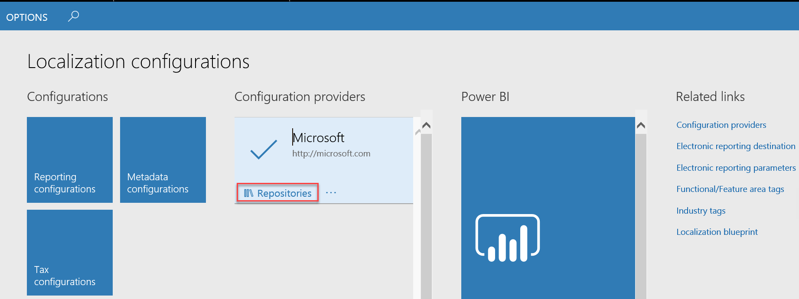

3. Click **Add**. 
4. Select the **LCS** option. 
5. Click **Create repository** to create an LCS configuration repository.
6. Enter a name and description for the repository and then click **OK**.

#### Import configurations from LCS
1. Go to **Organization administration** > **Workspaces** > **Electronic reporting**.
2. In the **Configuration providers** section, click **Repositories** on the **Microsoft** provider.
3. Select the configuration repository that you just created. 
4. Click **Open**.
5. In tree, select the latest tax document (for example, select **Tax (India GST)**).
6. In the **Versions** section, click **Import**.

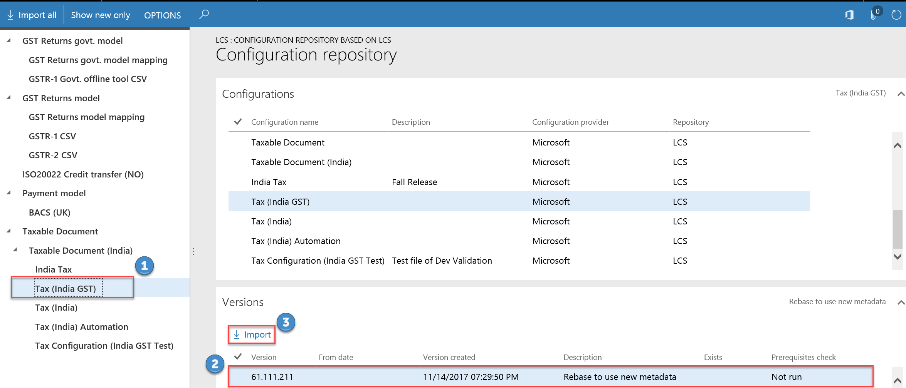

7. Click **Yes** to confirm the import.

#### Add a configuration provider and make it the active provider
1. Go to **Organization administration** > **Workspaces** > **Electronic reporting**.
2. Click **Configuration providers**.
3. Create a new configuration provider and close the page.
4. Click **...** > **Set active** on the configuration provider that you created.

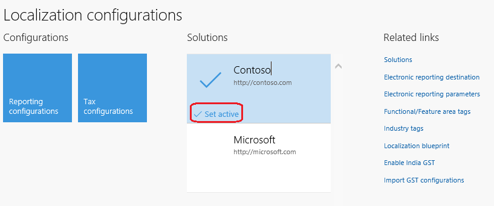

## Scenario 1: Extend the Tax engine configuration for UTGST

For union territories that don’t have a legislature, the GST Council introduced UTGST, which is comparable to SGST. UTGST applies to the following union territories of India:

-	Chandigarh
-	Lakshadweep
-	Daman and Diu
-	Dadra and Nagar Haveli
-	Andaman and Nicobar Islands

SGST can also be applied in union territories such as New Delhi and Puducherry, which have their own legislatures and can be considered “states” per the GST process.

For UTGST, the following combinations of taxes can be applied for any transaction:

-	Supply of goods and services within a state (intrastate): CGST + SGST
-	Supply of goods and services within union territories (intra-UT): CGST + UTGST
-	Supply of goods and services across states or union territories (interstate/inter-UT): IGST

The order of utilization for the Input Tax Credit of UTGST is the same as it is for the Input Tax Credit of SGST. Therefore, Input Tax Credit of SGST or UTGST is first set off against SGST or UTGST, respectively. The Output Tax liabilities and any balance can be set off against IGST Output Tax liabilities.

To support this scenario, you must complete the following tasks:
1. [Create extension configurations](#create-extension-configurations)	
2. [Extend the taxable document so that it includes the IntraStateInUnionTerritory flag](#extend-the-taxable-document-so-that-it-includes-the-intrastateinunionterritory-flag)
3. [Complete data mapping for the extended taxable document](#complete-data-mapping-for-the-extended-taxable-document)
4. [Change the data model of Tax (India GST Contoso)](#change-the-data-model-of-tax-india-gst-contoso)
5. [Change the applicability of State GST (SGST)](#change-the-applicability-of-sgst)
6. [Configure the UTGST task component](#configure-the-utgst-tax-component)
7. [Modify the formulas of lines to include UTGST](#modify-the-formulas-of-lines-to-include-utgst)
8. [Complete the tax document configuration](#complete-the-tax-document-configuration)
9. [Import the extended configuration and deploy it to a specific company](#import-the-configuration-and-deploy-it-to-a-specific-company) 


### Create extension configurations
The following steps are needed to create extension configurations:
-	Create a new taxable document that is derived from Taxable Document (India)
-	Create a new tax document that is derived from Tax (India GST)

1. In the **Localization configurations** workspace (**Organization administration** > **Workspaces** > **Electronic reporting**), click **Tax configurations**.
2. In the tree, find the **Taxable Document (India)** configuration, and then click **Create configuration**.
3. Select the **Derive from Taxable document model** option, and then enter a name and description for the derived taxable document. For this example, enter the name **Taxable Document (India Contoso)**.
4. Click **Create configuration**.
5. In the tree, select the **Tax (India GST)** configuration, and then click **Create configuration**.
6. Select the **Derive from Tax configuration** option, and then enter a name and description for the derived tax document. For this example, enter the name **Tax (India GST Contoso)**.
7. Click **Create configuration**.

### Extend the taxable document so that it includes the IntraStateInUnionTerritory flag.

Complete the following steps to add the **IntraStateInUnionTerritory** flag to **Taxable Document (India Contoso)**.

 1. In the tree, find the **Taxable Document (India Contoso)** configuration that you created in [Create extension configurations](#create-extension-configurations), and then click **Designer**.
 2. In the tree, go to **Taxable document** > **Header** > **Lines**, and then click **New** to create a new node.
 3. Enter a name for the node, and select the item type:
	-	**Name:** IntraStateInUnionTerritory
	-	**Item type:** Enum

	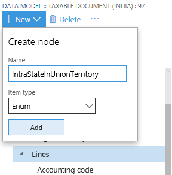

 4. Click **Add**.
 5. On the **Node** FastTab, click **Switch item reference**.
 6. Select **NoYes** in the tree, and then click **OK**.
 7. Save the configuration, and close the designer.
 8. With **Taxable Document (India Contoso)** still selected in the tree, click **Change status** > **Complete** in the **Versions** list.

	

 9. Enter a description such as **UTGST**, and then click **OK**.
 10. If there are any errors, open the designer, click **Validate**, and fix the errors.
 11. After the status is updated to **Complete**, the configuration is ready for deployment.
 
### Complete data mapping for the extended taxable document
There are data mappings for each taxable document, such as a purchase order or sales order, and reference mode in the taxable document. The purpose of data mapping is to get the value from taxable transactions and pass it into GTE for tax applicability or tax calculation. 
For convenience, there is a special data source called **Taxable document source**, which encapsulates most common tax relevant fields like assessable value, HSN, or SAC. So, there are two methods for retrieving and mapping the value of the additional field to your extended taxable document.

- 	Method 1: Enable the additional field for the existing taxable document source.
-	Method 2: Use Electronic reporting (ER) data mapping.
 
#### Method 1: Data mapping by taxable document source
Before you use this method, be sure to read about [Tax engine integration](tax-engine-integration.md) so you understand the underlying concepts. The Tax engine must determine whether a state is a union territory. Therefore, in this method, you will modify the data provider so that it provides this information to the Tax engine.

1. Find the system name of the Union Territory of State master.
	1. Go to **Organization administration** > **Global address book** > **Addresses** > **Address setup**. 
	2. Right-click the **Union territory** column, and then click **Form information** > **Form Name: LogisticsAddressSetup**. For this example, notice that the system name for the column is **LogisticsAddressState.UnionTerritory_IN**.

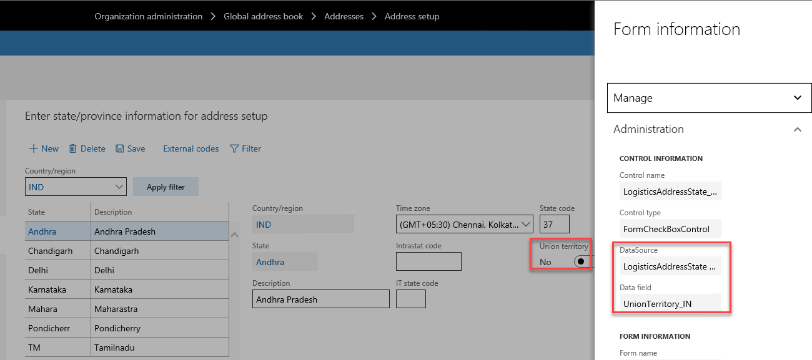

2. Add a tax engine model field for intrastate transactions in a union territory. 
	1. In the AOT, open **Classes** > **TaxableDocRowDataProviderExtensionLine**, add a ```const str``` for intrastate transactions in a union territory.
	
```
public class TaxableDocRowDataProviderExtensionLine extends TaxableDocumentRowDataProviderExtension
{
    public static const str IsIntraStateInUnionTerritory = 'IntraStateInUnionTerritory';
```

3. Implement logic to determine if a transaction is an intrastate transaction in a union territory. For example, add a new method for the **TaxableDocRowDataProviderExtensionLine** class, and implement the logic in the method.
	
```
private NoYes IsIntraStateWithUnionTerritory(TaxableDocumentLineObject _lineObj)
{
    boolean                     isIntraStateWithUnionTerritory = NoYes::No;
    LogisticsPostalAddress      partyAddress;
    LogisticsPostalAddress      taxAddress;
    LogisticsAddressState       partyState;
    SalesPurchJournalLine       documentLineMap;
    TaxModelTaxable_IN          taxModelTaxable;
    documentLineMap = SalesPurchJournalLine::findRecId(_lineObj.getTransactionLineTableId(), _lineObj.getTransactionLineRecordId());
    taxModelTaxable = TaxModelDocLineFactory_IN::newTaxModelDocLine(documentLineMap);
    partyAddress = taxModelTaxable.getPartyLogisticsPostalAddress();
    taxAddress = taxModelTaxable.getTaxLogisticsPostalAddressTable();
    if (partyAddress && taxAddress
        && partyAddress.CountryRegionId == taxAddress.CountryRegionId
        && partyAddress.State != ''
        && taxAddress.State != ''
        && partyAddress.State == taxAddress.State)
    {
        partyState = LogisticsAddressState::find(partyAddress.CountryRegionId, partyAddress.State);
        isIntraStateWithUnionTerritory = partyState.UnionTerritory_IN;
    }
    return  isIntraStateWithUnionTerritory;
}
```
4. Pass the flag to GTE in TaxableDocRowDataProviderExtensionLine.fillInExtensionFields()

```
_lineObj.setFieldValue(IsIntraStateInUnionTerritory, this.IsIntraStateWithUnionTerritory(_lineObj));
```

5. Add the new field in TaxableDocumentRowDataProviderLine. initValidFields ()

```
validFields.add(TaxableDocRowDataProviderExtensionLine::IsIntraStateInUnionTerritory, Types::Enum, enumNum(NoYes));
```

6. Complete the data binding in the Designer.
	1. Navigate to the **Taxable Document (India Contoso)** configuration, and then click **Designer**.

	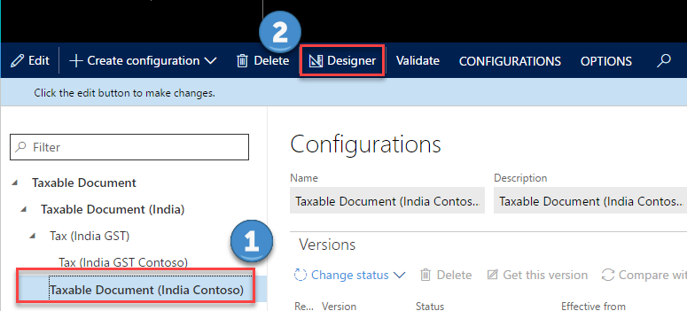
	
	2. Click **Map model to datasource**
	3. You will find there are lots of data mapping for each taxable document and reference model, like purchase order or sales order. You need to do your data mapping per your business requirement. For example:
		1. Select a sales order document line.
		2. Click **Designer**.

		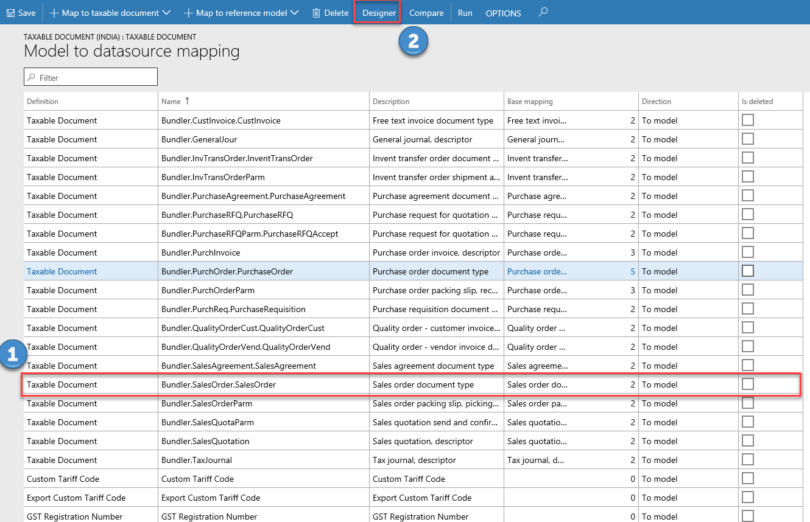

	4. After completing steps 1-5, you should be able to find the field **IntraStateInUnionTerritory** in the data source under **Sales order** > **Header** > **Lines**. You can bind this field to the **IntraStateInUnionTerritory:Enumeration** value in the taxable document.

	

	5. Save the configuration, and close the designer.
	6. In the **Configurations** workspace, click **Change status** > **Complete**.

	

	7. Enter a description such as **UTGST**, and then click **OK**.
	8. If there are any errors, open the designer, click **Validate**, and fix the errors.

#### Method 2: Data mapping using the ER model mapping designer
Before you use this method, be sure that you are familiar with ER and the table relation, class, and method for purchase orders. 
1. Open the model mapping design for a purchase order, add table records **PurchLine** as a root data source.
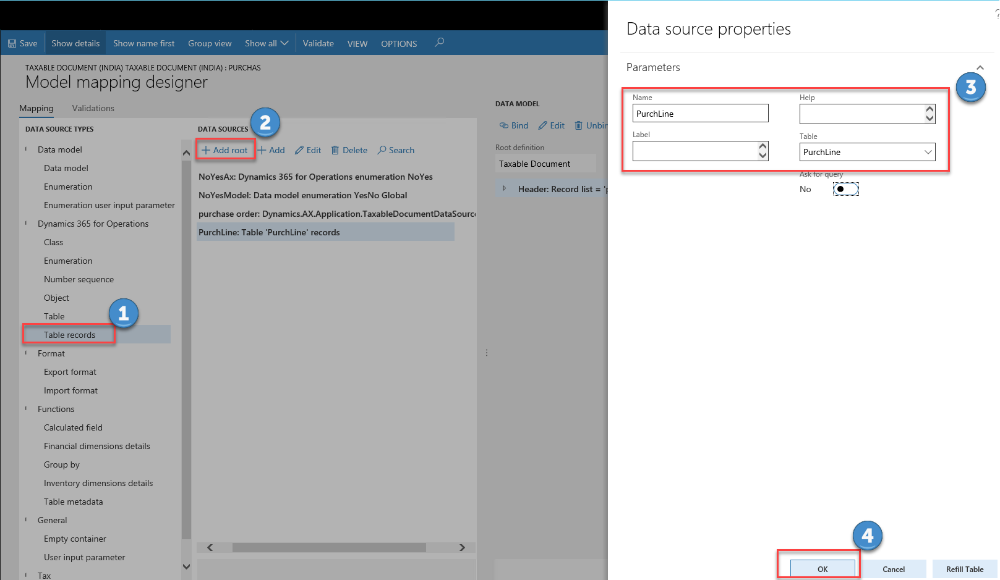
2. Add Data model\Enumeration **YesNo Global** and Dynamics 365 for Operations\Enumeration **NoYes**.

3. Add a calculated field **$PurchLine** in to the purchase order to build the connection between the existing taxable document **purchase order** and the table records **PurchLine**. Click **Edit formula**.
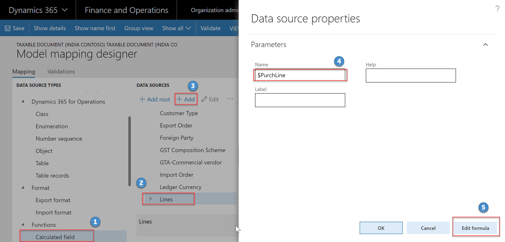
4. Input the formula that describe the relationship between **PurchLine** and **purchase order**.

5. Click **Save** and close the page.
6. Add the calculated field **\$IsIntraStateInUnionTerritory** in **$PurchLine**, and use the following formula. 
```
AND('purchase order'.'$PurchLine'.'initTaxModelDocLine_IN()'.getPartyLogisticsPostalAddress.'>Relations'.State.StateId = 'purchase order'.'$PurchLine'.'initTaxModelDocLine_IN()'.getTaxLogisticsPostalAddress.'>Relations'.State.StateId, 'purchase order'.'$PurchLine'.'initTaxModelDocLine_IN()'.getPartyLogisticsPostalAddress.'>Relations'.State.UnionTerritory_IN = NoYesAx.Yes, 'purchase order'.'$PurchLine'.'initTaxModelDocLine_IN()'.getTaxLogisticsPostalAddress.'>Relations'.State.UnionTerritory_IN = NoYesAx.Yes)
```
7. In the **Model mapping designer**, complete the mapping:
	1. In the **Data Sources** tree, select **$IntraStateInUnionTerritory**.
	2. In the **Data Model**, select **IntraStateInUnionTerritory**.
	3. Click **Edit**.

	4. Input the following formula to convert the Boolean value to the enumeration value, which is used by the extended taxable document field **IntraStateInUnionTerritory**.
	```
	CASE('purchase order'.'$PurchLine'.'$IsIntraStateInUnionTerritory', true, NoYesModel.Yes, false, NoYesModel.No)
	```
	5. Click **Save** and close the page.
8. Save the configuration, and close the designer.
9. In the **Configurations** workspace, click **Change status** > **Complete**.

	

10. Enter a description such as **UTGST**, and then click **OK**.
11. If there are any errors, open the designer, click **Validate**, and fix the errors.

### Change the data model of Tax (India GST Contoso)

1. Go to the **Tax (India GST Contoso)** configuration and then click **Designer**.
2. Click **Tax document**, and then select **Taxable Document (India Contoso)** as the data model, and select **1** as the data model version.

	

3. Click **Save** to save the configuration.

### Change the applicability of SGST

1. Go to the **Tax (India GST Contoso)** configuration, select the version that has a status of **Draft**, and then click **Designer**.
2. Go to **Tax document** > **Header** > **Lines** > **GST** > **SGST**, and then click the **Lookups** tab.
3. Click **Columns**.
4. Select **IntraStateInUnionTerritory** from the **Available columns** list, and then click the right arrow button to move the column to the **Selected columns** list.
5. Click **OK**.
6. For the **IntraStateInUnionTerritory** column, select **No**.
7. Click **Save** to save the configuration.

### Configure the UTGST tax component

1. Go to the **Tax (India GST Contoso)** configuration, select the version that has a status of **Draft**, and then click **Designer**.
2. Add the UTGST tax component.
	1. Go to **Tax document** > **Header** > **Lines** > **GST**. Click **Add**, and then select **Tax component**.
	2. Enter a name and description for the UTGST tax component, and then click **OK**.
3. Configure tax measures for the UTGST tax component.
	1. Expand the tax document tree, and click the UTGST tax component to create a measure for.
	2. Click **Add**, and then select **Tax measure**.
	3. All the logic, such as properties, lookups, formulas, postings, and accounting, except applicability of UTGST, is the same as it is for SGST. Therefore, select all the tax measures that SGST uses in the **Name** list and then click **OK**. 

	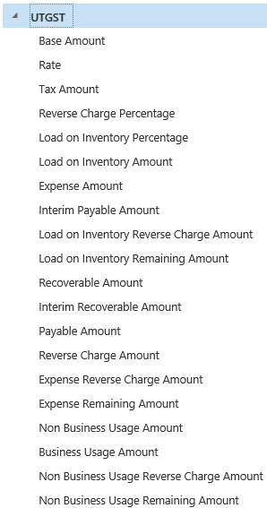

4. Configure rate/percentage lookups.
	1. Expand the **UTGST** tax component node.
	2. Select the measure of the **Rate/Percentage** type.
	3. Click **Lookups** > **Columns** to see a list of the attributes that are relevant to the tax rate/percentage value.
	4. Select the same attributes that SGST uses.
		> [!Note]
		> Don’t click **Add**. Values that you enter here have no effect on the actual rate table. That table should be configured at **Tax** > **Tax configuration** > **Tax setup**.

	5. Save the tax document.

5. Configure properties.
	1. Go to **Tax document** > **Header** > **Lines** > **GST** > **UTGST**. Click the **Properties** tab.
	2. Click **Edit** (the pencil icon) next to **Condition**.
	3. Enter the same condition that SGST uses.

	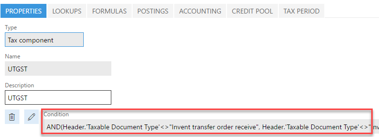

	4. Save the tax document.

6. Configure tax applicability lookups.
	1. Go to **Tax document** > **Header** > **Lines** > **GST** > **UTGST**. Click the **Lookup** tab.
	2. Click **Columns**.
	3. Select **Import Order** and **IntraStateInUnionTerritory** as lookup columns.
	4. Select **Configuration** as the source type.
	5. Click **Add**. Select **No** for the **Import Order** column and select **Yes** for the **IntraStateInUnionTerritory** column.	
	6. Save the tax document.

7. Configure formulas. Formulas can be configured at either the group node level (line, tax component, or tax type) or the measure node level. However, we recommend that you always configure tax calculation formulas at the group node level. Tax amount distribution formulas can be configured at either the group node level or the measure node level.
	1. Go to **Tax document** > **Header** > **Lines** > **GST** > **UTGST**. Click the **Formula** tab.
	2. Click **Add Tax formula**.
	3. On the **Details** FastTab, select **Calculation** as the category, and then edit the formula and condition.
	4. Repeat steps 2 through 3 until the UTGST tax component has all the same formulas as SGST.
	5. Save the tax document.

8. Configure a posting profile. Only nodes of the **Tax Component** type support a posting profile definition.
	1. Go to **Tax document** > **Header** > **Lines** > **GST** > **UTGST**. Click the **Postings** tab.
	2. Click **Add Posting Profile** to create a new posting profile definition.
	3. On the **Details** FastTab, enter the accounting treatment for the tax measures that you defined in the previous task, and provide the names of the debit and credit accounting subledgers.
	4. Click **Edit** to enter a condition for the posting profile.
	5. Optional: Enter a description for the posting profile.
	6. Repeat steps 2 through 5 until the UTGST tax component has all the same posting profiles as SGST.
	7. Save the tax document.

9. Configure accounting lookups. Only nodes of the **Tax Type** and **Tax Component** types support an accounting lookup definition.
	1. Go to **Tax document** > **Header** > **Lines** > **GST** > **UTGST**. Click the **Accounting** tab.
	2. Click **Columns** to see a list of the attributes that can be used to determine the main accounts that will be used for accounting taxes.
	3. Select the same attributes that SGST uses.
		> [!NOTE]
		> Don’t click **Add**. Values that you enter have no effect on the actual tax main accounts decision table. That table should be configured at **Tax** > **Tax configuration** > **Tax setup**.

	4. Save the tax document.

10. Configure credit pools. Only nodes of the **Tax Component** type support a credit pool definition.
	1. Go to **Tax document** > **Header** > **Lines** > **GST** > **UTGST**. Click the **Credit Pool** tab.
	2. Click **Columns** to see a list of the attributes that are relevant to the tax settlement of this component. Typically, the selected column is the appropriate tax registration number, like **GST Registration Number**.
	3. Select the same attributes that SGST uses.
		> [!NOTE]
		> Don’t click **Add**. Values that you enter here have no effect on the actual rate table. That table should be configured at **Tax** > **Tax configuration** > **Tax setup**.

	4. Save the tax document.

### Modify the formulas of lines to include UTGST

1. Go to **Tax document** > **Header** > **Lines**. Click the **Formulas** tab.
2. Change any formulas that contain the **Base Amount**, **Line tax amount**, and **Tax amount included in price** measures, so that the formulas reflect UTGST. For example, change the **Tax amount inclusive** formula as shown here.

 
	
3. Save the tax document.
4. Close the designer.

### Complete the tax document configuration
1. In the **Localization configurations** workspace (**Organization administration** > **Workspaces** > **Electronic reporting**), click **Tax configurations**.
2. In the **Configurations** workspace, click **Change status**, and then select **Complete**.
3. Enter a description such as **UTGST**, and then click **OK**.
4. If there are any errors, open the designer, click **Validate**, and fix the errors.
5. After the status is updated to **Complete**, the configuration is ready for deployment.

### Import the configuration and deploy it to a specific company
1. Go to **Tax** > **Setup** > **Tax configuration** > **Tax setup**.
2. Create a new record and define tax setup.


3. Click **Configurations**.

4. Click the **Tax configuration** tab.
5. In the **Available configurations** section, click **New** to create a tax configuration.
	> [!NOTE]
	> The configuration that is added to tax gets listed on the **Available configuration** tab
	


6. Select the required configuration, such as **Tax (India GST)**. Click **Save**.
7. Click **Synchronize**.


8. Click **Activate**.

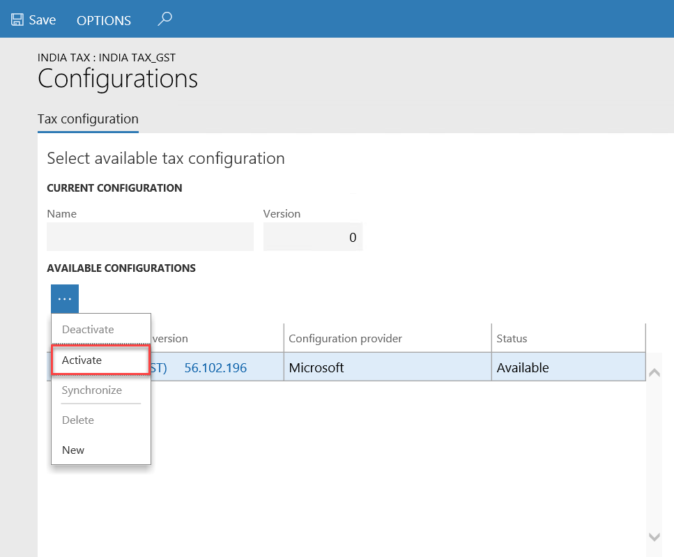


9. Click **Close**.
10. Click the **Companies** FastTab.
11. Click **New** and then select **INMF** in the **Companies** field.
12. Click **Save**.
13. Click **Activate** to activate the configuration for the company.


14. Click **Setup** to set up data for the new version.

## Scenario 2: Using a reference model

Per the Microsoft-provided configuration, the tax rate for the BCD is determined by Preferential Party/Import Order/Import Custom Tariff Code/Export Order/Export Custom Tariff Code. We will use this scenario to explain how to use a reference model to support applying a different tax rate for the BCD on the import order of goods from different countries/regions.

To support this scenario, you must complete the following tasks:
1. [Create extension configurations](#create-extension-configurations)
2. [Add a reference model for country/region of origin](#add-a-reference-model-for-countryregion-of-origin)
3. [Complete data mapping for the reference model](#complete-data-mapping-for-the-reference-model)
4. [Link the reference model to field in taxable document](#link-the-reference-model-to-a-field-in-the-taxable-document)
5. [Change the lookup of the BCD tax rate](#change-the-lookup-of-the-bcd-tax-rate)
6. [Complete the tax document configuration](#complete-the-tax-document-configuration)
7. [Import the configuration and deploy it to a specific company](#import-the-configuration-and-deploy-it-to-a-specific-company)

### Add a reference model for country/region of origin

1. In the **Localization configurations** workspace (**Organization administration** > **Workspaces** > **Electronic reporting**), click **Tax configurations**.
2. Find and select the **Taxable Document (India Contoso)** configuration, and then click **Designer**.
3. Click **...** > **Reference model** to change the view so that you can view all the available reference models.
4. Click **New** to add a new reference model.
    -	**Name** - Country of origin
    -	**Node type** - Model root
5. Click **Add**.
6. Highlight **Country of Origin**, click **New** to add new reference model.
    -   **Name** - Countries of origin
    -   **Node type** - Child of an active node
    -   **Item type** - Record list
7. Click **Add**.
8. Highlight **Countries of Origin**, click **New** to add new reference model.
    -   **Name** - Country of origin
    -   **Node type** - Child of an active node
    -   **Item type** - String
9. Click **Add**.
10. Highlight **Country of Origin**, click **Natural key**.
11. Select **Country of Origin\\Countries of Origin\\Country of Origin** as the **Natural key**.
12. If there are any errors, open the designer, click **Validate**, and fix the errors.

After you update the status to be **Complete**, the configuration is ready for deployment.

### Complete data mapping for the reference model
1. In the **Localization configurations** workspace (**Organization administration** > **Workspaces** > **Electronic reporting**), click **Tax configurations**.
2. Find and select the **Taxable Document (India Contoso)** configuration, and then click **Designer**.
3. Click **Map model to datasource**.
4. Select **Country of Origin** and then click **Add**.
5. With **Country of Origin** selected in the list, click **Designer** to open the designer of the model mapping.
6. Add table records **LogisticsAddressCountryRegion** as a root.
	1. Select **Table records** in the **Data source type** tree.
	2. Click **Add root**.
	3. Enter the name **LogisticsAddressCountryRegion** in the **Name** field.
	4. Select a table.
	5. Click **OK**.
	
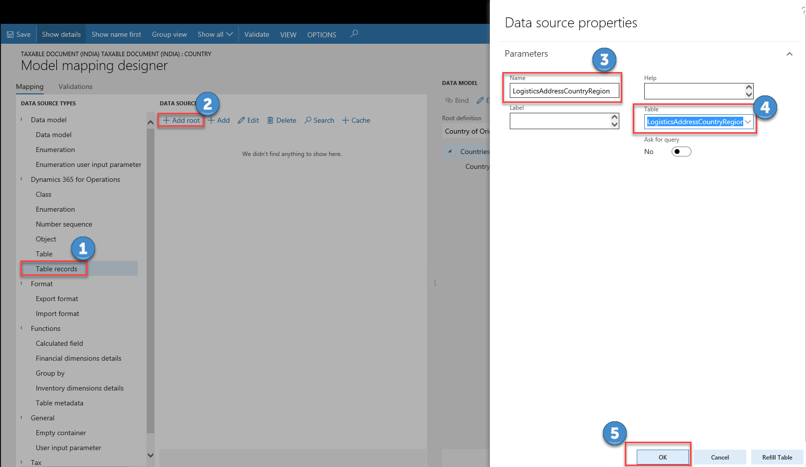
7.Bind the table.
	1. In the **Data sources** tree, select the **LogisticsAddressCountryRegion** table record that you created in step 5.
	2. In the **Date model** tree, select **Countries of Origin: Record list**.
	3. Click **Bind**.
	

8.Bind the field.
	1. In the **Data sources** tree, select **Country/region(CountryRegionID): String**.
	2. In the **Date model** tree, select **Country of Origin: String**.
	3. Click **Bind**.
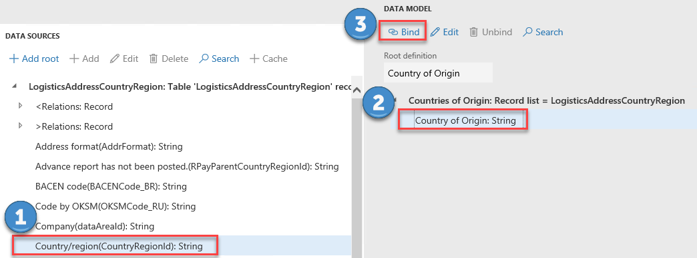
9.Click **Save**.

### Link the reference model to a field in the taxable document

1. Click **...** > **Taxable document** to change the view to **Taxable document**.
2. Navigate to **Taxable document** > **Header** > **Lines** > **GST** > **Country/Region of Origin**.
3. On the **Node** FastTab, click **Select reference model**. 
4. Choose **Country of Origin** for the reference model.
5. Click **OK**.
6. Save the configuration and close the designer.
7. In the **Configurations** workspace, click **Change status**, and then select **Complete**.
8. Enter a description such as **Add reference model for Country of Origin**, and then click **OK**.
9. If there are any errors, open the designer, click **Validate**, and fix the errors.

After the status is updated to **Complete**, the configuration is ready for deployment.

### Change the lookup of the BCD tax rate

1.  Go to the **Tax (India GST Contoso)** configuration, and then click **Designer**.
2.  Change the data model of **Tax (India GST Contoso)** to the updated version of the extended taxable document. To do this, complete the steps in [Scenario 1: Task 3](#task-3-do-data-mapping-for-the-extended-taxable-document).
3.  Go to **Tax document** > **Header** > **Lines** > **Custom Duty** > **BCD** > **Rate**. Click the **Lookup** tab.
4.  Click **Columns**.
5.  Select **Country/Region of Origin** as the lookup column, and then click the right arrow button.
6.  Click **Save**.

