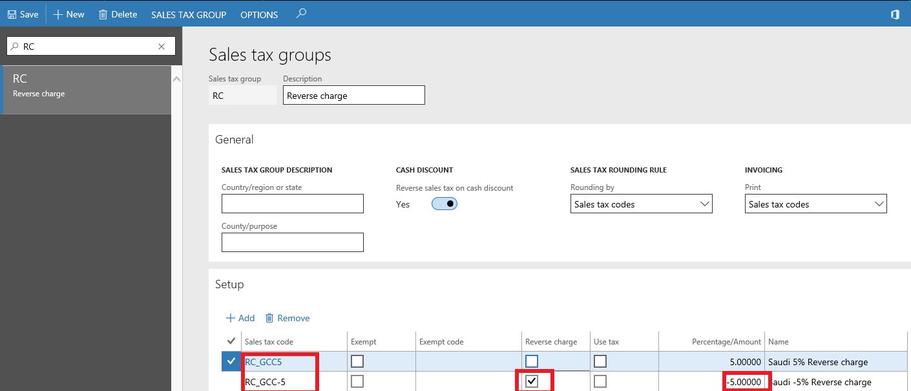
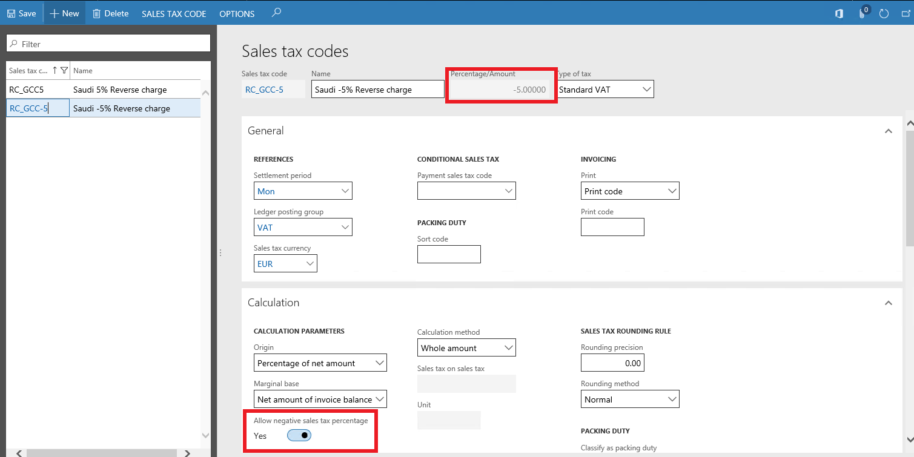

---
# required metadata

title: Sales tax for Saudi Arabia
description: This topic provides information about sales taxes for Saudi Arabia.           
author: ShylaThompson
manager: AnnBe
ms.date: 10/05/2017
ms.topic: article
ms.prod: 
ms.service: dynamics-ax-applications
ms.technology: 

# optional metadata

# ms.search.form: 
audience: Application User
# ms.devlang: 
ms.reviewer: shylaw
ms.search.scope: Core, Operations
# ms.tgt_pltfrm: 
# ms.custom: 
ms.search.region: Saudi Arabia
# ms.search.industry: 
ms.author: shylaw
ms.search.validFrom: 
ms.dyn365.ops.version: 

---

# Sales tax for Saudi Arabia

[!include[banner](../includes/banner.md)]

This topic walks you through setting up sales taxes for Saudi Arabia.  

## Sales tax codes for Saudi Arabia
Tax type with values added for VAT type: Standard VAT, Reduced VAT, VAT 0%
New value in Country/ Region field: GCC
Translation of sales tax description (button Tax directive)

## Enable Reverse charge mechanism
To use reverse charge functionality, you must do the following.
1. Set the **Reverse charge** option to **Yes** on the **General ledger parameters** page.
2. Create sales tax codes for reverse charge operations (for purchase operations). (**Tax** > **Indirect taxes** > **Sales tax** > **Sales tax codes**) 
2. Create a sales tax group that has the **Reverse charge** check box selected for a sales tax code with a negative rate.

### Sales tax codes for reverse operations
It is necessary to set up two sales tax codes for reverse charge operations (for purchase operations): one with positive rate and another with negative rate.  You may fill in negative rate (SALES TAX CODE/ Value button) if Negative sales tax percentage check box has been selected in the Sales tax codes form (see the screenshot below). 
Tax > Indirect taxes > Sales tax > Sales tax codes

These two sales tax codes should be added to a sales tax group and to Item sales tax group (Setup area).  See how sales tax functionality works in Sales tax codes, Sales tax group and Item sales tax groups
Tax > Indirect taxes > Sales tax > Sales tax groups 

### Sales tax transactions
According to these settings the system creates sales tax transactions when posting an invoice: one with sales tax Sales tax receivable and another with Sales tax payable direction (if Reverse charge check box is selected in the sales tax group).  See the screenshot below.

Tax > Inquiries and reports > Sales tax inquiries > Posted sales tax

