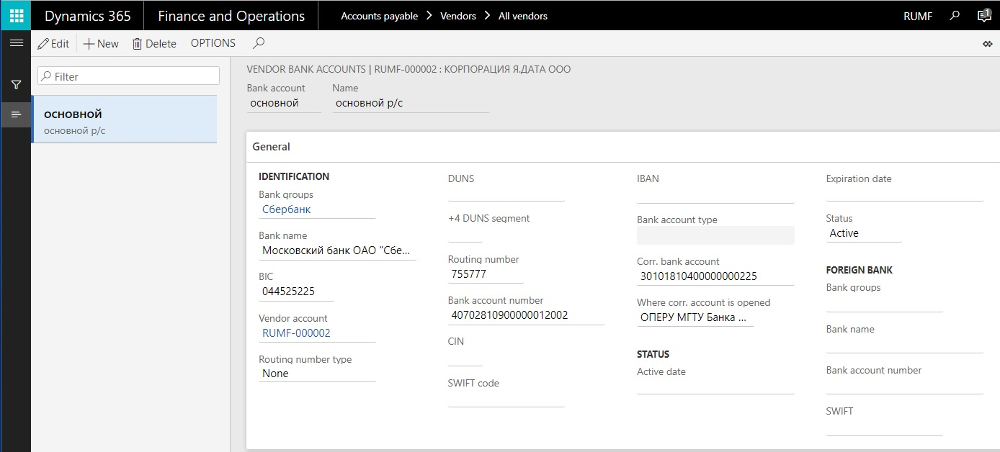
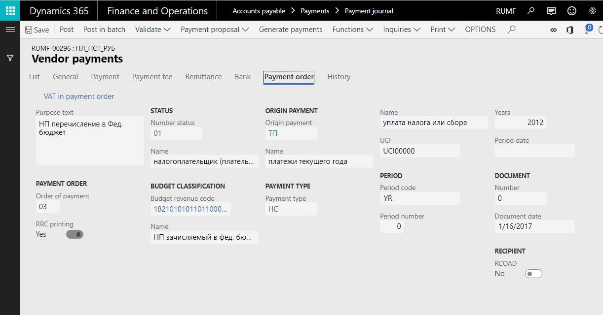

---
# required metadata
title: Payment order setup and processing 
description: This topic provides information about payment order settings and processing for Russia. 
author: ShylaThompson
manager: AnnBe
ms.date: 10/28/2018
ms.topic: article
ms.prod: 
ms.service: dynamics-ax-applications
ms.technology: 

# optional metadata
# ms.search.form:  
audience: Application User
# ms.devlang: 
ms.reviewer: shylaw
ms.search.scope: Core, Operations
# ms.tgt_pltfrm: 
# ms.custom: 
ms.search.region: Russia # ms.search.industry: 
ms.author: shylaw
ms.search.validFrom: 2018-10-28
ms.dyn365.ops.version: 8.1

---

## Payment order setup and processing (Russia)

[!include [banner](../includes/banner.md)]

## Set up for generating payment orders

Before you can generate payment orders, you need to set up the following:
-	**Banks** and **Bank accounts** for company. Find more details in <Local settings and requisites for Bank module> <give here link to content deliverable location 148860>

-	**Vendor bank accounts** and **Customer bank accounts**.

    1.	In the customer or vendor card, click **Bank accounts**. 
    2.	Create a bank account and fill all necessary information for bank account. 
    3.	For foreign customer bank accounts, on tab **General**, in the **Foreign bank** group, in the **Bank group** field, select the code of the foreign bank with which the customer bank account is registered and in **Bank account number** field, enter the foreign bank account number for the account that receives payment returns.
    4.	In the **SWIFT** field, enter the Society for Worldwide Interbank Financial Telecommunication (SWIFT) code of the bank that receives payment returns.

     []	

For generating payments to vendors, set up **Method of Payment** in **Accounts payable > Payment setup > Methods of payment**. 

For generating payment returns to customers, set up **Method of Payment** in **Accounts receivable > Payment setup > Methods of payment**.

To set up printing payment orders in Russian rubles according to legacy paper format, in the **Method of payment** form, choose **Payment order in RUB** in the field **Export format**.
To set up printing payment orders in foreign currency according to bank-specific template (which is defined in Bank account card), choose **Payment order in currency** in the field **Export format**.

[]	

## Generate a payment order in rubles for payment to vendor

### Create payment order lines
Before you can generate a payment order, you must create payment order lines. To do this, complete the following steps.
1.  Click **Accounts payable** \> **Payments** \> **Payment journal**.
2.  Create new journal and click **Lines**. Create new vendor payment line. 
3.  In the **Date** field, select the date of payment.
4.  In the **Account** field, select the vendor account.
5.  In the **Transaction text** field, enter text that describes the transaction.
6.  In the **Debit** field, enter the sum of the payment.
7.	In the **Currency** field, select the currency code.
7.  In the **Offset account type** field, select the account type for the selected account.
8.  In the **Offset account** field, select the offset account for the transaction.
9.  In the **Currency** field, select the currency code.
10. In the **Method of payment** field, select the method of payment to the vendor.
11. In the **Agreement Id** field, select the registration number of the contract.
12. In the **Sales tax group** and the **Item sales tax group** fields, select the tax groups for VAT calculation.
13. On the **Bank** FastTab, in the **Bank transaction type** field, select the transaction type.
14. In the **Account identification** field, select the bank account of the recipient.
    
    > [!IMPORTANT]
    > If the payment order is being generated for a legal representative of the vendor, the vendor account must be entered in the **Payment documented on** field. Along with this, the payment order slip will refer to the bank of the vendor that is specified in the **Payment documented on** field, but the transaction will be performed for the vendor that is specified in the **Account** field.

15. On the **Payment order** FastTab, in the **Purpose text** field, enter any text that must be reflected in the payment order.
    
    > If you click **VAT in payment order**, the text, including the VAT amount in the **Purpose text** field, will be entered.
    
16. Fill the following fields to be printed in respective boxes in payment order to vendor or tax authority: Order of payment, Number status, Budget revenue code, Origin payment, Payment type , UCI, Information about period: Period code, Period number, Year, Period date.

[]

### Generate payment order
After you've created payment order lines, you can generate the payment order. To do this, complete the following steps.

1. On the **Payment journal** page, click **Functions**, and then select **Generate payments** to open the **Generate payments** page.
2. In the **Method of payment** field, select the method of payment or in the **Export format** field, select **Payment order in RUB**.
3. In the **Bank account** field, select the bank account from which the payment is to be made.
4. Click **OK**. 
5. On the **Payment order setup** page,  enable **Document** to print the payment order and enable **Proxy text** to print the text.
6. Click **OK**. The payment order is generated, and the payment status of the appropriate payment journal line is changed to **Sent**.

### Void payment order

You can void payment order in the payment journal though **Functions > Void payment order**. The value for the voided payment order in the **Payment status** field changed to **None** and the voided payment order is deleted from the registry of payment orders.

### Reprint payment order

You can reprint a payment order through **Print > Print payment order**. You can also reprint payment orders from the **Bank transactions** form. Select the voucher for the payment order, click **Print > Payment order** to print the document.

### View generated payment orders

You can review generated payment orders on the **Registry of payment orders** page (**Accounts payable > Inquiries > Payment > Payment order register**). On the **Essential elements** tab, review the attributes of the payer and the recipient.

## Generate payment order for a payment return to customer

You can generate payment order for money return to customer.

1.  Click **Accounts receivable** \> **Payments** \> **Payment journal**.
2.  Create new journal and click **Lines**. Create new customer payment line like vendor payment line
3.  On the **Bank** tab, in the **Account identification** field, enter the bank account number of the customer account that receives the payment return.
4.  In the **Payment documented on** field, select the customer account that receives the payment return.
5.  Click **Functions** \> **Generate payments** to generate payment order.

You can review generated payment orders for customers on the **Registry of payment orders** page (**Accounts receivable > Inquiries > Payment > Payment order register**).
