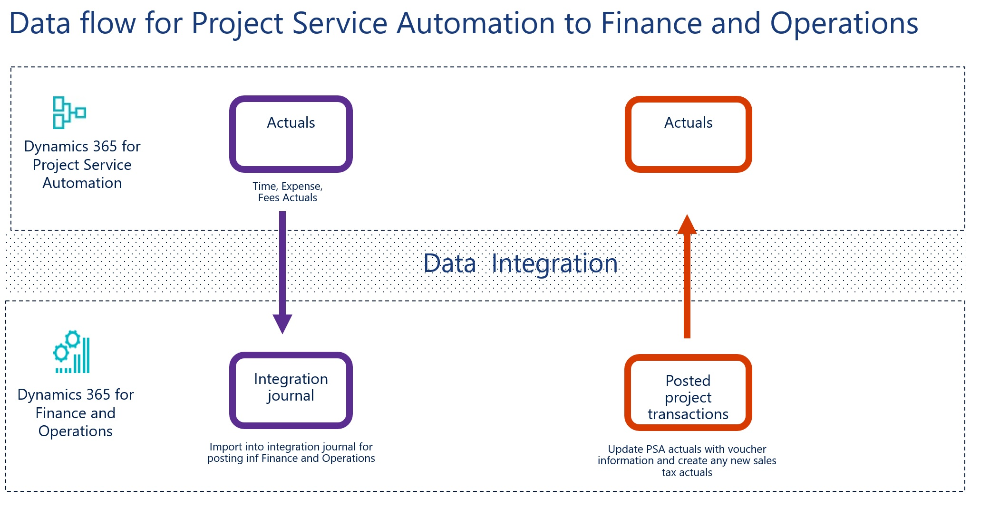
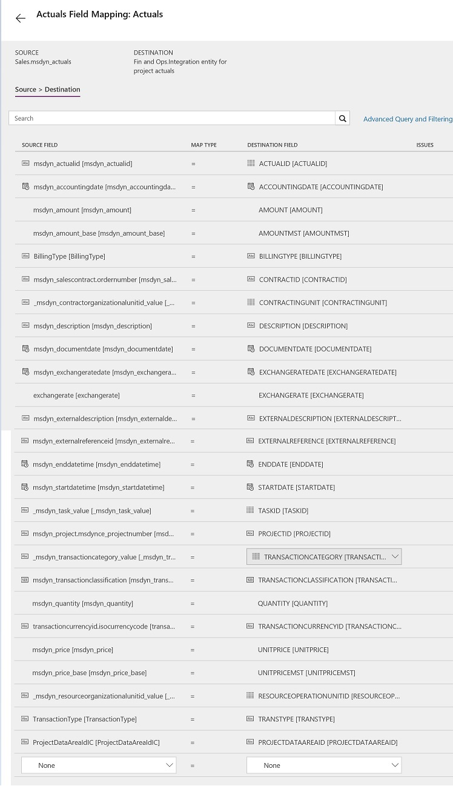
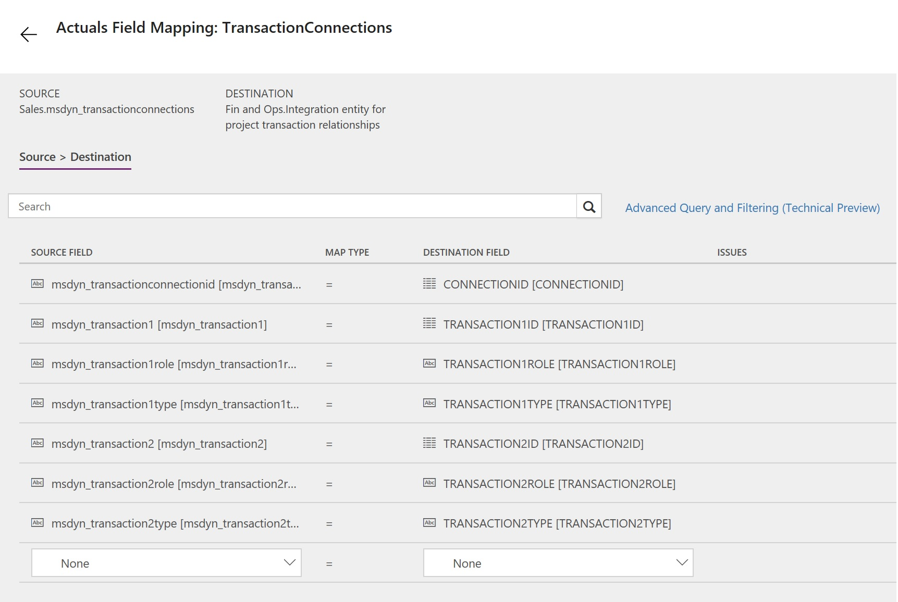
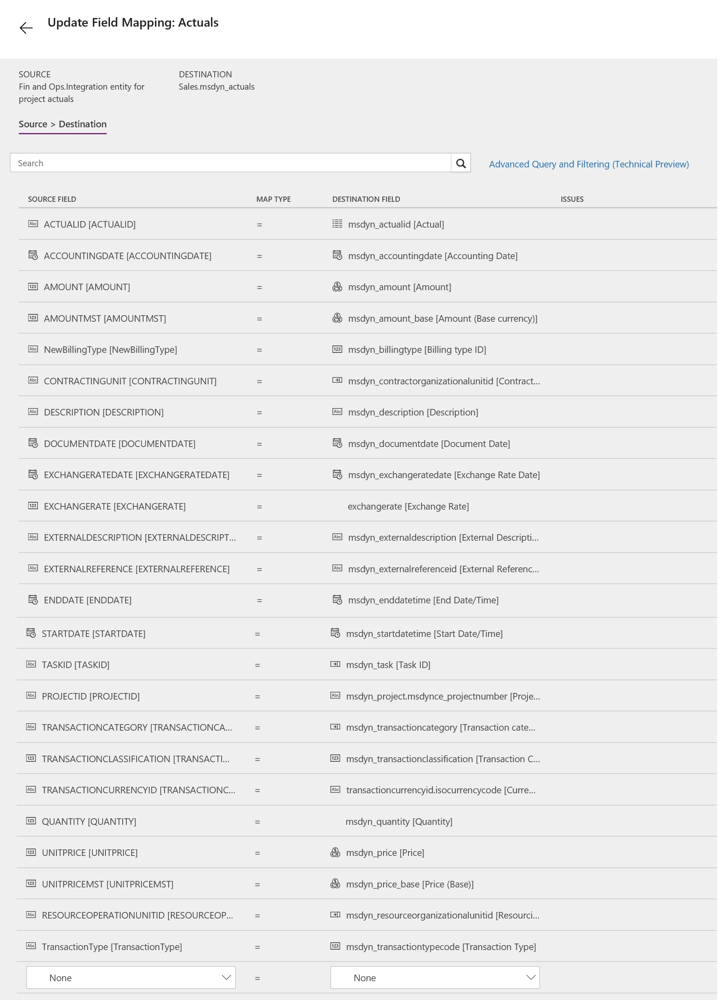
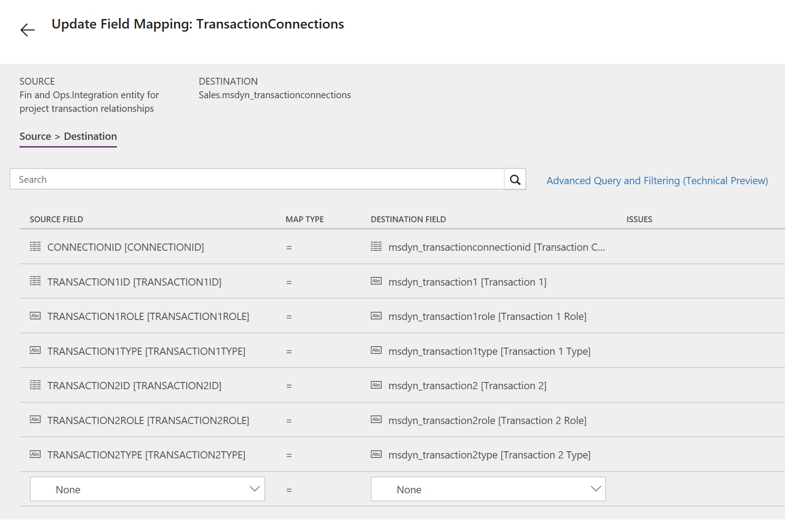

---
# required metadata

title: Synchronize project actuals from Project Service Automation directly to the project integration journal for posting in Finance and Operations
description: This topic describes the templates and underlying tasks that are used to synchronize project actuals directly from Microsoft Dynamics 365 for Project Service Automation to Dynamics 365 for Finance and Operations.
author: KimANelson
manager: AnnBe
ms.date: 05/21/2018
ms.topic: article
ms.prod: 
ms.service: dynamics-ax-applications
ms.technology: 

# optional metadata

# ms.search.form: 
# ROBOTS: 
audience: Application User
# ms.devlang: 
ms.reviewer: twheeloc
ms.search.scope: Core, Operations
# ms.tgt_pltfrm: 
ms.custom: 87983
ms.assetid: b454ad57-2fd6-46c9-a77e-646de4153067
ms.search.region: Global
# ms.search.industry: 
ms.author: knelson
ms.search.validFrom: 2016-11-28
ms.dyn365.ops.version: AX 7.3.0

---
# Synchronize project actuals from Project Service Automation directly to the project integration journal for posting in Finance and Operations

This topic describes the templates and underlying tasks that are used to synchronize project actuals directly from Microsoft Dynamics 365 for Project Service Automation to Dynamics 365 for Finance and Operations.

The template syncs transactions from Project Service Automation into a staging table in Finance and Operations. After synchronization is complete, you **must** import from the staging table to the integration journal.

> [!NOTE]
> Project actuals integration is available in Dynamics 365 for Finance and Operations version 8.0.1 or later.
>
> If you are using Dynamics 365 for Finance and Operations, Enterprise edition 7.3.0, after you install KB 4132657 and KB 4132660, you will be able to use the templates to integrate project tasks, expense transaction categories, hour estimates, expense estimates, and actuals, and to configure functionality locking. If you must reset the accounting distributions, we recommend that you also install KB 4131710.
>
> If you are entering sales tax amounts on time or expense transactions in Project Service Automation, you must install the Project Service Automation Update 7. If this update is not installed, the tax actuals will not be linked to the associated time or expense actuals and will not be synced to Finance and Operations. Contact Support for more information.

## Data flow for Project Service Automation to Finance and Operations

The Project Service Automation to Finance and Operations integration solution uses the Data integration feature to synchronize data across instances of Project Service Automation and Finance and Operations. The integration templates that are available with the Data integration feature enable the flow of data about project actuals from Project Service Automation to Finance and Operations.

The following illustration shows how the data is synchronized between Project Service Automation and Finance and Operations.

## Templates and tasks

To access the available templates, in the Microsoft PowerApps Admin Center, select **Projects**, and then, in the upper-right corner, select **New project** to select public templates.

The following template and underlying tasks are used to synchronize project actuals from Project Service Automation to Finance and Operations:

-  **Name of the template in Data integration:** Project actuals (PSA to Fin and Ops)

-  **Name of the tasks in the project:** 
    - Actuals 
    - TransactionConnections

## Entity set

| Project Service Automation      | Finance and Operations                                      |
|---------------------------------|-------------------------------------------------------------|
| Actuals                         | Integration entity for project actuals                      |
| Transaction Connections         | Integration entity for project transaction relationships    |

## Entity flow

Project actuals are managed in Project Service Automation, and they are synchronized to Finance and Operations to the project ingetration journal. The accounting will be applied based on default financial dimensions and posting setup.

## Preconditions

Before synchronization of actuals can occur, you must configure the Project Service Automation integration parameters and synchronize projects, project tasks, and project expense transaction categories.

## Power Query

You must use Microsoft Power Query in the project actuals template to:
- Transform the Project Service Automation **transaction type** to the correct **transaction type** in Finance and Operations. The Project actuals (PSA to Fin and Ops) template already has this transformation defined.
- Transform the Project Service Automation **billing type** to the correct **billing type** in Finance and Operations. The Project actuals (PSA to Fin and Ops) template already has this transformation defined. The billing type is then mapped to the **line property** based on the configuration in the Dynamics 365 for Project Service Automation integration parameters form.
- Filter to specific **Resource organizational units** that are to be synced with this template.
- If **intercompany time or intercompany expense actuals** will be synced to Finance and Operations, you must transform the **contract organizational unit** to the correct **legal entity** in Finance and Operations. The Project actuals (PSA to Fin and Ops) template has a conditional column defined based on demo data. You must update the last inserted condition column to the correct legal entities. Failure to do this may result in either an integration error or incorrect actual transactions imported into Finance and Operations.
- If **intercompany time or intercompany expense actuals** will not be synced to Finance and operations, you must delete the last inserted condition column from your template. Failure to do this may result in either an integration error or incorrect actual transactions imported into Finance and Operations.

### Contract Organizational Unit
To update the inserted condition column in the template, click the **Map** arrow to open the mapping. Select to open the Advanced Query and Filtering.
- If you are using the default Microsoft Project actuals (PSA to Fin and Ops) template, select the lasat **Inserted Condition** in the **Applied Steps** section. In the **Function** entry, replace **USSI** with the name of the **Legal entity** that should be used with the integration. Add additional conditions as needed to the **Function** entry and update the **else** condition from **USMF** to the correct **Legal entity**.
- If you are creating a new template, you must add this column to support intercompany time and expenses. Select **Add Conditional Column** and give the column a name, such as LegalEntity. Enter the condition for the column where if msdyn_contractorganizationalunitid.msdyn_name is \<organizational unit\>, then \<enter the Legal entity\>; else null.

## Template mapping in Data integration

The following illustration shows an example of the template task mapping in Data integration. The mapping shows the field information that will be synchronized from Project Service Automation to Finance and Operations.

## Import from staging table

The Import from staging table perioidic process must be run after the sychronization of actuals from Project Service Automation to Finance and Operations. This process will import the project transactions from the staging table into the Project Service Automation integration journal, where the accounting is applied and the imported transactions can be posted. It is recommended that you run this process in batch mode and optionally can be set up to run as a recurring batch.

## Update Actuals

The following template and underlying tasks are used to synchronize the voucher number and sales taxes for posted project transactions from Finance and Operations to Project Service Automation:

-  **Name of the template in Data integration:** Project actuals update (Fin Ops to PSA)
-  **Name of the tasks in the project:** 
     - Actuals 
     - TransactionConnections

## Entity set

| Finance and Operations                                         | Project Service Automation        |
|----------------------------------------------------------------|-----------------------------------|
| Integration entity for project actuals                         | Actuals                           |
| Integration entity for project transaction relationships       | Transaction Connections           |

## Entity flow

Project actuals are managed in Project Service Automation, and they are synchronized to Finance and Operations to the project integration journal. Once posted in Finance and Operations, actuals are updated in Project Service Automation with the voucher number from Finance and Operations. If sales taxes were added in Finance and Operations, new tax actuals will be created in PRoject Service Automation.

## Power Query

You must use Microsoft Power Query in the project actuals update template to:
- Transform the Finance and Operations **transaction type** to the correct **transaction type** in Project Service Automation. The Project actuals update (Fin Ops to PSA) template already has this transformation defined.
- Transform the Finance and Operations **billing type** to the correct **billing type** in Project Service Automation. The Project actuals update (Fin Ops to PSA) template already has this transformation defined.

## Template mapping in Data integration

The following illustrations show examples of the template task mappings in Data integration. The mapping shows the field information that will be synchronized from Finance and Operations to Project Service Automation.

