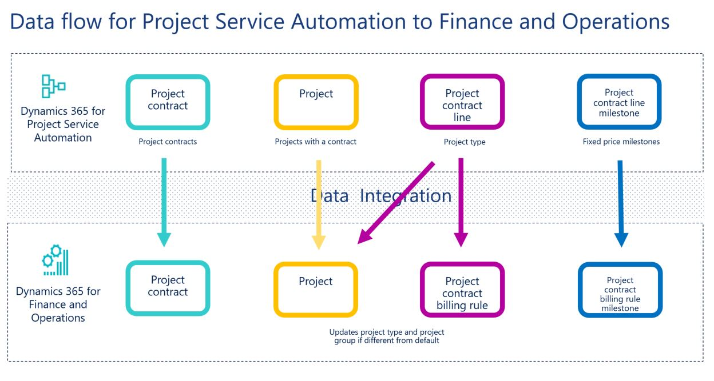
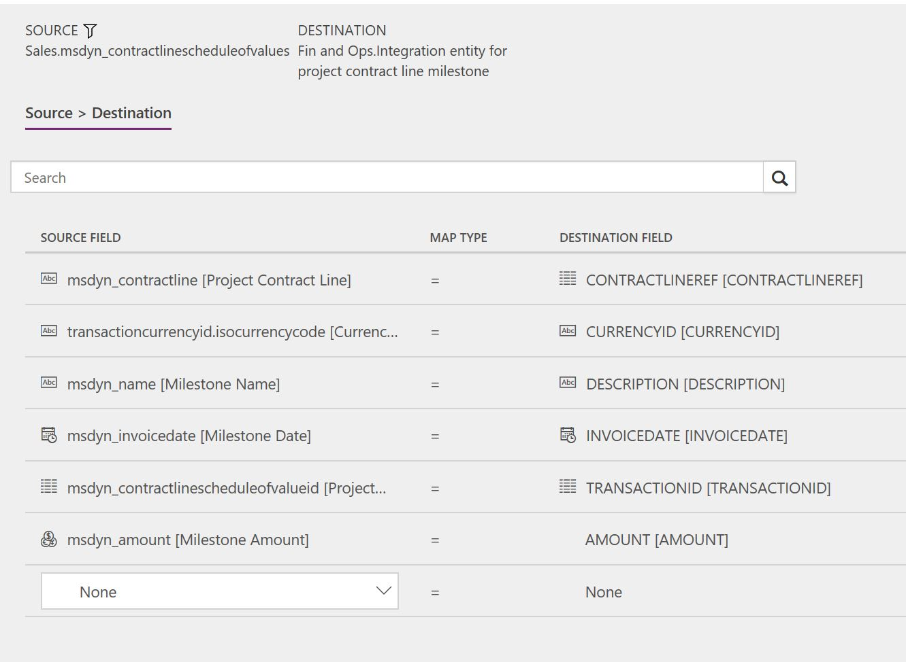

---
# required metadata

title: Synchronize project contracts and projects directly from Project Service Automation to Finance and Operations
description: This topic describes the template and underlying tasks that are used to synchronize project contracts and projects directly from Microsoft Dynamics 365 for Project Service Automation to Microsoft Dynamics 365 for Finance and Operations.
author: KimANelson
manager: AnnBe
ms.date: 10/25/2018
ms.topic: article
ms.prod: 
ms.service: dynamics-ax-applications
ms.technology: 

# optional metadata

# ms.search.form: 
# ROBOTS: 
audience: Application User
# ms.devlang: 
ms.reviewer: shylaw
ms.search.scope: Core, Operations
# ms.tgt_pltfrm: 
ms.custom: 87983
ms.assetid: b454ad57-2fd6-46c9-a77e-646de4153067
ms.search.region: Global
# ms.search.industry: 
ms.author: knelson
ms.search.validFrom: 2017-12-13
ms.dyn365.ops.version: AX 7.3.0

---

# Synchronize project contracts and projects directly from Project Service Automation to Finance and Operations

[!include[banner](../includes/banner.md)]

This topic describes the template and underlying tasks that are used to synchronize project contracts and projects directly from Microsoft Dynamics 365 for Project Service Automation to Microsoft Dynamics 365 for Finance and Operations.

> [!NOTE] 
> If you're using Microsoft Dynamics 365 for Finance and Operations, Enterprise edition 7.3.0, you must install KB 4074835.

## Data flow for Project Service Automation to Finance and Operations

> [!NOTE]
> Before you can use the Project Service Automation to Finance and Operations integration solution, you should be familiar with the Microsoft Dynamics 365 Data integration feature.

The Project Service Automation to Finance and Operations integration solution uses the Data integration feature to synchronize data across instances of Project Service Automation and Finance and Operations. The integration template that is available with the Data integration feature enables the flow of data about project contracts, projects, project contract lines, and project contract line milestones from Project Service Automation to Finance and Operations.

The following illustration shows how the data is synchronized between Project Service Automation and Finance and Operations.

## Templates and tasks

To access the available templates, in the Microsoft PowerApps admin center, select **Projects**, and then, in the upper-right corner, select **New project** to select public templates.

The following template and underlying tasks are used to synchronize project contracts and projects from Project Service Automation to Finance and Operations:

- **Name of the template in Data integration:** Projects and contracts (PSA to Fin and Ops)
- **Name of the tasks in the project:**

    - Project contracts PSA to Fin and Ops
    - Projects PSA to Fin and Ops
    - Project contract lines PSA to Fin and Ops
    - Project contract line milestones PSA to Fin and Ops

Before synchronization of project contracts and projects can occur, you must synchronize accounts.

## Entity set

| Project Service Automation       | Finance and Operations                                 |
|----------------------------------|--------------------------------------------------------|
| Orders                           | Integration entity for project contract                |
| Projects                         | Integration entity for project                         |
| Order lines                      | Integration entity for project contract line           |
| Project contract line milestones | Integration entity for project contract line milestone |

## Entity flow

Project contracts are managed in Project Service Automation, and they are synchronized to Finance and Operations as project contracts. As part of the integration template, you can set the integration source in Finance and Operations for the project contract.

Time and material project and Fixed price projects are managed in Project Service Automation, and they are synchronized to Finance and Operations as projects. As part of the template integration, you can set the integration source in Finance and Operations for the project.

Project contract lines are managed in Project Service Automation, and they are synchronized to Finance and Operations as project contract billing rules. If the billing method differs from the default project type, the synchronization updates the project type for the contract line project and project group.

Project contract line milestones are managed in Project Service Automation, and they are synchronized to Finance and Operations as project contract billing rule milestones.

## Project Service Automation to Finance and Operations integration solution

The **Project contract ID** field is available on the **Project contracts** page. This field has been made a natural and unique key to support the integration.

When a new project contract is created, if a **Project contract ID** value doesn't already exist, it's automatically generated by using a number sequence. The value consists of **ORD** followed by an incrementing number sequence and then a suffix of six characters. Here is an example: **ORD-01022-Z4M9Q0**.

The **Project Number** field is available on the **Projects** page. This field has been made a natural and unique key to support the integration.

When a new project is created, if a **Project Number** value doesn't already exist, it's automatically generated by using a number sequence. The value consists of **PRJ** followed by an incrementing number sequence and then a suffix of six characters. Here is an example: **PRJ-01049-CCNID0**.

When the Project Service Automation to Finance and Operations integration solution is applied<TO DO: link in the top level document link where we will be adding the instructions for applying the PSA solution>, an upgrade script sets the **Project contract ID** field for existing project contracts and the **Project Number** field for existing projects in Project Service Automation.

## Prerequisites and mapping setup

- Before synchronization of project contracts and projects can occur, you must synchronize accounts.
- In your connection set, add an integration key field mapping for **msdyn\_organizationalunits** to **msdyn\_name \[Name\]**. You might first have to add a project to the connection set. For more information, see [Integrate data into Common Data Service for Apps](/powerapps/administrator/data-integrator.md).
- In your connection set, add an integration key field mapping for **msdyn\_projects** to **msdynce\_projectnumber \[Project Number\]**. You might first have to add a project to the connection set. For more information, see [Integrate data into Common Data Service for Apps](/powerapps/administrator/data-integrator.md).
- **SourceDataID** for project contracts and projects can be updated to a different value or removed from the mapping. The default template value is **Project Service Automation**.
- The **PaymentTerms** mapping must be updated so that it reflects valid terms of payment in Finance and Operations. You can also remove the mapping from the project task. The default value map has default values for demo data. The following table shows the values in Project Service Automation.

    | Value | Description   |
    |-------|---------------|
    | 1     | Net 30        |
    | 2     | 2% 10, Net 30 |
    | 3     | Net 45        |
    | 4     | Net 60        |

## Power Query

You must use Microsoft Power Query for Excel to filter data if the following conditions are met:

- You have sales orders in Microsoft Dynamics 365 for Sales.
- You have multiple organizational units in Project Service Automation, and these organizational units will be mapped to multiple legal entities in Finance and Operations.

If you must use Power Query, follow these guidelines:

- The Projects and contracts (PSA to Fin and Ops) template has a default filter that includes only sales orders of the **Work item (msdyn\_ordertype = 192350001)** type. This filter helps guarantee that project contracts aren't created for sales orders in Finance and Operations. If you create your own template, you must add this filter.
- You must create a Power Query filter that includes only the contract organizations that should be synchronized to the legal entity of the integration connection set. For example, project contracts that you have with the contract organizational unit of Contoso US should be synchronized to the USSI legal entity, but project contracts that you have with the contract organizational unit of Contoso Global should be synchronized to the USMF legal entity. If you don't add this filter to your task mapping, all project contracts will be synchronized to the legal entity that is defined for the connection set, regardless of the contract organizational unit.

## Template mapping in Data integration

> [!NOTE] 
> The **CustomerReference**, **AddressCity**, **AddressCountryRegionID**, **AddressDescription**, **AddressLine1**, **AddressLine2**, **AddressState**, and **AddressZipCode** fields aren't included in the default mapping for project contracts. You can add the mappings if you require that this data be synchronized for project contracts.
>
> The **Description**, **ParentID**, **ProjectGroup**, **ProjectManagerPersonnelNumber**, and **ProjectType** fields aren't included in the default mapping for projects. You can add the mappings if you require that this data be synchronized for projects.

The following illustrations show examples of the template task mappings in Data integration. The mapping shows the field information that will be synchronized from Project Service Automation to Finance and Operations.

