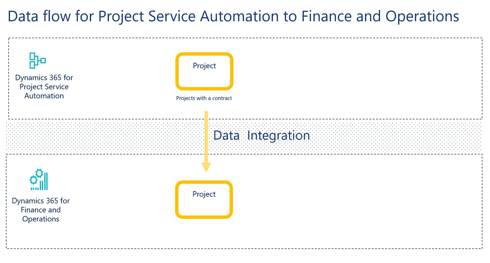

---
# required metadata

title: Synchronize projects directly from Project Service Automation to projects  in Finance and Operations
description: This topic discusses the template and underlying tasks that are used to synchronize projects directly from Microsoft Dynamics 
365 for Project Service Automation to Microsoft Dynamics 365 for Finance and Operations, Enterprise edition.
author: KimANelson
manager: AnnBe
ms.date: 11/27/2017
ms.topic: article
ms.prod: 
ms.service: dynamics-ax-applications
ms.technology: 

# optional metadata

# ms.search.form: 
# ROBOTS: 
audience: Application User
# ms.devlang: 
ms.reviewer: twheeloc
ms.search.scope: Core, Operations
# ms.tgt_pltfrm: 
ms.custom: 87983
ms.assetid: b454ad57-2fd6-46c9-a77e-646de4153067
ms.search.region: Global
# ms.search.industry: 
ms.author: knelson
ms.search.validFrom: 2016-11-28
ms.dyn365.ops.version: AX 7.0.0

---
# Synchronize projects directly from Project Service Automation to projects in Finance and Operations

This topic discusses the template and underlying tasks that are used to synchronize projects directly from Microsoft Dynamics 365 for 
Project Service Automation to Microsoft Dynamics 365 for Finance and Operations, Enterprise edition.

> [!NOTE] 
> Before you can use the Project Service Automation to Finance and Operations integration solution, you should be familiar with 
Dynamics 365 Data Integration.

## Data flow for Project Service Automation to Finance and Operations
The solution to integrate Project Service Automation to Finance and Operations uses the Data integration feature to synchronize 
data across instances of Project Service Automation and Finance and Operations. The integration templates that are available with the
Data integration feature enable the flow of data about project contracts, projects, project contract lines and project contract line 
milestones from Project Service Automation to Finance and Operations. 

The following illustration shows how the data is synchronized between Project Service Automation and Finance and Operations.

 

## Templates and tasks
To access the available templates, open the PowerApps Admin Center. 
Select **Projects**, and then, in the upper-right corner, select **New project** to select public templates.

The following template and underlying task are used to synchronize projects from Project Service Automation to Finance and 
Operations:

•	Name of the template in Data integration: Projects (PSA to Fin and Ops)

•	Name of the task in the project: Projects 

You must synchronize Project contracts <TO DO – add link to the project contracts topic> before projects synchronization can occur.

## Entity set

| Project service automation  | Finance and Operations      |
|-------------------------|--------------------------------|
| Projects                  | Integration entity for project |

## Entity flow

Time and material and fixed price projects are managed in Project Service Automation and synchronized to Finance and Operations as 
projects. As part of the template, you can set the Integration source in Finance and Operations for the project.

## Project Service Automation to Operations solution

The **Project number** field is available on the **Projects** page. It has been made a natural and unique key in order 
to support the integration.

When a new project is created, if a **Project Number** value doesn’t already exist, it’s automatically generated by using a number sequence. The value consists of **PRJ** followed by an increasing number sequence and then a suffix of six characters. Here is an example: **PRJ-01049-CCNID0**.

When the integration solution for Project Service Automation <TO DO: link the top level document link where we will be adding the 
instructions for applying the PSA solution> is applied, an upgrade script sets the **Project Number** field for existing projects in Project Service Automation.

## Preconditions and mapping setup

•	You must synchronize Project contracts <TO DO – add link to project contracts topic> before projects synchronization can occur.

•	Add an integration key field mapping in your connection set for msdyn_projects to msdynce_projectnumber [Project Number]. You may need
to add a project to the connection set first. For more information on integration keys, reference Dynamics 365 Data Integration.

•	The **SourceDataID** can be updated to a different value or be removed from the mapping. The default template value is **Project Service 
Automation**.

## Template mapping in Data integration

> [!NOTE] 
> The **Description**, **ParentID**, **ProjectGroup**, **ProjectManagerPersonnelNumber**, **ProjectType** fields aren’t included in the 
default mapping. You can add the mapping if you require this data to be synchronized for projects.

The following illustration shows an example of a template mapping in Data integration.

 
