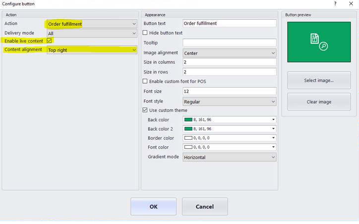
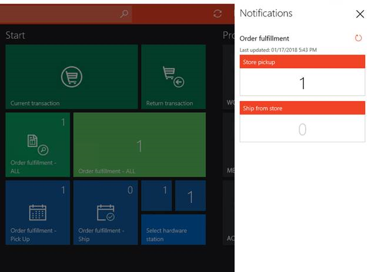

---
# required metadata

title: Display order notifications in Point of Sale
description: This topic describes how to enable order notifications in the Point of Sale and the notifications framework, which can be extended to other operations. 
author: ShalabhjainMSFT
manager: AnnBe
ms.date: 10/30/2017
ms.topic: article
ms.prod: 
ms.service: dynamics-ax-retail
ms.technology: 

# optional metadata

ms.search.form:  RetailOperations, RetailFunctionalityProfile
audience: Application User
# ms.devlang: 
ms.reviewer: josaw
ms.search.scope: Core, Operations, Retail
# ms.tgt_pltfrm: 
# ms.custom: 
ms.search.region: Global
ms.search.industry: retail
ms.author: ShalabhjainMSFT
ms.search.validFrom: 2017-10-30
ms.dyn365.ops.version: 

---

# Display notifications in Point of Sale

In today's modern retail environment, store associates are assigned various tasks, such as helping customers, entering transactions, performing stock counts, and receiving orders in store. The Point of Sale (POS) client empowers the associates to do these tasks and much more, all in a single application. With various tasks to be performed during a day, associates may need to be notified when something requires their attention. The notification framework in the POS solves this problem by allowing the retailers to configure role-based notifications. With Dynamics 365 for Retail with Application update 5, these notifications can be only configured for POS operations.

Currently, the system provides the capability to display notifications for order fulfillment operation, however, the framework is designed to be extensible, so that in the future, developers will be able to write a notification handler for any operation and display the notifications in POS.  

## Enable notifications for order fulfillment operations

To enable notifications for the order fulfillment operations, refer to the following the steps:

 - Go to the **Operations** page (**Retail** > **Channel setup** > **POS setup** > **POS** > **Operations**).
 - Search for the Order fulfillment operation and select the **Enable notifications** check box for this operation. This indicates to the notification framework to listen to the handler for the order fulfillment operation. If the handler is implemented, then the notifications will be displayed on POS, otherwise the notifications will not be displayed for this operation.
- Go to the POS permissions associated with the workers and under the **Notifications** FastTab, add the Order fulfillment operation with the "Display order" as 1. When there is more than one notification configured, the display order is used to arrange the notification from top to bottom with 1 being on top. Only those operations can be added for which the **Enable notifications** check box has been selected. Also, the notifications will be displayed only for the operations that have been added here and only to those workers for whom the operations have been added to the corresponding POS permissions. 

> [!NOTE]
> Notifications can be overridden at the user level by navigating to the worker's record and selecting **POS Permissions** and then editing that user's notification subscription.

 - Go to the **Functionality profile** page (**Retail** > **Channel setup** > **POS setup** > **POS profiles** > **Functionality profiles**). Update the **Notification interval** property, to set the interval in minutes at which the notifications should be pulled. For some notifications, the Point of Sale needs to make real-time calls to the back office application, which consumes compute capacity of your back office application. We recommend entering a number that meets your business requirements but also considers the impact of real-time calls. Setting the notification interval to "0" will turn off notifications.  

 - Go to **Retail** > **Retail IT** > **Distribution schedule**. Select schedule "1060-Staff" to sync notification subscription settings and then click **Run now**. Next, sync the permission interval by selecting the "1070-Channel configuration" and then click **Run now**. 

## View notifications in POS

After the above steps are complete, the workers, for whom the notifications are set up, can view the notifications in POS. To view the notifications, click the notification icon in the title bar of the POS. This diplays a notification center with the notifications
for the order fulfillment operation. The notification center should display the following groups within the order fulfillment operation: 

- **Pending orders** - This group displays the count of orders that are in the pending state, such as orders which need to be accepted by a POS worker, having the required permissions for store fulfillment. Clicking the number on the group will open the **Order fulfillment** page, filtered to display only the pending orders assigned to the store for fulfillment. If the orders are automatically accepted for the store, then the count for this group will be zero.

- **Store pickup** - This group displays the count of orders that have the delivery mode of **Pickup** and the pickup is scheduled from the current store. Clicking the number on the group will open the **Order fulfillment** page, filtered to display the active orders which are set up to be picked from the current store.

- **Ship from store** - This group displays the count of orders that have the delivery mode of **Shipping** and the shipping is scheduled from the current store. Clicking the number on the group will open the **Order fulfillment** page, filtered to display the active orders which are set up to be shipped from the current store.

When there are new orders assigned to the store for fulfillment, the notification icon will change to indicate the new notifications and the count of the corresponding groups will be updated. The user can also click on the refresh icon, next to the operation name, to immediately update the count of the groups. The count will also be updated at the predefined interval. Any group that has a new item, which is not seen by the current worker, will display a burst icon indicating this group has a new item. Clicking on the tiles within notifications will open the specific operation for which that notification is configured. In the above scenarios, clicking the notifications will open the **Order fulfillment** page and pass the appropriate parameters: pending orders, store pickup, and ship from store. 

> [!NOTE]
> Pending orders notifications will be enabled in an upcoming update to Dynamics 365 for Retail. 

## Enable live content on the POS buttons

You can now display an integer count on the POS buttons to help the workers easily determine the tasks that need their immediate attention. To display this number on the POS button, you need to complete the notification set up mentioned in the 'Notification setup' section i.e. enabling notification for an operation, setting up a notification pull frequency and updating the POS permission group for the worker. In addition to this, you would need to open the button grid designer, view button properties and select "Enable live content" checkbox. You have an option of displaying the number on the 'top right' corner or on the 'center' of the button. The below images display the live content settings on button grid designer and display the effect of choosing top right vs center on various button sizes.

> [!NOTE]
> The live content can only be enabled for those operations for which the "Enable notifications" has been checked in POS Operations

.

. 
