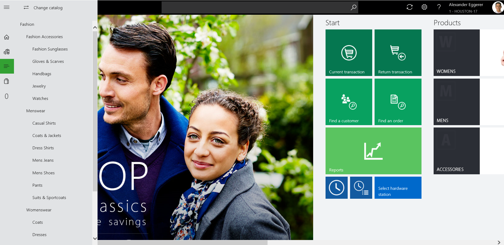
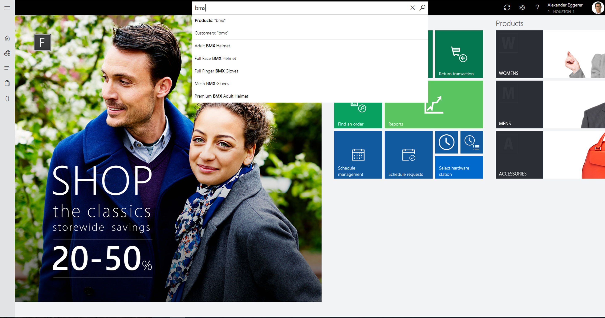
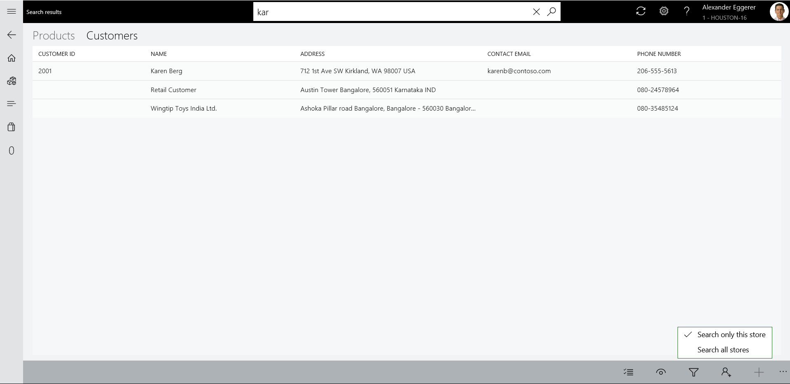
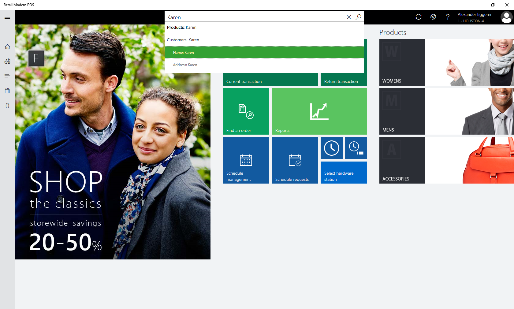
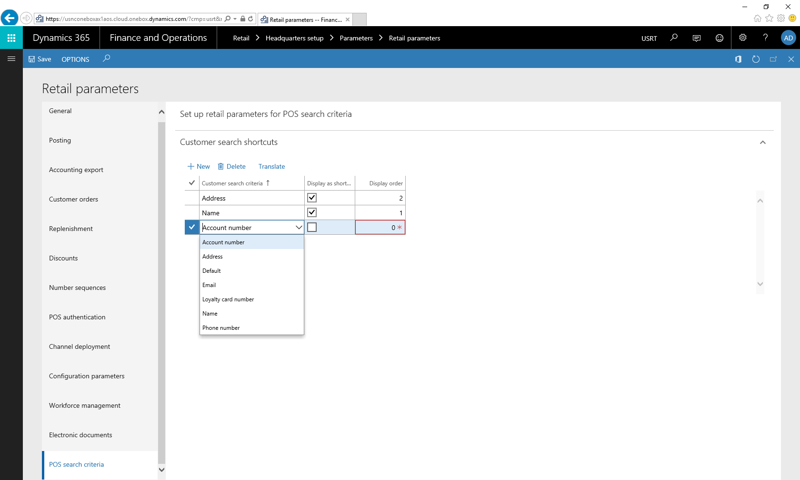

---
# required metadata

title: Product search and customer search in POS
description: This topic provides an overview of improvements that have been made to product and customer search functionality in Dynamics 365 for Retail. 
author: ShalabhjainMSFT
manager: AnnBe
ms.date: 08/16/2017
ms.topic: article
ms.prod: 
ms.service: dynamics-365-retail
ms.technology: 

# optional metadata

# ms.search.form: 
# ROBOTS: 
audience: Application user
# ms.devlang: 
ms.reviewer: josaw
ms.search.scope: Core, Operations, Retail
# ms.tgt_pltfrm: 
ms.custom: 141393
ms.assetid: 
ms.search.region: Global
ms.search.industry: Retail
ms.author: shajain
ms.search.validFrom: 2017-06-30
ms.dyn365.ops.version: Retail April 2017 update

---

# Overview of product and customer search in Point of Sale

Modern Point of Sale (MPOS) and Cloud Point of Sale (CPOS) provide easy-to-use search functionality that lets store employees quickly search for products and customers. The search bar is always present at the top of MPOS and CPOS, so that employees can quickly find products and customers.

Employees can search for products in the assortments and catalogs that are associated with the current store, and in the assortments and catalogs that are associated with any other store in the company. Therefore, cashiers can sell and return products outside the store assortment. Similarly, employees can search for customers that are associated with the current store or any other store in the company. Additionally, employees can search for customers that are associated with a different company in the parent organization.

## Product search 

By default, a product search is done on the store assortment. This type of search is known as a *local product search*. However, employees can easily switch to any catalog that is associated with the current store, or they can search in a different store. This type of search is known as a *remote product search*. To change the catalog, select the **Categories** button on the left side of the page. At the top of the pane that appears, select the **Change catalog** button, and then select one of the available catalogs to browse it. The system will search the selected catalog for products.

On the **Change catalog** page, employees can easily select any store, or they can search for products across all stores.

 
A local product search searches within the following product properties:

- Product number
- Product name
- Description
- Dimensions
- Barcode
- Search name

### Enhancements to local product searches

The experience for local product searches has been made more user friendly. The following enhancements have been made:

- Product and customer drop-down menus have been added to the search bar, so that employees can select either **Product** or **Customer** before they do the search. By default, **Product** is selected, as shown in the illustration that follows.
- For multiple-keyword searches (that is, for searches that use search terms), retailers can configure whether the search results include results that match any search term or only results that match all search terms. This setting is available in the POS functionality profile, under a new group that is named **Product search**. The default setting is **Match any search term**. This setting is also the recommended setting. When the **Match any search term** setting is used, all products that fully or partially match one or more search terms are returned as results, and the results are automatically sorted in ascending order of products that have the most keyword matches (full or partial).

    The **Match all search terms** setting returns only products that match all the search terms (full or partial). This setting is helpful when the product names are lengthy, and employees want to see only limited products in the search results. However, this type of search has two limitations:

    - The search is done on individual product properties. For example, only products that have all the searched keywords in at least one product property are returned.
    - Dimensions aren't searched.

- Retailers can now configure product search to show search suggestions as users type product names. A new setting for this functionality is available in the POS functionality profile, under a group that is named **Product search**. The setting is named **Show search suggestions while typing**. This functionality can help employees quickly find the product that they are searching for, because they don't have to type the whole name manually.
- The product search algorithm now also searches for the searched terms in the **Search name** property of the product.

## Customer search

Customer search is used to find customers for various purposes. For example, cashiers might want to view a customer's wish list or purchase history, or add the customer to a transaction. In the case of multiple-keyword searches, the customer search algorithm returns all customers that match any of the searched keywords. However, the customers that match the most keywords appear at the top of the results. This behavior is analogous to the way that other search engines show results. They first show the results that match the most searched terms, and then they show the results that partially match the search keywords. This behavior helps cashiers in situations where they are using multiple keywords for their search, but one of the keywords has a spelling mistake.

By default, a customer search is done on the customer address books that are associated with the store. This type of search is known as a *local customer search*. However, employees can also search for customers globally. In other words, they can search across the stores of the company and across all other legal entities. This type of search is known as a *remote customer search*.

To search globally, employees can select the **Filter results** button at the bottom of the page and then select the **Search all stores** option, as shown in the illustration that follows. In this case, not only customers are returned. All types of parties that are part of any address book in the headquarters are also returned. These parties include workers, vendors, contacts, and competitors.

> [!NOTE]
> A minimum of four characters must be entered for a remote customer search to return results.

In a remote customer search, the customer ID isn't shown for customers from the other legal entities, because no customer ID has been created for those parties in the current company. However, if an employee opens the customer details page, the system automatically generates a customer ID for the party and also associates the store's customer address books with the customer. Therefore, the customer will be visible in local store searches that are done later.

### Enhancements to local customer search
The phone number-based search has been simplified, as it now ignores special characters such as spaces, hyphens, or brackets that might have been added while creating the customer. With this enhancement, cashiers don't have to worry about the phone number format while searching. They can also search for customers by typing a partial phone number. If special characters are included in the phone number, it can also be found by searching for the numbers that appear after the special characters. For example, if a customer's phone number was entered as **123-456-7890**, a cashier can search for the customer by typing **123**, **456**, **7890**, or **1234567890**, or by partially entering the first few numbers of the phone number. 

Instead of the traditional customer search, which can be time consuming as it searches across multiple fields, cashiers can now search within a single custom property, such as name, email, or phone number. The properties used by the customer search algorithm are collectively called the customer search criteria. The system admin can easily configure one or more these criteria as shortcuts that will be displayed on POS. Since the search is restricted to a single criteria, only the relevant search results are displayed and the performance is much better than the standard customer search. The image below shows the customer search shortcuts in POS.

To set a search criteria as a shortcut, the admin must navigate to the **Retail parameters** page on the **POS search criteria** tab, then select all the criteria which should be displayed as a shortcut. The image below shows the page in Dynamics 365 for Finance and Operations to configure customer search shortcuts. 

> [!NOTE]
> Many shortcuts will clutter the POS search dropdown and can hinder the employee experience. We recommend that shortcuts are kept to the minimum needed.  

The **display order** field determines the order in which shortcuts will be displayed in POS. The criteria shown are the out-of-the-box properties that the customer search algorithm uses for searching customers. Partners can add custom properties as a search shortcut. To do so, the system admin must extend the extensible enum used for the customer search criteria and then mark their custom properties as shortcuts. Partners are responsible for writing the code to find results when their custom shortcuts are used for searching.

> [!NOTE]
> Adding a custom property to the enum does not have any impact on the standard customer search algorithm. In other words, the customer search algorithm will not search within the custom property. The only way to allow users to search using a custom property is to add it as a shortcut or override the default search algorithm. 
