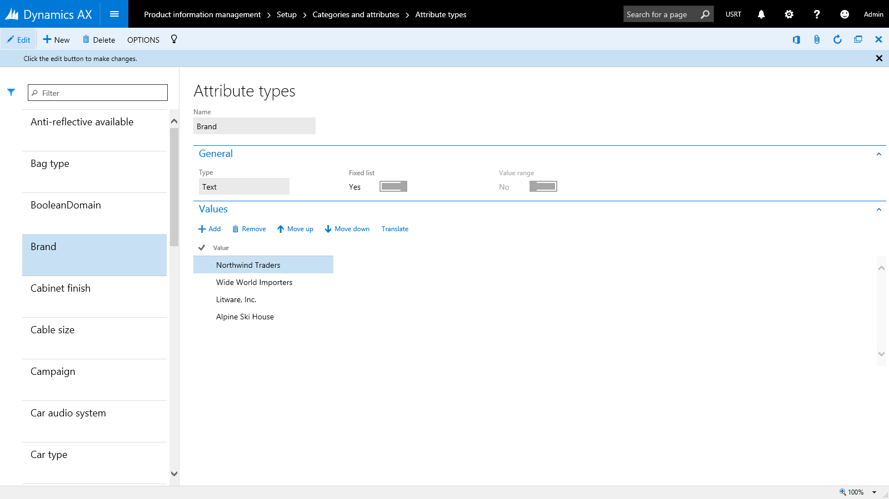
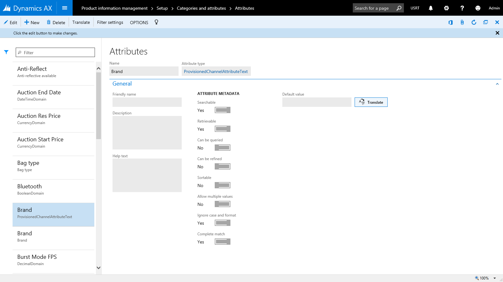
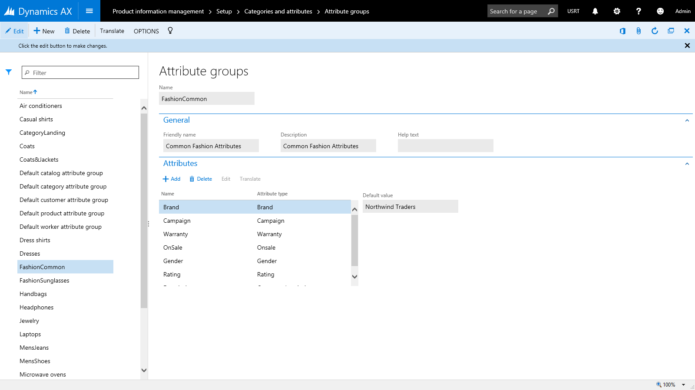
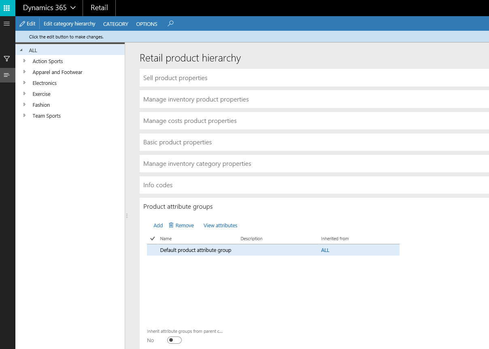
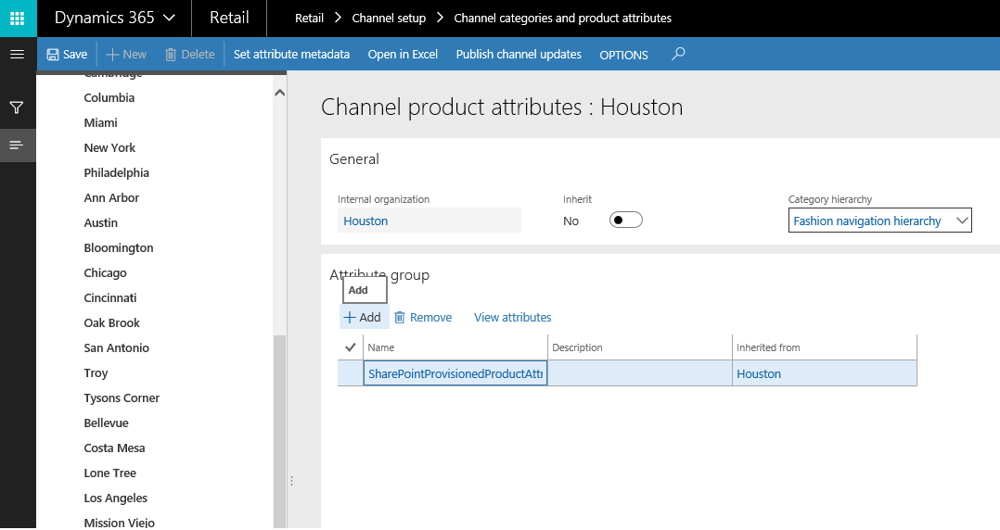
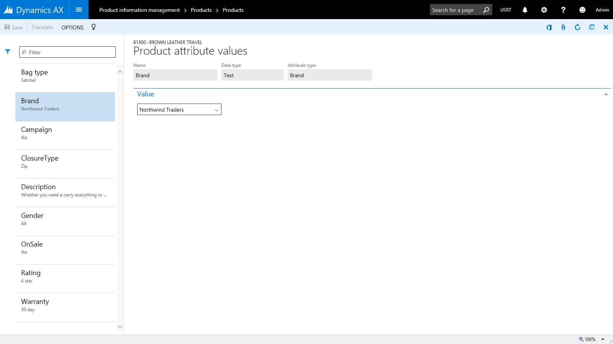
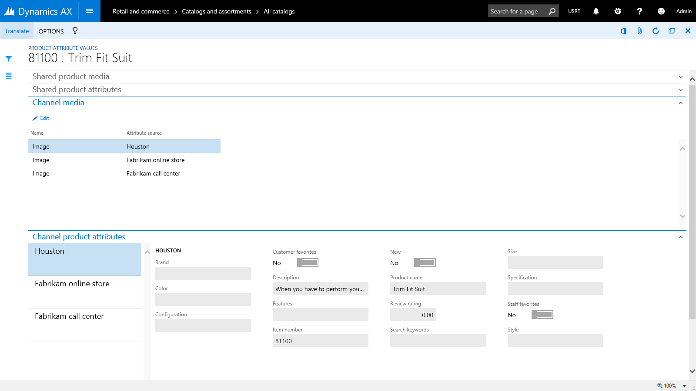

# Attributes, Attribute groups & their associations with various Retail Entities in Dynamics 365. 

 **Attribute** provides a way to further describe a product and its characteristics through user defined fields (examples: memory size, hard disk capacity, Is Energy star compliant etc.). In Dynamics 365, attributes can be associated with various retail entities such as Product Categories and Retail Channels, and default values can be set on them. Products inherit the attributes and the default values upon their association with the Product Categories or Retail Channels. The default values can be overridden at the product level: at the individual product level, at retail channel level, or in retail catalog.
 
*Example for a typical TV product there could be following attributes*

| **Category   | Attribute                | Permissible Values       | Default Value** |
|------------|--------------------------|--------------------------|---------------|
| TV & Video | Brand                    | Any valid Brand value    | (None)        |
|            |                          |                          |               |
| TV         | Screen Size              | 20” – 80”                | (None)        |
|            | Vertical Resolution      | 480i, 720p, 1080i, 1080p | 1080P         |
|            | Screen Refresh Rate      | 60hz, 120hz, 240hz       | 60hz          |
|            | HDMI Inputs              | 0 – 10                   | 3             |
|            | DVI Inputs               | 0 – 10                   | 1             |
|            | Composite Inputs         | 0 – 10                   | 2             |
|            | Component Inputs         | 0 – 10                   | 1             |
|            |                          |                          |               |
| LCD        | 3D Ready                 | Yes or No                | Yes           |
|            | 3D Enabled               | Yes or No                | No            |
|            |                          |                          |               |
| Plasma     | Operating Temp From      | 32 degree – 110 degree   | 32            |
|            | Operating Temp To        | 32 degree – 110 degree   | 100           |
|            |                          |                          |               |
| Projection | Projection Tube Warranty | 6, 12 or 18 months       | 12            |
|            | # of Projection Tubes    | 1 to 5                   | 3             |

## Attribute types

*Attributes* are based off **Attribute Types**. The **Attribute Type** identifies the type of data that can be entered for a specific attribute. The following attribute types are currently supported in the Dynamics 365:

-	**Currency** – Supports currency value. It can be bounded (supports a value range) or can be left open.
-	**DateTime** – Supports date and time value. It can be bounded (supports a value range) or can be left open.
-	**Decimal** – Supports numerical value including decimals. It also supports unit of measure. It can be bounded (supports a value range) or can be left open.
-	**Integer** – Supports numerical value. It also supports unit of measure. It can be bounded (supports a value range) or can be left open.
-	**Text** – Supports text value. It also supports a predefined set of possible values (aka Enumeration).
-	**Boolean** – Supports binary value (true / false).
-	**Reference** – References other attributes.

## How-to set up attribute types in Dynamics 365 

*	Login to Dynamics 365 back-office client as a Retail Merchandising Manager	
* Go to Product information management > Setup > Categories and attributes > Attribute types
	Create a new attribute types of type Text and with Fixed list:
  *	Lens shape (Values: Oval, Square, Rectangle)
  *	Sunglass brand (Values: Ray ban, Aviator, Oakley)

## How-to set up attributes in Dynamics 365 
- Login to Dynamics 365 back-office client as a Retail Merchandising Manager	
- Go to Product information management  Setup  Categories and attributes  Attributes
  - Create a new attribute: *Lens *
  -	Set Attribute type: *Lens shape*

## Attribute metadata
Attribute metadata allows you to select the options that indicate how the attributes for each product should behave. 

For example, you can select whether attributes are required, whether they can be used for search, and whether they can be used as a filter. For retail products, the attribute metadata settings can be overridden at the channel level, we will learn later in this article about it. 

As you may notice, on the attribute form there's a dedicated section for the Attribute metadata. Of the available properties, the property that affects the behavior or treatment of the attribute values by the system on Retail Point of Sale is **"Can be refined"**. 
Upon setting the value to be "Yes" for "Can be refined" only those attributes show up for refinement or filtering of products on Point of sale. 

The remaining properties in attribute metadata - 

- Searchable,
  - Retrievable,
  - Can be queried,
  - Sortable,
  - Allow multiple values,
  - Ignore case & format, and
  - Complete match 
  
  Purpose of these propoerties can be understood here [Overview of SharePoint search ](https://technet.microsoft.com/en-us/library/jj219669.aspx "Overview of SharePoint search")

These were originally intended for improving search for online store-front. With Dyamics 365, although we don’t ship that Online Store out of the box but we ship **eCommerce Publishing SDK** which is used by the customers to put products into a Search Index of their choice. While the data is imported it is still good idea to let our customers distinguish between searchable, queryable, and so on so they could build optimal index to make sure they index only those attributes which *in their opinion* should be indexed. 

## Filter settings for Attributes 
---add details around filter settings for attributes ---
---Add screenshot for filter settings of attributes----

## Attribute group 
An attribute group is used to group the attributes for a component or subcomponent in a product configuration model. This can help a person configure a product, because the selections are arranged in a certain context. Once attributes have been defined, they can be grouped under **Attribute Groups**. Attribute Groups provide grouping of individual attributes and can be assigned to retail categories or retail channels. An attribute can be included in more than one attribute group. 

You can also set default values for selected attributes that are included in the attribute group. For example, if you add an attribute for color to an attribute group, you can select the color ***Blue*** as the default attribute value. When the attribute group is added to a retail product that includes a color as one of its attributes, the color ***Blue*** is displayed as the default color for that product. 

## How-to Steps: Attribute groups
- Login to Dynamics 365 back-office client as a Retail Merchandising Manager 
-	Go to Product information management > Setup > Categories and attributes > Attribute groups
-	Create a new attribute group: *Fashion Sunglasses*
-	Add attributes: *Lens shape, Sunglass brand*

## Assign attribute groups to Retail categories

One or more attribute groups that can be associated with category nodes in the following types of retail category hierarchies: Retail product hierarchy, Channel navigation category hierarchy, and Supplemental product category hierarchy. Products will inherit the attributes, which are included in the attribute groups, upon their categorization.

## How-to Steps – Assign attribute groups to Retail categories
-	Login to Dynamics 365 back-office client as a Retail Merchandising Manager 
-	Go to Retail and commerce > Category and product management > Retail product hierarchy
  -	Click on “Fashion navigation hierarchy”.	
  -	Select category “Pants” under Menswear and add attribute group “Men’s belt” under Product attribute group tab.
  -	Select category “Fashion sunglasses” and verify new attributes in “Fashion Sunglasses” attribute group by clicking view attributes.
  [Note: It should show the newly added attributes Lens shape, Sunglass brand.]
  - Select category “Pants” under Menswear and verify attributes for “Men’s belt” attribute group by clicking view attributes
  [Note: It should show Men’s belt attributes: Men’s belt brand, Belt fabric, and Belt size.]

  [Note: The aforementioned approach can be used to assign attribute groups to categories in Channel navigation category hierarchy, and Supplemental product category hierarchy as well:
- Retail and commerce > Category and product management > Channel navigation categories
- Retail and commerce > Category and product management > Supplemental product categories]

## Assign attribute groups to Retail stores

One or more attribute groups that can be associated with one or more Retail stores in the retail stores hierarchy. Products will inherit the attributes, which are included in the attribute groups, when they are enriched for specific retail stores.

## How-to Steps – Assign attribute groups to Retail stores
- Login to Dynamics 365 back-office client as a Retail Merchandising Manager 
- Go to Retail and commerce  Channel setup  Channel categories and product attributes
- Assign the following attribute groups to the “Houston” channel:
- Select channel "Houston"
- Click on button "Add" under the Attribute group fast tab and then select " SharePointProvisionedProductAttributeGroup" in the Name drop down.
- Click on button "Add" under the Attribute group fast tab and then select "Men’s belt" in the Name drop down.
- Click on button "Add" under the Attribute group fast tab and then select "Fashion Sunglasses" in the Name drop down.
	[*Note: There is an option to inherit attribute groups from parent channel in the hierarchy. If enabled, the child channel node will inherit all the attribute groups (and all the attributes contained in the attribute groups).]*
- Enable the attributes to be available in the “Houston” channel
- Click on Set attribute metadata on the action pane.
	- In the Metadata form:
	- Select category node “Fashion” and for each of the attributes under the “Channel product attributes” fast tab, check / select “Include attribute”.
	- Select category node “Fashion Accessories  Fashion Sunglasses” and for each of the attributes under the “Channel product attributes” fast tab, check / select “Include attribute”.
	- Select category node “Menswear  Pants” and for each of the attributes under the “Channel product attributes” fast tab, check / select “Include attribute”.
	

## Override attribute values
The default values of the attributes can be overridden at the product level, that is, for individual products.

## How-to Steps – Override attribute values of product
- Login to Dynamics 365 back-office client as a Retail Merchandising Manager 
- Go to Retail and commerce > Category and product management  Released products by category
- Select category node “Fashion > Fashion Accessories > Fashion Sunglasses”.
- Select the required product from the list in the right pane and then in the action pane, select “Setup Product attributes” under the Product tab.
- Select any of the attributes from the left pane and then change / update its value in the right pane.

## Override attribute values of product in Catalog

The default values of the attributes can be overridden for individual products in specific catalogs that are targeted for specific retail channels.

## How-to Steps – Override attribute values of product in Catalog
- Login to Dynamics 365 back-office client as a Retail Merchandising Manager 
- Go to Retail and commerce  Catalog management  All catalogs
- Select catalog “Fabrikam Base Catalog”.
- Select category node “Fashion  Fashion Accessories  Fashion Sunglasses”.
- Select the required product under the “Products” fast tab and then click on the “Attributes” button that is right above the products grid / list.
- Change / update the values of the required attributes under the following fast tabs:
	- Shared product media
	- Shared product attributes
	- Channel media
	- Channel product attributes
	*[Note: If created in Dynamics 365, Shared product media and Shared product attributes are applicable to all the Retail products.]*

## Override attribute values of product in Channel
The default values of the attributes can be overridden for individual products in specific catalogs that are targeted for specific retail channels.

## How-to Steps – Override attribute values of product in Channel
- Login to Dynamics 365 back-office client as a Retail Merchandising Manager 
- Go to Retail and commerce  Channel setup  Channel categories and product attributes
- Select the “Houston” channel.
- Select the required product under the “Products” fast tab and then click on the “Attributes” button that is right above the products grid / list.
	*[Note: If there are no products available, then add products by clicking on the “Add” button under the “Products” fast tab and then selecting the required products from the “Add products” dialog.]*
- Change / update the values of the required attributes under the following fast tabs:
	- Shared product media
	- Shared product attributes
	- Channel media
	- Channel product attributes
	*[Note: If created in Dynamics 365, Shared product media and Shared product attributes are applicable to all the Retail products.]*

