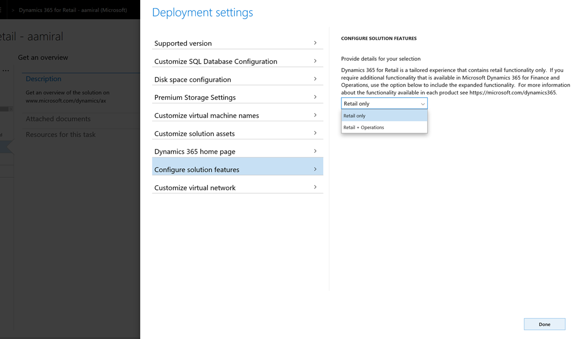

---
# required metadata

title: Choose a deployment option
description: This topic explains the differnces in the retail functionality between Dynamics 365 for Retail and Dynamics 365 for Finance and Operations.
author: ashishmsft 
manager: AnnBe
ms.date: 10/11/2017
ms.topic: article
ms.prod: 
ms.service: dynamics-ax-retail
ms.technology: 

# optional metadata

# ms.search.form:  [Operations AOT form name to tie this topic to]
audience: IT Pro
# ms.devlang: 
# ms.reviewer: sericks
ms.search.scope: Retail, Operations 
# ms.tgt_pltfrm: 
# ms.custom: [used by loc for topics migrated from the wiki]
ms.search.region: Global
# ms.search.industry: retail
ms.author: asharchw
ms.search.validFrom: 2017-06-30 
ms.dyn365.ops.version: Retail July 2017 update 
---

# Choose a deployment option

You can use retail functionality in 1 of 2 ways:
 
- Option 1: **Dynamics 365 for Retail**
- Option 2: **Dynamics 365 for Finance and Operations**
 
Dynamics 365 for Retail contains core retail functionality which is typically used by most retailers. This tailored functionality provides improved productivity and easier on-boarding and training for your employees.

You also have the option to enable additional functionality, which turns on the full functional footprint of Dynamics 365 Finance and Operations.
 
Below are some key differences between Dynamics 365 for Retail and Dynamics 365 for Finance and Operations.

| Capability   |  Dynamics 365 for Retail   |  Dynamics 365 for Finance and Operations  |
|--------------|----------------------------|-------------------------------------------|
|Seamless app model updates which do not require to be compiled or code merged with your customizations. | Yes | No|
|Seamless retail channel component updates (Retail POS, Channel database, Retail Server) which do not require code merge with your customizations. | Yes | Yes |
|Retail essentials scope and enhanced seed data initialization. | Yes (Enabled by default) | Yes (Available) |
|Full functional foot-print for a wide range of business processes. | Yes ( Available - requires Unified Operations license or P1 license) | Yes (Enabled by default) |

When you first go to Lifecycle Services (LCS) after acquiring necessary licenses for your tenant, you will be prompted to choose an implementation project type (Dynamics 365 for Retail or Dynamics 365 for Finance & Operations). You can use the above considerations to choose the right product to implement.
 
If you choose to implement Dynamics 365 for Retail, and have the necessary licenses, you will also have the option, at environment deployment time, to configure it for tailored retail functionality, or **Retail + Operations** functionality. 
 

