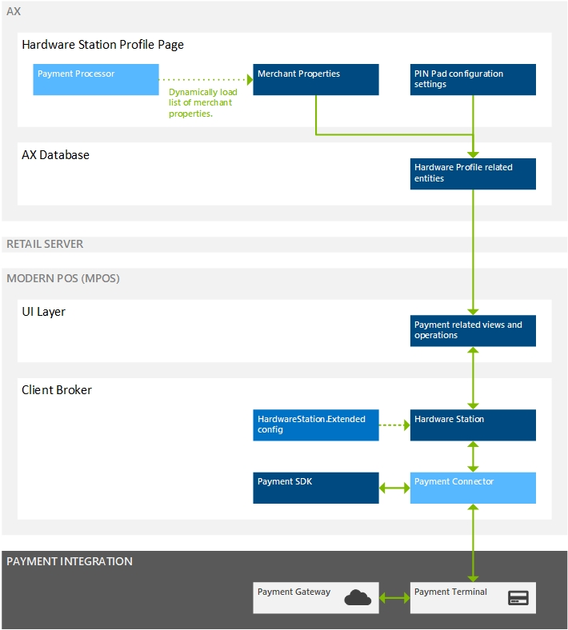

---
# required metadata

title: Create an end-to-end payment extension
description: 
author: 
manager: AnnBe
ms.date: 02/21/2018
ms.topic: article
ms.prod: 
ms.service: dynamics-365-retail
ms.technology: 

# optional metadata

# ms.search.form: 
# ROBOTS: 
audience: Developer
# ms.devlang: 
ms.reviewer: josaw
ms.search.scope: Operations, Retail
# ms.tgt_pltfrm: 
ms.custom: 
ms.search.region: Global
ms.search.industry: Retail
ms.author: rassadi
ms.search.validFrom: 2018-02-28
ms.dyn365.ops.version: AX 7.0.0, Retail July 2017 update

---

# Payment integration with payment terminal

This topic provides an overview of how to write a payment integration for the Dynamics 365 for Retail Modern POS (MPOS) for a payment terminal that can directly communicate with the payment gateway.

## Overview
The diagram below illustrates how a new payment connector that integrates with a payment terminal that can directly communicate with a payment gateway fits into the Dynamics 365 for Retail stack. Note, the diagram below assumes that a local Hardware Station is used to communicate with the payment terminal. However, the same patterns apply to the shared Hardware Station as well and the article below describes how a new payment connetors can be hooked up in each of the two scenarios.

This article describes the following steps required to create a new payment connector:
- **Writing payment connector**: Describes steps to implementation a new payment connector, including interfaces that have to be implemented and patterns to follow.
- **Configuring payment connector in the Hardware Station config**: Describes steps to configure the new payment connector to be loaded by the Hardware Station (local or shared).
- **Configuring payment connector in the AX Client UI**:: Describes steps to configure the payment connector in AX to be loaded at runtime.
