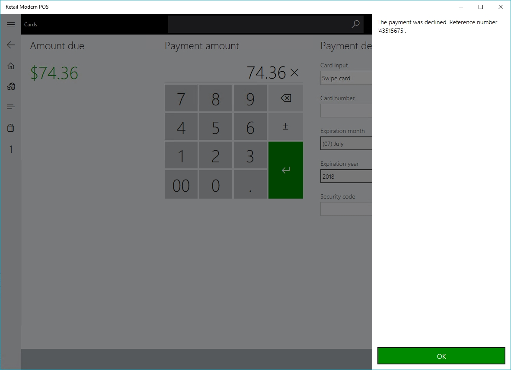

---
# required metadata

title: Custom error messages for payment terminal extensions
description: This topic describes how to create custom error messages for payment terminal extensions.
author: 
manager: AnnBe
ms.date: 07/20/2018
ms.topic: article
ms.prod: 
ms.service: dynamics-365-retail
ms.technology: 

# optional metadata

# ms.search.form: 
# ROBOTS: 
audience: Developer
# ms.devlang: 
ms.reviewer: josaw
ms.search.scope: Operations, Retail
# ms.tgt_pltfrm: 
ms.custom: 
ms.search.region: Global
ms.search.industry: Retail
ms.author: rassadi
ms.search.validFrom: 2018-07-20
ms.dyn365.ops.version: AX 7.0.0, Retail July 2017 update

---

# Custom error messages for payment terminal extensions
This topic describes how to create custom error messages for payment terminal extension. The most common scenario to leverage these custom error messages is when the payment terminal returns additional details on why a specific payment has failed that would be relevant to the cashier operating the POS terminal. For example, sometimes the external payment terminal/gateway might return unique identifiers (e.g. reference numbers or transaction identifiers) that would be relevant for troubleshooting with the payment provider.

## Key terms

| Term | Description |
|---|---|
| Payment connector | An extension library that is written to integrate the POS with a payment terminal. |

## Overview
This topic describes the following steps to create custom localized error messages for payment terminal extensions:

- **[Create custom error messages](#Create-custom-error-messages):** This step describes in detail how to create a custom error message in payment connector that can be returned and displayed in the POS. 

## Create custom error messages
In order to trigger a custom error message in the POS the `Errors` property of the `paymentInfo` passed to the `AuthorizePaymentTerminalDeviceResponse` object has to be set with the appropriate error. In particular, the `isLocalized` parameter on the constructor of the `PaymentError` object has to be set to `true` to force the POS to use the customized error message rather than the built in error message for a decline.

``` csharp
namespace Contoso.Commerce.HardwareStation.PaymentSample 
{ 
    /// <summary>
    /// <c>Simulator</c> manager payment device class.
    /// </summary>
    public class PaymentDeviceSample : INamedRequestHandler
    {
        /// <summary>
        /// Gets the collection of supported request types by this handler.
        /// </summary>
        public IEnumerable<Type> SupportedRequestTypes
        {
            get
            {
                return new[]
                {
                    typeof(AuthorizePaymentTerminalDeviceRequest),
                    ...
                };
            }
        }

        /// <summary>
        /// Executes the payment device simulator operation based on the incoming request type.
        /// </summary>
        /// <param name="request">The payment terminal device simulator request message.</param>
        /// <returns>Returns the payment terminal device simulator response.</returns>
        public Response Execute(Microsoft.Dynamics.Commerce.Runtime.Messages.Request request)
        {
            ThrowIf.Null(request, "request");

            Type requestType = request.GetType();

            if (requestType == typeof(AuthorizePaymentTerminalDeviceRequest))
            {
                return this.AuthorizePayment((AuthorizePaymentTerminalDeviceRequest)request);
            }
            else if (...)
            {
                ...
            }

            return new NullResponse();
        }

        /// <summary>
        /// Authorize payment.
        /// </summary>
        /// <param name="request">The authorize payment request.</param>
        /// <returns>The authorize payment response.</returns>
        public AuthorizePaymentTerminalDeviceResponse AuthorizePayment(AuthorizePaymentTerminalDeviceRequest request)
        {
            ThrowIf.Null(request, "request");

            ...

            // Assuming the external payment terminal/gateway returned a decline and a reference number.
            // Construct the custom error message and set the payment error on the 'paymentInfo' object set
            // on the response.
            PaymentInfo paymentInfo = new PaymentInfo();
            string errorMessage = string.Format("The payment was declined. Reference number '{0}'.", referenceNumber);
            PaymentError paymentError = new PaymentError(ErrorCode.Decline, "Test Messsage", true);
            paymentInfo.Errors = new PaymentError[] { paymentError };

            return new AuthorizePaymentTerminalDeviceResponse(paymentInfo);
        }
    }
}
```

The following screenshot illustrates how the customized error message will surface in the POS.


