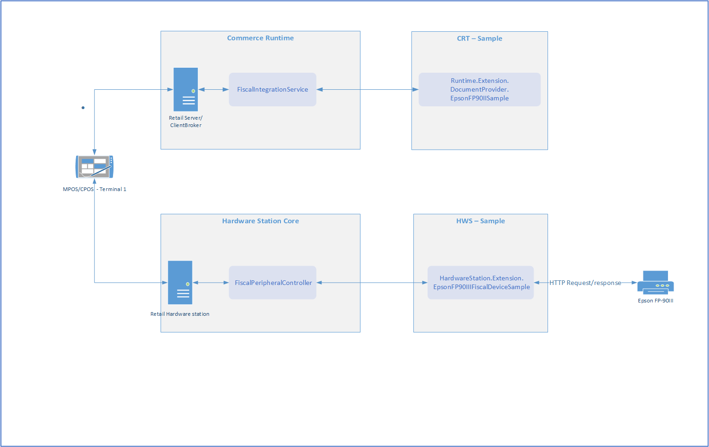
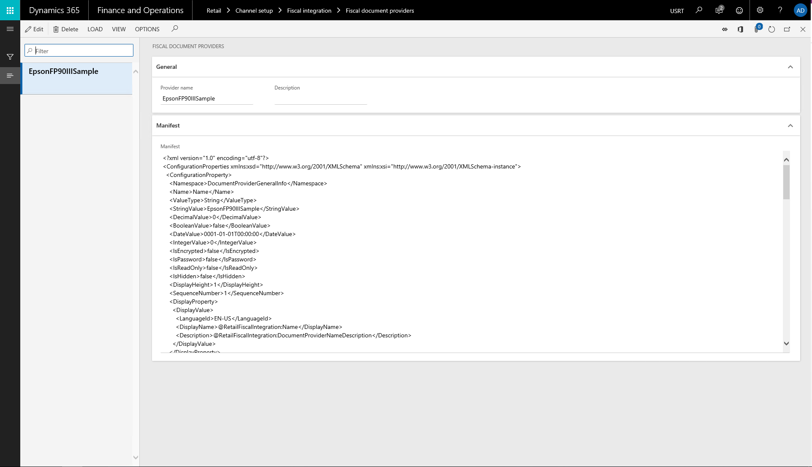
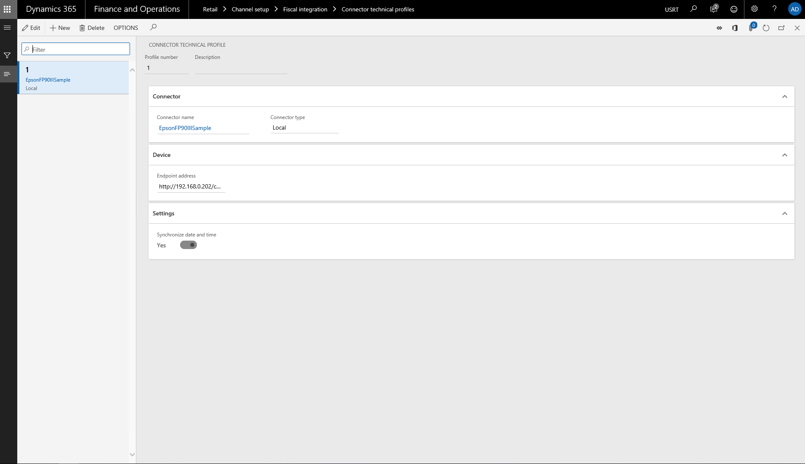
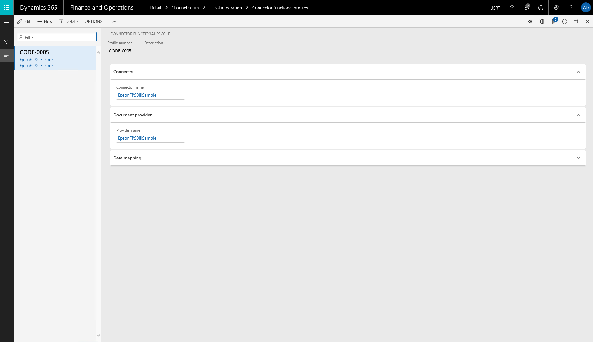
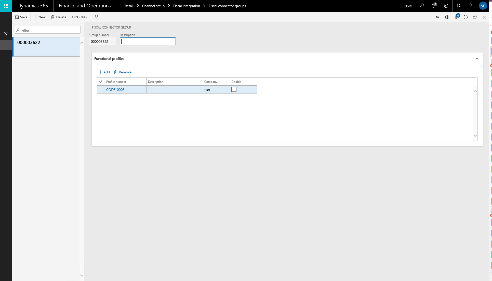
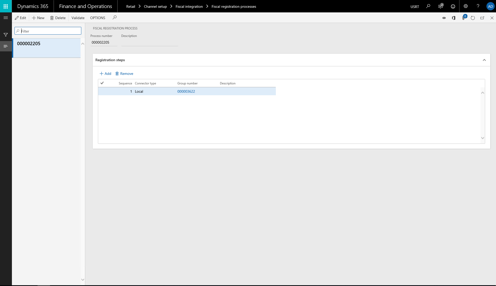
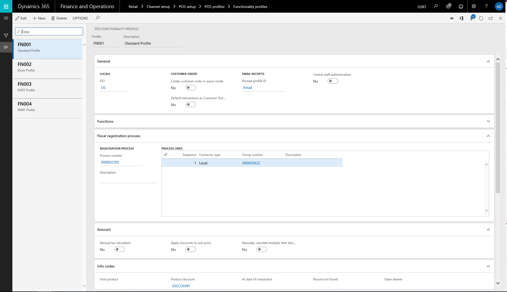
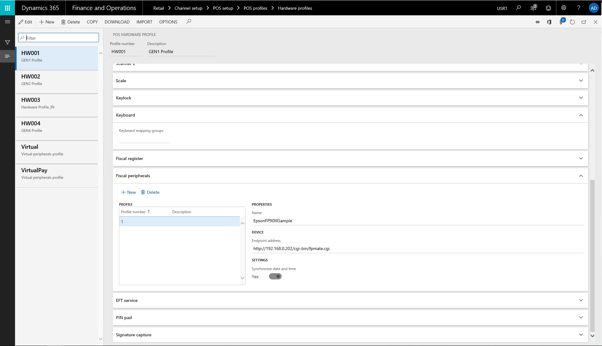
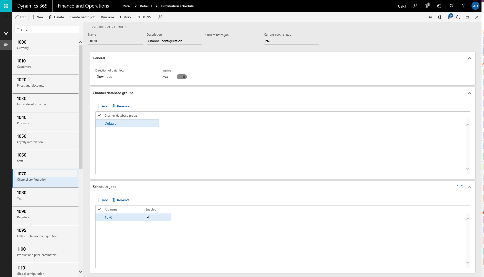

---
# required metadata

title: Fiscal printer integration sample for Italy
description: This topic provides an overview of the fiscal integration sample for Italy.
author: SergeyPismenko
manager: ezubov
ms.date: 11/01/2018
ms.topic: article
ms.prod: 
ms.service: dynamics-365-retail
ms.technology: 

# optional metadata

ms.search.form: RetailFunctionalityProfile, RetailFormLayout, RetailParameters
audience: Application User
# ms.devlang: 
ms.reviewer: josaw
ms.search.scope: Core, Operations, Retail
# ms.tgt_pltfrm: 
# ms.custom: 
ms.search.region: Italy
ms.search.industry: Retail
ms.author: sepism
ms.search.validFrom: 2018-11-1
ms.dyn365.ops.version: 8.1.1

---
# Fiscal printer integration sample for Italy

[!include[banner](../includes/banner.md)]

## Overview

The fiscal integration for Italy includes samples of the integration with the fiscal printer EPSON FP-90III.

The scope of the sample includes following functionality:
- Integration with fiscal printer Epson FP-90III via web-service mode - ePOS-Print solution.
- Registration of the following events in POS:
    - Print receipt for sale
	- Print receipt for sale return
	- Print X report
	- Print Z report

Receipts for sale and sale return operations supports following additional scenarios:  
- Printing of discounts
- Excluding gift cards from the receipt
- Receipts to customer order

## Design

The integration for the fiscal printer Epson FP-90III was inmplemented in two extensions:
* CRT extension - generates XML documents in printer specific format(Runtime.Extensions.DocumentProvider.EpsonFP90IIISample).
* Hardware Station Extension - submits documents generated by CRT extension to the fiscal printer (via HTTP protocol) and handling response from it(HardwareStation.Extensions.EpsonFP90IIIFiscalDeviceSample).

## Setting up Retail for Italy
### Enabling extensions
##### The CRT extension components
The CRT extension components are included in Retail SDK. To complete the following procedures, open the CRT solution, CommerceRuntimeSamples.sln, under RetailSdk\SampleExtensions\CommerceRuntime.

1. Find the Runtime.Extensions.DocumentProvider.EpsonFP90IIISample project, and built it.
2. In the Extensions.DocumentProvider.EpsonFP90IIISample\bin\Debug folder, find the Contoso.Commerce.Runtime.DocumentProvider.EpsonFP90IIISample.dll assembly file.
3. Copy the assembly file to the CRT extensions folder:
	* Retail Server: Copy the assembly to the \bin\ext folder under the Microsoft Internet Information Services (IIS) Retail Server site location.
	* Local CRT on Modern POS: Copy the assembly to the \ext folder under the local CRT client broker location.
4. Find the extensions configuration file for CRT:
	* Retail Server: The file is named commerceruntime.ext.config, and it's in the bin\ext folder under the IIS Retail Server site location.
	* Local CRT on Modern POS: The file is named CommerceRuntime.MPOSOffline.Ext.config, and it's under the local CRT client broker location.
5. Register the CRT change in the extensions configuration file.
	add source="assembly" value="Contoso.Commerce.Runtime.DocumentProvider.EpsonFP90IIISample" /> 
6. Restart the Retail Service:
	* Retail Server: Restart the Retail service site from IIS Manager.
    * Client broker: End the dllhost.exe process in Task Manager, and then restart Modern POS.

##### The Hardware station extension components
The Hardware Station extension components are included in Retail SDK. To complete the following procedures, open the Hardware Station solution, HardwareStationSamples.sln, under RetailSdk\SampleExtensions\HardwareStation.

1. Find the HardwareStation.Extensions.EpsonFP90IIIFiscalDeviceSample project, and built it.
2. In the Extensions.EpsonFP90IIIFiscalDeviceSample \bin\Debug folder, find the Contoso.Commerce.HardwareStation.EpsonFP90IIIFiscalDeviceSample.dll assembly file.
3. Copy the files to a deployed Hardware station machine:
    * Remote Hardware station: Copy the files to the bin folder under the Microsoft Internet Information Services (IIS) Hardware station site location.
	* Local Hardware station: Copy the files to the Modern POS client broker location.
4. Find the configuration file for Hardware station's extensions.
	The file is named HardwareStation.Extension.config:
	Remote Hardware station: The file is located under the IIS Hardware station site location.
	Local Hardware station: The file is located under the Modern POS client broker location.
	
5. Add the following section to the composition section of the config file.
	
	<add source="assembly" value="Contoso.Commerce.HardwareStation.Extension.EpsonFP90IIIFiscalDeviceSample" /
	
6. Restart the Hardware station service:
	* Remote Hardware station: Restart the Hardware station site from IIS Manager.
    * Local Hardware station: End the dllhost.exe process in Task Manager, and then restart Modern POS.

### Setup registration process
To enable registration process we should setup the Headquater in the following way:
1. Open Retail\Channel Setup\Fiscal Integration\Fiscal Connectors - import configuration from RetailSdk\SampleExtensions\CommerceRuntime\Entension.DocumentProvider.EpsonFP90IIISample\Configuration\DocumentProviderEpsonFP90IIISample.xml

2. 	Open Retail\Channel Setup\Fiscal Integration\Fiscal Document providers- import configuration from RetailSdk\SampleExtensions\HardwareStation\Entension.EpsonFP90IIIFiscalDeviceSample\Configuration\ConnectorEpsonFP90IIISample.xml

3. Open Retail\Channel Setup\Fiscal Integration\Connector Technical profiles - create a new one and select loaded connector from step above.
    * Update connection settings if needed.

4. Open Retail\Channel Setup\Fiscal Integration\Connector Functional profiles - create a new one and select loaded connector and document provider from steps above.
	* Update Data Mapping settings if needed

5. Open Retail\Channel Setup\Fiscal Integration\Connector Functional Group - create a new group and select connector functional profile from the step above.

6. Open Retail\Channel Setup\Fiscal Integration\Registration Process -  create a new process. Select connector functional group from the step above.

7. Open Functionality profile  linked to store were registration process should be activated. Expand Fiscal registration process fast-tab. Select created registration process from step above.

8. Open Hardware profile that linked to hardware station to which fiscal printer will be connected.  Expand fiscal peripherals fast tab. Select connector technical profile.

9. Open Distribution scheduler and  job 1070 to transfer data to Channel Database.

## Commerce Runtime Extension Design
### Purpose

The purpose of the extension (Document Provider) is to generate printer specific documents and handle response from the fiscal printer. 

### Request Handler
	
The request handler DocumentProviderEpsonFP90III is the entry point for the request to generate documents in the fiscal printer.

The handler is inherited from INamedRequestHandler interface.
Method HandlerName - responsible for return the Name of the handler. It should matches to the connector document provider name specified in HQ.

The connector supports the following requests:
* GetFiscalDocumentDocumentProviderRequest- contains information about what document should be generated. Returns printer specific document that should be registered in fiscal printer.
* GetSupportedRegistrableEventsDocumentProviderRequest - returns the list of events that we want to subscribe for. Currently following events are supported: Sales, printing X report,  printing Z report
* SaveFiscalRegistrationResultDocumentProviderRequest- saves response from the printer.

### Configuration
The configuration file could be found in Configuration folder of the extension project. The purpose of the file is to allow to configure settings  for document provider from the HQ. The file format aligned Fiscal Integration configuration requirements.
The following settings were added:
* VAT rates mapping
* Tender type mapping

## Hardware Station Extension Design
### Purpose
The purpose of the extension (Connector) is to communicate with the fiscal printer.

### Request Handler
The request handler EpsonFP90IIISample is the entry point for handling request to the fiscal peripheral device. 
The handler is inherited from INamedRequestHandler interface.
Method HandlerName - responsible for return the Name of the handler. It should matches to the fiscal connector name specified in HQ.

The connector supports following requests:
* SubmitDocumentFiscalDeviceRequest - sends document to printers and returns response from the fiscal printer.
* IsReadyFiscalDeviceRequest - is used for health check of the device.
* InitializeFiscalDeviceRequest - is used for printer initialization

### Configuration
The configuration file could be found in Configuration folder of the extension project. The purpose of the file is to allow to configure settings  for the connector provider from the HQ. The file format aligned Fiscal Integration configuration requirements.
The following settings were added:
* Endpoint address  - URL of the printer
* Date and time synchronization  - flag indicates if we need to sync date and time of the printer with the connected Hardware station. Date and time of the printer will be synchronized with the Hardware station time.
