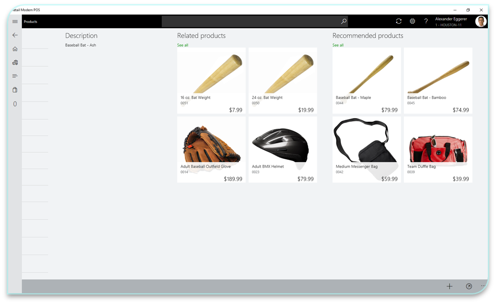
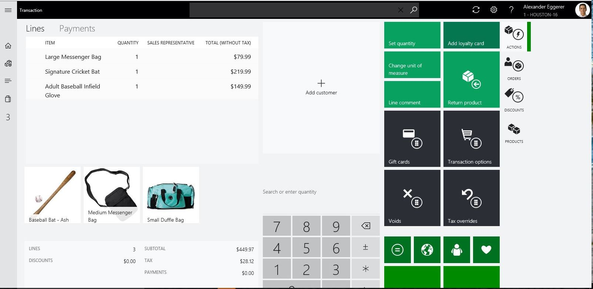

---
# required metadata

title: Personalized product recommendations overview
description: This topic has information about the Dynamics 365 for Retail product recommendations that can be displayed on the point of sale (POS) device.
author: ashishmsft
manager: AnnBe
ms.date: 02/05/2018
ms.topic: article
ms.prod: 
ms.service: dynamics-365-retail
ms.technology: 

# optional metadata

ms.search.form: RetailParameters
# ROBOTS: 
audience: Application User
# ms.devlang: 
ms.reviewer: josaw
ms.search.scope: Core, Operations, Retail
# ms.tgt_pltfrm: 
ms.custom: 259664
ms.assetid: 5dd8db08-cd96-4f7e-9e65-b05ca815d580
ms.search.region: global
ms.search.industry: Retail
ms.author: asharchw
ms.search.validFrom: 2016-11-30
ms.dyn365.ops.version: Version 1611

---

# Personalized product recommendations overview

[!include[banner](includes/banner.md)]

> [!NOTE]
> We are removing the current version of the product recommendation service as we redesign this feature with a better algorithm and newer retail-oriented capabilities. For more information see [Removed or deprecated features](https://docs.microsoft.com/en-us/dynamics365/unified-operations/dev-itpro/migration-upgrade/deprecated-features). Navigate to the bottom of the page if you are facing issues with already-enabled product recommendations for your environment. 

In Dynamics 365 for Retail, product recommendations can be displayed on the point of sale (POS) device. The recommendations are items that the customer might be interested in based on their purchase history, items in their wish list, and items that other customers purchased online and in brick-and-mortar stores. For retailers with large catalogs, recommendations help the customer with product discovery. By showcasing products targeted to a customer’s interests and buying habits, product recommendations can help retailers with up-sell and cross-sell, and can enhance customer retention. In Dynamics 365 for Retail, product recommendations are powered by cognitive services and Microsoft Azure machine learning.

Scenarios
---------

Product recommendations are enabled for the following POS scenarios. They are available in Cloud POS or Modern POS (MPOS).

1.  On the **Product details** page:

-   If a store associate visits a **Product details** page when looking at previous transactions across different channels, the recommendation engine suggests additional items that are likely to be purchased together.
-   If the store associate adds a customer to the transaction and then visits a **Product details** page, the recommendation engine provides personalized recommendations using the customer's transaction history.

2.  On the **Transaction** page:

-   The recommendation engine suggests items based on the entire list of items in the basket.
-   If the store associate adds a customer to the transaction, the recommendation engine provides personal recommendations using the customer’s transaction history and the list of items in the basket.

> [!NOTE]
> To display recommendations on the **Transaction** page, the retailer needs to update the screen layout in Dynamics 365 for Retail. The **Recommendations** control must be dropped on to the **Transaction** page. 

3.  On the **Customer details** page:
    -   The recommendation engine suggests items based on the user ID and items in the customer’s wish list.

## Configure Dynamics 365 for Retail to enable POS recommendations
To set up product recommendations, you need to do the following.

1.  Make sure that you have selected the correct **Legal entity**.
2.  Navigate to **Entity store**, select **Retail sales**, and then click **Refresh**. This will use the demo data (or your data) from your operational database and move it to Entity store.
3.  Optional: To display recommendations on the transaction screen, go to **Screen Layout**, choose your screen layout, launch the **Screen layout designer**, and then drop the **recommendations** control where needed.

4.  Go to **Retail parameters**, select **Machine-learning**, select **Yes** under **Enable POS recommendations**.
5.  To see recommendations on POS, run global configuration job **1110**. To reflect changes made to POS screen layout designer, run channel configuration job **1070**.

## How does it work?
When you refresh the **Entity store** entity, the following actions take place.

-   Data in the format required by the Cognitive services is extracted from the Dynamics 365 for Retail operational database and sent to the Entity store.
-   The data is used by Azure Data Factory (ADF) to cleanse the data using Hive scripts as part of ADF activities. Cleansed data is stored in blob storage.
-   Data from blob storage is used by the Cognitive services API to train a recommendation model.

When you turn on **Enable recommendations** and run the configuration jobs, the following actions take place.

-   Model credentials and ID are picked up from the API and stored in the Dynamics 365 for Retail operational database, in the web.config for AOS, and also in the retail server.
-   Model credentials and ID are made available to CRT so that calls for product recommendations from Cloud POS and MPOS in online mode can be honored.

> ## Troubleshoot issues where you have Product recommendations already enabled 
>- Navigate to **Retail Parameters** > **Machine learning** > **Disable product recommendations** and run **Global configuration job [1110]**. If you are not able to locate **Machine learning** tab, please contact Dynamics Support. 

>- If you added the **Recommendations control** to your transaction screen using the **Screen layout designer**, please remove that as well. 

See also
--------

[Add a recommendations control to the transaction page on a POS device](add-recommendations-control-pos-screen.md)

