---
# required metadata

title: Configure screen layouts for POS
description: This topic provides information about screen layouts for the Microsoft Dynamics 365 for Retail point of sale (POS) experiences.
author: jblucher
manager: AnnBe
ms.date: 06/20/2017
ms.topic: article
ms.prod: 
ms.service: dynamics-365-retail
ms.technology: 

# optional metadata

ms.search.form: RetailTillLayout
# ROBOTS: 
audience: Application user
# ms.devlang: 
ms.reviewer: josaw
ms.search.scope: Core, Operations, Retail
# ms.tgt_pltfrm: 
ms.custom: 90573
ms.assetid: a6868f93-02ed-4928-9f6a-3b7383e7e399
ms.search.region: global
ms.search.industry: Retail
ms.author: jeffbl
ms.search.validFrom: 2016-02-28
ms.dyn365.ops.version: AX 7.0.0, Retail July 2017 update

---

# Configure screen layouts for POS

[!include [banner](includes/banner.md)]

This topic provides information about screen layouts for the Microsoft Dynamics 365 for Retail point of sale (POS) experiences.

The Microsoft Dynamics 365 for Retail point of sale (POS) user interface can be configured using a combination of visual profiles and screen layouts, assigned to stores, registers, and/or users.

The diagram below explains the relationship between the various entities that make up the configurable aspects of the POS user interface.

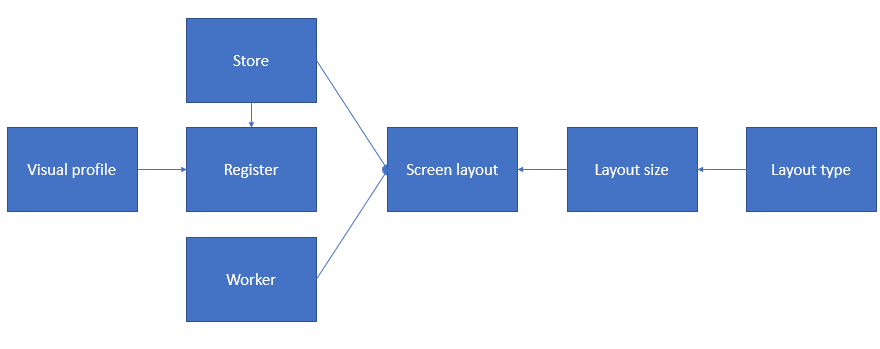

## Visual profile
Visual profiles are assigned to registers and are used to specify the visual elements that are register-specific and shared across users. Any user who logs into the register will have the same theme, colors, and images.

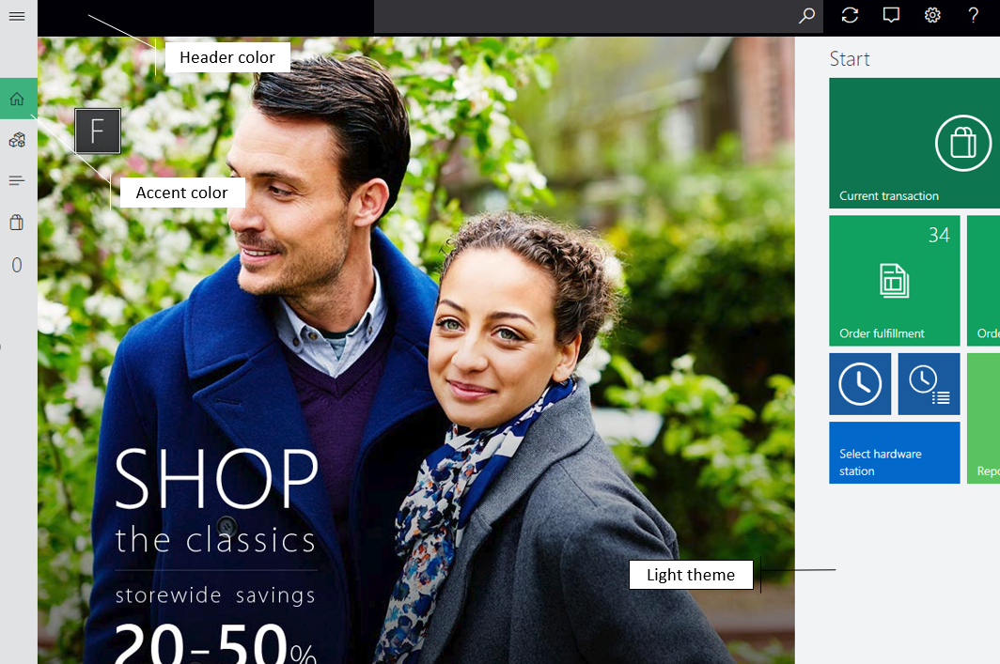

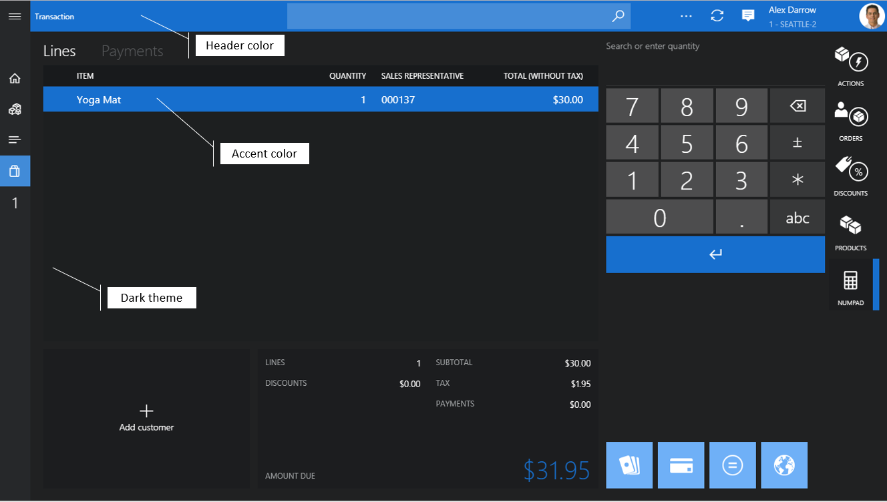

**Profile number** - The profile number is the unique identifier for the Visual profile. 

**Description** - The description allows you to specify a meaningful name that will help to identify the correct profile for your situation.

**Theme** - Users can choose between the Light or Dark application themes. These settings impact the font and background colors throughout the app.

**Accent color** - The accent color is used throughout the POS to differentiate or highlight certain visual elements such as tiles, command buttons, or hyperlinks. These elements are typically actionable.

**Header color** - The header color allows the user to configure the color of the page header to meet the branding needs of the retailer. This feature is only available in Dynamics 365 for Retail version 1611.

**Login backgrounds** - Users can specify a background image for the login screen. The file size of background images should be kept as small as possible, as storing and loading large files can have an impact on the application behavior and performance.

**Application background** - The POS can also use an image as a background throughout the application in place of the solid theme color. As with the login backgrounds, it is advised to keep the file size as minimal as possible.

## Screen layouts
Screen layout configuration determines the actions, content, and placement of UI controls in the POS Welcome screen and Transaction screen.  

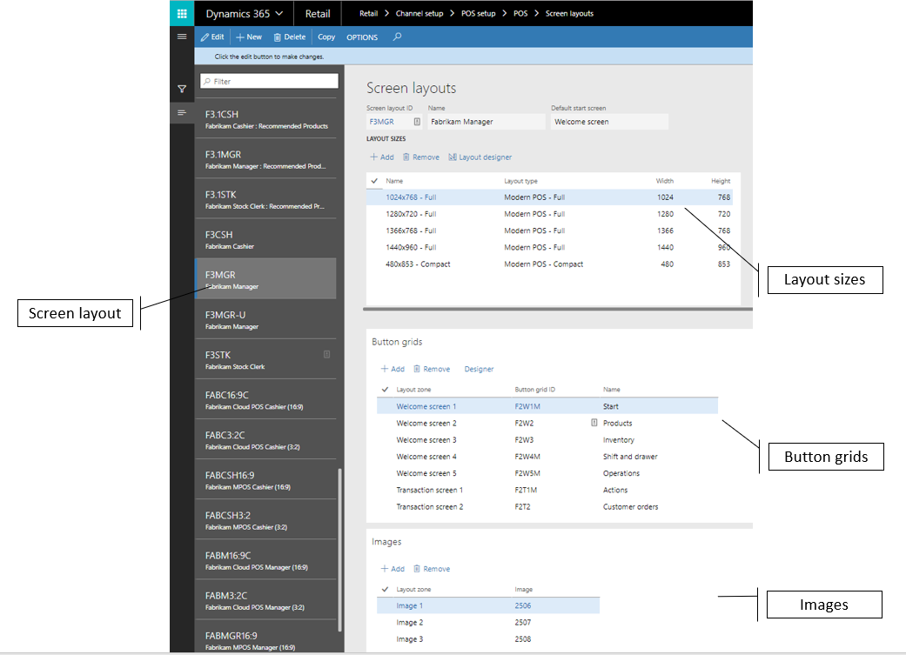

**Welcome screen**- In most cases, the Welcome screen is the page that users will see when they first log into POS. The Welcome screen can consist of a branding image and button grids that provide access to POS operations. Typically, operations that are not specific to the current transaction are placed here.

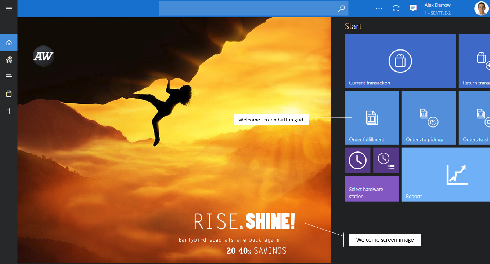 

**Transaction screen** - The Transaction screen is the main screen in POS for processing sales transactions and orders.  The content and layout is configured using the screen layout designer. 

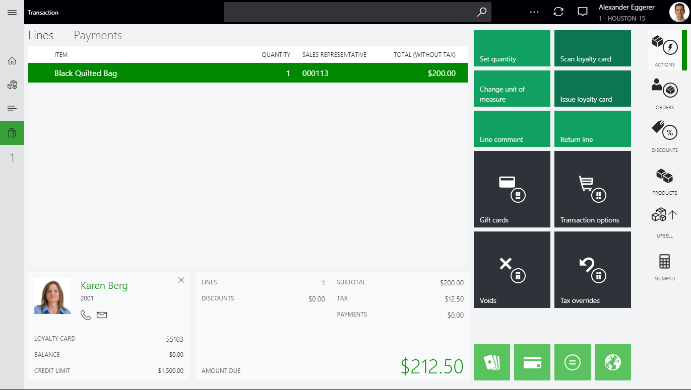 

**Default start screen** - Some retailers prefer that the cashier navigate directly to the Transaction screen after logging in. The default start screen setting allows users to set this for each screen layout.

### Assignment

Screen layouts can be assigned at the store, register, or user level. The user assignment overrides the register and store assignment, and the register assignment overrides the store assignment. In a simple scenario where all users use the same layout regardless of register or role, the screen layout can be set only at the store. In cases where certain registers or users require specialized layouts, they can be assigned appropriately.

### Layout sizes

Most aspects of the POS user interface are responsive and will automatically resize and adjust the layout depending on the screen size and orientation.  However, the POS transaction screen must be configured for each expected screen resolution.

The POS application will automatically choose the closest configured layout size for the device at the time of startup. A screen layout can also contain configurations for both landscape and portrait and for full and compact devices. This allows a user to be assigned to a single screen layout that will work across various sizes and form factors within the store.

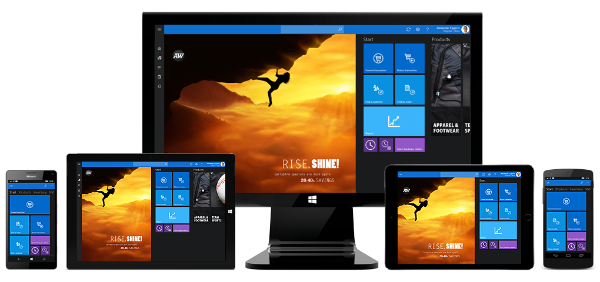 

**Name** – This field allows users to provide a meaningful name to identify the screen sizes.  

**Layout type** – POS can render it’s user face in different modes for the best user experience on a given device. 

- **Modern POS - Full** - Full layouts are typically best used for larger displays such as PC monitors or tablets. Users can choose which UI elements to include, determine their size and placement, and configure their detailed properties. Full layouts support both portrait and landscape configurations. 

- **Modern POS - Compact** - Compact layouts are typically best used for phones or small tablets. Design possibilities are limited for compact devices. Users can configure the columns and fields for the receipt and totals panes.

**Width/Height** – These values represent the expected effective screen size in pixels for the layout.  Keep in mind that some operating systems utilize scaling with high resolution displays.  

*Tip: You can find out the layout size needed for your POS screen by viewing the resolution within the app.  Simply open POS and navigate to **Settings > Session information**.  POS will display the currently loaded screen layout and layout size, as well as the app window resolution.*

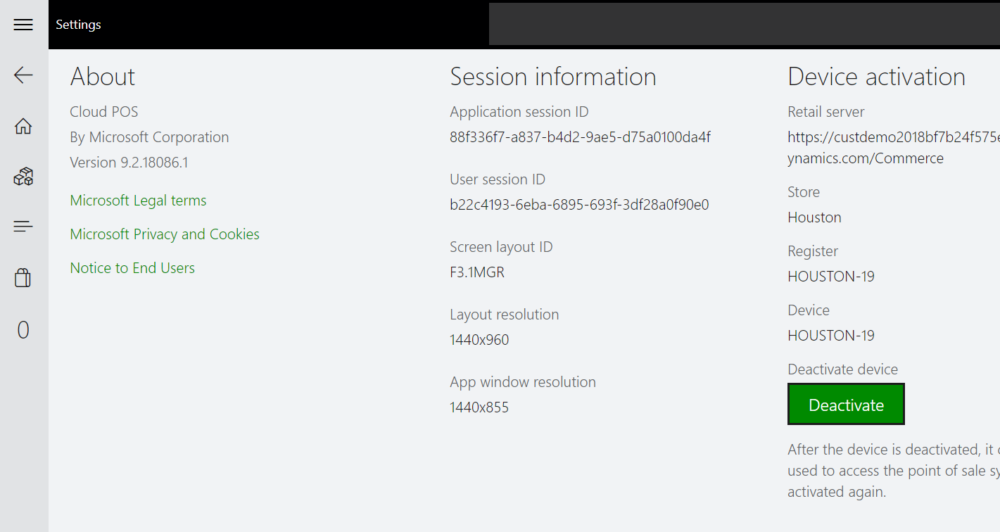 

### Button grids
For each layout size within a screen layout, users can configure and assign button grids for the POS welcome screen and transaction screen.  Welcome screen button grids will automatically be laid out from left to right, from the lowest number (Welcome screen 1) to the largest.  In Full POS layouts, the button grid placement is specified in the screen layout designer. 

In Compact POS layouts, the button grids are automatically laid out from top to bottom, from the lowest number (Transaction screen 1) to the largest and are accessible by opening the “Actions” menu.

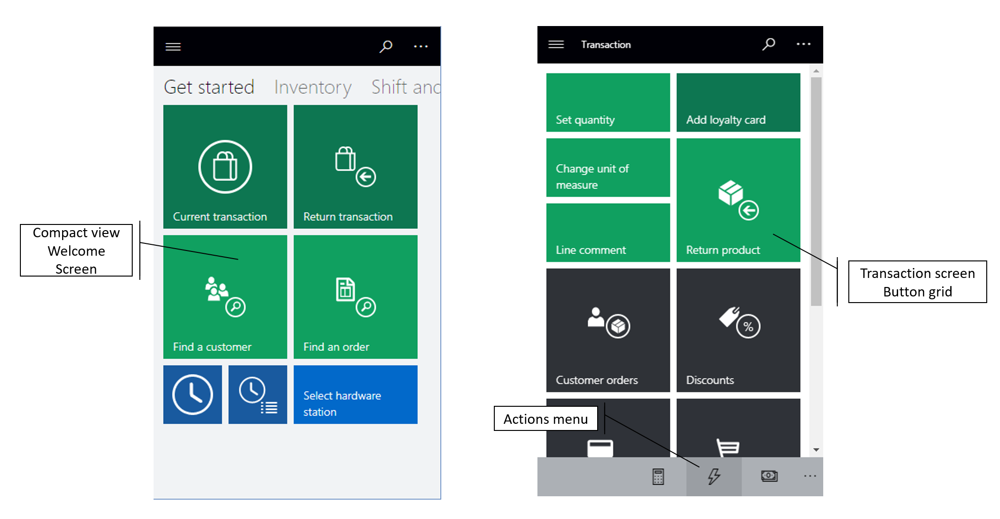

### Images
For each layout size within a screen layout, users can specify images to be included in the POS user interface.  Full POS layouts allow a single Welcome screen image which is rendered as the first UI element on the left.  Images can be utilized in the Full POS layout Transaction screen as tab images or as a logo.  Compact POS layouts do not utilize these images.

### Screen layout designer

The screen layout designer allows user to configure the various aspects of the POS Transaction screen for each layout size, in portrait and landscape, and for Full and Compact layout types. The Screen layout designer uses ClickOnce to download, install, and launch the latest version of the application each time the user accesses it. Be sure to check browser requirements for using ClickOnce—some browsers, such as Chrome, require extensions.

*Important: You must configure a screen layout for each layout size defined and utilized by POS*

### Full layout designer

The Full layout type designer allows users to drag and drop UI controls onto the POS transaction and to configure their applicable settings.

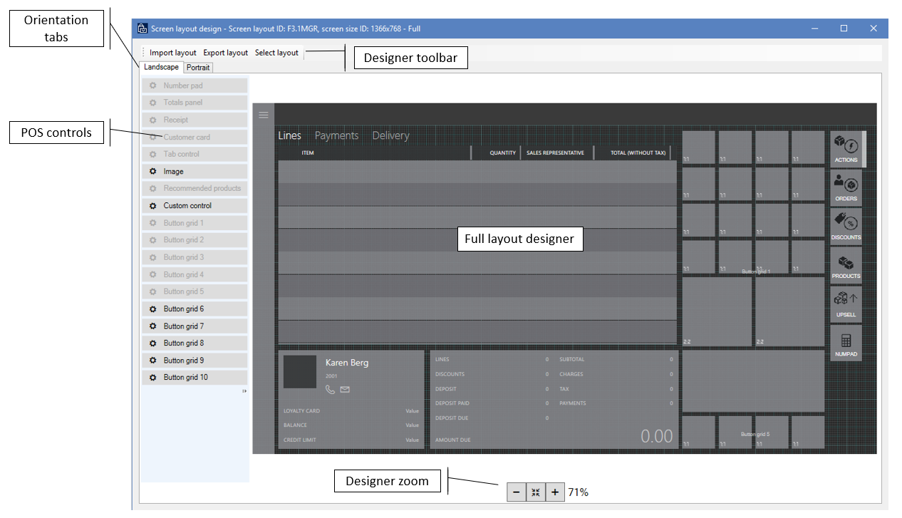

**Import/Export layout:** Users can export and import POS screen layout designs as XML files to easily reuse and share across environments.  It is important to only import layout designs for the correct size layouts or UI elements may not fit properly on the screen.

**Landscape/Portrait:**  If the POS device supports switching between landscape and portrait modes, you must define a screen layout for each.  POS will automatically detect the screen rotation and render the configured layout.

**Layout grid:** The POS designer is laid out in a 4 pixel grid.  UI controls will snap to the grid layout to allow users to properly align the content.

**Designer zoom:**  Users can zoom the designer view in and out to better view the content on the POS screen.  This is useful when the screen resolution on the POS is very different than the screen used in the designer.

**Show/hide navigation bar:** Users can choose to show or hide the POS left navigation bar on the Transaction screen for Full layouts.  This is helpful for lower resolution displays. POS users will still be able to access the navigation bar by clicking or touching menu in the upper left. Right click the navigation bar in the designer and choose to show or hide. 

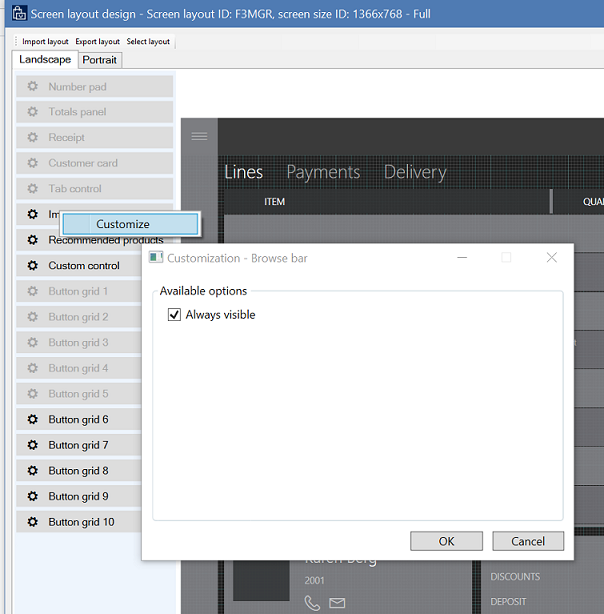

**POS controls:** The POS layout designer supports the following controls.  Many controls can be configured by right-clicking and using the context menu.

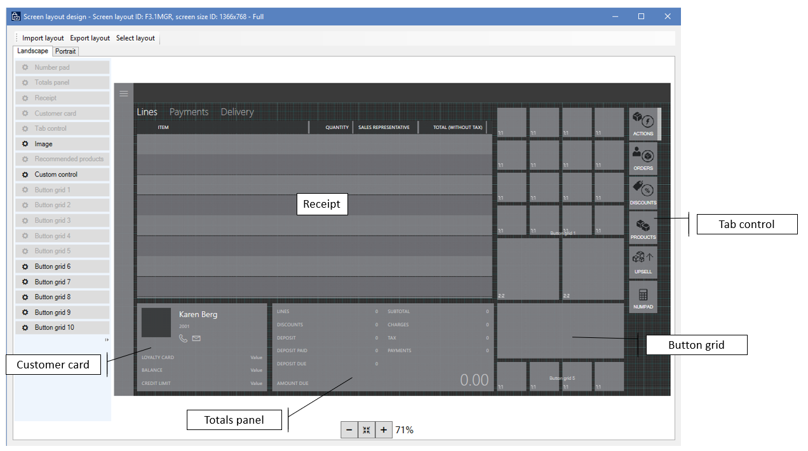

- **Number pad** - The number pad is the main user input in the POS Transaction screen. It can be configured to show the entire on-screen pad, which is ideal for touchscreens, or only the input field, which can be used with a physical keyboard. The number pad settings are available in the full layout only. Compact layouts always have the full number pad available from the Transaction screen.

- **Totals panel** - The totals panel can be configured in either one or two columns to show fields such as line count, discount amount, charges, subtotal, and tax. Compact layouts only support a single totals column.

- **Receipt** - The receipt panel contains the sales lines, payment lines, and delivery information for the products and services processed in the POS. Users can specify columns, widths, and placement. In Compact layouts you can also configure additional information which will appear in the row under the main line.

- **Customer card** - The customer card shows information pertaining to the customer currently associated with the transaction. The customer card can be configured to hide or show additional information.

- **Tab control** - The tab control can be placed onto the screen layout, and other controls such as the number pad, customer card, or button grids can be placed inside the tab. The tab control is a container that helps users fit more content in the screen. The tab control is only available for Full layouts.

- **Image** - The image control can be used to show the store logo or other branding image on the transaction screen. The image control is only available for full layouts.

- **Recommended products** - If configured for the environment, the recommended products control will show product suggestions based on machine learning. 

- **Custom control**- The custom control acts as a placeholder within the screen layout to allows users to reserve space for custom content. The custom control is only available for full layouts.

### Compact layout designer
Like the Full layout designer, the Compact layout designer allows users to configure the POS screen layout for phones and small tablets, but in this case the layout itself is fixed.  The controls on the layout can be configured using the right-click context menu, but users cannot drag and drop additional content.

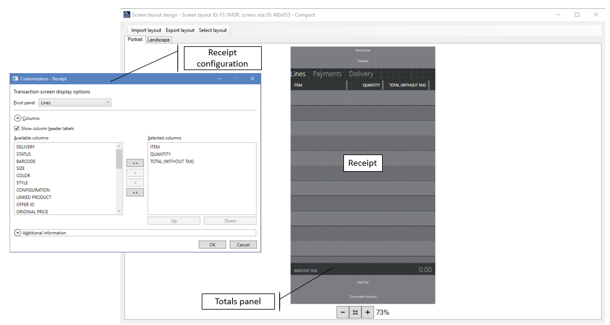

### Button grid designer
The button grid designer allows user to configure button grids for use in POS Welcome screens and Transaction screens for Full and Compact layout types.  The same button grid can be used across layouts and types. Like the Screen layout designer, the Button grid designer uses ClickOnce to download, install, and launch the latest version of the application each time the user accesses it. Be sure to check browser requirements for using ClickOnce—some browsers, such as Chrome, require extensions

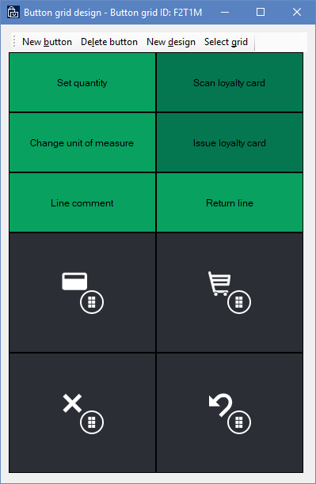

**New button**: This menu option adds a new button to the button grid in the upper left corner of the grid.  Button placement can be arranged on the grid by dragging and dropping the button on the layout.

*Important: Button grid content can overlap.  Be careful placing buttons to ensure content is not hidden by other buttons.*

**New design**:  This menu option will automatically setup a button grid layout by specifying the number of buttons per row and column.

**Button properties**:  The user can configure the button properties by right-clicking the button and using the context menu.

*Important:  Some button grid settings are only applicable to Enterprise POS (not Retail Modern POS or Cloud POS)*

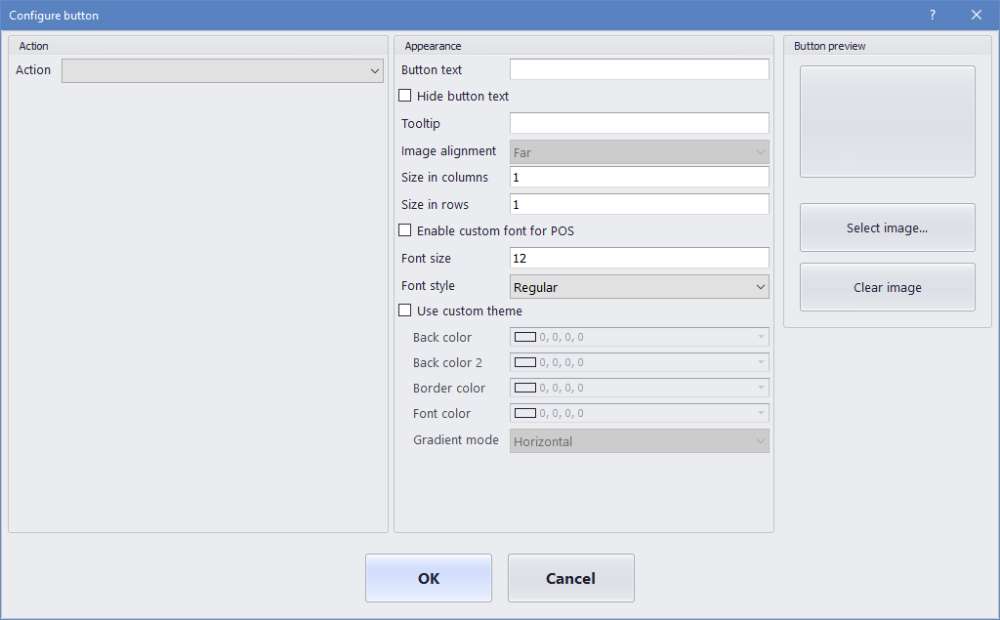

**Action**:  This option allows the user to choose from the list of applicable POS Operations to invoke when the button is pressed in POS.

You can find this list of supported POS Operations here:  [POS operations, online and offline](pos-operations.md)

**Action parameters**:  Some POS Operations utilize additional parameters when invoked.  For example, the Add product operation allows the user to specify which product to add.

**Button text**:  This is the text that appears on the button in POS.

**Hide button text**:  This option hides the button text.  This is often used for small buttons where only icon is used.

**Tooltip**:  This is the additional help text that is displayed on mouse over. 

**Size in rows/columns**:  This specifies how tall and wide the button is.  

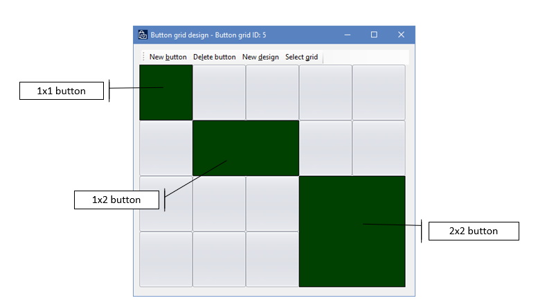

**Custom font**:  This setting allows the user to specify a font other than the default system font for POS.

**Custom theme**:  By default, POS buttons will utilize the accent color from the visual profile.  Use this setting to specify additional colors.

*Note:  Only Back color and font color are used by Retail Modern POS and Cloud POS.*

**Button image**:  Buttons can also include images or icons.  Select from available images which are specified at Retail > Channel setup > POS setup > POS > Images.

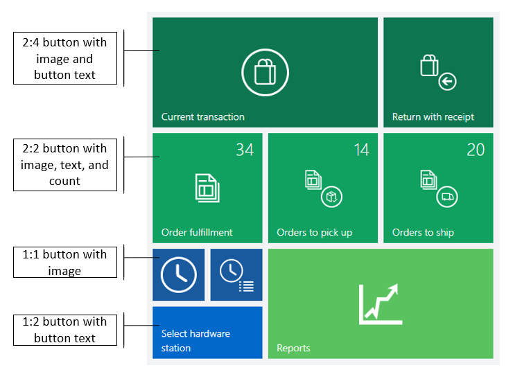

Additional resources
--------

[Install the Retail POS Layout designer](install-pos-layout-designer.md)

