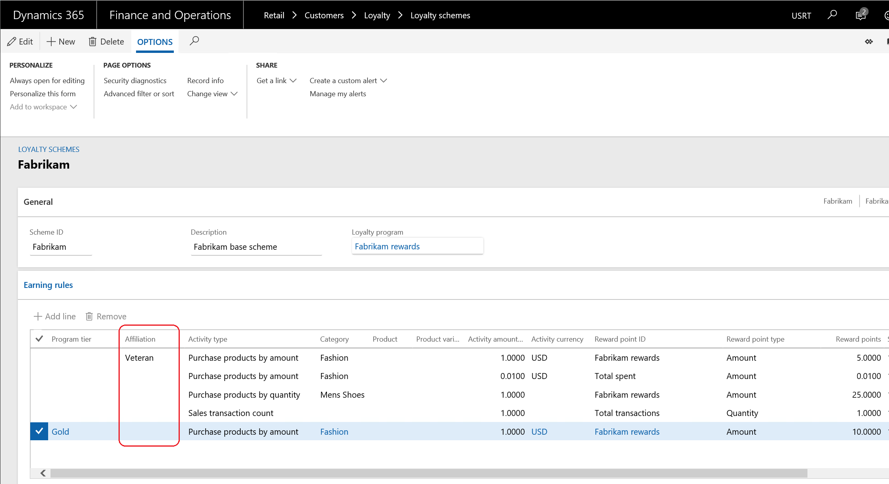
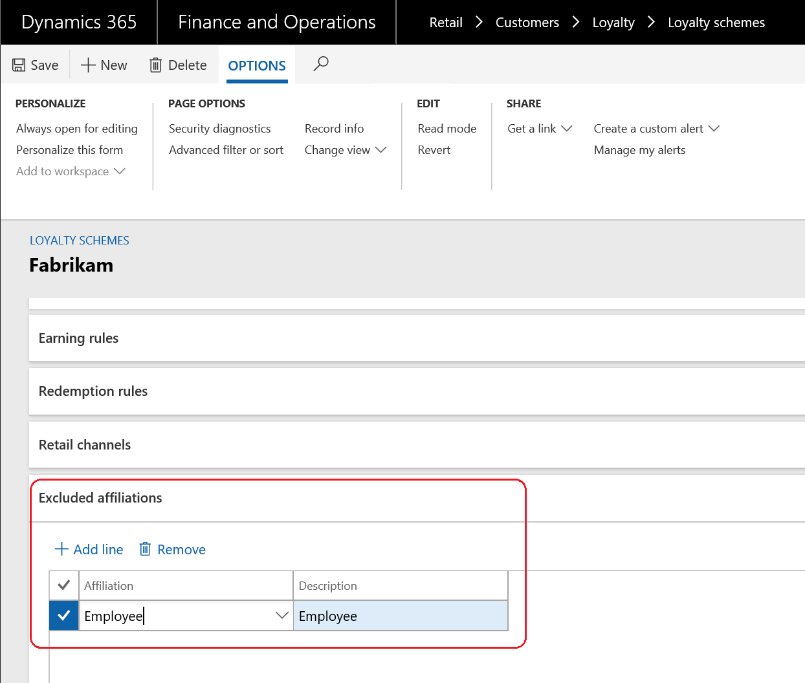
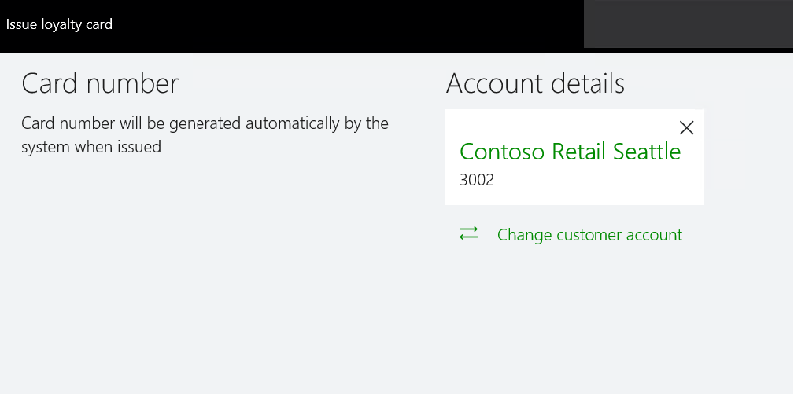
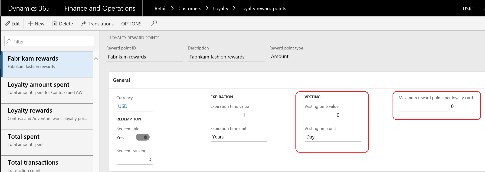
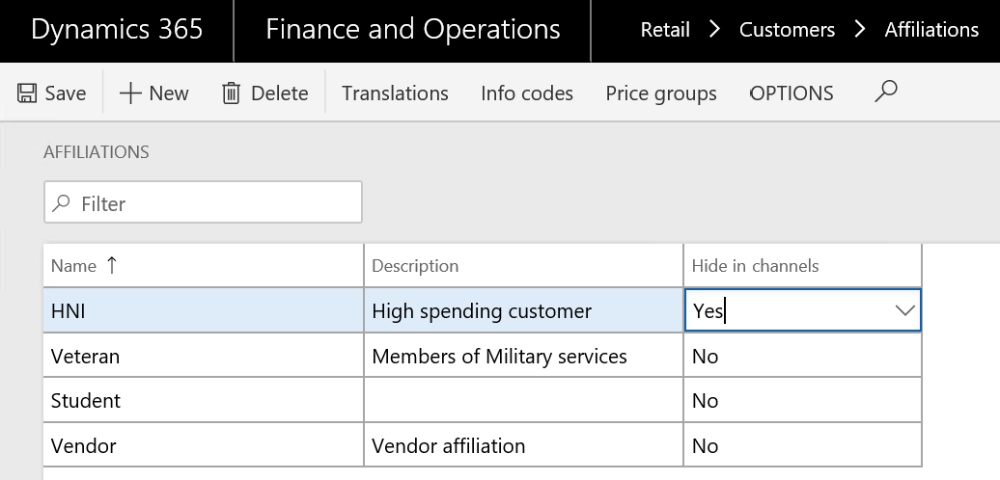
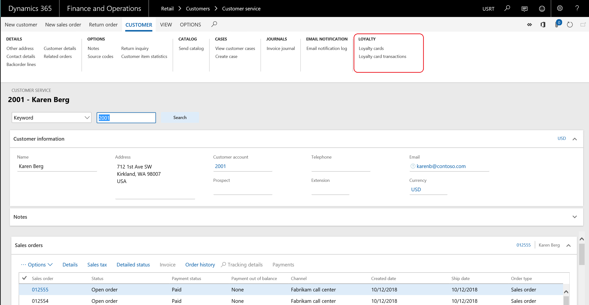
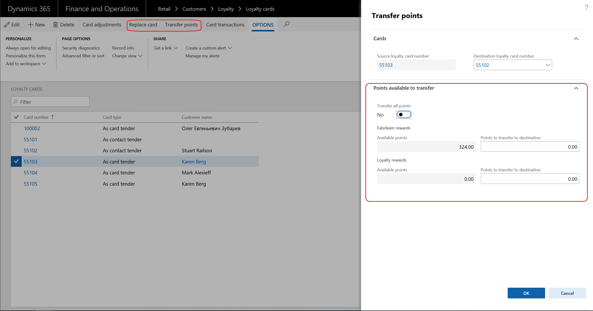
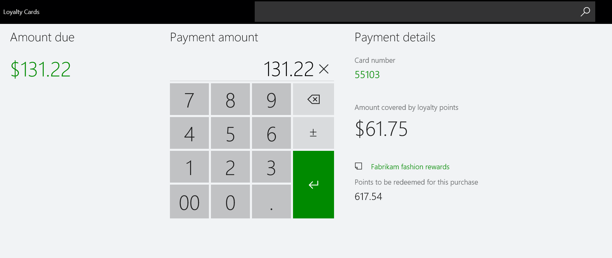
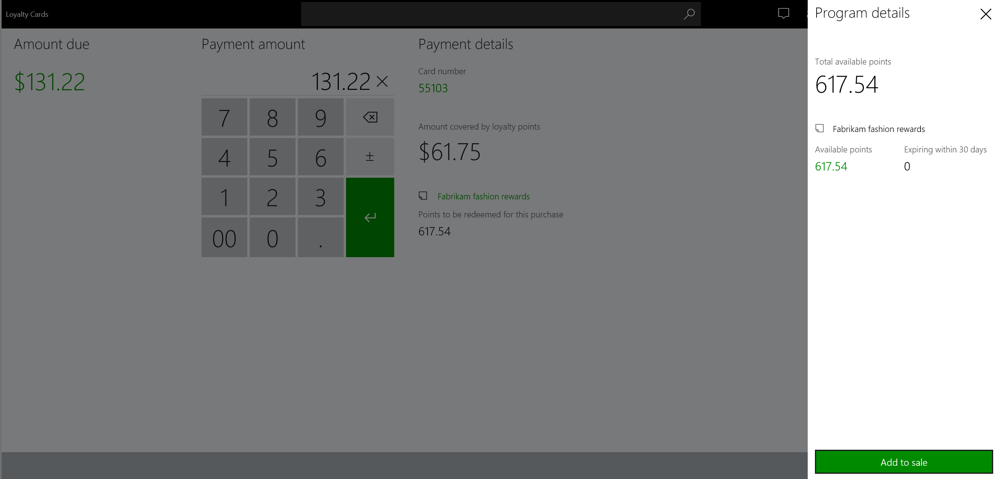

---
# required metadata

title: Set up customer loyalty programs
description: Loyalty programs can help increase customer loyalty by rewarding customers for their interactions with the Retailer's brand. In Microsoft Dynamics 365 for Retail, you can set up simple or complex loyalty programs that apply across your legal entities in any retail channel. This article describes the loyalty capabilities within Microsoft Dynamics 365 for Retail and the corresponding setup steps to help the retailer easily get started with their loyalty programs.
author: scott-tucker
manager: AnnBe
ms.date: 06/20/2017
ms.topic: article
ms.prod: 
ms.service: dynamics-365-retail
ms.technology: 

# optional metadata

ms.search.form: RetailLoyaltyPrograms, RetailPriceDiscGroup
# ROBOTS: 
audience: Application User
# ms.devlang: 
ms.reviewer: josaw
ms.search.scope: Core, Operations, Retail
# ms.tgt_pltfrm: 
ms.custom: 16201
ms.assetid: f79559d2-bc2d-4f0b-a938-e7a61524ed80
ms.search.region: global
ms.search.industry: Retail
ms.author: scotttuc
ms.search.validFrom: 2016-02-28
ms.dyn365.ops.version: AX 7.0.0, Retail July 2017 update

---

# Loyalty overview

[!include [banner](includes/banner.md)]

Loyalty programs can help increase customer loyalty by rewarding customers for their interactions with the Retailer's brand. In Microsoft Dynamics 365 for Retail, you can set up simple or complex loyalty programs that apply across your legal entities in any retail channel. This article describes the loyalty capabilities within Microsoft Dynamics 365 for Retail and the corresponding setup steps to help the retailer easily get started with their loyalty programs.

Loyalty features
----------------

You can set up your loyalty program so that they include the following options:

-   Set up multiple types of rewards that you offer in your loyalty programs, and track participation in your loyalty programs.
-   Set up loyalty programs that represent the different reward incentives that you offer. You can include loyalty program tiers to offer greater incentives and rewards to customers who shop more frequently or spend more money in your stores.
-   Define earning rules to identify the activities that a customer must complete to earn rewards. You can also define redemption rules to identify when and how a customer can redeem rewards.
-   Issue loyalty cards from any retail channel that participates in your loyalty programs, and link loyalty cards to one or more loyalty programs that the customer can participate in. You can also link a customer record to a loyalty card, so that the customer can pool loyalty points from multiple cards and redeem them.
-   Manually adjust loyalty cards, or transfer the loyalty rewards balance from one card to another to accommodate or reward a customer.

## Setting up loyalty programs
You must set up several components to enable the loyalty feature in Dynamics 365 for Retail. The following diagram illustrates the loyalty components and how they relate to each other. 

## Loyalty components
The following table describes each component and where it's used in the loyalty setup.

| Component                                        | Description                                                                                                                                                                                                                                                                                                                                                                                                                                                                                                                                                                              | Where it’s used                                                                                                                                                                                                                                                                                                                                                                 |
|--------------------------------------------------|------------------------------------------------------------------------------------------------------------------------------------------------------------------------------------------------------------------------------------------------------------------------------------------------------------------------------------------------------------------------------------------------------------------------------------------------------------------------------------------------------------------------------------------------------------------------------------------|---------------------------------------------------------------------------------------------------------------------------------------------------------------------------------------------------------------------------------------------------------------------------------------------------------------------------------------------------------------------------------|
| Set up discounts (prerequisite)                  | Set up the discounts that you offer to your loyalty customers. For example, you can offer 5 percent off all apparel products.                                                                                                                                                                                                                                                                                                                                                                                                                                                            | Discounts must be added to price groups before they can be included in a loyalty program. Price groups are assigned to loyalty programs and loyalty tiers.                                                                                                                                                                                                                      |
| Set up price groups (prerequisite)               | Price groups are used to create and manage prices and discounts for retail products. Set up the price groups that include the discounts that apply to your loyalty programs.                                                                                                                                                                                                                                                                                                                                                                                                             | Price groups are assigned to loyalty programs and loyalty program tiers.                                                                                                                                                                                                                                                                                                        |
| Set up channels (prerequisite)                   | Retail channels are the stores that participate in your loyalty programs, such as a brick-and-mortar store, an online store, or a call center. You must set up your retail channels before you can assign loyalty programs to them.                                                                                                                                                                                                                                                                                                                                                      | You assign retail channels to a loyalty program if the retail channel is participating in the loyalty program.                                                                                                                                                                                                                                                                  |
| Set up the loyalty payment method (prerequisite) | You must set up a payment method before a loyalty card can be used at a register and loyalty points can be redeemed as part of a loyalty program. You must also add the loyalty payment method to the retail channel before customers can redeem their loyalty points as payment for products.                                                                                                                                                                                                                                                                                           | Set up a loyalty type payment method, and then assign the loyalty payment method to the retail channels that are participating in the loyalty program.                                                                                                                                                                                                                          |
| Set up date intervals                            | Date intervals provide a flexible way to set the time span that applies to loyalty tiers. Use date intervals to specify how long a customer can stay in a tier or how much time a customer has to complete an activity to qualify for a tier.                                                                                                                                                                                                                                                                                                                                            | Date intervals apply only if you use tiers in your loyalty programs. You select the date interval that applies to program tiers, and also the date intervals that apply to program tier rules.                                                                                                                                                                                  |
| Set up reward points                             | Reward points are the types of reward that you offer to your customers. Rewards points can be redeemable or non-redeemable. Redeemable reward points can be exchanged for products. Non-redeemable reward points are used for tracking purposes or to advance a customer to the next tier in a loyalty program.                                                                                                                                                                                                                                                                          | Reward points are referenced in tier rules and are used to qualify a customer for a specific tier. Reward points are also referenced in loyalty schemes in earning and redemption rules. In earning rules, you specify the rewards that a customer can earn for a specific activity. In redemption rules, you specify the reward that the customer can redeem.                  |
| Set up loyalty programs                          | Loyalty programs are the core loyalty entity that you offer. Each loyalty program can also have loyalty tiers assigned to it. Discounts and price groups are assigned to the loyalty programs at either the program level or the tier level.                                                                                                                                                                                                                                                                                                                                             | You create loyalty schemes for your loyalty programs. You assign loyalty cards to your loyalty programs, and loyalty cards can be assigned to a customer. Retail channels participate in the loyalty programs that are assigned to the loyalty schemes. Any customer who holds a loyalty card can participate in the loyalty programs that are assigned to the card.            |
| Set up loyalty tiers and tier rules              | Loyalty tiers are optional levels that you can define for your loyalty programs. You can set up base discounts and rewards for all customers who participate in the loyalty program, and you can set up additional discounts and rewards for customers who achieve the various levels in the program. For each loyalty tier that you define, you can set up the rules that qualify a customer for that tier. You can also define how long customers can remain in that tier after they have reached it.                                                                                  | Loyalty tiers and loyalty tier rules are defined in the loyalty programs. If you don’t define any loyalty tiers, all customers who participate in the loyalty program qualify for the discounts that you assign in the loyalty program price group. If you define loyalty tiers, you can set up earning rules and redemption rules for the loyalty tiers in the loyalty scheme. |
| Set up loyalty schemes                           | Loyalty schemes specify the earning rules and redemption rules that apply to a selected loyalty program. You assign retail channels to a loyalty scheme to identify which loyalty program, earning rules, and redemption rules apply to a retail store.                                                                                                                                                                                                                                                                                                                                  | A loyalty scheme is assigned to a loyalty program and retail channels. You can assign many loyalty schemes to the same loyalty program, and you can assign many loyalty schemes to many retail channels.                                                                                                                                                                        |
| Set up loyalty cards                             | A loyalty card entitles the card holder to participate in the loyalty programs that are assigned to the card. Loyalty cards can be issued anonymously, or they can be assigned to a specific customer. You can view the loyalty transactions for a specific card, and you can view a summary of loyalty points that have been accumulated on the card. You can issue loyalty cards from any retail channel. You can also manually adjust a loyalty card to upgrade the customer to a different tier, add loyalty points, or transfer the loyalty point balance from one card to another. | You assign loyalty programs to a loyalty card.                                                                                                                                                                                                                                                                                                                                  |

## Loyalty processes
The following table describes the processes that must be run to send the loyalty configurations and data to your stores, and to retrieve the loyalty transactions from your stores.

| Process name                         | Description                                                                                                                                                                                                                                                                                                                                                                                                    | Page name                            |
|--------------------------------------|----------------------------------------------------------------------------------------------------------------------------------------------------------------------------------------------------------------------------------------------------------------------------------------------------------------------------------------------------------------------------------------------------------------|--------------------------------------|
| 1050 (loyalty information)           | Run this process to send the loyalty data from Dynamics 365 for Retail to the retail stores. It's a good idea to schedule this process to run frequently, so that loyalty data is transmitted to all stores.                                                                                                                                                                                               | Distribution schedule                |
| Process loyalty schemes              | Run this process to associate loyalty schemes with the retail channels that the loyalty scheme is assigned to. This process can be scheduled to run as a batch process. You must run this process if you change loyalty configuration data, such as loyalty schemes, loyalty programs, or loyalty reward points.                                                                                               | Process loyalty schemes              |
| Process offline loyalty transactions | Run this process to update loyalty cards so that they include transactions that were processed offline. This process applies only if the **Earn offline** check box is selected on the **Retail shared parameters **page, so that rewards can be earned offline.                                                                                                                                               | Process offline loyalty transactions |
| Update loyalty card tiers            | Run this process to evaluate the customer’s earning activity against the tier rules for a loyalty program, and to update the customer’s tier status. This process is required only if you change the tier rules in loyalty programs and want the updated rules to be retroactively applied to loyalty cards that have already been issued. This process can be run as a batch process or for individual cards. | Update loyalty card tiers            |

## Loyalty enhancements

As a part of October 2018 release, we have added new capabilities to our loyalty area and we are continuing to invest in this area to enable the retailers run flexible and rewarding loyalty programs. Each of the new enhancement is explained below in detail.

- As a part of loyalty scheme, the retailers could already create different earning and redemption rules by tiers to differentiate the rewards for customers in different tiers. We have now added the capability to include "Affiliations" as a part of the earning and redemption rules so that certain group of customers e.g. Veterans, AAA  member etc. can be a part of existing tiers, but still rewarded differently, thus avoiding the need to create additional tiers.
	
	> [!NOTE]
	> The earning rules within a loyalty scheme are addition i.e. if you create a rule to reward a gold tier member 10 points for each US dollar, and you also create a rule for a customer with "Veteran" affiliation, to reward 5 points for each US dollar, then a veteran who is also a gold tier member would earn 15 points for 1 US dollar as both the line qualify for the customer. However, if the veteran customer was not a gold tier member, then he would earn 5 points for each dollar. To reflect the changes in the channels, run the "Process loyalty schemes" and "1050" (loyalty information) jobs.
	

- Many time retailers have special prices for a certain group of customers and they do not want such customers to earn using the loyalty programs for e.g. wholesalers, employees etc. Commonly, 'Affiliations' are used to provide the special pricing to such customer groups. Thus, to restrict certain customer groups of customers from earning loyalty points, the retailer can now specify one or more Affiliations under the "Excluded affiliations" section of the loyalty scheme. Now, even if customers belonging to excluded affiliation are existing loyalty members, but still they cannot earn loyalty points for their purchases. To reflect the changes in the channels, run the "Process loyalty schemes" and "1050" (loyalty information) jobs.
	
	
- We have added a capability to generate loyalty card numbers in the channels. Prior to this update, the retailers could use physical loyalty cards, or generate loyalty card using some unique customer information such as their phone numbers. To enable the automatic generation of the loyalty cards in the retail stores, you need to turn on the configuration "Generate loyalty card number" in the functionality profile associated to the store. 
For the Online channels, the retailers can use the IssueLoyaltyCard API to issue loyalty cards to the customers. The retailers can either provide a loyalty card number to this API, which will be used to generate the loyalty card or else the system tries to use the loyalty card number sequence set in the Dynamics 365 for Retail application. However, if the number sequence is not present, and the retailer does not provide a loyalty card number while calling the API, then the system throws an error.

- We now save the earned and redeemed loyalty points for each transaction and sales orders against the sales line so that the same amount can be refunded or taken back in the case of full or partial returns. Moreover, having the visibility for points at sales line level provides the capability for the call center users to answer customer questions on how many points were earned/redeemed for each line. Prior to this change, the reward points were always recalculated during returns which resulted in a different amount than the original, if the earning or redemption rules were changed and also the call center users did not have the visibility on the points breakdown. The points can be viewed under the "Card transactions" form for each loyalty card.
	
- We have enhanced the loyalty reward points capabilities to enable the retailer to define the vesting period for each reward point. Setting up a vesting period defines the duration, from the earn date, after which the reward points would become available to the customers. Such points can be seen in a new column named "Unvested points" under the loyalty cards form (refer unvested points image). 
Additionally, the retailers can also define the maximum loyalty reward point limit per loyalty card. This field can be used to reduce the impact of loyalty fraud as once the maximum award points have been reached, the user cannot earn more points. The retailer can decide to block such cards until they have investigated for potential fraud. In case the retailer determines a fraud, the retailer can not only block the loyalty card for the customer but also mark the customer as blocked i.e. set the property "Block customer for loyalty enrollment" to Yes under All customers -> Retail fast tab. The blocked customers cannot be issued a loyalty card in any of the channels.

- Affiliations are used to provide special pricing and discounts, but there be some affiliations that the retailers do not want their end customers to see for e.g. affiliation titled 'High spend customer' might be well received by some of the customers. Moreover, there are some affiliations that should not be managed in the store e.g. Employees because you do not want the cashiers to decide who is an employee and thus provide employee based discounts. Thus, retailers can now select the affiliations which should be hidden in the retail channels i.e. MPOS/CPOS. The affiliations marked as 'Hide in channels' cannot be viewed, added or removed in the POS. However, the pricing and discounts associated with the affiliation would still be applied to the products.

	
- We have made it easy for the call center user to search for a customer using their loyalty card information and also the call center user can now easily navigate to the customer's loyalty card and customer's loyalty card transaction pages from the 'Customer service' form. Thus, empowering the call center user to view all the important customer information with reduced clicks.

	
- If a loyalty card is compromised, a replacement card needs to be generated and the existing points should be transferred to the new card. The user experience of the replacement card flow has now been simplified. Additionally, we have added the capability for customers to gift their loyalty points to friends and family. The customers can decide to transfer partial or all of their points. As a result of points transfer, we create points adjustment entries to each loyalty card The replace card and transfer balance capabilities can be used in the back office application from the loyalty cards form.

	
- Often times retailers want to capture the effectiveness of a particular channel to enroll customers into loyalty program. To enable this we now save the enrollment source for the loyalty cards so that retailers can run reports on this data. The enrollments source is automatically captured for all the issued loyalty cards from MPOS/CPOS or eCommerce channels. For the loyalty cards issued from the backoffice application, the call center user can select an appropriate channel.

- Retailers can currently use MPOS/CPOS to redeem loyalty points for customers in store. However, since the loyalty balance is displayed in loyalty points, so the cashier did not have the visibility on the amount, in currency value, that can be applied towards the current transaction. Thus, the cashier had to do the points to currency conversion before paying by loyalty points. Once some lines are added to the transaction, the cashier can now see the amount that the loyalty points can cover the current transaction, thus making it easy to apply partial or all the loyalty points to the transaction. Additionally, we now also show the points which will be expiring in next 30 days, so that the cashier can upsell or cross sell to motivate the customer to spend the expiring points now.

	
## Upcoming enhancements

The following features would be available in the November monthly update of Dynamics 365 for Retail product
	
- Customers want the capability to view their loyalty balance details on the consumer facing channels. Similarly, it is important for the cashiers to view the customer's history of the loyalty points in MPOS/CPOS to quickly answer any queries from the customer. With the upcoming monthly release, the customers and cashiers will be able to see the loyalty history details

- Many retailers are able to award loyalty points only based on the sales transactions, but the more customer-centric retailers want to reward their customers for any of their engagement activity with their brand—for example, filling an online survey, visiting a store, liking the retailers on Facebook, tweeting about the retailer, and more. We are adding the capability to award loyalty points for any customer activity. To do so, the retailer can define an "Other activity type" and define the earning rules for these activities. We are also exposing a Retail Server API that can be called whenever such an activity is identified which will use the earning rule to award the required loyalty points

- To enable a true omni-channel retail experience, we will allow the customers to earn and redeem loyalty points across all channels. Currently, the Call center only allows to earn loyalty points, but the redeem capability will be added with the November monthly release. 
