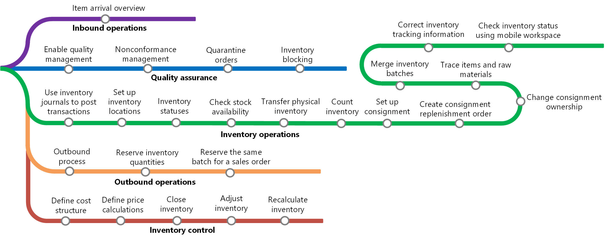

---
# required metadata

title: Inventory management home page
description: This topic provides an overview of Inventory management.
author: YuyuScheller
manager: AnnBe
ms.date: 10/12/2017
ms.topic: article
ms.prod:
ms.service: dynamics-ax-applications
ms.technology:

# optional metadata

ms.search.form: 
# ROBOTS:
audience: Application User
# ms.devlang:
ms.reviewer: YuyuScheller
ms.search.scope: Core, AX 7.0.0, Operations, UnifiedOperations
# ms.tgt_pltfrm:
ms.custom: 2094
ms.assetid: 1968e32f-eff9-4c17-8f7f-a870f0c38fbc
ms.search.region: Global
ms.search.industry: Distribution
ms.author: perlynne
ms.search.validFrom: 2016-02-28
ms.dyn365.ops.version: AX 7.0.0

---

# Inventory management 

[!include[banner](../includes/banner.md)]

You can use Inventory management for inbound operations, quality assurance, inventory activities, outbound operations, and inventory control.

[Inbound operations](arrival-overview.md)

On the **Arrival overview** page, you can keep track of expected items and use arrival journals to register receipts. 
After items have arrived in the inbound dock, you can use pallet transports to guide the flow through the warehouse to the picking 
or the bulk location areas.

[Quality assurance](quality-management-processes.md)

You can set up quality inspection and quarantine of products as an automated process by using quality associations or you can manually put products on hold in various stages of the order process cycle.

[Inventory activities](inventory-journals.md)

You can perform periodical inventory activities, such as set up inventory tracking, perform item counting, manage consignment inventory and item tracking dimensions. 

[Outbound operations](outbound-process.md)

You can process shipments for complete orders, parts of orders, or a consolidation of multiple orders and create picking routes or pallet transports based on the contents of the shipment. You can use picking lists and output orders to ship items to production or to  
distribution channels.

[Inventory control](../cost-management/inventory-close.md)

-  Inventory control includes the raw materials, semi-finished goods, and finished goods that a company has on hand for its own 
production processes or for sale to customers. Because inventory is considered an asset, inventory accounting methods are used to create a valuation, which has impact on the amount of the expenses charged to the cost of goods in an accounting period. You can define cost structure, define prices and price calculation. You can also close, adjust, and recalculate inventory. To learn more, see [Inventory accounting in Cost management](../cost-management/inventory-close.md).

## Learning map

The following learning map shows the major concepts and tasks that make up the framework of the Inventory management module. Refer to the topics listed to help you learn about a concept or task.

## Additional resources

### What's new and in development

Go to the [Microsoft Dynamics 365 Roadmap](https://roadmap.dynamics.com/) to see what new features have been released and what new features are in development.

### Manufacturing and supply chain management blogs

You can find opinions, news, and other information about Inventory management and other solutions on the
[Dynamics AX Manufacturing R&D Team Blog](https://blogs.msdn.microsoft.com/axmfg) and [Supply Chain Management in Dynamics AX R&D Team Blog](https://blogs.msdn.microsoft.com/dynamicsaxscm).

### Task guides

Additional help is available as task guides inside Finance and Operations. To access task guides, click the **Help** button on any page.

