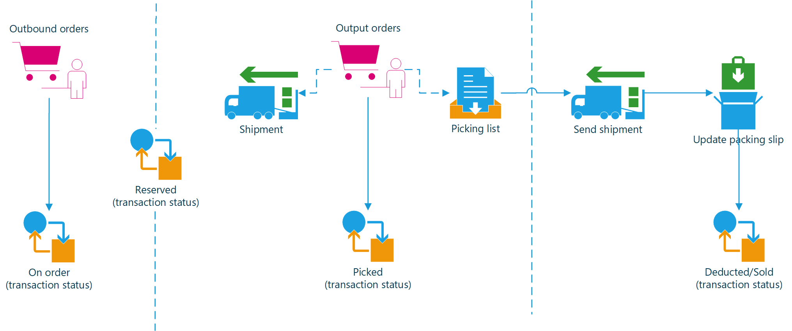
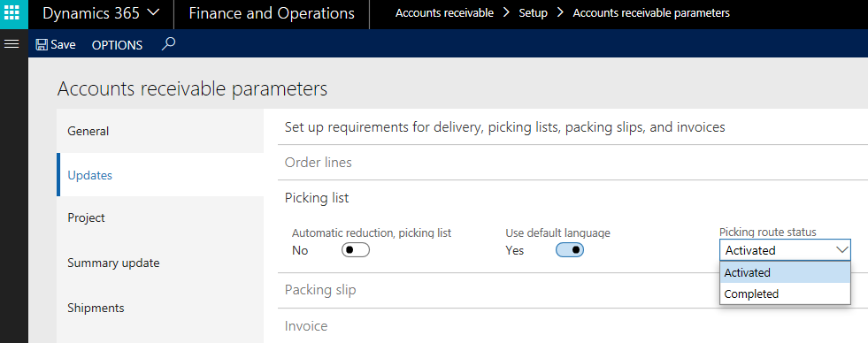
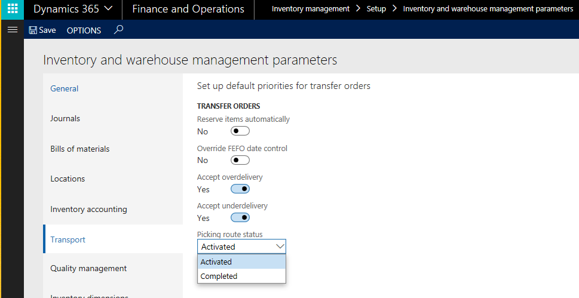
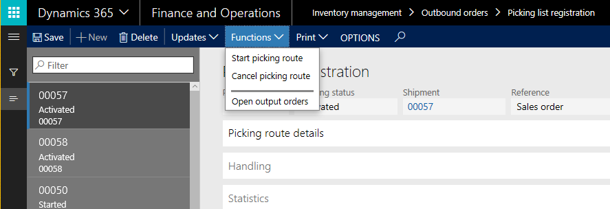
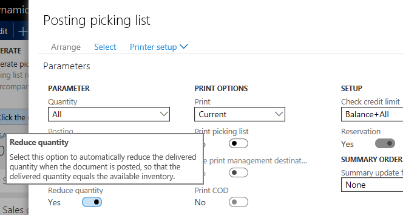
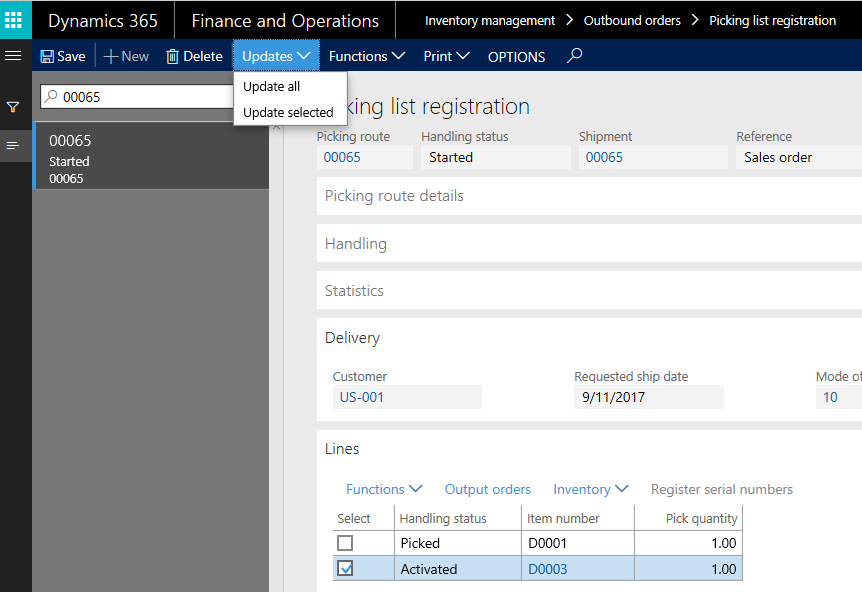

---
# required metadata

title: Outbound process 
description: This topic provides overview information about the outbound process in Inventory management. 
author: perlynne
manager: AnnBe
ms.date: 10/02/2017
ms.topic: article
ms.prod:
ms.service: dynamics-ax-applications
ms.technology:

# optional metadata

ms.search.form: WMSOrder, WMSShipment, MCRPickingWorkbench, WMSPickingRegistration, CustomFilterGroup
# ROBOTS:
audience: Application User
# ms.devlang:
ms.reviewer: YuyuScheller
ms.search.scope: Core, AX 7.0.0, Operations, UnifiedOperations
# ms.tgt_pltfrm:
ms.custom: 274363
ms.assetid: 375807b2-a426-4f1b-bc1f-2fe00fd48413
ms.search.region: global
ms.search.industry: Distribution
ms.author: perlynne
ms.dyn365.ops.intro: AX 7.0.0
ms.search.validFrom: 2016-02-28

---

# Outbound process

[!include[banner](../includes/banner.md)]

This topic provides overview information about the outbound process in Inventory management.

## Output orders

Output orders are used to link the sales and transfer order lines with the outbound picking processes using picking lists.

When picking lists are generated from either sales or transfer orders, output orders and shipments will be automatically created. A picking list will have a one-to-one relationship with a shipment. The transfers order shipment or the sales order packing slip can be processed from the shipment. 

The following diagram shows the the outbound order process. 

You can set up outbound rules to determine how you want the program to handle the outbound process. You can use these rules to control the shipment process, in particular, at which stage in the process you can send a shipment. The following settings define how the outbound processes are handled.

## Picking route status for sales and transfer orders 

**Account receivable \> Setup \> Account receivable parameters \> Updates \>
Picking route status.**

If the field is set to **Completed**, the picking process will take place automatically as part of the picking list generation process. If the field is set to **Activated**, the picking list lines will need to be updated manually.

The same setup applies for transfer orders. **Picking route status** under **Inventory management \> Setup \> Inventory and warehouse management parameters \> Transport \> Picking route status.**

## End output inventory orders

**Inventory management \> Setup \> Inventory and warehouse management parameters
\> General \> End output inventory orders.**

When some items in the inventory can’t be picked as part of the picking list process. For example, a warehouse worker reduces the quantities on picking lines and processes the picking list, the remaining unpicked quantities can either be reported back to the order level (Parameter set to Yes) or kept as an open output order quantity (Parameter set to No), and thereby remain as released to
the warehouse and need to be added to a new picking list as part of the **Open output order** functionality.

## Reduce quantity

The third parameter which can be used as part of the picking list generation process is the **Reduce quantity** parameter. This setup goes together with the **Reservation** setting, which will trigger a reservation process as part of the release to the warehouse.

## Example of an outbound process for a sales order

Imagine there a sales order for two items. During the picking list generation, it has been enabled to only release and thereby create picking lines for the available inventory on-hand by selecting the **Reduce quantity** parameter and the picking must be reported via a picking list registration process (**Picking route status** = Activated).

As part of the generation of the picking list, the inventory which has not already been reserved will be reserved during the picking list generation. The unavailable inventory can be either removed from the sales order or released to the warehouse for outbound processing at a later point in time when inventory is available for picking.

As soon as all the picking lines have been picked on the **Picking list registration** page, the associated shipment will be completed and the sales order packing slip process can be initialized based on the picked inventory.

