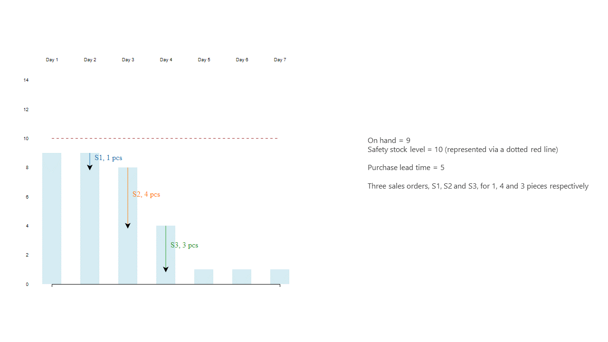
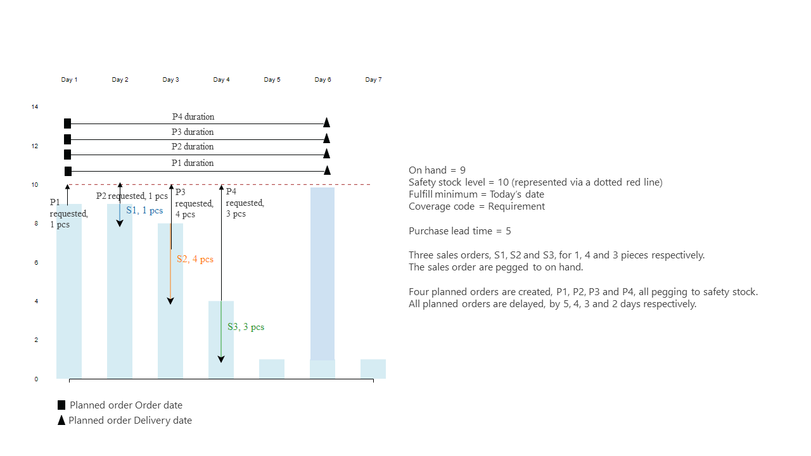
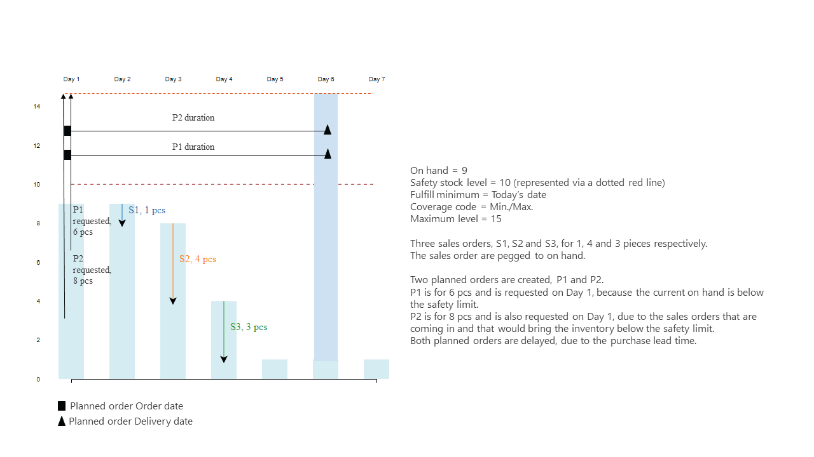
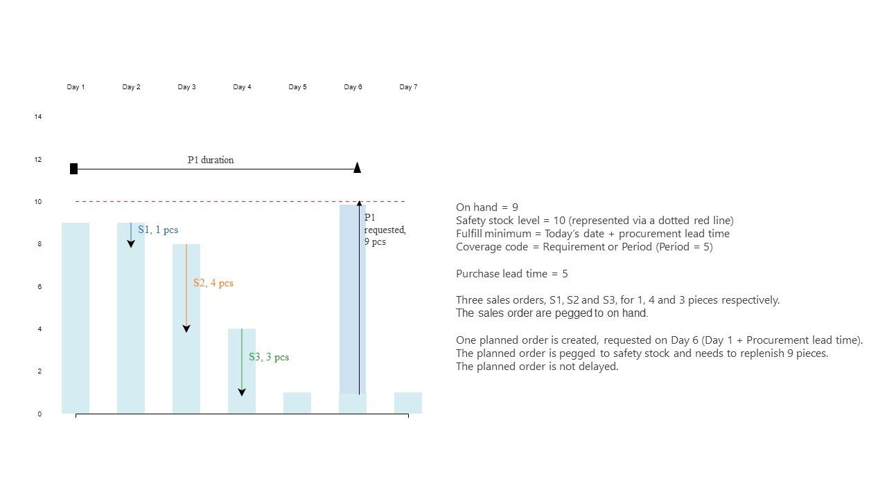
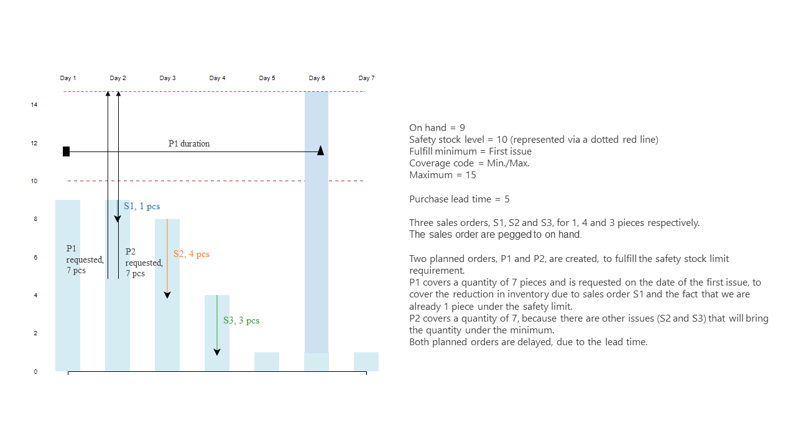
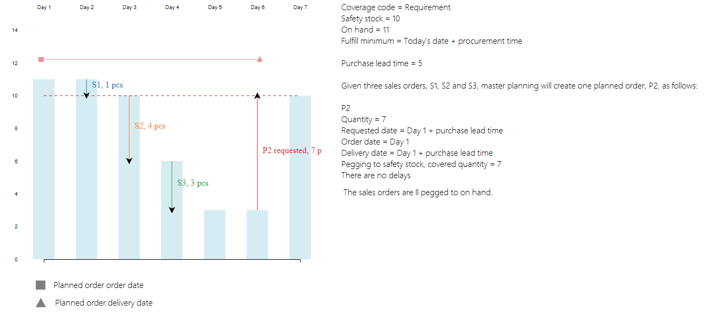

# Setting up safety stock levels for items

Safety stock is set up part of item coverage (**Released products – Plan – Coverage – Item coverage** form).

In the **Minimum** field, enter the safety stock level, that you want to maintain for the item. The value is expressed in inventory units. If you leave the field blank, the default value is zero. This field is available when you select **Period**, **Requirement**, or **Min./Max.** in the **Coverage code** list. The limit applies to the available inventory, meaning that reservations and markings may trigger safety stock replenishment before the physical quantity goes below the specified minimum.

You must define all other coverage planned dimensions before you can define the **Minimum**. This rule prevents an invalid record from being used during master planning. This situation can occur if, for example, a dimension group is extended with an additional coverage planned dimension for which the minimum and maximum inventory quantities are not yet defined.

You can use minimum keys to handle seasonal fluctuations in demand. For example, you can decrease the minimum inventory level of an item off season, and then gradually increase the level in the following months. You create a minimum key by going to **Master planning - Setup - Coverage - Minimum/maximum keys**. You specify the minimum key that adjusts the safety stock level by seasonality in the **Minimum key** field on the **Item coverage** form.

#### Example: Minimum key
If, for example, you want to set up a minimum key that accounts for increased seasonal demand during the spring and summer months, go to **Master planning - Setup - Coverage - Minimum/maximum keys** and follow these steps.
1. Create 12 lines, and number the lines from 1 to 12 in the **Change field**.
2. In the **Unit** field, select **Months**.
3. In the **Factor** field, enter the values that are described in the following table.

|Line|Enter this value|Result|
|---|---|---|
|1-3|1|Minimum inventory is based on the setting for January through March in the **Item coverage** form.|
|4-5|2|Minimum inventory is multiplied by a factor of 2 for April and May.|
|6-8|2.5|Minimum inventory is multiplied by a factor of 2.5 for June through August.|
|9-12|1|Minimum inventory reverts to the setting for September through December in the Item coverage form.|

If coverage code is **Min./Max.**, you can also specify the **Maximum** inventory quantity that you want to maintain for the item. The value is also expressed in inventory units. If the projected available inventory falls below the minimum quantity, master planning generates a planned order to fulfill all open requirements and also bring the available inventory up to the specified maximum quantity. Just like for **Minimum**, you must define all other coverage planned dimensions before you can define the **Maximum** field.

#### Example: Min./Max. coverage code
The minimum quantity is 10, and the maximum quantity is 15. Current on-hand inventory is 4. This gives a minimum quantity requirement of 6. However, because the maximum quantity is 15, master planning generates a planned order for 11.

For items with demand patterns that follow a certain seasonality, you may need to maintain different maximum levels, following the item's seasonality. To do that, you need to define **Maximum keys** (**Master planning – Setup – Coverage – Minimum/maximum keys**) and fill in the **Maximum key** field on the **Item coverage** form. You can view the information about the safety stock levels defined via minimum keys on the **Min./Max.** tab of the **Item coverage** form. You need to make sure that, for a certain period, the minimum and the maximum values are kept in sync.

# Safety stock fulfillment 

The **Fulfill minimum** parameter allows you to select the date or the period during which the inventory level must meet the quantity that you specified in the **Minimum** field. This field is available when you select **Period**, **Requirement**, or **Min./Max.** in the **Coverage code** list.

The following scenario will be used in order to exemplify how this parameter works and what are the differences between its values:

The following options are available:
### **Today's date** 
The specified minimum quantity is met on the date that master planning is run. The system tries to fulfill to the safety stock limit as soon as possible, even though though it may be unrealistic, due to the lead time.

Planned order P1 is created for today's date, to bring the available inventory above safety stock already on this date. The other planned orders respond to safety stock fulfillment due to the sales orders that are taking the available inventory lower and lower.

When **Requirement** coverage code is used, a lot of planned orders are created. It is always a good idea to either use **Period** or **Min./Max.** coverage for materials, in order to bundle the replenishment, as you can see in the following examples.

### **Today's date + procurement time** 
The specified minimum quantity is met on the date that master planning is run, plus the purchase or production lead time. This time includes any safety margins. If the item carries a trade agreement, and the **Find trade agreements** check box is selected in the **Master planning parameters** form, the delivery lead time from the trade agreement is not considered. Lead times are taken from the item's coverage settings or from the item. 
This fulfillment mode has the benefit that it will create plans with less delays, as the following images show.

### **First issue** 
The specified minimum quantity is met on the date the available inventory goes below minimum, as you can see in the image below. Even if available inventroy is below minimum on the date master planning is run, **First issue** will not attempt to cover it until the next requirement comes in.

> [!NOTE] If on the date master planning is run the available inventory is already under the safety stock limit, **Today's date** and **Today's date + procurement time** will trigger the replenishment imediately. **First issue** will wait until there is another issue transaction (sales order, BOM line requirement, etc) for the item and it will trigger the replenishment on the date of this transaction. 
If on the date master planning is run the available inventory is not under the safety stock limit, **Today's date** and **First issue** will provide exactly the same result. **Today's date + procurement time** will provide the following result, because it postpones the fulfillment until the end of the procurement lead time:

- **Coverage time fence**: The specified minimum quantity is met during the period that is specified in the **Coverage time fence** field.

If **Minimum keys** are used, select **Minimum periods** check box to fulfill the minimum inventory level for all the periods that are set up in the minimum key. If you clear the check box, the minimum inventory is fulfilled for the current period only.

# The way master planning is handling the safety stock constraint

Safety stock is tracked in the system as a requirement type. You can see it in the **Net requirements** form, if you remove the default filter on the **Requirement type** column.

Fulfilling the safety stock requiremet transaction is deprioritized if the system determines that this causes delays in the fulfilment of real demand: sales lines, BOM lines, transfer requirements, demand forecast lines, and so on. Otherwise, making sure that the available inventory is above the safety stock quantity has the same priority as any other demand types. This ensures no delays for real transactions and helps to prevent over-replenishment and early-replenishment of safety stock.

During the coverage phase of master planning, safety stock replenishment is no longer deprioritized. Now on-hand inventory can be used before any other demand types. During the delay calculation, new logic will be added to go over the delayed sales lines, BOM line requirements, and all the other demand types, to determine whether they could be delivered on time, provided safety stock is used. If the system identifies that it can minimize delays by using safety stock, then the sales lines or BOM lines will replace their initial coverage with the safety stock, and the system will trigger the replenishment for the safety stock instead.

If the plan or the item is not set up for delayed calculation, then the safety stock constraint will have the same priority as any other demand types. This means there be a reserve of on-hand and other available inventory before any other demand types.
