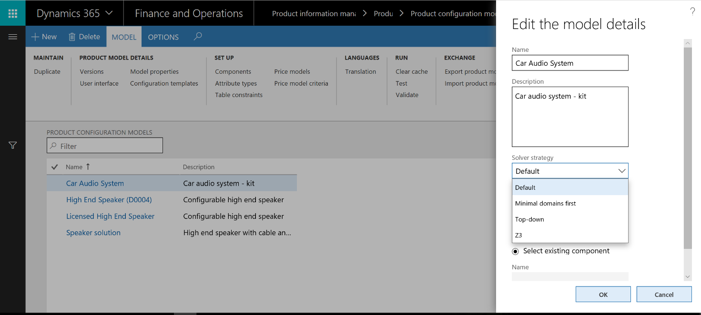

---
# required metadata

title: Solver strategy for product configuration
description: This topic discusses how to use solver strategy to improve performance of product configuration. 
author: cvocph 
manager: AnnBe
ms.date: 12/22/2017
ms.topic: article
ms.prod: 
ms.service: dynamics-ax-applications
ms.technology: 

# optional metadata
ms.search.form: PCCreateProductConfigurationModel, PCProductConfigurationModelListPage 
# ROBOTS: 
audience: Application User
# ms.devlang: 
ms.reviewer: YuyuScheller
ms.search.scope: Core, Operations

# ms.tgt_pltfrm: 
ms.custom: 
ms.assetid: 
ms.search.region: Global
ms.search.industry: 
ms.author: cvocph
ms.search.validFrom: 2016-02-28
ms.dyn365.ops.version: AX 7.0.0

---

# Solver strategy for product configuration

[!include[banner](../includes/banner.md)]

This topic discusses how to use solver strategy to improve performance of product configuration.

The **Solver strategy** concept was first introduced in Cumulative update 7 for Dynamics AX 2012 R2. The concept has been extended in Cumulative update 8 for Dynamics AX 2012 R3 and Microsoft Dynamics 365 for Finance and Operations, Enterprise edition (December 2017).

It now consists of the following strategies:

-  Default
-  Minimal domains first
-  Top-down
-  Z3

## Solver strategy 

A configuration model can be formulated as a constraint satisfaction problem (CSP). For more information about CSP, see [CSP](http://aima.cs.berkeley.edu/2nd-ed/newchap05.pdf).

Microsoft Solver Foundation (MSF) provides two types of solver strategy to solve the CSPs that can be expressed from a configuration model. These two solve strategies rely on heuristics, which are used to decide in which order the variables of the CSP are considered when solving the problem. [Heuristics](https://techterms.com/definition/heuristic) can have a significant impact on the performance of solving a problem or class of problems.

The Solver strategy that is exposed for product configuration models in Dynamics 365 for Finance and Operations controls which solver will be used with heuristics. The **Default**, **Minimal domains first** and **Top-down** strategies use the two solvers from MSF, whereas **Z3** uses the Z3 solver. 

Based on real customer implementation studies, changing the solver strategy for a product configuration model can result in the fact that the response time has been reduced from minutes to milliseconds. So, it is worth the effort to try different solver strategies to see which solver strategy has impact on your product configuration model.

## Change solver strategy setting

You can change the solver strategy setting on the **Model properties** form.

Currently, there is no logic that automatically detects which solver strategy will be the most efficient strategy for constraint-based product configuration. So, you must try solver strategies one by one.

The following table provides some recommendations for which solver strategy fits into which specific scenario.

| Solver strategy | When to use it       |
|----------------------|------------|
| Default              | The **Default** solver strategy has been optimized to solve models that rely on table constraints. Based on customer implementation cases that use table constraints to a great extend, this solver strategy has proved to be the most efficient. |
| Minimal domain first | **Minimal domain first** and **Top-down** strategies are closely related. The **Top-down** strategy, which was introduced with CU 8, has shown to outperform **Minimal domain first** based on customer implementation studies, but for backward compatibility, the **Minimal domain first** strategy is kept in the product. Both strategies have shown to be more efficient for solving models that contain several arithmetic expressions where table constraints are not used. However, there are examples where the **Default** solver strategy outperforms these two strategies. So, remember to try each.|
| Top-down             | **Minimal domain first** and **Top-down** strategies are closely related. The **Top-down** strategy, which was introduced with CU 8, has shown to outperform **Minimal domain first** based on customer implementation studies, but for backward compatibility, the **Minimal domain first** strategy is kept in the product. Both strategies have shown to be more efficient for solving models that contain several arithmetic expressions where table constraints are not used. However, there are examples where the **Default** solver strategy outperforms these two strategies. So, remember to try each.|
| Z3                   | The Z3 strategy is recommended to be used by default. If there are concerns about performance and scalability, you can evaluate the other solver strategies.       |

## Additional resources

[Heuristics](https://techterms.com/definition/heuristic)

[CSP](http://aima.cs.berkeley.edu/2nd-ed/newchap05.pdf)

