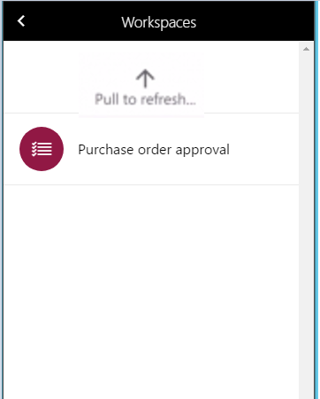

---
# required metadata

title: Purchase order approval mobile workspace
description: This topic provides information about the Purchase order approval mobile workspace, which lets you view purchase orders and respond to them through actions. For example, you can approve or reject a purchase order.
author: mkirknel 
manager: AnnBe
ms.date: 06/16/2017
ms.topic: article
ms.prod: 
ms.service: dynamics-ax-applications
ms.technology: 

# optional metadata

ms.search.form: PurchTable, PurchVendorPortalRequests
# ROBOTS: 
audience: Application User
# ms.devlang: 
ms.reviewer: bis

ms.search.scope: Core, Operations, UnifiedOperations, Retail

# ms.tgt_pltfrm: 
ms.custom: 30211
ms.search.region: Global
# ms.search.industry: 
ms.author: mkirknel
ms.search.validFrom: 2016-11-30 
ms.dyn365.ops.version: Version 1611 

---

# Purchase order approval mobile workspace

[!include[banner](../includes/banner.md)]

[!include[retail name](../includes/retail-name.md)]

This topic provides information about the **Purchase order approval** mobile workspace. This workspace lets you view purchase orders and respond to them through actions. For example, you can approve or reject a purchase order.
 
## Overview 
Purchase orders that requires approval go through an approval workflow. The workflow can include various steps that require that one or more people take action. For example, a person might have to complete a task or approve the purchase order. 

The **Purchase order approval** mobile workspace lets you easily view and respond to purchase orders from your mobile device. This workspace also lets you take the same workflow actions that you can take from the Microsoft Dynamics 365 for Finance and Operations, Enterprise edition, web client.

## Prerequisites
The prerequisites vary, depending on the version of Finance and Operations that has been deployed for your organization.

### Prerequisites if you use Microsoft Dynamics 365 for Finance and Operations, Enterprise edition (July 2017) 
If Microsoft Dynamics 365 for Finance and Operations, Enterprise edition (July 2017), has been deployed for your organization, the system administrator must publish the **Purchase order approval** mobile workspace. For instructions, see [Publish a mobile workspace](../../dev-itpro/mobile-apps/publish-mobile-workspace.md).

### Prerequisites if you use Microsoft Dynamics 365 for Operations version 1611 with Platform update 3 or later
If Microsoft Dynamics 365 for Operations version 1611 with Platform update 3 or later has been deployed for your organization, the system administrator must complete the following prerequisites. 

<table>
<thead>
<tr class="header">
<th>Prerequisite</th>
<th>Role</th>
<th>Description</th>
</tr>
</thead>
<tbody>
<tr class="odd">
<td>Implement KB 4017918.</td>
<td>System administrator</td>
<td>KB 4017918 is an X++ update or metadata hotfix that contains the <strong>Purchase order approval</strong> mobile workspace. To implement KB 4017918, your system administrator must follow these steps.
<ol>
<li><a href="../../dev-itpro/migration-upgrade/download-hotfix-lcs.md">Download the metadata hotfix from Microsoft Dynamics Lifecycle Services (LCS)</a>.</li>
<li><a href="../../dev-itpro/migration-upgrade/install-metadata-hotfix-package.md">Install the metadata hotfix</a>.</li>
<li><a href="../../dev-itpro/deployment/create-apply-deployable-package.md">Create a deployable package</a> that contains the <strong>SCMMobile</strong> model, and then upload the deployable package to LCS.</li>
<li><a href="../../dev-itpro/deployment/apply-deployable-package-system.md">Apply the deployable package</a>.</li>
</ol></td>
</tr>
<tr class="even">
<td>Publish the <strong>Purchase order approval</strong> mobile workspace.</td>
<td>System administrator</td>
<td>See <a href="../../dev-itpro/mobile-apps/publish-mobile-workspace">Publish a mobile workspace</a>.</td>
</tr>
</tbody>
</table>

## Download and install the mobile app
Download and install the Microsoft Dynamics 365 for Unified Operations mobile app:

- [For Android phones](https://go.microsoft.com/fwlink/?linkid=850662)
- [For iPhones](https://go.microsoft.com/fwlink/?linkid=850663)

## Sign in to the mobile app

1. Start the app on your mobile device.
2. Enter your Microsoft Dynamics 365 URL.
3. The first time that you sign in, you're prompted for your user name and password. Enter your credentials.
4. After you sign in, the available workspaces for your company are shown. Note that if your system administrator publishes a new workspace later, you will have to refresh the list of mobile workspaces.

## View orders that are assigned to you
1. On your mobile device, select the **Purchase order approval** workspace.
2. Select **Orders assigned to me** to view all the purchase orders for which you've been asked to take action in the purchase order approval workflow.
3. Select an order. On the **Order details** page, you will see the order header information and lines. You can also find guidelines from the workflow task.
4. Select **Accounting distributions** to open the **Header accounting distributions** page.
5. Return to the **Order details** page, and select a line. From the order line details, you can also explore the line-specific accounting distributions.

## Complete an action on the purchase order
After you've viewed the purchase order that is assigned to you and read the workflow instructions, you should be ready to take action.

1. On your mobile device, select the **Purchase order approval** workspace.
2. Select **Orders assigned to me** to view all the purchase orders for which you've been asked to take action in the purchase order approval workflow.
3. Select an order, and view the details page.
4. Select **Actions** to show the available actions. The actions that are available depend on the task that has been assigned to you.

    | Task action    | Approval action  |
    |----------------|------------------|
    | Complete       | Approve          |
    | Return         | Reject           |
    | Request change | Request change   |
    | Delegate       | Delegate         |

5. Select the appropriate action.
6. On the **Complete task** page, enter a comment. Note that if you select the **Delegate** action, you must select a user to delegate the task to.
7. Select **Done**. After you refresh your workspace, the purchase order will no longer be in your list. 
