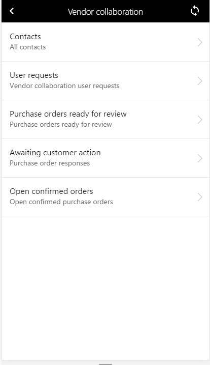

---
# required metadata

title: Vendor collaboration mobile workspace
description: This topic provides information about the Vendor collaboration mobile workspace. This workspace helps your vendors stay up to date about the purchase orders that have been sent to them for approval. They can also view information about new and updated purchase orders and contacts.
author: mkirknel 
manager: AnnBe
ms.date: 06/16/2017
ms.topic: article
ms.prod: 
ms.service: dynamics-ax-applications
ms.technology: 

# optional metadata

# ms.search.form: 
# ROBOTS: 
audience: Application User
# ms.devlang: 
ms.reviewer: sericks
ms.search.scope: Core, Operations
# ms.tgt_pltfrm: 
ms.custom: 267074
ms.assetid: 1d293b3a-2fa2-418d-9347-78c2809d67fe
ms.search.region: global
# ms.search.industry: 
ms.author: mkirknel
ms.dyn365.ops.intro: Version 1611
ms.search.validFrom: 2016-11-30

---

# Vendor collaboration mobile workspace

[!include[banner](../includes/banner.md)]

This topic provides information about the **Vendor collaboration** mobile workspace. This workspace helps your vendors stay up to date about the purchase orders that have been sent to them for approval. They can also view information about new and updated purchase orders and contacts.

This mobile workspace is intended to be used with the Microsoft Dynamics 365 for Unified Operations mobile app.

## Overview 
The **Vendor collaboration** mobile workspace keeps vendors informed about new purchase orders, so that they can view purchase orders and then respond to them in the Microsoft Dynamics 365 for Finance and Operations, Enterprise edition, web client. 

>[!NOTE]
> The mobile workspace should be used as a supplement to the vendor collaboration web interface, not a replacement for it. 

Your vendors can use the **Vendor collaboration** mobile workspace to view new purchase orders that are sent to them for approval. It shows purchase order information, such as products, quantities, and requested delivery dates. Price information is also available, depending on the configuration of each vendor. 

A user who signs in as a vendor will see which purchase orders have been responded to, and which purchase orders are still awaiting customer action. For example, a purchase order might be awaiting customer action because the vendor suggested another delivery date, but the customer hasn't yet agreed to that date. The vendor will also see a list of purchase orders that have been confirmed but haven't yet been delivered. 

To respond to a purchase order, the vendor must use the vendor collaboration web interface that is available in the web client. There, the vendor can also get more information about the order, such as document attachments, the delivery address per line, and charges that are associated with the vendor. 

Vendors that have a special security role can see which contact persons are registered for a vendor account. The same security role lets a vendor view the status of any user request that has been submitted. 

The vendor collaboration web interface in the web client must be used to create new contacts and submit new user requests. 

The **Vendor collaboration** mobile workspace lets a vendor perform these tasks:

-   View new purchase orders that are sent to the vendor.
-   View purchase orders that the vendor has responded to, and that are awaiting customer action.
-   View purchase orders that have been confirmed but haven't yet been fully received.
-   View contact person information that is registered for the vendor account. (This task requires an additional security role.)
-   View information about a user request that was submitted by the vendor, and follow the status of the request. (This task requires an additional security role.)

## Prerequisites
The prerequisites vary, depending on the version of Microsoft Dynamics 365 that has been deployed for your organization.

### Prerequisites if you use Microsoft Dynamics 365 for Finance and Operations, Enterprise edition (July 2017) 
If Microsoft Dynamics 365 for Finance and Operations, Enterprise edition (July 2017), has been deployed for your organization, the system administrator must publish the **Vendor collaboration** mobile workspace. For instructions, see [Publish a mobile workspace](../../dev-itpro/mobile-apps/publish-mobile-workspace.md).

### Prerequisites if you use Microsoft Dynamics 365 for Operations version 1611 with Platform update 3 or later
If Microsoft Dynamics 365 for Operations version 1611 with Platform update 3 or later has been deployed for your organization, the system administrator must complete the following prerequisites. 

<table>
<thead>
<tr class="header">
<th>Prerequisite</th>
<th>Role</th>
<th>Description</th>
</tr>
</thead>
<tbody>
<tr class="odd">
<td>KB 3216943 must be implemented if you're using Platform update 3.</td>
<td>System administrator</td>
<td>KB 3216943 is a binary update that is required if you're using Platform update 3. To implement this KB, the system administrator must follow these steps.
<ol>
<li>Download KB 3216943 from Microsoft Dynamics Lifecycle Services (LCS).</li>
<li>Install the binary update, which is delivered as a deployable package. For information about how to apply a deployable package, see <a href="../../dev-itpro/deployment/apply-deployable-package-system.md">Apply a deployable package</a>.</li>
</ol></td>
</tr>
<tr class="even">
<td>KB 4013633 must be implemented.</td>
<td>System administrator</td>
<td>KB 4013633 is an X++ update or metadata hotfix that contains the <strong>Inventory on-hand</strong> mobile workspace. To implement KB 4013633, your system administrator must follow these steps.
<ol>
<li><a href="../../dev-itpro/migration-upgrade/download-hotfix-lcs.md">Download the metadata hotfix from LCS</a>.</li>
<li><a href="../../dev-itpro/migration-upgrade/install-metadata-hotfix-package.md">Install the metadata hotfix</a>.</li><li><a href="../../dev-itpro/deployment/create-apply-deployable-package.md">Create a deployable package</a> that contains the <strong>SCMMobile</strong> model, and then upload the deployable package to LCS.</li>
<li><a href="../../dev-itpro/deployment/apply-deployable-package-system.md">Apply the deployable package</a>.</li>
</ol></td>
</tr>
<tr class="odd">
<td>The <strong>Vendor collaboration</strong> mobile workspace must be published.</td><td>System administrator</td>
<td>See <a href="../../dev-itpro/mobile-apps/publish-mobile-workspace.md">Publish a mobile workspace</a>.</td>
</tr>
<tr class="even">
<td>The vendor user must have access to the vendor collaboration web interface in the web client and must set up a vendor collaboration user.</td><td>Purchasing professionals and the system administrator</td>
<td>Follow the steps in the following topics to set up and work with the vendor collaboration web interface.
<ul>
<li><a href="vendor-collaboration-work-external-vendors.md">Use vendor collaboration to work with external vendors</a></li>
<li><a href="manage-vendor-collaboration-users.md">Manage vendor collaboration users</a></li>
<li><a href="set-up-maintain-vendor-collaboration.md">Set up and maintain vendor collaboration</a></li>
<li><a href="vendor-collaboration-work-customers-dynamics-365-operations.md">Use vendor collaboration to work with customers in Finance and Operations</a></li>
</ul></td>
</tr>
</tbody>
</table>

## Download and install the mobile app

Download and install the Dynamics 365 for Unified Operations mobile app:

-   [For Android phones](https://go.microsoft.com/fwlink/?linkid=850662)
-   [For iPhones](https://go.microsoft.com/fwlink/?linkid=850663)

## Sign in to the mobile app
1.  Start the app on your mobile device.
2.  Enter your Microsoft Dynamics 365 URL.
4.  The first time that you sign in, you’re prompted for your user name and password. Enter your credentials.
5.  After you sign in, the available workspaces for your company are shown. Note that if your system administrator publishes a new workspace later, you will have to refresh the list of mobile workspaces.

    

## Use the Vendor collaboration mobile workspace
When you select the **Vendor collaboration** workspace, you’ll see the following options.

The **Vendor collaboration** workspace includes the following pages.

### Contacts
The **Contacts** page lets you see all the contacts that have been set up for the vendor account. It shows the contact person's name, primary email address, and user alias, if the contact person has an alias. This page also shows whether the contact person's user account is active. When you select a contact, you see contact details, such as the legal entities that the person is a contact for. You also see contact information, such as a telephone number or an alternative email address.

### User requests
The **User requests** page lets you see all the user requests that you've submitted via the vendor collaboration web interface. You can also follow the status of those requests. When you select a user request, you can see what was requested, add or inactivate a user, change security, and see which security roles were requested for the user.

### Purchase orders ready for review
The **Purchase orders ready for review** page lets you see all the purchase orders that the customer has sent, but that haven't yet been responded to. You can view selected information about the order, such as which products were requested and when those products should be delivered. Price information is also available, depending on the configuration of the vendor.

You can also see whether the purchase order has notes or attachments. However, to open notes and attachments, you must use vendor collaboration web interface in the web client. Select **Purchase order line** to see all the lines together with their details. For each line, an indicator will show whether there are notes or attachments, or whether the delivery address differs from the delivery address that is shown on the header.

To respond to the purchase order, you must use the vendor collaboration web interface in the web client.

### Awaiting customer action
The **Awaiting customer action** page lets you find purchase orders that you or another person in your company who has access to vendor collaboration has responded to. The purchase orders are visible in this list only if the customer must take one of the following actions on the purchase order:

-   If the purchase order was rejected, the customer must either update or cancel the original order, and then send it again. When the purchase order is sent again, it no longer appears on the **Awaiting customer action** page.
-   If the purchase order was accepted with changes, the customer must either update the original order and then send it again for review, or update the order per the requested changes and then confirm it immediately. In both cases, the purchase order no longer appears on the **Awaiting customer action** page.
-   If the purchase order was accepted but still appears on the **Awaiting customer action** page, the purchase order wasn't automatically confirmed when it was accepted. It's now waiting for a purchasing agent to change the order status to **Confirmed**. Typically, a purchase order is considered an agreement between the customer and the vendor as soon as the vendor accepts the order. Therefore, the update to **Confirmed** status is usually just a formality.

When you select a purchase order, additional details appear about the response. You can see the line details and response for every line. The line status shows which of the following responses has been given:

-   Accepted
-   Rejected
-   Accepted with changes
-   Substituted/Substitute
-   Split into schedule/Schedule line

Note that the **Delivering** field is set to either **Yes** or **No** to indicate whether the lines will be delivered. A line might not be delivered because for the following reasons:

- The line was rejected.
- A substitution was made, and the original line isn't expected to be delivered as requested in the received order.
- The line was split into multiple schedule lines, and the original line isn't expected to be delivered as requested in the received order.

Any changes that have been made to the order line response are shown. However, uploaded notes and attachments aren't shown. To view notes and attachments, you must use the vendor collaboration web interface in the web client.

### Open confirmed orders
When the purchase order is confirmed by the customer (that is, the status of the purchase order is changed to **Confirmed**), it appears in the open confirmed order. It will remain in the list until it's registered as received by the customer.
