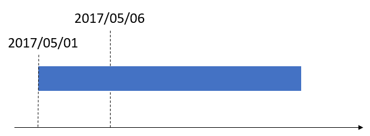

---
# required metadata

title: Visibility into material exceptions
description: This topic describes how to get an increased visibility into exceptions for raw materials for production and
batch orders.
author: johanhoffmann
manager: AnnBe
ms.date: 10/30/2017
ms.topic: article
ms.prod: 
ms.service: dynamics-ax-applications
ms.technology: 

# optional metadata

# ms.search.form:  
# ROBOTS: 
audience: Application User
# ms.devlang: 
ms.reviewer: bis
ms.search.scope: AX 7.3.0, Operations, UnifiedOperations
# ms.tgt_pltfrm: 
ms.custom: 1705903
ms.search.region: Global
# ms.search.industry: 
ms.author: johanho
ms.search.validFrom: 2018-03-28
ms.dyn365.ops.version: AX 7.3.0
---
**Visibility into material exceptions**

With the use of three tiles in the Production floor management workspace you can
get an increased visibility into exceptions for raw materials for production and
batch orders.

1.  Unreleased material lines needing attention

2.  Unprocessed waves needing attention

3.  Open warehouse work needing attention

For all three tiles, the raw material date of the BOM and formula lines will
be compared against the workspace date and the filters for **Production unit,
Resource group** and **Resource** that are set in the **Configure my work
space** menu. The workspace date defaults to today’s date but it can be adjusted
by the user.

An unreleased BOM or formula line qualifies for needing attention if the raw
material date of the line equals to or is earlier than the work space date
and meets the criteria of the filters in the work space.

In the below figure the blue bar represents a production job scheduled on a
resource. The job is scheduled to start on 2017/05/01, and this is the raw
material date, that is, the date where the materials assigned to the job, in the
BOM and formula lines, need to be ready. The other date in the figure,
2017/05/06, represents the work space date. The raw material date is earlier
than the workspace date so the day where consumption of the raw material was
supposed to start has been exceeded and thus the BOM and formula lines meet the
criteria for needing attention.

**Tile - Unreleased material lines needing attention**

A BOM or formula line can be released to warehouse in three different ways:
- As part of a production or batch order release. 
- As a manual release.
- Automatically with the use of a batch job. 

For more information see: [Release BOM and formula lines to the warehouse](releasing-bom-and-formula-lines-to-warehouse.md). 

If a BOM or formula line has not been released or has only been partly released and
the date and filter criteria of the workspace are met, then the line will be
included in the calculation of the number on the tile.

When you select the tile, the **Release to warehouse** form is opened. This form
shows the number of unreleased BOM and formula lines that is indicated by the
tile number. The unreleased lines are displayed in the upper grid and here you
can see the originally estimated quantity for the line, the already released
quantity, and the remaining quantity to release. You can add the lines from the
upper to the lower grid, and from the lower grid, the selected lines can be
released to warehouse. From the lower grid you can also adjust the quantity to
release to only release a partial quantity.

**Tile - Unprocessed waves needing attention**

When a BOM or formula line is released, it is either added to a new production
wave or to an existing open wave, depending on the configuration of the
production wave template. Through the configuration of the wave template, a wave
can also be set to be automatically processed when a BOM or formula line is
released. When the wave is processed, warehouse work for raw material picking is
generated. If the wave template is set to not process at release, the wave will
remain in an unprocessed state. The **Unprocessed waves needing attention** tile
shows the number of BOM and formula lines that are released to warehouse on
unprocessed waves where the raw material date of the lines is earlier than or equal
to the workspace date. It is also a prerequisite that the lines are consumed by
an operation resource that applies to the filter of the workspace.

When the tile is selected, the **All production waves** page is opened filtered
with the number of open waves that contain wave lines from released BOM and
formula lines that fulfill the criteria for the tile. From the page, you can
manually process the wave.

**Tile - Open warehouse work needing attention**

This tile shows the number of BOM and formula lines released to warehouse with
unprocessed work where the raw material date of the lines is earlier than or equal to
the workspace date. It is also a prerequisite that the lines are consumed by an
operation resource that applies to the filter of the workspace.

When the tile is selected, the **All work** page is opened filtered with the
number of open work headers that contain work lines from released BOM and
formula lines that fulfill the criteria for the tile. From the page, you can
manually process the work.
