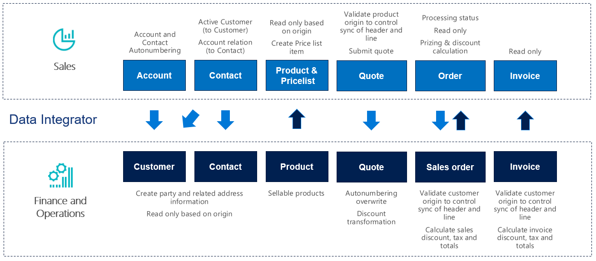
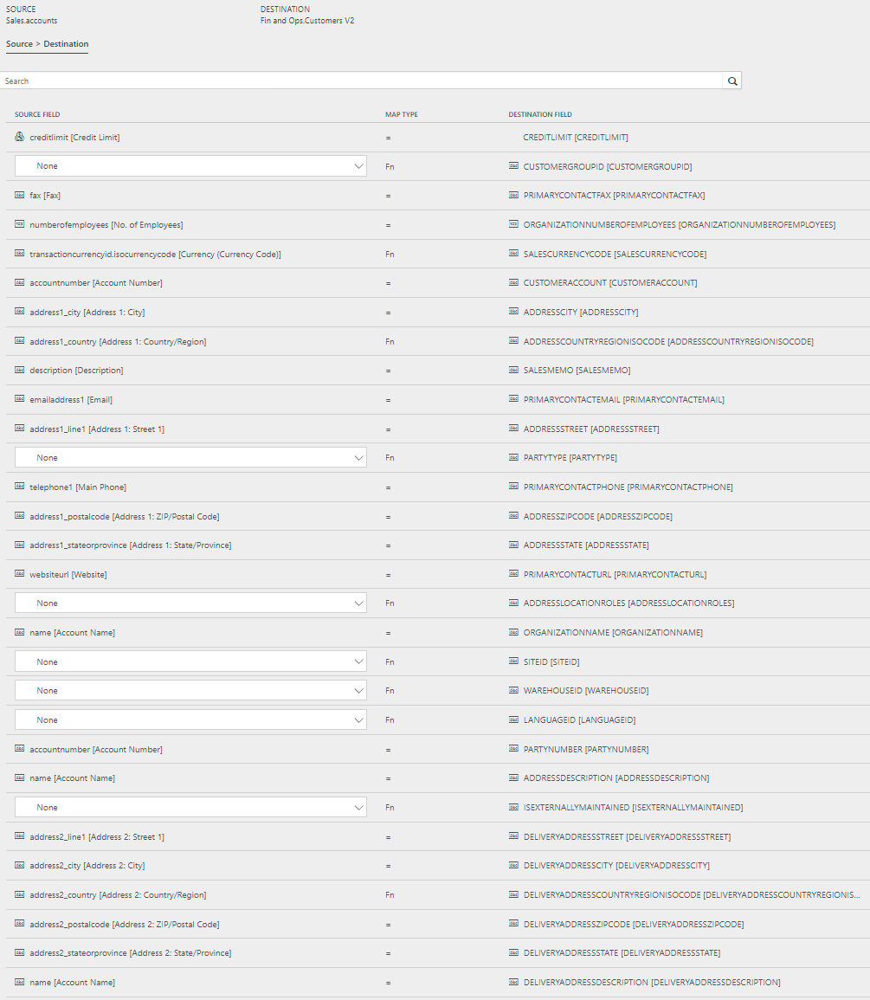

---
# required metadata

title: Synchronize accounts directly from Sales to customers in Finance and Operations 
description: This topic discusses the templates and underlying tasks that are used to synchronize accounts from Microsoft Dynamics 365 for Sales to Microsoft Dynamics 365 for Finance and Operations. 
author: ChristianRytt
manager: AnnBe
ms.date: 10/26/2017
ms.topic: article
ms.prod: 
ms.service: dynamics-ax-applications
ms.technology: 

# optional metadata

ms.search.form: 
# ROBOTS: 
audience: Application User, IT Pro
# ms.devlang: 
ms.reviewer: yuyus
ms.search.scope: Core, Operations
# ms.tgt_pltfrm: 
ms.custom: 
ms.assetid: 
ms.search.region: global

ms.search.industry: 
ms.author: crytt
ms.dyn365.ops.version: July 2017 update 
ms.search.validFrom: 2017-07-8

---

# Synchronize accounts directly from Sales to customers in Finance and Operations

[!INCLUDE [banner](../includes/banner.md)]

> [!NOTE]
> Before you can use the Prospect to cash solution, you should be familiar with [Dynamics 365 Data integration](/common-data-service/entity-reference/dynamics-365-integration).

This topic discusses the templates and underlying tasks that are used to synchronize accounts directly from Microsoft Dynamics 365 for Sales to Microsoft Dynamics 365 for Finance and Operations.

## Data flow in Prospect to cash

The Prospect to cash solution uses the Data integration feature to synchronize data across instances of Finance and Operations and Sales.  The Prospect to cash templates that are available with the Data integration feature enable the flow of data about accounts, contacts, products, sales quotations, sales orders, and sales invoices between Finance and Operations and Sales. The following illustration shows how the data is synchronized between Finance and Operations and Sales.

## Templates and tasks

To access the available templates, open [PowerApps Admin Center](https://preview.admin.powerapps.com/dataintegration). Select **Projects**, and then, in the upper-right corner, select **New project** to select public templates.

The following template and underlying task are used to synchronize accounts from Sales to Finance and Operations:

- **Name of the template in Data integration:** Accounts (Sales to Fin and Ops) - Direct
- **Name of the task in the project:** Accounts - Customers

No synchronization tasks are required before Account/Customer synchronization can occur.

## Entity set

| Sales    | Finance and Operations |
|----------|------------------------|
| Accounts | Customers V2           |

## Entity flow

Accounts are managed in Sales and synchronized to Finance and Operations as customers. The **Is Externally Maintained** property on these customers is set to **Yes** to track customers that originate from Sales. During invoicing, this information is used to filter invoices that are synchronized to Sales.

## Prospect to cash solution for Sales

The **Account Number** field is available on the **Account** page. It has been made a natural and unique key in order to support the integration. The natural key feature of the Customer Relationship Management (CRM) solution might affect customers who already use the **Account Number** field, but who don't use unique **Account Number** values per account. Currently, the integration solution doesn't support this case.

When a new account is created, if an **Account Number** value doesn't already exist, it's automatically generated by using a number sequence. The value consists of **ACC**, followed by an increasing number sequence and then a suffix of six characters. Here is an example: **ACC-01000-BVRCPS**

When the integration solution for Sales is applied, an upgrade script sets the **Account Number** field for existing accounts in Sales. If there are no **Account Number** values, the number sequence that was mentioned earlier is used.

## Preconditions and mapping setup

- The **CustomerGroupId** mapping must be updated to a valid value in Finance and Operations. You can specify a default value, or you can set the value by using a value map.

    The default template value is **10**.

- By adding the following mappings, you can help reduce the number of manual updates that are required in Finance and Operations. You can use a default value or a value map from, for example, **Country/Region** or **City**.

    - **SiteId** – A site is required in order to generate quotations and sales order lines in Finance and Operations. A default site can be taken either from the product, or from the customer from the order header.

        The default template value is **1**.

    - **WarehouseId** – A warehouse is required in order to process quotations and sales order lines in Finance and Operations. A default warehouse can be taken either from the product, or from the customer from the order header in Finance and Operations.

        The default template value is **13**.

    - **LanguageId** – A language is required in order to generate quotations and sales orders in Finance and Operations. By default, the language from the order header from the customer is used.

        The default template value is **en-us**.

## Template mapping in Data integration

> [!NOTE]
> The **Payment terms**, **Freight terms**, **Delivery terms**, **Shipping method**, and **Delivery mode** fields aren't included in the default mappings. To map these fields, you must set up a value mapping that is specific to the data in the organizations that the entity is synchronized between.

The following illustrations show an example of a template mapping in Data integration. 

> [!NOTE]
> The mapping shows which field information will be synchronized from Sales to Finance and Operations.

## Related topics

[Prospect to cash](prospect-to-cash.md)

[Synchronize accounts directly from Sales to customers in Finance and Operations](accounts-template-mapping-direct.md)

[Synchronize contacts directly from Sales to contacts or customers in Finance and Operations](contacts-template-mapping-direct.md)

[Synchronize sales order headers and lines directly from Finance and Operations to Sales](sales-order-template-mapping-direct-two-ways.md)

[Synchronize sales invoice headers and lines directly from Finance and Operations to Sales](sales-invoice-template-mapping-direct.md)

