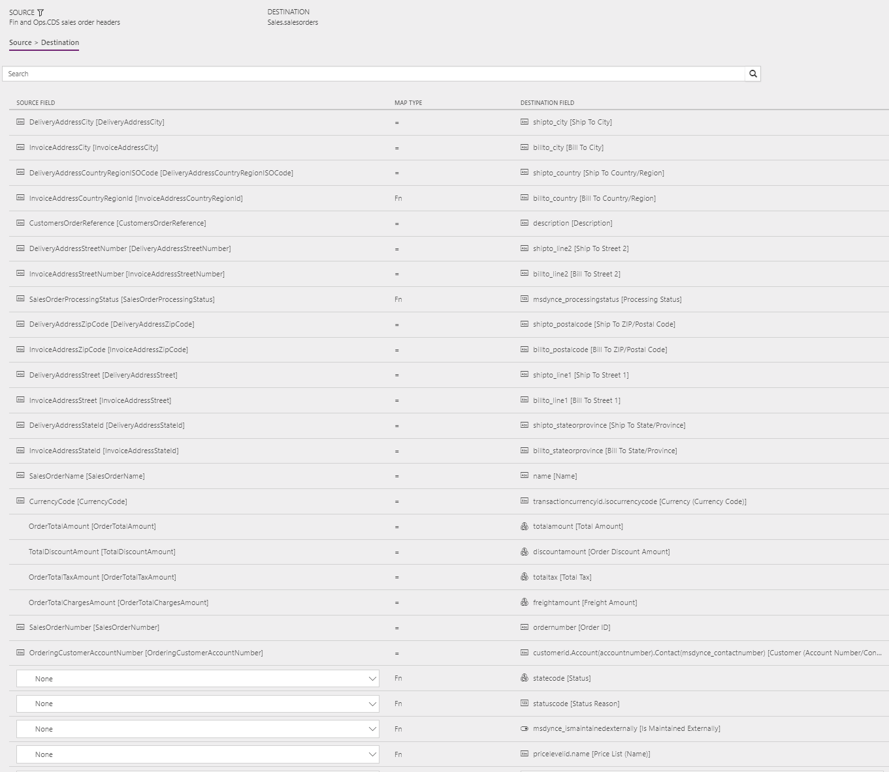
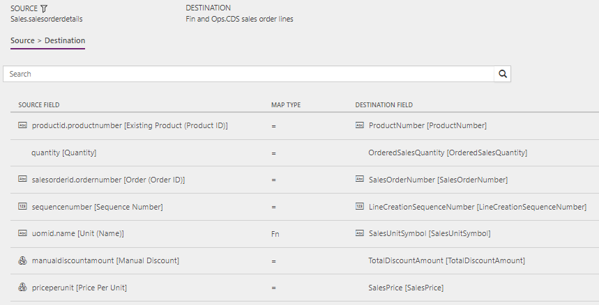

---
# required metadata

title: Synchronize sales order headers and lines directly between Sales and Finance and Operations
description: The topic discusses the templates and underlying tasks that are used to synchronize sales order headers and lines directly between Microsoft Dynamics 365 for Sales and Microsoft Dynamics 365 for Finance and Operations, Enterprise edition.
author: ChristianRytt
manager: AnnBe
ms.date: 08/28/2017
ms.topic: article
ms.prod: 
ms.service: dynamics-ax-applications
ms.technology: 

# optional metadata

ms.search.form: 
# ROBOTS: 
audience: Application User, IT Pro
# ms.devlang: 
ms.reviewer: yuyus
ms.search.scope: Core, Operations, UnifiedOperations
# ms.tgt_pltfrm: 
ms.custom: 
ms.assetid: 
ms.search.region: global
ms.search.industry: 
ms.author: crytt
ms.dyn365.ops.intro: July 2017 update 
ms.search.validFrom: 2017-07-8

---

# Synchronize sales order headers and lines directly between Sales and Finance and Operations

[!include[banner](../includes/banner.md)]

The topic discusses the templates and underlying tasks that are used to synchronize sales order headers and lines directly between Microsoft Dynamics 365 for Sales and Microsoft Dynamics 365 for Finance and Operations, Enterprise edition.
 
## Template and tasks

The following templates and underlying tasks are used to synchronize sales order headers and lines directly between Finance and Operations and Sales:

- **Name of template in Data integration** 

    - Sales Orders (Sales to Fin and Ops) - Direct
    - Sales Orders (Fin and Ops to Sales) - Direct
    
- **Names of tasks in Data integration project**

    - OrderHeader
    - OrderLine

Sync tasks required prior to Sales order header and lines sync:

- Products (Fin and Ops to Sales) - Direct
- Accounts (Sales to Fin and Ops) - Direct (if used)
- Contacts to Customers (Sales to Fin and Ops) - Direct (if used)

## Entity set

| Finance and Operations |       Sales       |
|------------------------|-------------------|
| CDS sales order headers|  SalesOrders      |
| CDS sales order lines  |  SalesOrderDetails|

## Entity flow

Sales orders are created in Sales and synchronized to Finance and Operations when activated with the 'Sales Orders (Sales to Fin and Ops) - Direct' template. In order to activate and sync orders from Sales they have to consist of only externally maintained products, no write-in products are allowed. Once activated the sales order will become read only from the UI and from this point updates are done from Finance and Operations. When the sales order is Confirmed any updates or fulfillment status will sync from Finance and Operations to Sales with the 'Sales Orders (Fin and Ops to Sales) - Direct' template. 
It is also possible to create new sales orders in Finance and Operations and skip the creation from Sales, as in the above flow they will sync to Sales once Confirmed.

In Finance and operations
Filters in the template ensure that only relevant sales orders are included in the synchronization:

- Both ordering and invoicing customer on the sales order that originate from Sales will be included in the synchronization. In Finance and Operations, the fields **OrderingCustomerIsExternallyMaintained** and **InvoiceCustomerIsExternallyMaintained** are used to track the synchronization in the data entities.

- The **Sales order** in Finance and Operations must be confirmed. Only the confirmed sales orders or sales orders with higher processing status, for example, Shipped or Invoiced status, are synchronized to Sales.

- After creating or modifying a sales order, the batch job **Calculate sales totals** in Finance and Operations must be executed. Only the sales orders with sales totals calculated will be synced to Sales.

### Freight tax

Sales doesn’t support tax on header level as all tax is stored on line level. 
To support Header charge tax from Finance and Operations, e.g. tax on freight, this synchronizes to Sales as a Write in product with the name ‘Freight Tax’ that has the tax amount from Finance and Operations. This way the standard price calculation in Sales can be used for totals, even with header tax from Finance and Operations. 

### Discount calculation and rounding

The discount calculation model differs between Sales and Finance and Operations. The final discount amount on a sales line in Finance and Operations can be the result of a combination of discount amounts and discount percentages. If this final discount amount is divided by the quantity on the line, there can be a rounding which would not be taken into account if a rounded ‘Per unit’ discount amount were to synchronize to CRM. To ensure that the full discount amount from a sales line in Finance and Operations synchronizes correctly to Sales, the full amount has to be synchronized without being divided by line quantity. For this reason, the requirement in Sales is to define that line discount is Per line item.

When a sales order line is synchronized in the other direction, from Sales to Operations, the full line discount amount is used. Since there is no field in Operations which can store the full discount amount for a line, the amount will be divided by quantity and stored in the Line discount field. Any rounding which may happen in this division is stored in the Sales charges field on the sales line.

**Example**

Sync Sales to Finance and Operations

    Sales: Qty = 3, Per line Discount = $10.00    
    Finance and Operations: Qty = 3, Line discount amount = $3.33, Sales charge = -$0.01

Sync Finance and Operations to Sales

    Finance and Operations: Qty = 3, Line discount amount = $3.33, Sales charge = -$0.01    
    Sales: Qty = 3, Per line Discount = 3 * $3.33 + $0.01 = $10.00

## Prospect to cash solution for Sales

New fields are added to the **Order** entity and displayed on the page:

- **Is Maintained Externally** - Set to **Yes** when the order is coming from Finance and Operations.

- **Processing status** - Used to show the processing status of the order in Finance and Operations. Values are:

    - Draft (Initial status when order is created in Sales - only processing status in Sales that is editable)
    - Active (Status after activated with the Activate button in Sales)
    - Confirmed
    - Packing Slip
    - Invoiced
    - Picked
    - Partially Picked
    - Partially Packed
    - Shipped
    - Partially Shipped
    - Partially Invoiced
    - Cancelled

The **Has Externally Maintained Products Only** setting is used during **Activate** to consistently keep track of whether the sales order is made up entirely of **Externally Maintained Products**, in which case products are maintained in Finance and Operations. This ensures that you don't activate and try to sync sales order lines with products that are unknown to Finance and Operations.
 
The **Create Invoice**, **Cancel Order**, **Recalculate**, **Get Products** and **Lookup Address** buttons on the **Sales order** page are hidden for externally maintained orders because invoices will be created in Finance and Operations and synced to Sales. The order page is non-editable because sales order information will be synced from Finance and Operations.
 
The **Sales order status** will remain active to ensure that changes from Finance and Operations can flow to the **Sales order** in Sales. This is controlled by setting the default **Statecode [Status]** to **Active** in the Data integration project.

## Preconditions and mapping setup 

Before synchronizing sales orders, it is important to update the systems with the following setting:

### Setup in Sales

- Ensure permissions for the team that the user (from your Sales **Connection set**) is assigned to. If you are using demo data, usually the user has admin access, but not the team. Without this you will get an error that Principal team is missing when running the project from Data integrator. 

    - Under **Settings** > **Security** > **Teams**, select the relevant team, click **Manage Roles** and select a role with the desired permissions e.g. System Administrator.

- Under **Settings** > **Administration** > **System settings** > **Sales**, ensure that **Use system prizing calculation system** is set to **Yes**. 

- Under **Settings** > **Administration** > **System settings** > **Sales**, ensure that **Discount calculation method** is set to **Line item**. 

### Setup in Finance and Operations

Set **Sales and marketing** > **Periodic tasks** > **Calculate sales totals** to run as a batch job, with **Calculate totals for sales orders** set to **Yes**. This is important because only the sales orders with sales totals calculated will be synced to Sales. The frequence of the batch job should be alligned with the frequence of the sales order synchronization.

### Setup in the Data integration project Sales Orders (Sales to Fin and Ops) - Direct

- Ensure that the needed mapping exists for **Shipto_country to DeliveryAddressCountryRegionISOCode**. You can make a default for blank value in the ValueMap by setting the left side to "blank" and right side to the desired country.

    - Template value is **ValueMap** with a number of countries mapped and "blank" = US
    
### Setup in the Data integration project Sales Orders (Fin and Ops to Sales) - Direct

#### SalesHeader task

- **Price list** is required to create orders in Sales. Update the **ValueMap** for **pricelevelid.name [Price List Name]** to the **Price list** used in Sales per currency. You can either used the default **Price list** for single currency or use **ValueMap** if you have **Price lists** in multiple currencies.
    
    - Default template value for **pricelevelid.name [Price List Name]** is CRM Service USA (sample). 

#### SalesLine task
   
- Ensure that the needed **ValueMap** for **SalesUnitSymbol** in Finance and Operations exists and also that the needed units are defined in Sales.

    - Template value with **ValueMap** is defined for **SalesUnitSymbol to oumid.name**.

## Template mapping in data integrator

> [!NOTE]
> The **Payment terms**, **Freight terms**, **Delivery terms**, **Shipping method**, and **Delivery mode** fields aren't part of the default mappings. To map these fields, you must set up a value mapping that is specific to the data in the organizations that the entity is synchronized between.

The following illustrations show an example of a template mapping in data integrator.

### Sales Orders (Fin and Ops to Sales) - Direct / OrderHeader

### Sales Orders (Fin and Ops to Sales) - Direct / OrderLine

### Sales Orders (Sales to Fin and Ops) - Direct / OrderHeader

### Sales Orders (Sales to Fin and Ops) - Direct / OrderLine

sales-marketing/media/sales-order-template-mapping-data-integrator-4.png

## Related topics

[Synchronize products from Finance and Operations to products in Sales](products-template-mapping.md)

[Synchronize accounts from Sales to customers in Finance and Operations](accounts-template-mapping.md)

[Synchronize contacts from Sales to contacts or customers in Finance and Operations](contacts-template-mapping.md)

[Synchronize sales quotation headers and lines from Sales to Finance and Operations](sales-quotation-template-mapping.md)

[Synchronize sales invoice headers and lines from Finance and Operations to Sales](sales-invoice-template-mapping.md)

