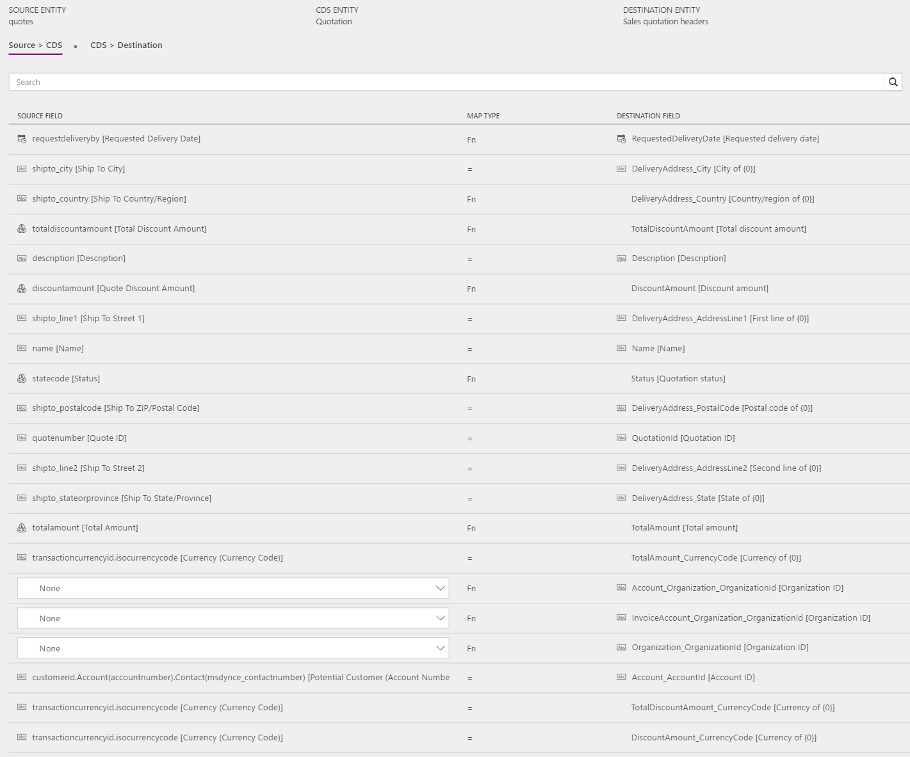
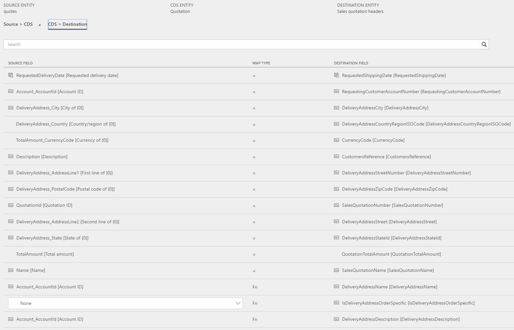
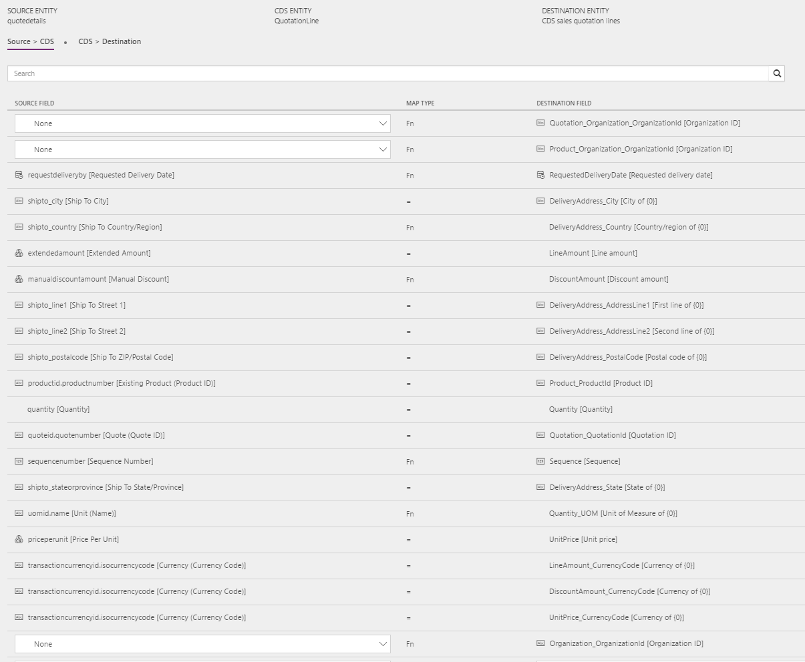
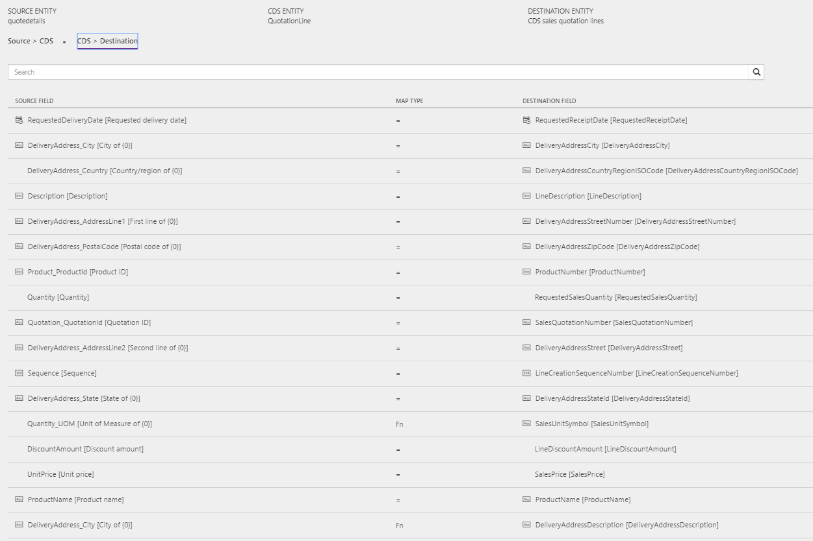

---
# required metadata

title: Synchronize sales quotation headers and lines from Sales to Finance and Operations
description: The topic discusses the templates and underlying tasks that are used to synchronize sales quotation headers and lines from Microsoft Dynamics 365 for Sales to Microsoft Dynamics 365 for Finance and Operations, Enterprise edition. 
author: ChristianRytt
manager: AnnBe
ms.date: 08/28/2017
ms.topic: article
ms.prod: 
ms.service: dynamics-ax-applications
ms.technology: 

# optional metadata

ms.search.form: 
# ROBOTS: 
audience: Application User, IT Pro
# ms.devlang: 
ms.reviewer: yuyus
ms.search.scope: Core, Operations
# ms.tgt_pltfrm: 
ms.custom: 
ms.assetid: 
ms.search.region: global
ms.search.industry: 
ms.author: crytt
ms.dyn365.ops.version: July 2017 update 
ms.search.validFrom: 2017-07-8

---

# Synchronize sales quotation headers and lines from Sales to Finance and Operations

[!include[banner](../includes/banner.md)]

> [!NOTE]
> Before you can use the Prospect to cash solution, be familiar with [Dynamics 365 Data Integration](/common-data-service/entity-reference/dynamics-365-integration). 

The topic discusses the templates and underlying tasks that are used to synchronize sales quotation headers and lines from Microsoft Dynamics 365 for Sales (Sales) to Microsoft Dynamics 365 for Finance and Operations, Enterprise edition (Finance and Operations). 

## Template and tasks

The following templates and underlying tasks are used to synchronize sales quotation headers and lines from Sales to Finance and Operations:

- **Name of the template:** Sales Quotes (Sales to Fin and Ops)
- **Names of the tasks in the project:**

    - QuoteHeader
    - QuoteLine

The following synchronization tasks are required before synchronization of sales quotation headers and lines can occur:

- Products (Fin and Ops to Sales)
- Accounts (Sales to Fin and Ops) (if used)
- Contacts to Customers (Sales to Fin and Ops) (if used)

## Entity set

| Sales        | CDS           | Finance and Operations    |
|--------------|---------------|---------------------------|
| Quotes       | Quotation     | Sales quotation headers   |
| QuoteDetails | QuotationLine | CDS sales quotation lines |

## Entity flow

Sales quotations are created in Sales and synchronized to Finance and Operations.

Sales quotations from Sales are synchronized only if the following conditions are met:

- All products on the sales quotation lines are externally maintained.
- The sales quotation is active or activated.

## Prospect to cash solution for Sales

The **Has Externally Maintained Products Only** field has been added to the Quote entity to consistently track whether the sales quotation consists entirely of externally maintained products. If a sales quotation has only externally maintained products, the products are maintained in Finance and Operations. This behavior helps guarantee that you don't try to synchronize sales quotation lines with products that are unknown to Finance and Operations.

All products and lines on the quotation are updated with the **Has Externally Maintained Products Only** information from the quotation header. This information can be found in the **Quote Has Externally Maintained Products Only** field on the Quote line entity.

The **Discount**, **Charges**, and **Tax** fields are controlled by a complex setup in Finance and Operations. This setup doesn't currently support integration mapping. In the current design, the **Price**, **Discount**, **Charge**, and **Tax** fields are mastered and handled by Finance and Operations.

In Sales, the solution makes the following fields read-only, because the values aren't synchronized to Finance and Operations:

- **Read-only fields on the sales quotation header:** Discount %, Discount, Freight Amount
- **Read-only fields on sales quotation lines:** Tax

## Preconditions and mapping setup

Before synchronizing sales orders, it is important to update the systems with the following setting:

### Setup in Sales

- Go to **Settings** &gt; **Administration** &gt; **System settings** &gt; **Sales**, and make sure that the **Discount calculation method** field is set to **Per unit**. This setting helps guarantee that the line item discount from Sales matches the setting in Finance and Operations. Otherwise, the discount won't be correct in Finance and Operations, because Finance and Operations will read the discount as a per-unit discount even if it was a per-line discount in Sales.

### Setup in Finance and Operations

- Go to **Accounts receivable** &gt; **Setup** &gt; **Account receivable parameters**. On the **Number sequence** tab, select the number sequence for sales quotations, and then click **View details**. Then, under **General Setup**, set the **Manual** field to **Yes**.
- Go to **Accounts receivable** &gt; **Setup** &gt; **Accounts receivable parameters**. Then, on the **Shipments** tab, set the **Delivery date control** field to **None**. This setting helps prevent synchronization from failing for sales quotations.

### Setup in the Data integration project

#### QuoteHeader

- The **Requested delivery date** field is required in Finance and Operations, and synchronization will fail if the field is left blank. To prevent this issue, if the field is blank, a default date is taken from **Source &gt; CDS**. The date should be updated to a preferred value. Currently, you can't enter a value such as **Today** to represent today's date. You must enter a specific date. The default template value for **Requested delivery date** is **1/1/2020**.
- The **Address Country region code** field is required in Finance and Operations. To help prevent synchronization errors, you can specify a default value that is used if the field is left blank in Sales. This default value is also useful, because you don't have to manually enter a value in the **Country region** field for local addresses. There is no default template value for **DeliveryAddressCountryRegionISOCode**.
- Update the mapping for **CDS Organization ID** in **Source &gt; CDS** so that it matches **CDS organization** in the Organization entity:

    - The default template value for **Organization_OrganizationId** is **ORG001**.
    - The default template value for **Account_Organization_OrganizationId** is **ORG001**.
    - The default template value for **InvoiceAccount_OrganizationId** is **ORG001**.

#### QuoteLine

- Update the mapping for **CDS Organization ID** in **Source &gt; CDS** so that it matches **CDS organization** in the Organization entity:

    - The default template value for **Organization_OrganizationId** is **ORG001**.
    - The default template value for **Product_Organization_Organization_OrganizationId** is **ORG001**.
    - The default template value for **Quotation_Organization_Organization_OrganizationId** is **ORG001**.

- The **Requested delivery date** field is required in Finance and Operations, and synchronization will fail if the field is left blank. To prevent this issue, if the field is blank, a default date is taken from **Source &gt; CDS**. The date should be updated to a preferred value. Currently, you can't enter a value such as **Today** to represent today's date. You must enter a specific date. The default template value for **Requested delivery date** is **1/1/2020**.
- You can add the following mappings from **CDS &gt; Destination** to help guarantee that quotation lines are imported into Finance and Operations if there is no default information from either the customer or the product:

    - **SiteId** – A site is required in order to generate quotations and sales order lines in Finance and Operations. There is no default template value for **SiteId**.
    - **WarehouseId** – A warehouse is required in order to process quotations and sales order lines in Finance and Operations. There is no default template value for **WarehouseId**.

- Make sure that the required value map for the selling unit of measure (UOM) in Finance and Operations exists in the **CDS &gt; Destination** mapping for **Quantity_UOM** to **SALESUNITSYMBOL**.

## Template mapping in data integrator

> [!NOTE]
> - The **Discount**, **Charges**, and **Tax** fields are controlled by a complex setup in Finance and Operations. This setup doesn't currently support integration mapping. In the current design, the **Price**, **Discount**, **Charge**, and **Tax** fields are handled by Finance and Operations.
> - The **Payment terms**, **Freight terms**, **Delivery terms**, **Shipping method**, and **Delivery mode** fields aren't part of the default mappings. To map these fields, you must set up a value mapping that is specific to the data in the organizations that the entity is synchronized between.

The following illustrations show an example of a template mapping in data integrator.

### QuoteHeader

### QuoteLine

## Related topics

[Synchronize products from Finance and Operations to products in Sales](products-template-mapping.md)

[Synchronize accounts from Sales to customers in Finance and Operations](accounts-template-mapping.md)

[Synchronize contacts from Sales to contacts or customers in Finance and Operations](contacts-template-mapping.md)

