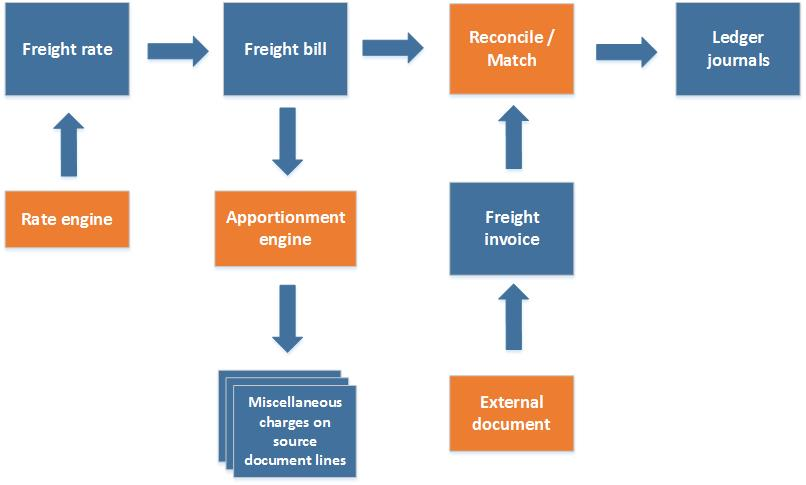
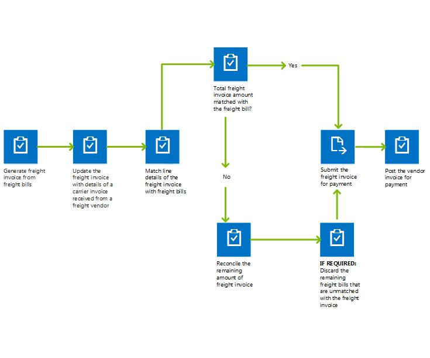

---
# required metadata

title: Reconcile freight in transportation management
description: This article describes the freight reconciliation process.
author: MarkusFogelberg
manager: AnnBe
ms.date: 06/20/2017
ms.topic: article
ms.prod: 
ms.service: dynamics-ax-applications
ms.technology: 

# optional metadata

ms.search.form: TMSAuditMaster, TMSFreightBillInvoiceReconcile, TMSFreightBillSummary, TMSFreightBillType, TMSFreightMatchReason, TMSInvoiceTable
# ROBOTS: 
audience: Application User
# ms.devlang: 
ms.reviewer: bis
ms.search.scope: Core, Operations
# ms.tgt_pltfrm: 
ms.custom: 89983
ms.assetid: bc34a9b1-0c11-4797-b463-25409cf98ca8
ms.search.region: Global
ms.search.industry: Distribution
ms.author: mafoge
ms.search.validFrom: 2016-02-28
ms.dyn365.ops.version: AX 7.0.0

---

# Reconcile freight in transportation management

[!include [banner](../includes/banner.md)]

This article describes the freight reconciliation process.

Freight reconciliation can be done manually, or it can be set up to occur automatically. To use automatic freight reconciliation, you must set up an audit master where you can define criteria that determine which freight bills are matched automatically.

## The freight reconciliation process
Freight rates are calculated by the rate engine that is associated with the relevant shipping carrier. When a load is confirmed, a freight bill is generated, and the freight rates are transferred to it. The freight rates are apportioned as miscellaneous charges to the relevant source document (purchase order, sales order, and/or transfer order), depending on the setup that is used for the regular billing process. The freight reconciliation process (which is also known as the matching process) can start as soon as the freight invoice arrives from the shipping carrier. The invoice can be received electronically or on paper. If the invoice is received on paper, you can generate an electronic invoice by using the freight bill as a template. 

## Manual reconciliation
If you're reconciling freight manually, you must match each invoice line with the freight bill line or lines for the load that is being invoiced. You do this matching on the **Freight bill and invoice matching** page. If the amount on the invoice line doesn’t match the freight bill amount, you must select a reconciliation reason for the difference. If there are multiple reasons for reconciliation, you can split the unmatched amount across them. The reconciliation reason determines how the difference amounts are posted in the general ledger. When the reconciliation of the whole invoice amount is accounted for, it's submitted for approval, and then the journal is posted. The following illustration shows how to generate a freight invoice and do freight reconciliation in Microsoft Dynamics 365 for Finance and Operations. 

## Automatic reconciliation
To use automatic reconciliation, you must specify the schedule for reconciliation, and the invoices and shipping carriers to use. The matching of the invoice lines and freight bills is done according to the setup of the audit master and freight bill type. After you run the automatic reconciliation, you must handle any invoices that the system can't match. You must then process these invoices manually before you can post all the invoices for payment.

