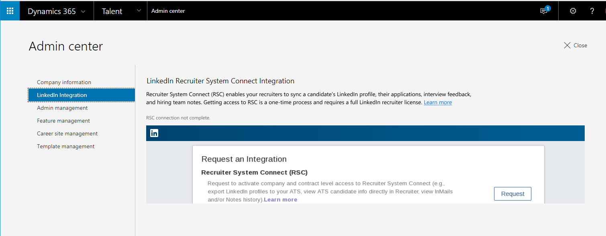
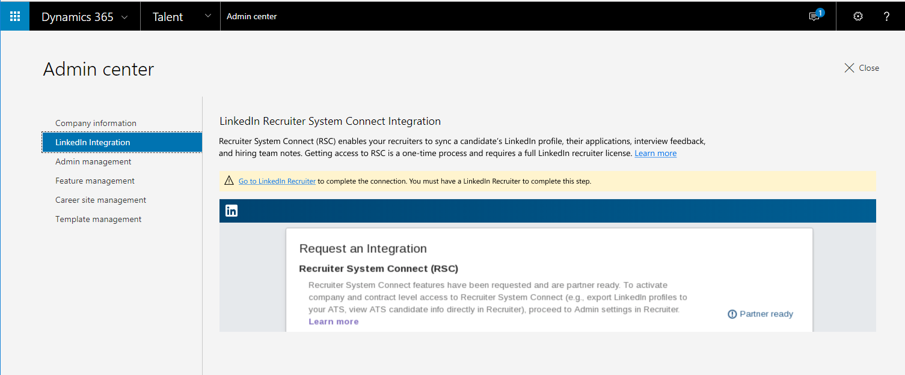
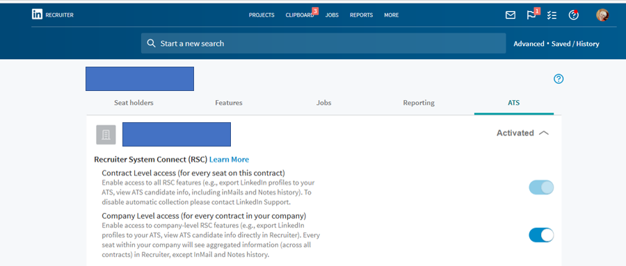

---
# required metadata

title: Sourcing with LinkedIn Recruiter
description: This topic provides information about using machine learning to get job and job candidate recommendations.
author: 
manager: AnnBe
ms.date: 10/15/2018
ms.topic: article
ms.prod: 
ms.service: dynamics-365-talent
ms.technology: 

# optional metadata

ms.search.form: 
# ROBOTS: 
audience: Application User
# ms.devlang: 
ms.reviewer: josaw
ms.search.scope: Talent, Core
# ms.tgt_pltfrm: 
ms.custom: 7521
ms.assetid: 3b953d5f-6325-4c9e-8b9b-6ab0458a73f8
ms.search.region: Global
Attract Admin view to start LinkedIn Recruiter integration# ms.search.industry: 
ms.author: rschloma
ms.search.validFrom: 2018-10-15
ms.dyn365.ops.version: Talent October 2018 update

---

# Sourcing with LinkedIn Recruiter
[!include[banner](../includes/banner.md)]

LinkedIn is the world’s largest talent database and often the primary system that recruiters use to find, communicate with, and source candidates for the jobs that recruiters are looking to fill. LinkedIn Recruiter integration with Dynamics 365 for
Talent: Attract makes it easier for users to hire, and to keep the data in sync between the two systems.

> [!NOTE]
> You need the Comprehensive hiring add-on and LinkedIn Recruiter seats to be able to use LinkedIn Recruiter integration with Attract.

## Set up LinkedIn Recruiter with Attract 

Before you can use the LinkedIn Recruiter capabilities, you must configure contract-level or company-level access with your Attract instance. To complete the configuration process, you must work with the user who is an Admin on your LinkedIn Recruiter contract. Complete the following steps to configure LinkedIn Recruiter with Attract.

1.  Log in to Attract as an Admin and navigate to **Admin Settings**.

2.  On the left pane, click the **LinkedIn Integration** tab.

3.  Click **Connect** to start the setup. You will be taken through a LinkedIn Sign-in process.

4.  If you have seats on multiple LinkedIn contracts, select the contract that you would like to connect to the Attract system. If you have a seat on only one LinkedIn contract, this step will not be needed.

5.  The LinkedIn widget will now load in your Admin settings with the list of integrations shown. Under **Recruiter System connect**, click **Request**.

6.  After the integration is requested from Attract, it will show as **Partner ready** and is ready to be turned on from **Recruiter Admin settings**. If you see **Notify partner** on this page, wait a few seconds, click **Notify partner**, and then refresh the page. It should now show as **Partner ready**.

To complete the next step, you need to have an Admin privilege on your LinkedIn Recruiter Contract as well.

7.  Log in to LinkedIn using the Admin account and navigate to LinkedIn Recruiter on top right. 

8. In the **More** menu at the top of the screen, click **Admin Settings** and then click the **ATS** Tab.

You will see your Attract system listed there showing a couple of options which can be turned on.

9. If you want to enable only 1-Click export for the **In-ATS indicator** and the **In-ATS Profile Widget**, select **Company-level access**. If you want to enable all of Company-level access features plus InMail history, Notes history, and the InMail stub profile access, select **Contract-level access**.

10. Turn on the desired access level from your LinkedIn Recruiter **Admin-ATS** settings.

12. Navigate back to Attract Admin Settings as an AttractAdmin and select the **LinkedIn integration** tab. You should now see the LinkedIn widget load showing **Enabled** with the selected access level turned on.

## Using LinkedIn Recruiter capabilities

After LinkedIn Recruiter capabilities has been enabled by the Attract Admin is now available for hiring managers and recruiters to access. To use these capabilities, connect your LinkedIn account under **User Settings**. There are several capabilities available after both the Admin and User settings have been connected.

### In-ATS profile widget

You can view the candidate’s LinkedIn profile in Attract. The LinkedIn widget will display the candidate profile when the ATS information matches the LinkedIn information of its users.

To view a profile, go the candidate profile either from a job or talent pool. In the candidate profile, select the **LinkedIn** tab and the profile widget will load. Using the profile widget, indicate if this is the right match. If it is not, find the correct person. You can also save the candidate to your LinkedIn Recruiter projects from this page.

### 1-click export 

While sourcing candidates in LinkedIn, you can 1-click export the candidate to
the jobs that you currently have open. Complete the following steps for a 1-click export. Before you complete these steps, verify that you are a assigned the role of Hiring manager or Recruiter for the job and that the job has a **Prospect** stage.

1.  Create the job, assign the appropriate roles, and activate the job.

2.  When the job is activated, navigate to LinkedIn Recruiter.

3.  Find the candidate that you are looking for and go to their profile.

4.  Using the job search box in the contact card, find the job using the title or the Job ID that was activated in Attract. If you don’t find the job, click **Change ATS** to find the right Attract instance.

5. When the right job is selected, click **Export**. The candidate is now fetched by Attract.

6.  Go to Attract and open the respective job. You will find the candidate you just exported in the **Prospect** stage of the job.

### In-ATS indicator 

Using LinkedIn recruiter, you can track whether a candidate has applied to other jobs in your organization, look at where they are in different stages of job applications, and view the feedback and comments from Attract in LinkedIn Recruiter.

1.  Open LinkedIn Recruiter and locate the candidate profile that you are looking for.

2.  Scroll down to view the **In-ATS** section on the candidate’s profile.

3.  You can use this widget to view all of the information about the candidate that’s present in Attract from within the LinkedIn Recruiter view itself.

4.  Select the **Jobs & Statuses** tab to see jobs they are part of, the latest status, and how they have been moving against each job.

5.  Select the **Interview Feedback** tab to see feedback that the interviewers have submitted in Attract.

6.  Select the **Notes** tab to see notes that have been captured for this applicant in Attract.

### InMail history

The LinkedIn InMail history is available with contract-level access with LinkedIn Recruiter. When it is enabled, you can view your entire InMail history with the candidate. You can also see who else from your organization has exchanged InMail with the candidate, 
however you can't see the messages between them.

To view InMail history, go to a candidate’s profile, navigate to the LinkedIn
tab and scroll to the bottom of the page to view the history. You can view the
InMail history only if the candidate has responded to your request and chosen to
share their profile with you in LinkedIn. The messages from InMail sync with
Attract every couple of hours.

### Notes history 

The LinkedIn notes history is available with contract-level access with LinkedIn Recruiter. When it is enabled, you can view the notes that have been captured about the candidate by different recruiters in LinkedIn from your organization.

To view Notes history, go to a candidate’s profile, navigate to the LinkedIn tab
and scroll to the bottom of the page to view the history. You can view all the
notes about the candidate from LinkedIn Recruiter.

### InMail stub profile

The InMail stub profile is available with contract-level access with LinkedIn Recruiter. As candidates agree to share their LinkedIn profiles with any user in your organization, you can track the candidates in Attract and a new candidate record is created each candidate.

To view the list of candidates, go to **Talent pools** and there will be a system-created LinkedIn talent pool. This talent pool contains the list candidates and their stub profiles as received from LinkedIn which will have their first name and last name. The candidate’s email ID will be displayed if the candidate had chosen to share their email address.
