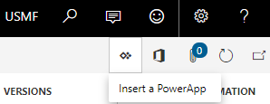
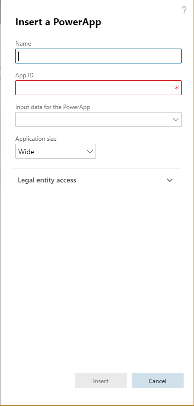

---
# required metadata

title: How to embed PowerApps in Core HR
description: The PowerApps menu item disappeared from the System administration module.
author: Darinkramer
manager: AnnBe
ms.date: 11/02/2018
ms.topic: article
ms.prod: 
ms.service: dynamics-365-talent
ms.technology: 

# optional metadata

# ms.search.form: 
# ROBOTS: 
audience: Application User
# ms.devlang: 
ms.reviewer: josaw
ms.search.scope: Talent
# ms.tgt_pltfrm: 
ms.custom: 
ms.assetid: 
ms.search.region: Global
# ms.search.industry: 
ms.author: dkrame
ms.search.validFrom: 2018-11-02
ms.dyn365.ops.version: Talent

---

# How to embed PowerApps in Core HR

[!include [banner](includes/banner.md)]

**Issue:**

The PowerApps menu item disappeared from the System administration module.

**Cause:**

Design changed to include PowerApps in standard personalization model.

**Resolution:**

PowerApps embedding has been modified. Power apps are now added through the
personalization model and can added to almost all forms with Dynamics 365 for
Talent.

You can learn how to embed PowerApps with Talent by reading [Embed PowerApps apps](https://docs.microsoft.com/en-us/dynamics365/unified-operations/fin-and-ops/get-started/embed-power-apps).

Any PowerApps customer has embedded before the change should've been upgraded to
the new model.

From almost any page within Talent, locate the PowerApps button in the upper
right corner of the page. This button will give you access to insert a power
app.

Example:

Personnel management \> Links \> Workers \> Employees

You can also navigate to the personalization options on the form by going to:
OPTIONS \> PERSONALIZE \> Personalize this form.

The personalization toolbar will open, and you can now select to Insert a power
app directly from this menu.

