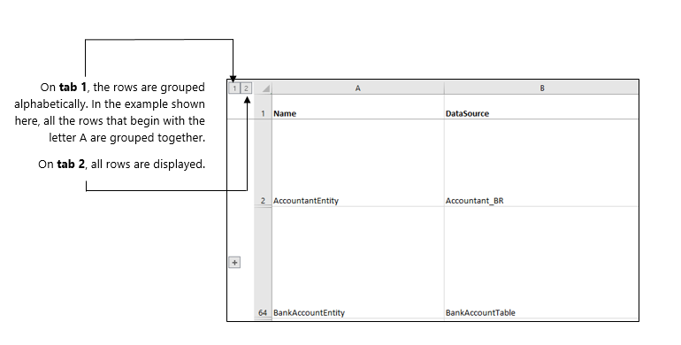

---
# required metadata

title: Aggregate measurements report
description: This topic points you to a report that lists the aggregate measurements that are available in Dynamics AX.
author: annbe
manager: AnnBe
ms.date: 2016-10-11 15 - 41 - 09
ms.topic: article
ms.prod: 
ms.service: Dynamics365Operations
ms.technology: 

# optional metadata

# ms.search.form: 
# ROBOTS: 
audience: Developer, IT Pro
# ms.devlang: 
# ms.reviewer: 71
ms.search.scope: Operations, Platform, AX Platform
# ms.tgt_pltfrm: 
ms.custom: 203544
ms.assetid: a9333dad-439a-41ea-8324-db963d562f46
ms.search.region: Global
# ms.search.industry: 
ms.author: annbe
ms.dyn365.intro: May-16
ms.dyn365.version: Platform update 1

---

# Aggregate measurements report

This topic points you to a report that lists the aggregate measurements that are available in Dynamics AX.

Aggregate measurements can be used to define data entities, called *aggregate data entities,* which can be directly bound to Dynamics AX forms as a data source. Aggregate data entities can also be used to expose data to Power BI and access data programmatically using the AXQuery object. To learn more about aggregate measurements and aggregate data entities, see [In-memory, real-time aggregate models replace SSAS cubes](in-memory-real-time-aggregate-models.md).

## To view the report
The [Aggregate measurements report](https://mbs.microsoft.com/customersource/northamerica/AX/downloads/reports/axtechrefrep)lists each aggregate measurement that is available, along with the measure group, measures, and dimensions associated with the measurement.

## How the report is grouped
The report is a Microsoft Excel file. For large reports, the rows are grouped alphabetically on tab 1. All rows are displayed when you click tab 2. 

