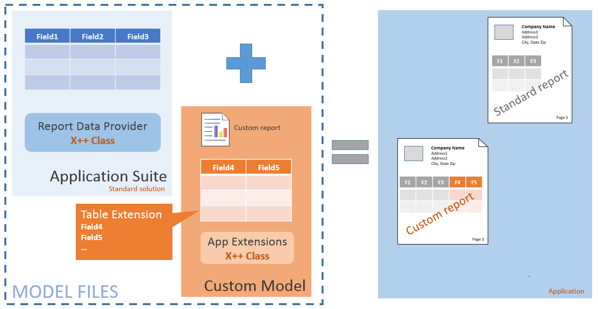
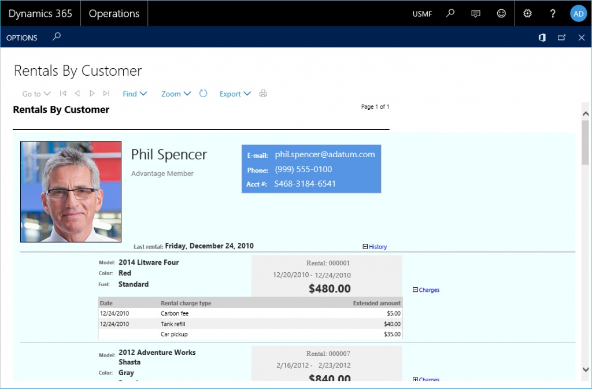
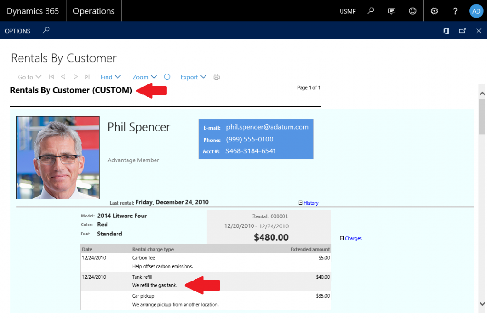
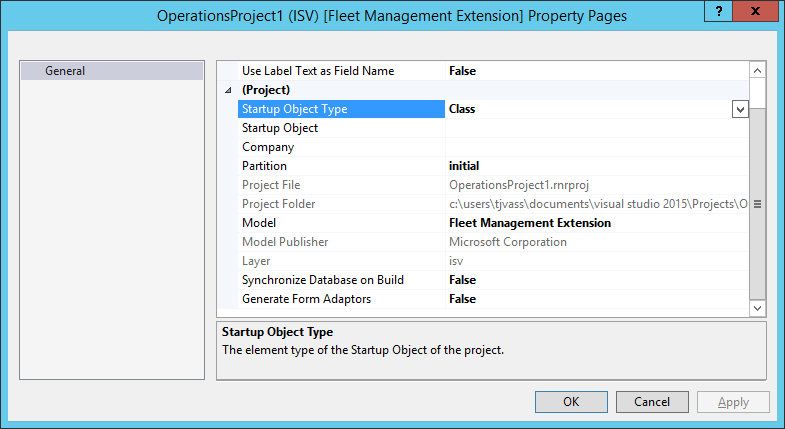
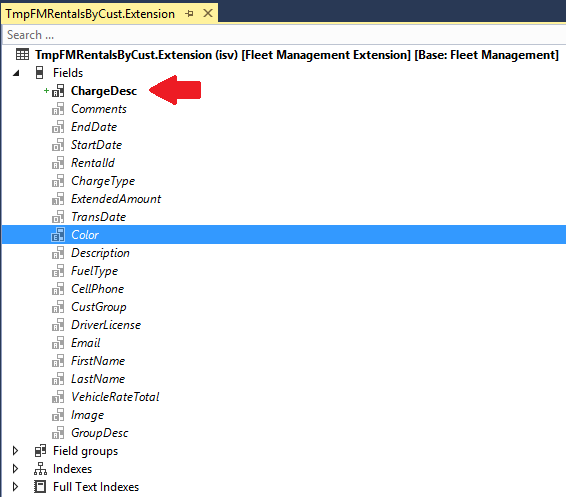
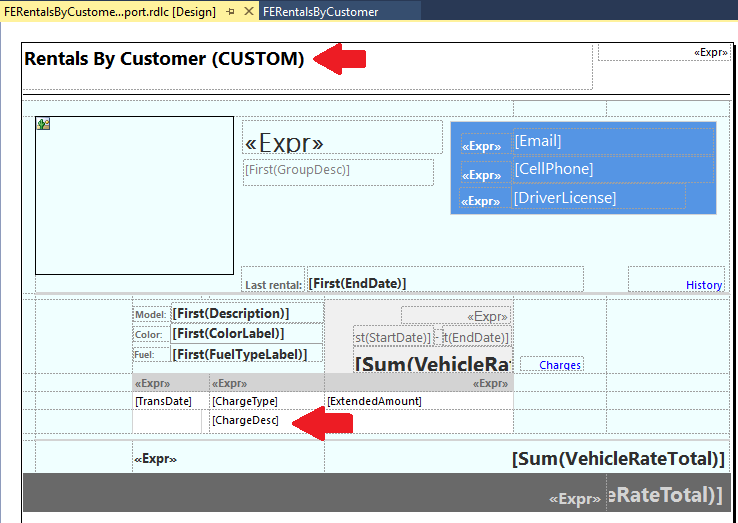

---
# required metadata

title: Expand Application Suite report data sets
description: This topic shows how to expand an existing report data set that is produced by using X++ business logic in a report data provider (RDP) class. 
author: sericks007
manager: AnnBe
ms.date: 2017-01-09 20 - 01 - 10
ms.topic: article
ms.prod: 
ms.service: Dynamics365Operations
ms.technology: 

# optional metadata

# ms.search.form: 
# ROBOTS: 
audience: Developer
# ms.devlang: 
# ms.reviewer: 2051
ms.search.scope: Operations, Platform
# ms.tgt_pltfrm: 
ms.custom: 266594
ms.assetid: 7810ee2c-e012-4a0f-992c-840e626bf437
ms.search.region: Global
# ms.search.industry: 
ms.author: tjvass
ms.search.validFrom: 2016-11-30
ms.dyn365.ops.version: Platform update 3

---

# Expand Application Suite report data sets

This topic shows how to expand an existing report data set that is produced by using X++ business logic in a report data provider (RDP) class. 

Microsoft Dynamics 365 for Operations offers an expanded set of tools to support custom solutions. This topic focuses on the expansion of an existing report data set that is produced by using X++ business logic in a report data provider (RDP) class. You use custom delegate handlers and table extensions to include additional field data and/or calculations. You don't have to over-layer the Application Suite. You then create custom designs that replace the standard application solutions and present the data to users. The following illustration shows a typical application customization, as described in this topic.  

## What's important to know?
There are a few basic assumptions that you should be aware of before you apply this solution.

-   **You can't directly extend RDP classes.** However, the platform provides extension points that enable data set expansion without duplicating business logic in the standard application.
-   **There are two methods that can be used to expand report data sets.** Use the strategy that is appropriate for your solution:
    -   **Data processing post-handler** – This method is called only one time, after the **ProcessReport** method is completed and before the data set is returned to the report server. Register for this post-handler to perform bulk updates on the temporary data set that is produced by the standard application solution.
    -   **Temp table inserting event** – This method is called for each row that is added to the temporary table. It's more suitable for calculations and inline evaluations. Try to avoid expensive queries that have many joins and look-up operations.
-   **Use event handlers to redirect menu items to your new report design.** You can customize all aspects of an application reporting solution by using event handlers. Add a **PostHandler** event for the controller class to reroute user navigations to a custom report design.

## Expand a report data set
The following walkthrough shows the process of expanding an existing application data set by using a "pure" extension-based solution. The solution includes a custom **Rentals list** report for the Fleet Management application. The new report includes additional rental charge data in the rental details. The application customizations are defined in an extension model. The following illustrations show the standard design and the custom solution.

### Before (standard design)

### After (custom solution)

1.  **Create a new model for your application customizations.** For more information about extension models, see [Customization: Overlayering and extensions](..\dev-tools\..\dev-tools\customization-overlayering-extensions.md). For this example, add a custom report to the **Fleet Management Extensions** model.
2.  **Create a new project in Microsoft Visual Studio.** Make sure that the project is associated with your extension model. The following illustration shows the project settings. 
3.  **Add a table extension to store the custom report data.** Find the temporary cache for the **TmpFMRentalsByCust** data set that is populated by the RDP class, and create an extension in your model. Define the fields that will be used to store the data for the report server, and then click **Save** to save your changes. The following illustration shows the table extension that is required for this example. 
4.  **Add your custom report to the project.** The custom design closely resembles the standard solution. Therefore, you can just duplicate the existing application report in the **Fleet Management Extension** model, and then update the report design so that it includes the custom title and additional text box in the Rental Charges container.
5.  **Rename the report so that it has a meaningful name.** For this example, rename the custom report **FERentalsByCustomer** to distinguish it from the standard solution.
6.  **Restore the report data set references.** Open the report designer, expand the **Datasets** collection, right-click the data set that is named **FMRentalsByCustDS**, and then click **Restore**. The data set is expanded so that it includes the newly introduced columns. Therefore, these columns are now available in the report designer.
7.  **Customize the report design.** The designer offers a free-form design surface that you can use to create the custom solution. The following illustration shows the custom design that is used for this example. 
8.  **Add a new report handler (X++) class to the project.** Give the class a name that appropriately describes that it's a handler for an existing application report. For this example, rename the class **FERentalsByCustomerHandler** to distinguish it from other report handlers.
9.  **Add a PostHandler method to begin to use your custom report.** In this example, extend the controller class in the standard solution, **FMRentalsByCustController**, by using the following code.

        class FERentalsByCustomerHandler
        {
            [PostHandlerFor(classStr(FMRentalsByCustController), staticMethodStr(FMRentalsByCustController, construct))]
            public static void ReportNamePostHandler(XppPrePostArgs arguments)
            {
                FMRentalsByCustController controller = arguments.getReturnValue();
                controller.parmReportName(ssrsreportstr(FERentalsByCustomer, Report));
            }
        }

    User navigations in the application will now be rerouted to the custom reporting solution. Take some time to deploy the custom report to the report server and verify that the application is using it. At this point, you just have to add the business logic that is used to populate the custom fields that you introduced in step 3. In the next step, you must select the method of data set expansion that is appropriate for your solution.

10. **Add X++ business logic to populate the custom field data.** Select the data processing technique that makes sense for the type of transformation that you require for the solution.
    -   **Option 1: Add a data processing post-handler.** Apply this technique for bulk insert operations that use a single pass over the result set of the standard solution. Here is the code that expands the data set by using a table lookup.

            class FERentalsByCustomerHandler
            {
                [PostHandlerFor(classStr(FMRentalsByCustDP), methodstr(FMRentalsByCustDP, getTmpFMRentalsByCust))]
                public static void TmpTablePostHandler(XppPrePostArgs arguments)
                {
                    TmpFMRentalsByCust tmpTable = arguments.getReturnValue();
                    FMRentalCharge chargeTable;
                    ttsbegin;
                        while select forUpdate tmpTable
                        {
                            select * from chargeTable where chargeTable.RentalId == tmpTable.RentalId;
                            tmpTable.ChargeDesc = chargeTable.Description;
                            tmpTable.update();
                        }
                    ttscommit;
                }
            }

    -   **Option 2: Add a temp table Inserting event.** Apply this technique for row-by-row calculations. Here is the code that expands the data set by using a table lookup.

            class FERentalsByCustomerHandler
            {
                [DataEventHandlerAttribute(tableStr(TmpFMRentalsByCust), DataEventType::Inserting)]
                public static void TmpFMRentalsByCustInsertEvent(Common c, DataEventArgs e)
                {
                    TmpFMRentalsByCust tempTable = c;
                    FMRentalCharge chargeTable;
                    // update the value of the 'ChargeDesc' column during 'insert' operation
                    select * from chargeTable where chargeTable.RentalId == tempTable.RentalId
                    && chargeTable.ChargeType == tempTable.ChargeType;
                    tempTable.ChargeDesc = chargeTable.Description;
                }
            }

You’ve now finished expanding the report data set. After the application is compiled, it will begin to reroute user navigations to the new report design by using the custom X++ business logic that you defined in the report class handler that is defined in the extension model.

