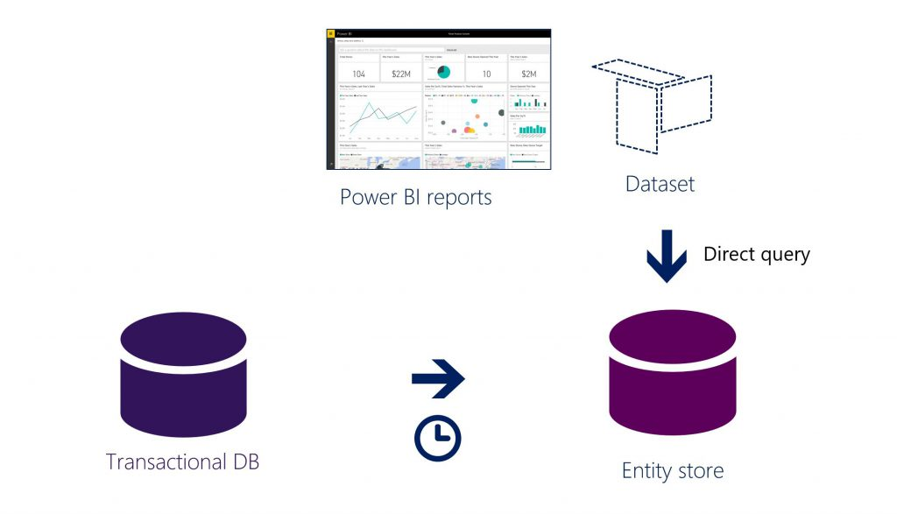
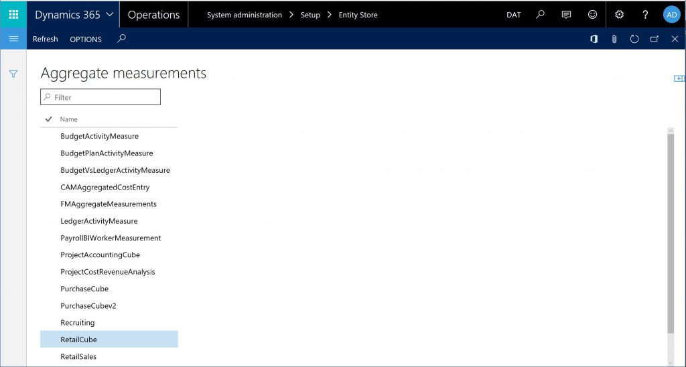
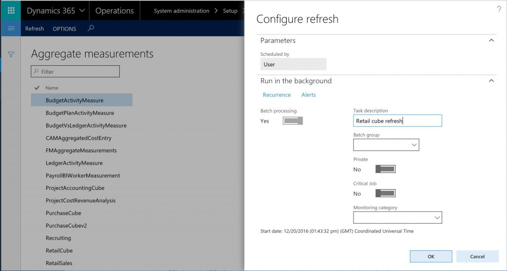

---
# required metadata

title: Overview of Power BI integration with Entity store
description: Entity store is an operational data store that is included with Microsoft Dynamics 365 for Operations. This topic describes how Entity store enables Power BI integration with Dynamics 365 for Operations.
author: sericks007
manager: AnnBe
ms.date: 2017-01-05 18 - 43 - 42
ms.topic: article
ms.prod: 
ms.service: Dynamics365Operations
ms.technology: 

# optional metadata

# ms.search.form: 
# ROBOTS: 
audience: IT Pro
# ms.devlang: 
# ms.reviewer: 71
ms.search.scope: Operations, Platform, AX Platform
# ms.tgt_pltfrm: 
ms.custom: 265974
ms.assetid: 434b5d9f-9877-4769-ad96-d4e8d460a7fa
ms.search.region: Global
# ms.search.industry: 
ms.author: milindav
ms.search.validFrom: 2016-05-31
ms.dyn365.ops.version: Platform update 1

---

# Overview of Power BI integration with Entity store

Entity store is an operational data store that is included with Microsoft Dynamics 365 for Operations. This topic describes how Entity store enables Power BI integration with Dynamics 365 for Operations.

Entity store is an operational data store that is included with Microsoft Dynamics 365 for Operations. The Entity store feature was introduced in the Microsoft Dynamics AX platform update 1 (May 2016) release. This feature lets an administrator or power user stage aggregate measurements in a dedicated data store for reporting and analytics. (Aggregate measurements are a star schema that is modeled by using entities.) We call this data store Entity store. It’s a database that is optimized for reporting purposes. Entity store uses the in-memory, clustered columnstore index (CCI) functionality that is built into Microsoft SQL Server to optimize reporting and queries. Customers can use Microsoft Power BI DirectQuery models together with Entity store to enable high-volume, near-real-time analytical reporting over large volumes of data.

## Power BI DirectQuery mode
In the February 2016 release of Microsoft Dynamics AX, you could create Power BI reports by using OData endpoints that are exposed via data entities (both aggregate data entities and detailed or regular data entities). Although this approach is still supported in Dynamics 365 for Operations, Entity store also lets power users create Power BI DirectQuery reports.  As the preceding illustration shows, DirectQuery is a reporting mode that runs reports directly on Entity store. In this reporting mode, data isn't staged in Power BI caches. This mode provides two immediate benefits:

-   You can create Power BI reports over large data volumes.
-   Reports don't have to be updated by using Power BI. When Entity store is updated, reports reflect the latest data.

Additionally, data doesn't leave your Dynamics 365 for Operations environment, because no data is cached in the Power BI service.

## Stage aggregate measurements in Entity store
Aggregate measurements are a star schema that is modeled for analytical scenarios. In the February 2016 release, we enabled real-time, in-memory aggregate measurements. By using real-time aggregate measurements, you can enable embedded charts and key performance indicators (KPIs) that react to real-time operations on data. For information, see [In-memory, real-time aggregate models replace SSAS cubes](..\migration-upgrade\in-memory-real-time-aggregate-models.md). Real-time aggregate measurements take advantage of the in-memory, non-clustered columnstore index (NCCI) technology. Visuals and aggregate calculations that are built over real-time aggregate measurements reflect transactions within seconds. In the platform update 1 (May 2016) release, we enabled aggregate measurements that can be staged in Entity store. Aggregate measurements that are staged in Entity store can be used for near-real-time analytical scenarios where large volumes of data must be explored by using Power BI. As a developer, you learned how to model an aggregate measurement for real-time analytics in [Modeling and using aggregate data](model-aggregate-data.md). In the platform update 1 (May 2016) release, we also added the capability to model aggregate measurements that can be staged in Entity store. In Microsoft Visual Studio, you can specify **StagedEntityStore** as the usage property of an aggregate measurement. This new property was added in May 2016. Previously, **InMemoryRealTime** was available as the usage property.  However, you might wonder why you would model an aggregate measurement so that it can be staged? Why wouldn’t you use in-memory real-time aggregate measurements all the time? There are several reasons for using the **StagedEntityStore** pattern:

-   There might be large amounts of data that must be explored and analyzed.
-   You might have Analysis projects (that is, cubes) that you migrated from Microsoft Dynamics AX 2012 R3 as part of the code upgrade process to Dynamics 365 for Operations. Because of the complex views and joins that are present in the schema, query response times might not be acceptable for embedded visuals. However, you might not want to refactor the visuals to take advantage of NCCI technology immediately.
-   Unlike the operational database schema, the schema in Entity store is modeled specifically for reporting. Therefore, it's much easier to build new reports from the schema in Entity store.
-   Your scenario might not require that analytical data be updated within seconds of an operation. Most Power BI reports that are built to enable data exploration fall into this category. If data freshness of approximately 10 minutes is acceptable for your scenario, you might want to use the staged pattern.

If one of the preceding reasons covers your situation, you should stage your aggregate measurement in Entity store and it use for Power BI integration.

## Update Entity store
In the client, you can find the **Entity Store** page at **Systems administration** &gt; **Setup** &gt; **Entity Store**.  This page includes a list of aggregate measurements. You can stage any of these aggregate measurements in Entity store. If you're a developer and are familiar with the aggregate measurements that are available in the Application Object Tree (AOT), you might wonder why some aggregate measurements aren't shown here. If you have aggregate measurements that you migrated from AX 2012 R3 (that is, SQL Server Analysis Services projects that were migrated as part of the upgrade process), they can't be deployed until a developer changes the usage property to **StagedEntityStore**. This behavior is intentional. We have enabled best practice warnings and errors that are intended to capture some of the common upgrade issues that affect aggregate measurements. You should fix best practice errors and warnings if you plan to use near-real-time (NCCI) mode. As of the May 2016 update, the administrator must schedule a periodic update by clicking **Refresh** on the **Entity Store** page. You can use the **Refresh** button for a one-time update (that is, demo) or to schedule periodic updates, as shown in the following illustration.  The batch framework is used for scheduling. Therefore, refresh jobs can be monitored, load balanced, and prioritized by using the capabilities of the batch framework. As of the May 2016 update, we support only full updates. However, we will enable incremental updates soon. Eventually, in a future update, the system will update Entity store based on actual usage patterns. Therefore, as an administrator, you will have to use the **Configure refresh** dialog box only as an exception.

