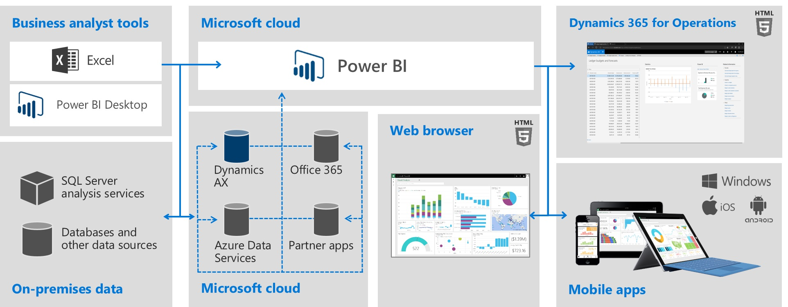
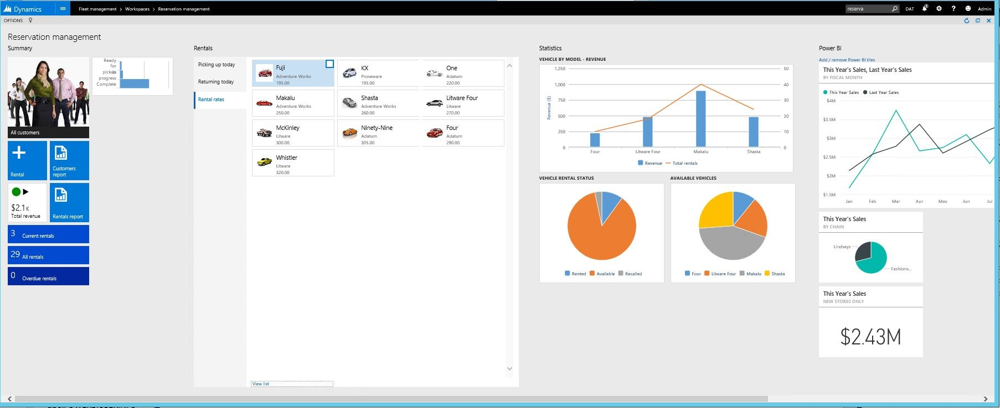

---
# required metadata

title: Power BI integration
description: This article explains how you can use the features and services that are included in Microsoft Power BI to access, explore, and gain insight from your Microsoft Dynamics 365 for Operations data. 
author: clwesene
manager: AnnBe
ms.date: 2016-02-03 15 - 10 - 34
ms.topic: article
ms.prod: 
ms.service: Dynamics365Operations
ms.technology: 

# optional metadata

ms.search.form: PowerBIConfiguration
# ROBOTS: 
audience: IT Pro
# ms.devlang: 
# ms.reviewer: 71
ms.search.scope: AX 7.0.0, Operations, Core
# ms.tgt_pltfrm: 
ms.custom: 31001
ms.assetid: bf6eff60-4a30-4338-a55f-1f2a97d3debe
ms.search.region: Global
# ms.search.industry: 
ms.author: cwesene
ms.search.validFrom: 2016-02-28
ms.dyn365.ops.version: AX 7.0.0

---

# Power BI integration

This article explains how you can use the features and services that are included in Microsoft Power BI to access, explore, and gain insight from your Microsoft Dynamics 365 for Operations data. 

Microsoft Power BI is a collection of tools and services that enables interactive visualizations and dashboards. Power BI is the tool that many users choose when they want to create interactive visualizations and self-service reports for Microsoft Dynamics 365 for Operations. Power BI can connect to multiple data sources, both on premises and in the cloud, to create combined reports and dashboards. Dynamics 365 for Operations uses Open Data Protocol (OData) V4 to provide data securely to Power BI.  Dynamics 365 for Operations integrates with Power BI by being a first-class source of data to Power BI authoring tools, such as Microsoft Excel and Power BI Desktop. After reports are authored, they can be published to PowerBI.com for collaboration and mobile access. Although dashboards and reports can be used on PowerBI.com, they can also be pinned to the Dynamics 365 for Operations client to provide interactive visuals that are related to business processes. You can see an overview of the Power BI tools [here](https://powerbi.microsoft.com/tour).

## Consuming Dynamics 365 for Operations data securely
Dynamics 365 for Operations is a first-class data source for Power BI authoring tools, such as Excel and Power BI Desktop. Users who connect to Dynamics 365 for Operations data feeds via Microsoft Power Query for Excel can access [data entities](data-entities.md) that they can use to author Power BI reports and dashboards. Dynamics 365 for Operations data entities are exposed as data feeds by using [OData](odata.md)V4. These data entities include both standard data entities and aggregate data entities that can provide summarized and calculated data in the OData feed. Dynamics 365 for Operations data feeds authenticate users and enable access, based on security permissions that are defined in Dynamics 365 for Operations. Any client tool that supports the OData protocol can consume Dynamics 365 for Operations data securely.

## Authoring content and deriving insights in Excel
Power BI reports can be developed in Excel or [Power BI Desktop](https://powerbi.microsoft.com/en-us/desktop). If you are using Microsoft Excel 2013, you must [download Power Query](http://www.microsoft.com/en-gb/download/details.aspx?id=39379). Power Query is an add-in for Excel that can source data from Dynamics 365 for Operations and many other data sources. Power Query lets you build compelling data mash-ups that provide reporting across data sources. **Microsoft SQL Server Power Pivot for Excel**, another add-in for Excel, enables data modeling for power users. Power Pivot takes advantage of an in-memory engine that is built into Excel, and that enables large amounts of data to be stored and worked with in a highly performant manner. **Power View**, another add-in for Excel, lets users build interactive visualizations in Excel by using data that is loaded and modeled by Power Query and Power Pivot. Power View reports can be used on a stand-alone basis, so that you don't have to upload reports that are for personal use to PowerBI.com. You can complete a tutorial that shows how to build a Power BI report and dashboard [here](create-powerbi-report-dashboard.md).

## Accessing interactive dashboards and collaborative capabilities on PowerBI.com
After reports are published to PowerBI.com, users can build dashboards, share with co-workers, and take advantage of the mobile tools that are available from Power BI. Additionally, after data is published to Power BI, users can take advantage of natural language search through Power BI Q&A. In addition to self-service and power user content, pre-built Dynamics 365 for Operations content packs for Power BI include dashboards and reports. These content packs are provided by Microsoft, and also by independent software vendors (ISVs) and partners. Users who are exploring data from their Dynamics 365 for Operations deployment can access the content packs directly from PowerBI.com. Users can also develop Power BI organizational content packs to share their data sets, reports, and dashboards within their organization. You can learn more about organizational content packs [here](https://powerbi.microsoft.com/en-us/documentation/powerbi-service-organizational-content-packs-introduction/). Finally, Power BI clients for iOS, Android, and Microsoft Windows mobile devices let users who are on the move access Power BI dashboards and reports.

## Embedding Power BI visuals in the Dynamics 365 for Operations client
PowerBI.com can be used on its own as a reporting and dashboard solution for your organization or business unit. However, users can also pin reports from PowerBI.com to Dynamics 365 for Operations workspaces and pages to provide contextual insights that are related to business operations. Power BI tiles that are pinned to the Dynamics 365 for Operations client provide insightful visuals at a glance. They also let users open PowerBI.com for interactive analysis.  You can learn how to configure workspace integration [here](configure-power-bi-integration.md).

