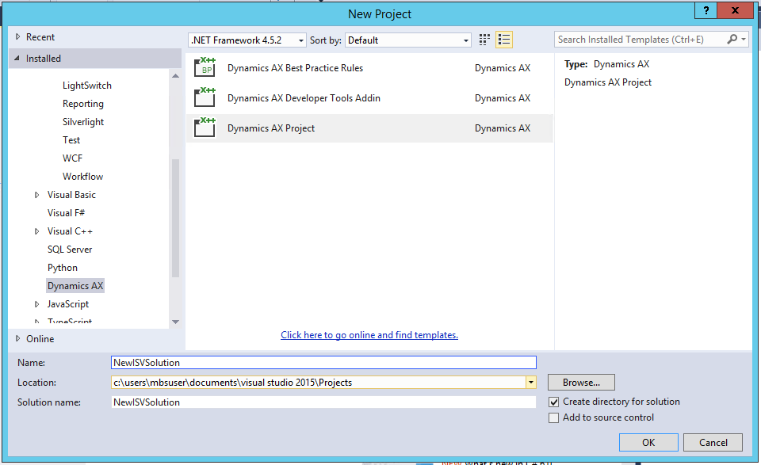
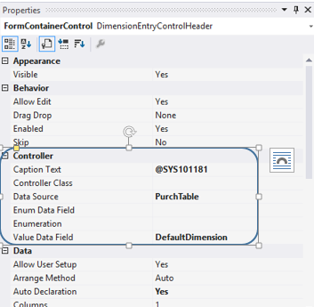
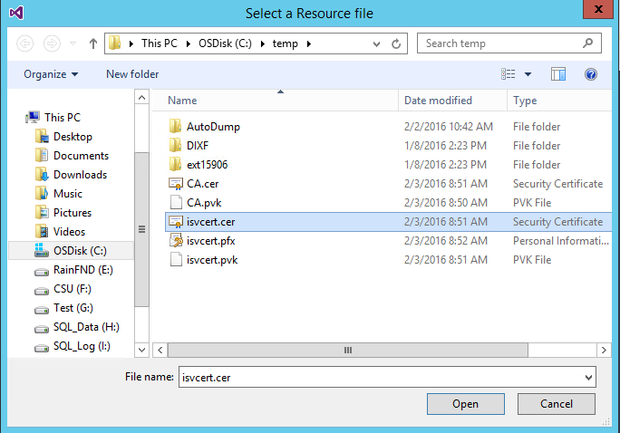

---
# required metadata

title: Dimension entry control uptake
description: Describes the Dimension Entry control and associated Controller classes.
author: annbe
manager: AnnBe
ms.date: 2015-12-12 20 - 44 - 35
ms.topic: article
ms.prod: 
ms.service: Dynamics365Operations
ms.technology: 

# optional metadata

# ms.search.form: 
# ROBOTS: 
audience: Developer
# ms.devlang: 
# ms.reviewer: 61
ms.search.scope: AX 7.0.0, Operations
# ms.tgt_pltfrm: 
ms.custom: 25551
ms.assetid: 71b7b289-a2ec-4161-b461-fb0fe260a946
ms.search.region: Global
# ms.search.industry: 
ms.author: annbe
ms.dyn365.intro: Feb-16
ms.dyn365.version: AX 7.0.0

---

# Dimension entry control uptake

Describes the Dimension Entry control and associated Controller classes.

General approach
----------------

The design goal is to encapsulate the control implementation and not require the form to interact with the classes backing the control. In alignment with this design, **all forms should interact only with the Dimension Entry control instance API and not directly with the controller classes**, like LedgerDimensionEntryController, LedgerDefaultDimensionEntryController, etc. Any property that was manipulated or any method that was called on the controller would now need to be called on the control. **Note:**

-   The upgrade script only handles Dimension Entry controls constructed with the constructInGroupWithValues() and constructInTabWithValues() methods. Other controls will need to be upgraded manually.
-   The upgrade script will not handle any Dimension Entry controls sent as parameters to helper methods. This code will need to be manually upgraded.
-   In Dynamics AX 2012, the container for the default dimension control may have been defined as a securable control by setting ‘Needed Permission’ = Manual. Access to the control was granted in the security model so view and maintain access worked correctly. The default dimension control is now a design-time experience. Therefore forms no longer need to define the container of the control as a securable control. In most cases, forms that control metadata should be updated to remove the Manual setting and the references to the control in the security model need to be removed. The setting can be left as Manual if it is used to maintain fine-grained security control over the Dimension Entry control.
-   In Dynamics AX 2012, parmAttributeSetDataSource and parmAttributeValueSetDataSource were used to set the datasource and datasource field associated with the Default Dimensions control.  Typically these were set in the init method of the form, immediately after constructing the DimensionDefaultingController instance.  All calls to parmAttributeSetDataSource and parmAttributeValueSetDataSource will be removed after upgrade.  The values from these calls are used to populate metadata on the upgraded control.  After upgrade the form should be checked to verify that it is working as expected after the removal of all these calls.
-   Dimension Entry controls are now modelled on form design. To find a Dimension Entry control, expand the design elements or search for “DimensionEntry” on the form design. Here is what the new control will look like at design time.

## Properties
The custom properties for the Dimension Entry control are found under the **Controller** group. 

#### Details on the properties

|                  |                                                                                          |                                                                                                                                                                    |
|------------------|------------------------------------------------------------------------------------------|--------------------------------------------------------------------------------------------------------------------------------------------------------------------|
| **Property**     | **Valid Values**                                                                         | **Usage**                                                                                                                                                          |
| Caption Text     | Any label                                                                                | Caption for the control.                                                                                                                                           |
| Controller Class | One of the 8 Controller classes. For example, LedgerDefaultDimensionEntryController      | Determines the behavior of the Dimension Entry control. More information about this property is provided below.                                                    |
| Data Source      | Any data source in the form data source list                                             | The data source specified here should be pointed to the table that holds the field specified in the Value Data Field property and/or the Enum Data Field property. |
| Enum Data Field  | A field in the table referenced by the data source provided in the Data Source property. | This is the field that the enumeration values will be stored in. This property shouldn’t be specified if the control is not using an enumeration.                  |
| Enumeration      | Any enumeration. For example, NoYes                                                      | The enumeration used by the control. The enumeration will be used by the control instead of Dimension values.                                                      |
| Value Data Field | A field in the table referenced by the data source provided in the Data Source property. | This is the field that the Dimension Entry control is bound to.                                                                                                    |

## Controller class property
The table provided below gives details about each controller.

|                                                |                                                                                                                                                                                                                                                                                                                           |
|------------------------------------------------|---------------------------------------------------------------------------------------------------------------------------------------------------------------------------------------------------------------------------------------------------------------------------------------------------------------------------|
| **Controller**                                 | **Details**                                                                                                                                                                                                                                                                                                               |
| BudgetDefaultDimensionValueSet                 | This controller provides budget based support for default value data entry in the Dimension Entry control. Budget Default Dimensions require a Main Account Dimension.                                                                                                                                                    |
| PurchReqDefaultDimensionValueSet               | This controller provides PurchReq based support for default value data entry in the Dimension Entry control. PurchReq Default Dimensions require a Main Account Dimension.                                                                                                                                                |
| LedgerDefaultDimensionValueSet                 | This controller provides ledger based support for default value data entry in the Dimension Entry control. Default Dimensions require the phrase “No default” to appear in the name column of any row that doesn’t have a value specified. This controller is typically used with setup, master data, and header records. |
| LedgerDimensionValueSet                        | This controller provides ledger based support for data entry in the Dimension Entry control. This controller is typically used with line item or transactional data.                                                                                                                                                      |
| InventSiteLockedDimensionValueSet              | This controller provides support for data entry in the Dimension Entry control specifically for the InventSite form.                                                                                                                                                                                                      |
| InventSiteLinkedDimensionValueSet              | This controller provides support for data entry in the Dimension Entry control for the behavior mandated by the Inventory Dimension Link setup. This controller updates the control in a special way when the company is changed.                                                                                         |
| InventSiteSMAItemDimensionValueSet             | This controller provides support for data entry in the Dimension Entry control for the behavior mandated by the Inventory Dimension Link setup.                                                                                                                                                                           |
| InventSiteTmpLedgerBaseLinkedDimensionValueSet | This controller provides support for data entry in the Dimension Entry control for the behavior mandated by the Inventory Dimension Link setup. This controller specifically works with the DefaultDimension field on the TmpLedgerBase table.                                                                            |

Some Dimension Entry controls might not have the controller property set. The controller is inferred from the EDT of the control’s Value Data Field in these cases. A set of Dimension Entry control specific properties is provided below. These properties are for the Dimension Entry control selected in the General Approach section above (DimensionEntryControlHeader) on the PurchTable form. This Dimension Entry control is using the DefaultDimension field on the PurchTable table. The Extended Data Type property of the DefaultDimension field on PurchTable is set to LedgerDefaultDimensionValueSet (shown below). At runtime, this EDT will be mapped to the LedgerDefaultDimensionEntryController. So the DimensionEntryControlHeader control uses the LedgerDefaultDimensionEntryController in this case. The following example shows the EDTs and the controllers they are mapped to.  

#### Extended data types and the controllers they are mapped to

|                                                |                                                       |
|------------------------------------------------|-------------------------------------------------------|
| **Extended data type**                         | **Controller**                                        |
| BudgetDefaultDimensionValueSet                 | BudgetDefaultDimensionEntryController                 |
| PurchReqDefaultDimensionValueSet               | PurchReqDefaultDimensionEntryController               |
| LedgerDefaultDimensionValueSet                 | LedgerDefaultDimensionEntryController                 |
| LedgerDimensionValueSet                        | LedgerDimensionEntryController                        |
| InventSiteLockedDimensionValueSet              | InventSiteLockedDimensionEntryController              |
| InventSiteLinkedDimensionValueSet              | InventSiteLinkedDimensionEntryController              |
| InventSiteSMAItemDimensionValueSet             | InventSiteSMAItemDimensionEntryController             |
| InventSiteTmpLedgerBaseLinkedDimensionValueSet | InventSiteTmpLedgerBaseLinkedDimensionEntryController |

## Upgrade Script TODOs
<table>
<colgroup>
<col width="50%" />
<col width="50%" />
</colgroup>
<tbody>
<tr class="odd">
<td><strong>Old</strong></td>
<td><strong>New</strong></td>
</tr>
<tr class="even">
<td><pre><code>/* TODO: (Code Upgrade) [Dimension entry control] 
Replace this based on the migration guidance. */
DimensionEntryControl.reactivate();</code></pre></td>
<td>The reactivate method refreshes the Dimension Entry control with current settings. The method only refreshes the control if the company or displayed dimension list changes. This call can be removed if neither of these are changed before it. Otherwise leave the call as is. If parmCompany() is called immediately before reactivate(), and it is the only DEC API called before reactivate(), and the method it resides in is called during the active() of the datasource; an optimization can be manually made to improve performance and reduce code uptake:

1) Remove the parmCompany() and reactivate() calls during the datasource active process.

2) In the form init(), run(), datasource init(), or similar methods called before initial user interaction with the form, add the following line of code:

<pre><code>DimensionEntryControl.parmCompanyReference(
    fieldStr([myTable], [myCompanyContextField]);</code></pre>
This change will allow the DEC to automatically find the company field reference that is updated when the active record changes and refresh the list of dimensions accordingly. <strong>Note:</strong> This should not be combined with the use of parmDisplayedDimensionSet() otherwise the list of dimensions may not be the ones expected. In all other locations, such as the modified method of a company selection field, parmCompany() must be called to immediately reflect the change in company as the datasource is not in the process of being read at that time.</td>
</tr>
<tr class="odd">
<td><pre><code>/* TODO: (Code Upgrade) [Dimension entry control] 
Replace this based on the migration guidance. */
DimensionEntryControl.setEditability(true, 0);</code></pre></td>
<td>If a specific editable dimension set is needed, replace this call with:
<pre><code>DimensionEntryControl.parmEditableDimensionSet(
    editableDimensionSet);</code></pre>
<strong>Note</strong>: The editableDimensionSet parameter is of type DimensionEnumeration.</td>
</tr>
<tr class="even">
<td><pre><code>/* TODO: (Code Upgrade) [Dimension entry control] 
This method can be removed if there is 
no custom implementation */
// dimensionDefaultingController.pageActivated();</code></pre></td>
<td>If this call is made within the pageActivated method of the Dimension Entry control’s parent control or the form init method, it can be removed. The intent of this method call outside the above mentioned locations isn’t clear. Remove the call and test the control.</td>
</tr>
<tr class="odd">
<td><pre><code>/* TODO: (Code Upgrade) [Dimension entry control] 
Replace this based on the migration guidance. */
DimensionEntryControl.deleted();</code></pre></td>
<td>A TODO will be left for a call to deleted() that is not inside a data source delete method. These calls are only expected to be in data source delete methods, and there is no replacement. Try to remove the call and test the control.</td>
</tr>
<tr class="even">
<td><pre><code>/* TODO: (Code Upgrade) [Dimension entry control] 
Replace this based on the migration guidance. */
// dimensionDefaultingController.writing();</code></pre></td>
<td>The Dimension Entry control framework will save values. Remove the call and test the control.</td>
</tr>
<tr class="odd">
<td><pre><code>/* TODO: (Code Upgrade) [Dimension entry control] 
Replace this based on the migration guidance. */
dimensionDefaultingController::findBackingEntityInstance();</code></pre></td>
<td>To find the entity, the getEntityInstance method needs to be called from the DimensionAttributeValue. Replace this call with something similar to the following:
<pre><code>DimensionAttributeValue dimAttrValue = 
    DimensionAttributeValue::
        findByDimensionAttributeAndValueNoError(
            dimensionAttributeTable, dimensionValue);
if (dimAttrValue) {
    common = dimAttrValue.getEntityInstance();
}</code></pre></td>
</tr>
<tr class="even">
<td><pre><code>/* TODO: (Code Upgrade) [Dimension entry control] 
Replace this based on the migration guidance. */
DimensionEntryControlHeader.updateValues(NoYesUnchanged::Yes);</code></pre></td>
<td>Since the updateValues() method is only called with one parameter here, the call can be replaced with a call to allowEdit().
<pre><code>DimensionEntryControlHeader.allowEdit(
    NoYesUnchanged::Yes);</code></pre></td>
</tr>
<tr class="odd">
<td><pre><code>/* TODO: (Code Upgrade) [Dimension entry control] 
Replace this based on the migration guidance. */
DimensionEntryControlHeader.updateValues(
    NoYesUnchanged::No, true);</code></pre></td>
<td>Since the call to updateValues() has two parameters in this case, it needs to be replaced with a call to allowEdit() to change the editability of the control and a call to loadAttributeValueSet() to clear the control’s values.
<pre><code>DimensionEntryControlHeader.allowEdit(
    NoYesUnchanged::No);
DimensionEntryControlHeader.loadAttributeValueSet(0);</code></pre>
<strong>Note:</strong>If the first parameter in the updateValues method call was NoYesUnchanged::Unchanged, then the new call to allowEdit is not needed. Similarly, if the second parameter in the updateValues method call was false, then the call to loadAttributeValueSet is not needed.</td>
</tr>
</tbody>
</table>

## **Methods to potentially remove**
Any leftover methods on the datasource or tabpage/group that holds the Dimension Entry control can be removed if there is no custom logic. The following table shows examples of methods without customizations which should be deleted.

<table>
<colgroup>
<col width="50%" />
<col width="50%" />
</colgroup>
<tbody>
<tr class="odd">
<td><strong>Old</strong></td>
<td><strong>New</strong></td>
</tr>
<tr class="even">
<td><pre><code>public int active(){int ret;ret = super();return ret;}</code></pre></td>
<td>This method will be on the data source. It can be removed if there is no custom logic.</td>
</tr>
<tr class="odd">
<td><pre><code>public void delete(){super();}</code></pre></td>
<td>This method will be on the data source. It can be removed if there is no custom logic.</td>
</tr>
<tr class="even">
<td><pre><code>public void deleted(){super();}</code></pre></td>
<td>This method will be on the data source. It can be removed if there is no custom logic.</td>
</tr>
<tr class="odd">
<td><pre><code>public void deleting(){super();}</code></pre></td>
<td>This method will be on the data source. It can be removed if there is no custom logic.</td>
</tr>
<tr class="even">
<td><pre><code>public boolean validateDelete(){boolean ret;ret = super();return ret;}</code></pre></td>
<td>This method will be on the data source. It can be removed if there is no custom logic.</td>
</tr>
<tr class="odd">
<td><pre><code>public void write(){super();}</code></pre></td>
<td>This method will be on the data source. It can be removed if there is no custom logic.</td>
</tr>
<tr class="even">
<td><pre><code>public void writing(){super();}</code></pre></td>
<td>This method will be on the data source. It can be removed if there is no custom logic.</td>
</tr>
<tr class="odd">
<td><pre><code>public void written(){super();}</code></pre></td>
<td>This method will be on the data source. It can be removed if there is no custom logic.</td>
</tr>
<tr class="even">
<td><pre><code>public boolean validateWrite(){boolean ret;ret = super();return ret;}</code></pre></td>
<td>This method will be on the data source. It can be removed if there is no custom logic.</td>
</tr>
<tr class="odd">
<td><pre><code>public void pageActivated()
{
    super();
    /* TODO: (Code Upgrade) [Dimension entry control] This method can be removed if 
    there is no custom implementation */
    // dimensionDefaultingController.pageActivated();
}</code></pre></td>
<td>This method will be on the tabpage or group that holds the Dimension Entry control. If there is no custom logic, the method can be deleted.</td>
</tr>
</tbody>
</table>

## **Compile Errors**
This section will go through how to address common compile errors that may be left behind.

<table>
<colgroup>
<col width="50%" />
<col width="50%" />
</colgroup>
<tbody>
<tr class="odd">
<td><strong>Old</strong></td>
<td><strong>New</strong></td>
</tr>
<tr class="even">
<td><strong>On the form (PurchTable):</strong>
<pre><code>purchTableForm.parmDimensionDefaultingControllerHeader(
    dimensionDefaultingControllerHeader);</code></pre>
<strong>In the class (PurchTableForm):</strong>
<pre><code>public DimensionDefaultingController 
parmDimensionDefaultingControllerHeader(
    DimensionDefaultingController 
        _dimensionDefaultingControllerHeader = 
        dimensionDefaultingControllerHeader)
{
   dimensionDefaultingControllerHeader =
       _dimensionDefaultingControllerHeader;
   return dimensionDefaultingControllerHeader;
}</code></pre></td>
<td><strong>On the form (PurchTable):</strong>
<pre><code>purchTableForm.parmDimensionEntryControlHeader(
    DimensionEntryControlHeader);</code></pre>
<strong>In the class (PurchTableForm):</strong>
<pre><code>public DimensionEntryControl 
parmDimensionEntryControlHeader(
    DimensionEntryControl 
       _dimensionEntryControlHeader = 
       dimensionEntryControlHeader)

{
    dimensionEntryControlHeader =
        _dimensionEntryControlHeader;
    return dimensionEntryControlHeader;
}</code></pre></td>
</tr>
</tbody>
</table>

See also
--------

[Dimension Entry control migration walkthrough](dimension-entry-control-migration.md)

[Dimension Entry control dialog support](dimension-entry-control-dialog-support.md)

