---
# required metadata

title: ISV licensing
description: This article describes the independent software vendor (ISV) licensing feature. It includes information about benefits and capabilities of the ISV licensing feature, and explains how to enable licensing for an ISV solution, create a package and generate a customer-specific license, and create self-signed certificates for test purposes.
author: maertenm
manager: AnnBe
ms.date: 2016-03-24 19 - 53 - 15
ms.topic: article
ms.prod: 
ms.service: Dynamics365Operations
ms.technology: 

# optional metadata

# ms.search.form: 
# ROBOTS: 
audience: Developer
# ms.devlang: 
# ms.reviewer: 71
ms.search.scope: AX 7.0.0, Operations
# ms.tgt_pltfrm: 
ms.custom: 70381
ms.assetid: 0111f819-0628-4ff3-b982-ee69a8a42455
ms.search.region: Global
# ms.search.industry: 
ms.author: maertenm
ms.dyn365.intro: Feb-16
ms.dyn365.version: AX 7.0.0

---

# ISV licensing

This article describes the independent software vendor (ISV) licensing feature. It includes information about benefits and capabilities of the ISV licensing feature, and explains how to enable licensing for an ISV solution, create a package and generate a customer-specific license, and create self-signed certificates for test purposes.

The Microsoft Dynamics ecosystem provides tools and frameworks that let independent software vendors (ISVs) build, deploy, sell, and therefore monetize vertical industry solutions that can be repackaged. The ISV licensing feature provides the following benefits:

-   It provides a safer licensing mechanism for ISV solutions for customers and partners. ISV solutions are enabled only if the customer has purchased a valid license key from the ISV.
-   It aligns how customers handle licenses for ISV solutions from different ISVs, and therefore lowers the total cost of ownership (TCO).
-   ISVs can independently generate, manage, and distribute ISV licenses by using industry standard frameworks.

This feature doesn't enable ISV competitor copycat protection (that is, source-based protection).

## Capabilities
This section describes various capabilities of the ISV licensing feature.

### ISVs can generate their own licenses

ISVs can independently generate their own licenses, apply them to solutions, and deliver those solutions to partners and customers. Each ISV license enables run-time features that help protect the ISV solution. Additionally, each ISV license is tied to an ISV Authenticode certificate, which guarantees that the software was distributed by the ISV.

### A run-time check makes sure that an ISV-generated license key exists in the customer's environment

Each ISV solution that is tied to a license runs only when a valid license key exists in the customer's environment. Therefore, if an ISV ties its solution to a license, but the customer doesn't have a valid license key, the solution doesn't run.

### There are two types of license: Boolean and Number

ISVs can create two types of license: **Boolean** and **Number**. ISVs can associate an expiration date with either type of license. This expiration date is applied only to the ISV licenses and is independent of the system expiration date. A Boolean license is a simple activation license. The type of license (**Boolean** or **Number**) is set through a property in the license code node. ISVs can write their own custom logic to check the count that is provided in the ISV license, to make sure that their solutions are being used within the license terms. For more information, see <https://msdn.microsoft.com/en-us/library/jj677284.aspx>.

### License validation errors

When an ISV license becomes invalid after import, the ISV solution continues to run until the server is restarted. (After the server is restarted, the solution is disabled.) An error is thrown when the instance of the Application Object Server (AOS) starts. The error is written to the event log.

## Implementing ISV licensing in a solution
ISVs must have a valid Authenticode certificate (X.509) from a certificate authority (CA). Microsoft doesn't recommend any particular CA. However, many companies offer these certificates. Authenticode certificates come in various key sizes. The ISV licensing feature supports certificates of both 1024-bit and 2048-bit key sizes. By default, many providers use the 2048-bit key size, and we recommend that ISVs use this bit key size, because it provides stronger encryption. However, if an ISV already has an existing 1024-bit key size, that key size works with the ISV licensing feature. **Note:** The ISV licensing feature doesn't support 4096-bit key sizes. Authenticode certificates can have various cryptographic service providers. The ISV licensing feature uses Enhanced Cryptographic Provider (which also covers Base Cryptographic Provider). There are many independent providers that you can purchase an Authenticode certificate from. Microsoft doesn't recommend any particular provider. Some providers that are often used are Symantec VeriSign, Thawte, and Go Daddy.

## Certificate import and export
The certificate is used to sign your customer license files and validate the license files at the time of import. Authenticode certificates support four file formats. For the ISV licensing feature, you must have the certificate files in two formats:

-   **Personal Information Exchange (PFX, also known as PKCS \#12)** – The PKCS \#12 format, which uses the .pfx file name extension, supports secure storage of certificates, private keys, and all certificates in a certification path. The PKCS \#12 format is the only file format that can be used to export a certificate and its private key.
-   **Base64-encoded X.509** – The Base64 format supports storage of a single certificate. This format doesn't support storage of the private key or certification path.

There is a restriction on the format. The PFX (PKCS \#12) format should be used only to export the certificate together with its private key for signing/generating purposes. It should never be shared outside the ISV organization. The DER-encoded binary X.509 format, which uses the .cer file name extension, should be used to export the public key of the certificate that must be embedded in the Application Object Tree (AOT) License. This public key is distributed to customers via the model. It's used when a license is imported, to make sure that the license is signed by the ISV license that owns the private key.

## Enable licensing for your ISV solution
Follow these steps to enable licensing for your solution.

1.  Create an ISV solution. 
2.  Add the certificate's public key (.cer file) to your project as a resource.
    1.  Add a new item. [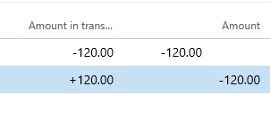](./media/2.png)
    2.  Click **Labels And Resources**, and then click **Resource**. [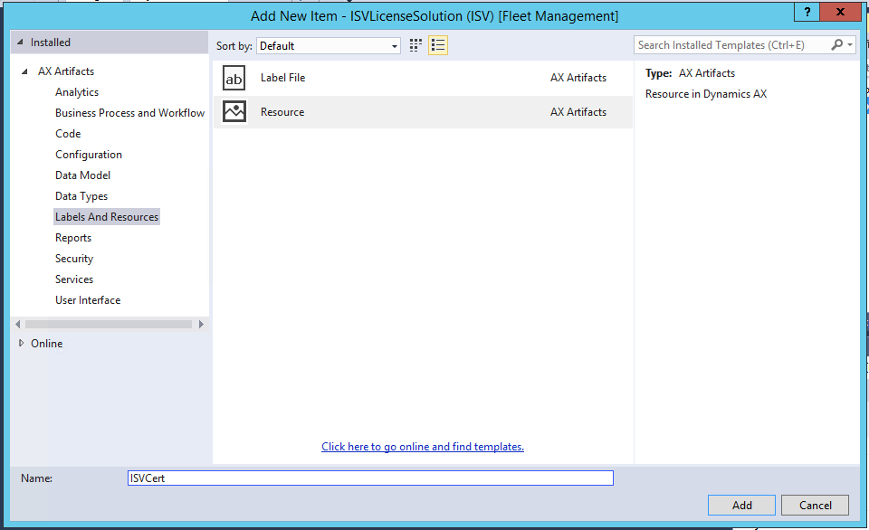](./media/3.png)
    3.  Select the certificate's public key as the resource. 
    4.  Add the certificate as a resource. 

3.  Create a license code. [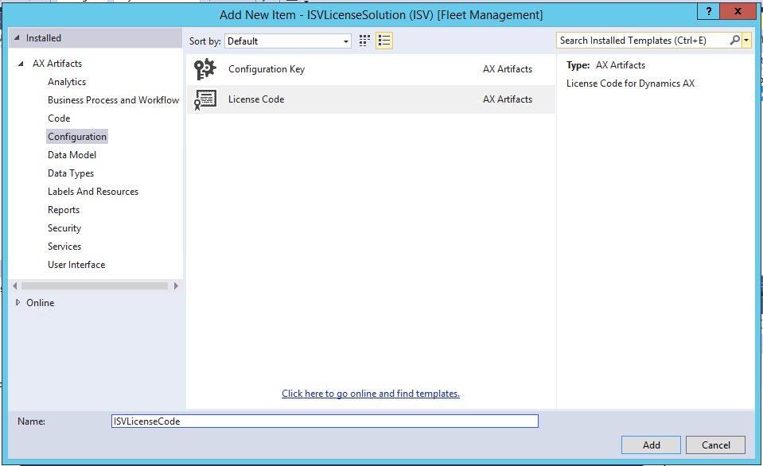](./media/6.png)
4.  Map the certificate to the license code. [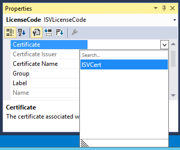](./media/7.png)
5.  Create one or more configuration keys. [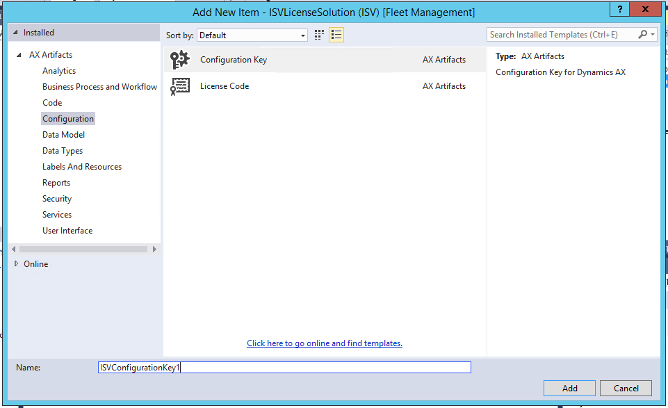](./media/8.png)
6.  Associate the license code with the configuration keys. [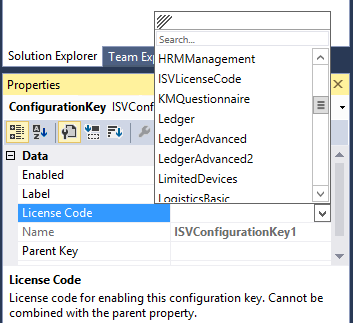](./media/9.png)
7.  Associate a configuration key to an element in your solution. For example, create a new form. [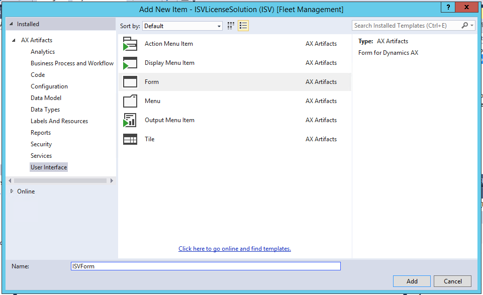](./media/10.png)
8.  Add a button to the form. [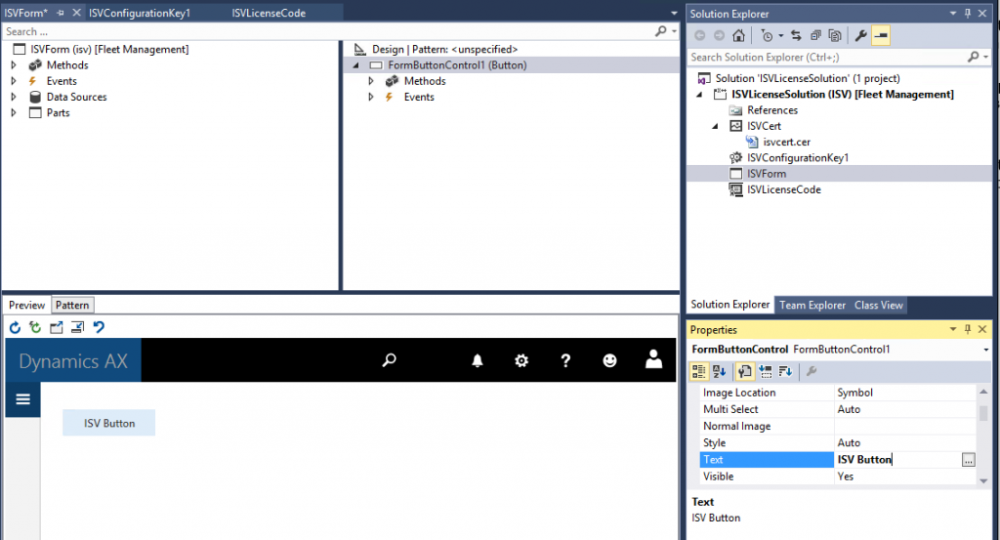](./media/11.png) The button will be visible, because it isn't controlled by a configuration key at first. [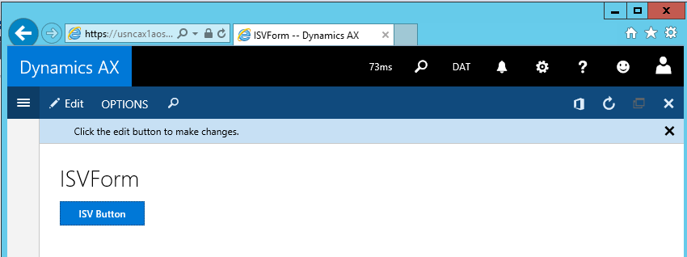](./media/12.png)
9.  Associate a configuration key with the button.  The button will no longer be visible, because the configuration key must be available and enabled. [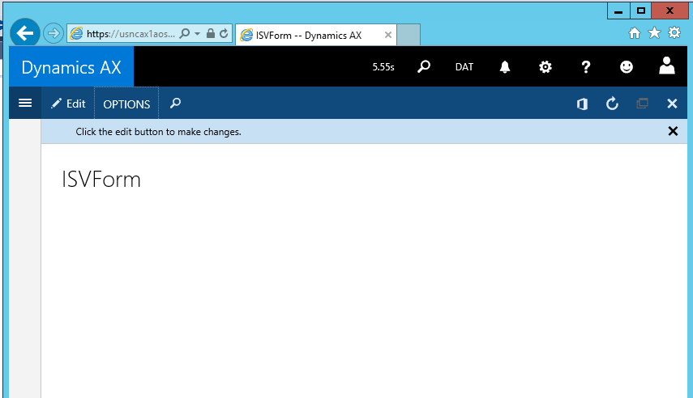](./media/14.png)

## Create a package and generate a customerspecific license
1.  Collect the tenant name and ID for the customer to issue the license to. (You can find this information at **Settings** &gt; **About**.) [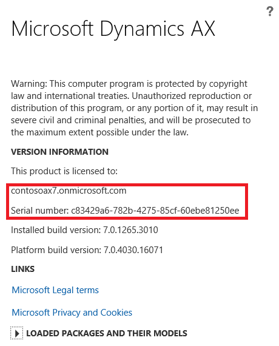](./media/15.png)
2.  Generate a license for the customer (tenant ID and name), and sign the license by using the certificate's private key.You must pass the following parameters to the **axutil genlicense** command to create the license file.

    | Parameter name  | Description                                                                  |
    |-----------------|------------------------------------------------------------------------------|
    | file            | The name of your license file.                                               |
    | licensecode     | The name of your license code (from Microsoft Visual Studio).                |
    | certificatepath | The path of your certificate's private key.                                  |
    | password        | The password for your certificate's private key.                             |
    | customer        | The customer's tenant name (from the screen shot under step 1).              |
    | serialnumber    | The customer's tenant ID (labeled "Serial number" in the screen shot).       |
    | expirationdate  | Optional: The expiration date for the license.                               |
    | count           | Optional: The number/count that custom validation logic can use as required. |

    Here is an example.

        C:\AOSService\PackagesLocalDirectory\Bin\axutil genlicense /file:c:templicense.txt /certificatepath:c:tempisvcert.pfx /licensecode:ISVLicenseCode /customer:TAEOfficial.ccsctp.net /serialnumber:4dbfcf74-c5a6-4727-b638-d56e51d1f381 /password:********

     

3.  Import the license into the target environment. **Note:** In production systems, you complete this step from Microsoft Dynamics Lifecycle Services (LCS), by using a deployable package. For more information, see the "Production environments" section later in this article.

    | Parameter name                | Description                                                                                            |
    |-------------------------------|--------------------------------------------------------------------------------------------------------|
    | --setupmode importlicensefile | Use this parameter to inform the setup tool that a license will be loaded.                             |
    | --metadatadir                 | Use this parameter to specify the metadata directory. You should use the default packages directory.   |
    | --bindir                      | Use this parameter to specify the binaries directory. You should use the default packages directory.   |
    | --sqlserver                   | Use this parameter to specify the Microsoft SQL Server. For one-box environment, use a period (**.**). |
    | --sqluser                     | Use this parameter to specify the SQL Server user. You should pass in **AOSUser**.                     |
    | --sqlpwd                      | Use this parameter to specify the SQL Server password.                                                 |
    | --licensefilename             | Use this parameter to specify the license file that will be loaded.                                    |

    Here is an example.

        C:\AOSService\PackagesLocalDirectory\Bin\Microsoft.Dynamics.AX.Deployment.Setup.exe --setupmode importlicensefile --metadatadir c:packages --bindir c:packages --sqlserver . --sqldatabase axdbrain --sqluser AOSUser --sqlpwd ******** --licensefilename c:templicense.txt

4.  The corresponding configuration key will be available and enabled on the **License configuration** page. By default, the configuration is enabled. For example, see the **ISVConfigurationKey1** configuration key in the following screen shot. [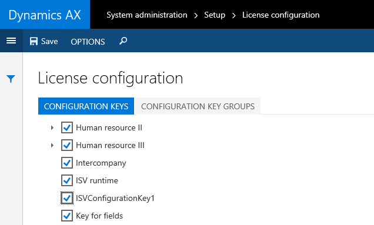](./media/18.png)
5.  In non-production installations, you must start the database synchronization process from Visual Studio.

After the configuration key is enabled, the button become visible, as shown in the following screen shot. [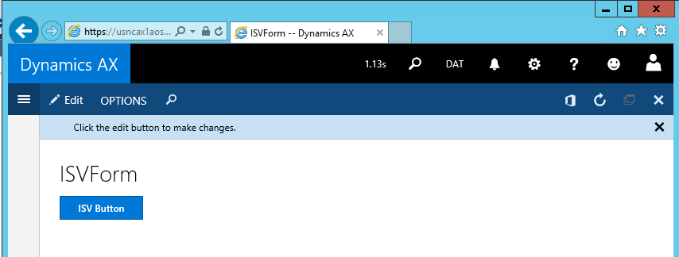](./media/19.png)

## Protection best practices
In Microsoft Dynamics 365 for Operations, solutions can be delivered in two forms:

-   Model files (source code)
-   Deployable packages (binary)

To protect your configuration keys and license codes, we recommend that you release them in binary form, by using a deployable package. Customers will then be able to install and interact with those elements in Visual Studio. Although customers will be able to refer to items in the deployable package, they won't be able to access source code or make modifications to the items. (However, they can create extensions.) More details about the capability to release solutions in binary form will be available soon. The deployable package (binary) can also include classes and other logic that your customer doesn't require access to and should not be able to customize. [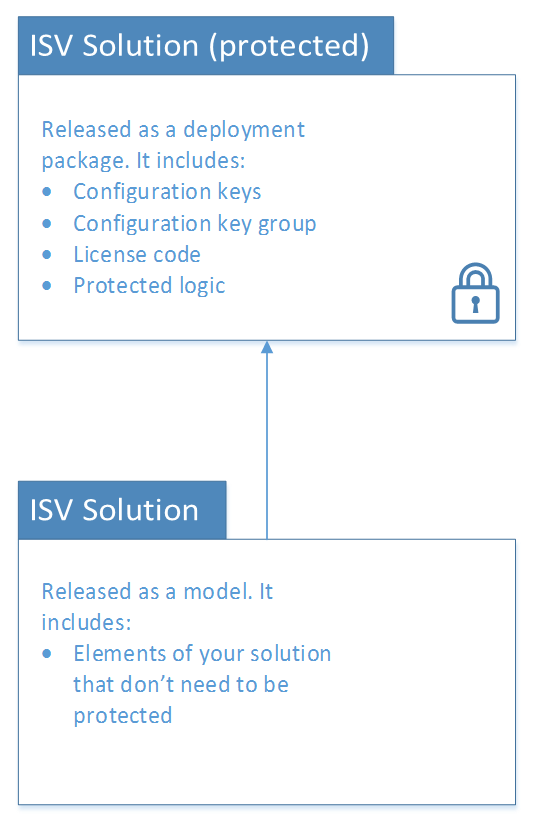](./media/20.png)

## Production environments
To install ISV licenses in production systems, you must use a deployable package through LCS. You can find a template package for configuration mode at the following location in all Dynamics 365 for Operations installations: &lt;PackagesFolder&gt;\\bin\\CustomDeployablePackage\\ImportISVLicense.zip (Packages folder is typically under j:\\AOSService\\PackagesLocalDirectory or c:\\AOSService\\PackagesLocalDirectory\\) 

1.  Make a copy of the package template.
2.  Put the license file in the following folder within the package template: ImportISVLicense.zipAosServiceScriptsLicense

More than one license can be installed at a time. If one of the licenses depends on another, make sure that it's named accordingly. (Licenses are installed in alphabetical order.)

## Appendix: Create selfsigned certificates for test purposes
**Note:** Self-signed certificates can be used only during development. They aren't supported in production environments.

1.  For test purposes, create a self-signed CA certificate. Use the Visual Studio tools prompt to run the following command.

        makecert -r -pe -n "CN=IsvCertTestAuthority O=IsvCertTestAuthority" -ss CA -sr LocalMachine -a sha256 -len 2048 -cy authority -sky signature -b 01/01/2016 -sv c:tempCA.pvk c:tempCA.cer

    For more information, see <https://msdn.microsoft.com/en-us/library/windows/desktop/aa386968(v=vs.85).aspx>.

2.  Create a certificate by using the CA.

        makecert -pe -n "CN=IsvCertTest O=IsvCertTest" -ss ISVStore -sr LocalMachine -a sha256 -len 2048 -cy end -sky signature -eku 1.3.6.1.5.5.7.3.3 -ic c:tempca.cer -iv c:tempca.pvk -b **/**/**** -sv c:tempisvcert.pvk c:tempisvcert.cer

3.  Convert the ISV certificate to PFX format.

        pvk2pfx -pvk c:tempisvcert.pvk -spc c:tempisvcert.cer -pfx c:tempisvcert.pfx -po ********

4.  For a test scenario, import the self-signed CA certificate manually on all the AOS instances.

        certutil -addstore root c:tempca.cer

    However, if a self-signed ISV certificate was used, that certificate must be imported instead of the CA certificate.

        certutil -addstore root c:tempisvcert.cer

