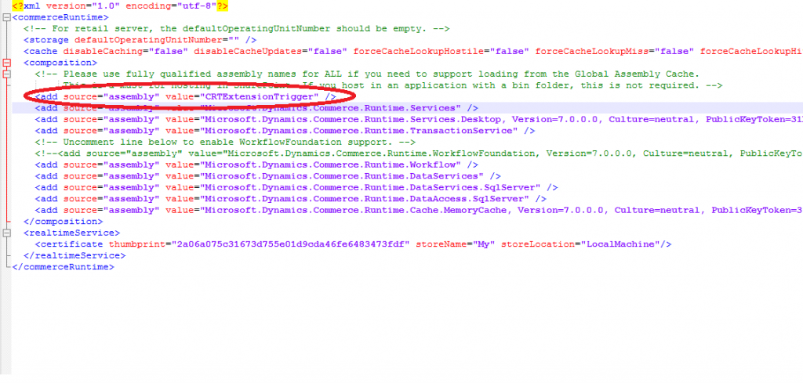

---
# required metadata

title: Commerce runtime extensibility and triggers
description: This article explains trigger support for the Microsoft Dynamics AX commerce runtime (CRT). CRT supports pre-triggers and post-triggers for every request.
author: RobinARH
manager: AnnBe
ms.date: 2015-12-04 20 - 30 - 09
ms.topic: article
ms.prod: 
ms.service: Dynamics365Operations
ms.technology: 

# optional metadata

# ms.search.form: 
# ROBOTS: 
audience: Developer
# ms.devlang: 
ms.reviewer: RobinARH
ms.search.scope: AX 7.0.0, Operations
# ms.tgt_pltfrm: 
ms.custom: 17731
ms.assetid: 7bda83e5-28bf-441b-936d-e08566132352
ms.search.region: Global
ms.search.industry: Retail
ms.author: sijoshi
ms.dyn365.intro: Feb-16
ms.dyn365.version: AX 7.0.0

---

# Commerce runtime extensibility and triggers

This article explains trigger support for the Microsoft Dynamics AX commerce runtime (CRT). CRT supports pre-triggers and post-triggers for every request.

CRT trigger overview
--------------------

Commerce runtime (CRT) triggers give you a way to extend the CRT workflow, and let you add business logic before and after every CRT request is executed. The following two methods are used:

-   **OnExecuting** – This method is invoked before a request has been processed by a corresponding **IRequestHandler** implementation.
-   **OnExecuted** – This method is invoked after the request has been processed by a corresponding **IRequestHandler** implementation.

## CRT trigger interface
To implement a trigger, you must complete these tasks, as shown in the code example that follows:

1.  Implement **IRequestTrigger**.
2.  Specify **SupportedRequestTypes** to define the request types that the trigger must be executed for.
3.  Write a trigger implementation in the **OnExecuting** method if business logic must be run before the request is addressed.
4.  Write a trigger implementation in the **OnExecuted** method if business logic must be run after the request is addressed.

<!-- -->

    /// 

    /// The interface for request trigger.
    /// 

    public interface IRequestTrigger
    {
        /// 

        /// Gets the collection of request types supported by this trigger.
        /// 

        /// <remarks>If null or empty collection returned trigger will be called for all request.</remarks>
        IEnumerable<Type> SupportedRequestTypes { get; }
        /// 

        /// Invoked before request has been processed by <see cref="IRequestHandler"/>.
        /// 

        /// <param name="request">The incoming request message.</param>
        void OnExecuting(Request request);
        /// 

        /// Invoked after request has been processed by <see cref="IRequestHandler"/>.
        /// 

        /// <param name="request">The request message processed by handler.</param>
        /// <param name="response">The response message generated by handler.</param>
        void OnExecuted(Request request, Response response);
    }

## Trigger CommerceRunTime.config updates
When you extend the CRT, make sure that you always write your extension in your own assembly. After you write the trigger extension in your assembly, you must add an entry in the **composition** section of the .config file for the CRT, so that the trigger is loaded at run time. The following example shows a .config file that includes an entry for a trigger implementation in the **CRTExtensionTrigger** assembly. 

