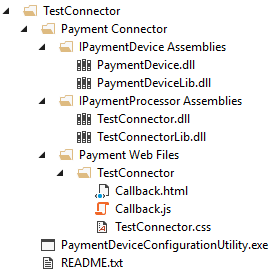

---
# required metadata

title: Create a Windows installer for a payment connector
description: This topic describes how to create a Windows installer for a payment connector. This topic is targeted at developers working for or with a payment connector provider, for example, MasterCard or Visa, to describe how to package a payment connector, which can then be shared with Dynamics 365 for Operations implementation partners working for specific customers. 
author: MargoC
manager: AnnBe
ms.date: 2016-08-19 00 - 18 - 05
ms.topic: article
ms.prod: 
ms.service: Dynamics365Operations
ms.technology: 

# optional metadata

# ms.search.form: 
# ROBOTS: 
audience: Developer
# ms.devlang: 
# ms.reviewer: 61
ms.search.scope: AX 7.0.0, Operations
# ms.tgt_pltfrm: 
ms.custom: 141573
ms.assetid: e0263e68-8e60-4339-9ed0-90d31ce174e7
ms.search.region: Global
# ms.search.industry: 
ms.author: yabinl
ms.dyn365.intro: Feb-16
ms.dyn365.version: AX 7.0.0

---

# Create a Windows installer for a payment connector

This topic describes how to create a Windows installer for a payment connector. This topic is targeted at developers working for or with a payment connector provider, for example, MasterCard or Visa, to describe how to package a payment connector, which can then be shared with Dynamics 365 for Operations implementation partners working for specific customers. 

After you've implemented and tested your payment connector in the development environment, you must create an installer to transfer the payment connector to a retailer IT professional or a value-added reseller (VAR) for production deployment. For more information, see [Implement a payment connector and a payment device](http://download.microsoft.com/download/4/D/7/4D7C6B05-0C23-4C6C-BA13-AB62ED08AA61/The%20Guide%20to%20Implementing%20Payment%20Connector%20and%20Payment%20Device.docx).

## Windows Installer
Microsoft Windows Installer (MSI) is the application and configuration service for Microsoft Windows. You must create an installer that contains all the files that are required in order to deploy a payment connector. The installer itself doesn't deploy the payment connector. It just unzips and copies the connector files to a designated folder. The next section of this topic defines the contents of that folder. You can configure the installer to require that customers accept a user agreement before they can continue with the installation. You can also choose your preferred format for the installer. For example, you can have an .exe file.

## Installer contents
The installer must install the required files in the following structure:

-   **Payment Connector** – This folder contains up to three subfolders:
    -   **IPaymentDevice Assemblies** – This folder contains the assembly that implements the IPaymentDevice interface and its dependent assemblies. These assemblies are used in Hardware station and Retail Modern POS to communicate with payment terminal devices, such as VeriFone MX925. If you don’t support a payment terminal device, you can omit this folder.
    -   **IPaymentProcessor Assemblies** – This folder contains the assembly that implements the IPaymentProcesor interface and its dependent assemblies.
    -   **Payment Web Files** – This folder contains the callback HTML/JavaScript/CSS files that are required in order to enable the payment accepting page. If the payment accepting web app follows the Microsoft implementation guide, these payment web files aren't required, and you can omit this folder. In some cases, the payment accepting page requires that a callback page be deployed to the host application server. In that case, you must include a folder for the callback page:
        -   **&lt;Payment\_Connector\_Name&gt;** – To avoid file conflicts from different payment connectors, the payment web files must be placed inside subfolders. We recommend that you use the connector name as the name of the subfolder.
-   **Other utility tools** – If you have other utility tools, such as a configuration utility for a payment terminal device, you can include them here. If you don’t support any payment terminal devices, you can omit these files. The utility tool should be designed to interact only with the payment terminal devices. It should not interact with anything in Hardware station or Modern POS. Hardware station and Modern POS will be packaged together with files from the Payment Connector folder.
-   **README.txt** – This file describes the contents of the folder and how to use any utilities that are included. The file must also include the payment page URLs that are required in the Cloud POS web.config and Modern POS package.appxmanifest files. If you support any payment terminal devices, the file must also mention the name of the assembly that implements the IPaymentDevice interface. The assembly will be registered in the Hardware Station .config file.

The following illustration shows the file structure for a connector that is named TestConnector. 

