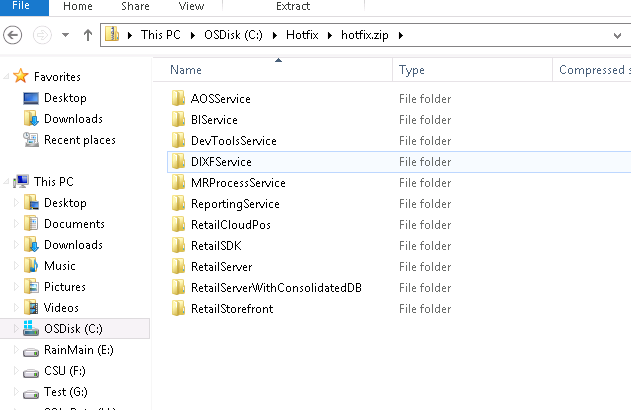
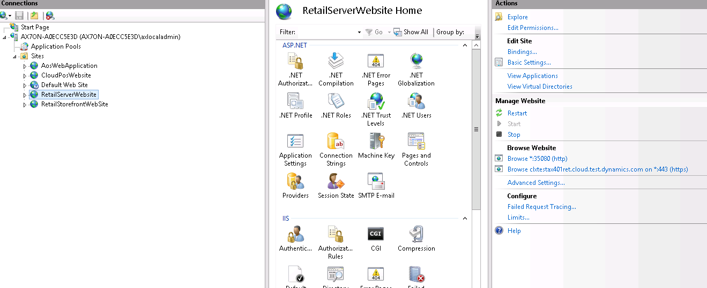
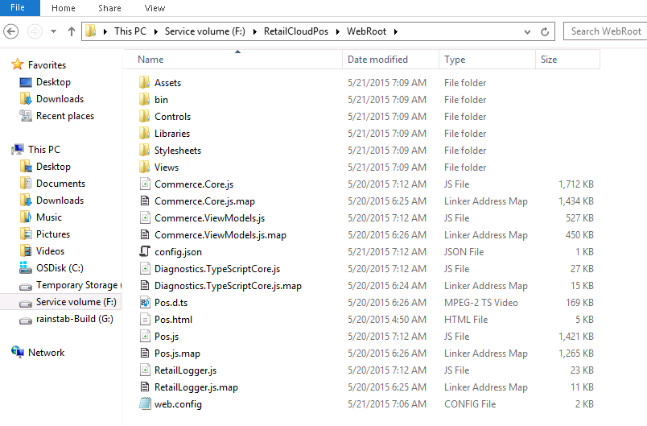
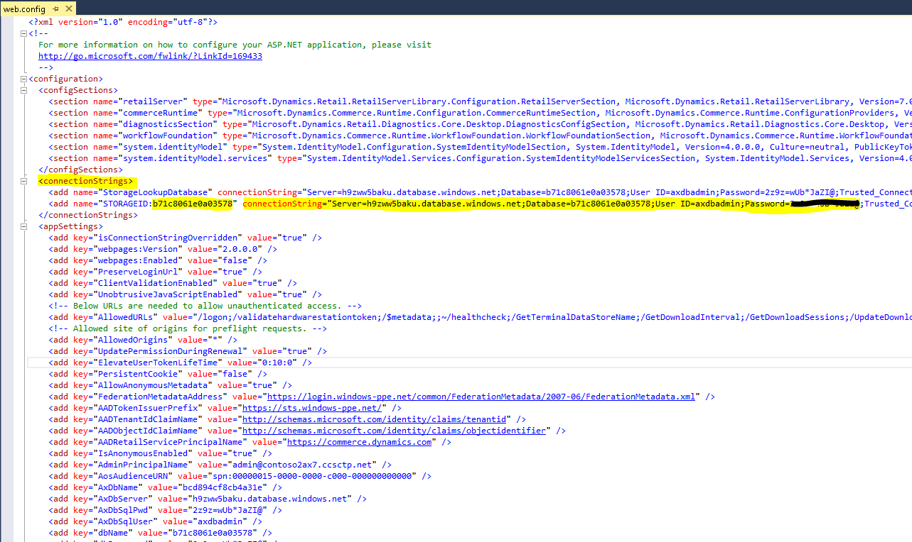
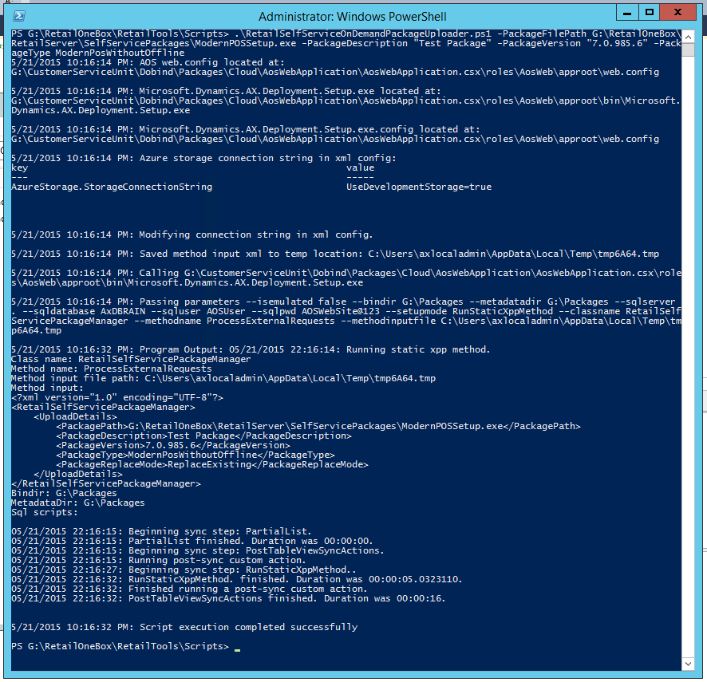

---
# required metadata

title: Install Retail hotfixes
description: Use this tutorial to install Retail hotfixes for Microsoft Dynamics AX.
author: MargoC
manager: AnnBe
ms.date: 2015-12-03 19 - 39 - 22
ms.topic: article
ms.prod: 
ms.service: Dynamics365Operations
ms.technology: 

# optional metadata

# ms.search.form: 
# ROBOTS: 
audience: Developer
# ms.devlang: 
# ms.reviewer: 61
ms.search.scope: AX 7.0.0, Operations
# ms.tgt_pltfrm: 
ms.custom: 15151
ms.assetid: b11893ae-cd59-4af1-99cd-a65ada9672c0
ms.search.region: Global
# ms.search.industry: 
ms.author: aamiral
ms.dyn365.intro: Feb-16
ms.dyn365.version: AX 7.0.0

---

# Install Retail hotfixes

Use this tutorial to install Retail hotfixes for Microsoft Dynamics AX.

Retail server
-------------

1.  Download the hotfix package.
2.  Unzip the package. 
3.  Go to the Retail server files in the extracted zip folder.
4.  Stop the Retail server IIS website. 
5.  Back up files.
6.  Copy Retail server files from the zip folder to the following location:
    -   Navigate to IIS, right-click the RetailServer website and select **Explore**.

7.  Merge the web.config by diffing the current version in this folder with the file in the zip package.
8.  Start the IIS website.

## Cloud POS
##### Follow the same steps as for Retail server (as described above)

You will find the install folder for Cloud POS the same way as for Retail Server, by navigating to IIS, and selecting CloudPOS website, instead of Retail Server website. 

## Channel database
1.  Download the hotfix.
2.  Extract the contents on the Retail Server computer.
3.  Connect to SQL Server where the Channel database is deployed.

### Downloadable VHD

SQL computer is 'localhost.' The password is the same as the one for the computer. Connect to SQL using Windows authentication.

### Cloud deployments

Find the SQL machine name and the credentials to log in to SQL Server in the Retail Server web.config file. You can navigate to the web.config file as described in above sections. Find the following node.

    <connectionStrings>/<add name="STORAGEID:<databasename>

In this node, you'll find the necessary details:

-   Server – The SQL server to connect to.
-   Database – Retail channel database name.
-   User ID – User name.
-   Password

1.  Start SQL Server Management Studio.
2.  Connect to the SQL Server instance with the respective credentials.
3.  Browse to the RetailServer/Scripts folder.
4.  Before you open the web.config file to obtain the connection details, you must first decrypt the file. After you have obtained the connection details, you must encrypt the file again.

    This can be done by running the following commands in command prompt (run with elevated privileges).

        aspnet_regiis -pe "connectionStrings" -app "/" -Site 3
        aspnet_regiis -pd "connectionStrings" -app "/" -Site 3

    Site number in the above commands can be obtained by using the following steps:

    Click the RetailServer website in IIS Manager, and then select Advanced Settings.

    Site ID will be shown under **General &gt; ID**.

5.  Open the upgrade script in SQL Server Management Studio.
6.  Execute the script.

## Selfservice package upload
Run the uploader script from the following location:

-   Downloadable VHD - To upload a self-service package on a Downloadable VHD, obtain the scripts from a cloud deployment, as described above and copy them to the Downloadable VHD.
-   Cloud deployments - F:\\AosService\\RetailTools\\Scripts\\RetailSelfServiceOnDemandPackageUploader.ps1. If you cannot find this folder in the specified drive, look in a different drive on the VM.

### How to use the script and things to know

List of parameters accepted/required.

**Parameter name**

**Required**

**Purpose**

**PackageFilePath**

Yes

The full path to the package file which needs to be uploaded to the cloud storage.

**PackageDescription**

No

A brief description of the package which will be visible from AOS.

**PackageVersion**

Yes

The package file version.

**PackageType**

Yes

The type of the package being uploaded. Currently supported types include:

-   ModernPosWithOffline
-   ModernPosWithoutOffline
-   HardwareStation
-   Miscellaneous (customization option in a future release)

**PackageReplaceMode**

No

Specify the action to be performed if another package exists of the same type. The default is ReplaceExisting.

**AOSWebsiteName**

No

The name of the AOS website as shown in IIS. The default is AosWebApplication

**LogFile**

No

Location or name of the file where all the logs will be stored. The default is RetailSelfServiceOnDemandPackageUploader.log

### Example 1

Upload a package located at *C:\\Packages\\ModernPOSSetup.exe* with version "7.0.968.0" and PackageType as 'ModernPosWithOffline'. If a package exists with the same type in the cloud storage, the existing package will be removed from the storage and replaced with the provided package. .\\RetailSelfServiceOnDemandPackageUploader.ps1 -PackageFilePath *C :\\Packages\\ModernPOSSetup.exe" -PackageVersion "7.0.968.0" -PackageType ModernPosWithOffline*

### Example 2

Upload a package located at *C:\\Packages\\ModernPOSSetup.exe* with version "7.0.968.0" and PackageType as 'ModernPosWithOffline'. If there exists a package of the same type in the cloud storage, it will be removed from the storage. The details required to access the cloud storage will be accessed via the configuration file available for the IIS website 'MyCompanyWebsite'. .\\RetailSelfServiceOnDemandPackageUploader.ps1 -PackageFilePath *C:\\Packages\\ModernPOSSetup.exe" -PackageVersion "7.0.968.0" -PackageType ModernPosWithOffline -AOSWebsiteName "MyCompanyWebsite*   

