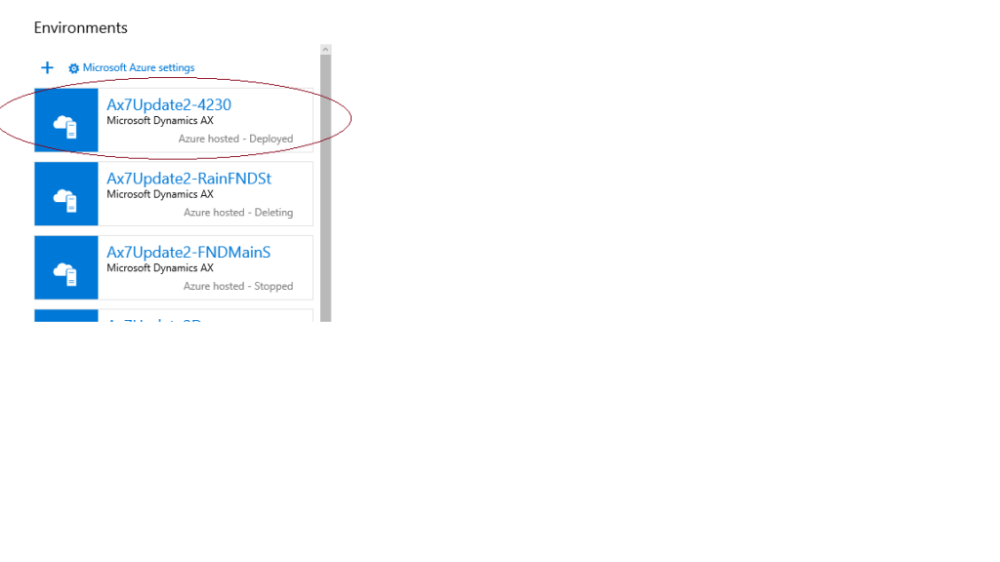
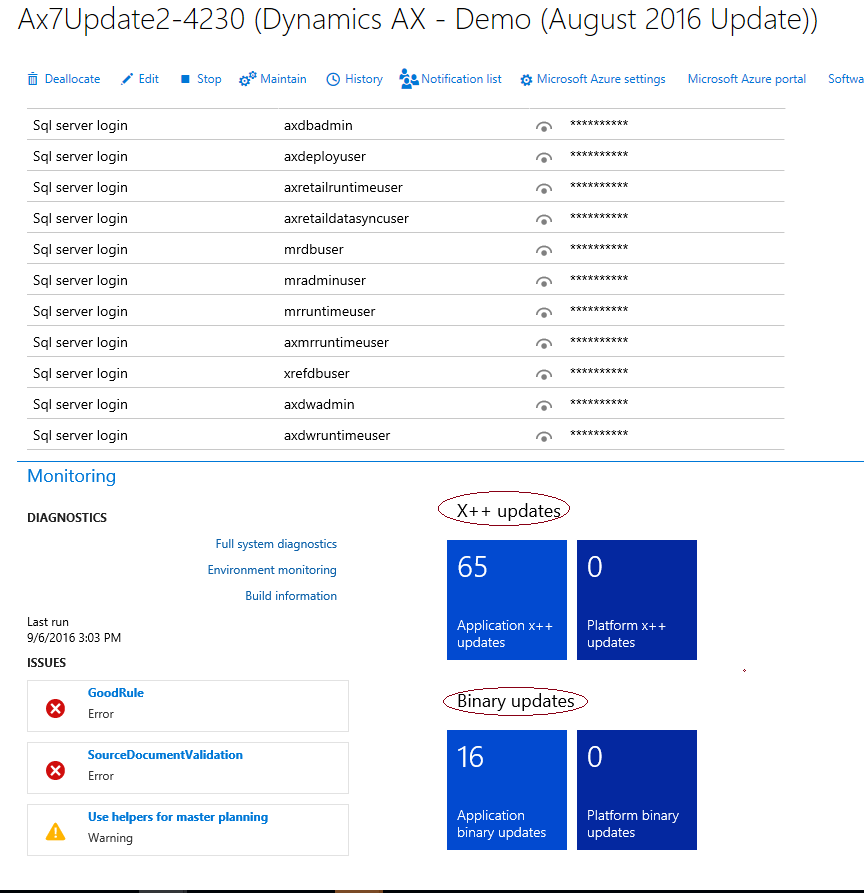
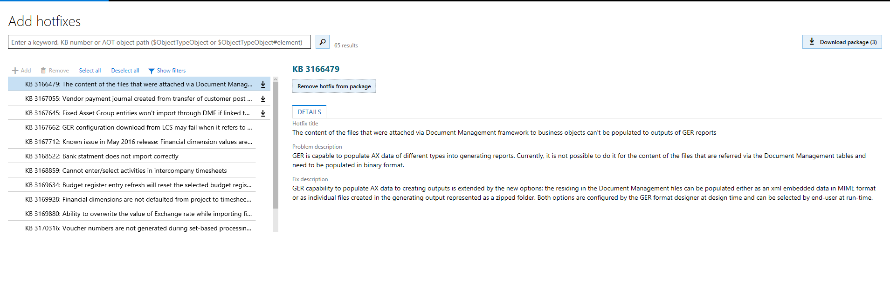

---
# required metadata

title: Download hotfixes from Lifecycle Services
description: Use this tutorial to download the Microsoft Dynamics AX hotfixes from Lifecycle Services (LCS).
author: kfend
manager: AnnBe
ms.date: 2016-02-26 19 - 53 - 09
ms.topic: article
ms.prod: 
ms.service: Dynamics365Operations
ms.technology: 

# optional metadata

# ms.search.form: 
# ROBOTS: 
audience: Developer
# ms.devlang: 
# ms.reviewer: 51
ms.search.scope: AX 7.0.0, Operations
# ms.tgt_pltfrm: 
ms.custom: 56171
ms.assetid: 1a314a26-3ef1-4ca9-9598-56276170b576
ms.search.region: Global
# ms.search.industry: 
ms.author: anupams
ms.dyn365.intro: Feb-16
ms.dyn365.version: AX 7.0.0

---

# Download hotfixes from Lifecycle Services

Use this tutorial to download the Microsoft Dynamics AX hotfixes from Lifecycle Services (LCS).

This tutorial will guide you through downloading the newest version of Microsoft Dynamics hotfix from Lifecycle services (LCS).  This tutorial is a part of the [Servicing environments](developer-landing-page.md#servicing-environments) content.

1.  Log in to LCS with your credentials.
2.  Select an environment from the LCS project. 
3.  On the **Environment** page, **Monitoring** is shown in two sections, **X++ updates** and **Binary updates**. The update tiles show the hotfixes that are relevant or required for your environment. For example, if a specific X++ hotfix is already installed on your environment, we will not include that X++ hotfix in the  X++ updates.There are 2 kinds of X++ hotfixes, Application X++ updates and Platform X++ updates. There are 2 kinds of Binary updates. Application binary updates and Platform binary updates. 
4.  Select one of the update tiles to view the list of available hotfixes that can be used to create a hotfix package for download.
5.  Select the applicable KBs, and then click **Add hotfix to package**. 
6.  Click **Download package** to download the hotfix package.  After you select **Download package**, the **Review and download hotfixes** page will open. Use this page to review selected hotfixes, discard the package, return to the hotfix selections, or download the final package. 

This tutorial is a part of the [Servicing environments](developer-landing-page.md#servicing-environments) content.

