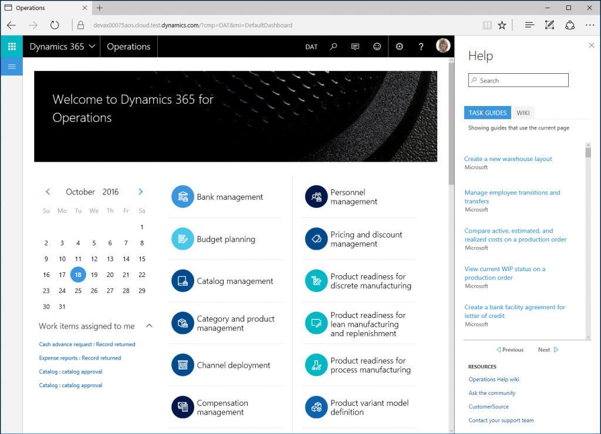
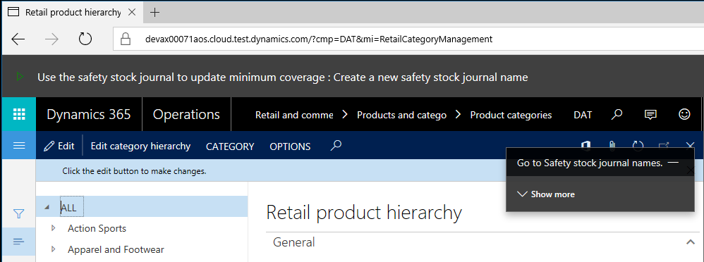
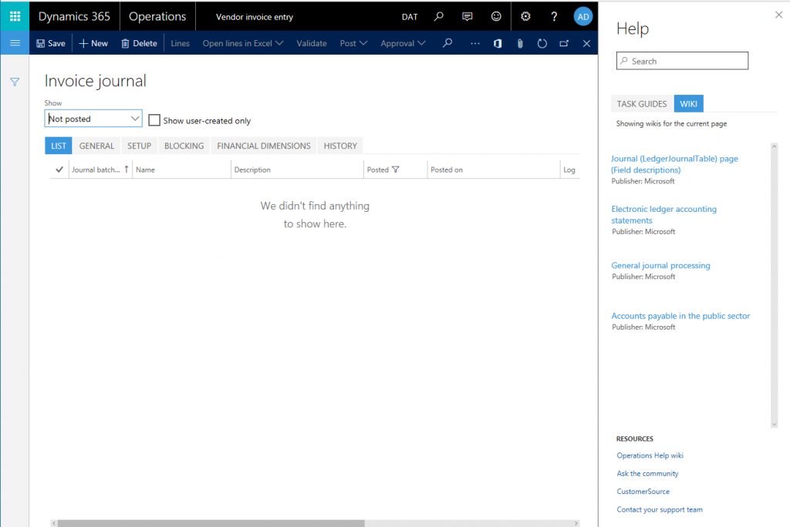
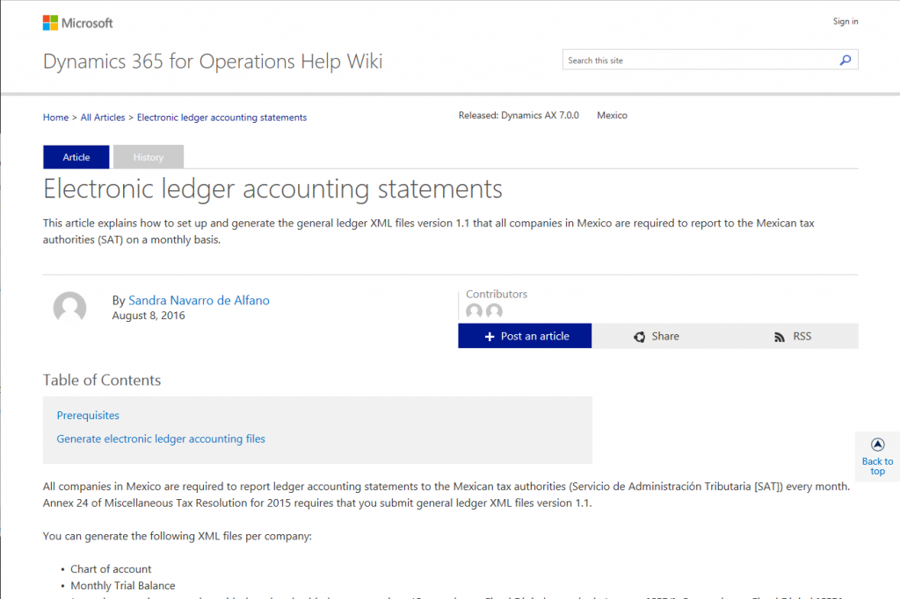

---
# required metadata

title: Getting started with Help
description: This article provides an overview of the components of the Microsoft Dynamics 365 for Operations Help system. It also explains how you can provide custom documentation and training to your organization. 
author: annbe
manager: AnnBe
ms.date: 2015-12-04 02 - 12 - 46
ms.topic: article
ms.prod: 
ms.service: Dynamics365Operations
ms.technology: 

# optional metadata

# ms.search.form: 
# ROBOTS: 
audience: Application User, Developer, IT Pro
# ms.devlang: 
ms.reviewer: annbe
ms.search.scope: AX 7.0.0, Operations
# ms.tgt_pltfrm: 
ms.custom: 16381
ms.assetid: 309207aa-d5a3-41cd-ba4e-3abf198648fb
ms.search.region: Global
# ms.search.industry: 
ms.author: annbe
ms.dyn365.intro: Feb-16
ms.dyn365.version: AX 7.0.0

---

# Getting started with Help

This article provides an overview of the components of the Microsoft Dynamics 365 for Operations Help system. It also explains how you can provide custom documentation and training to your organization. 

Dynamics 365 for Operations includes a Help system that is based on two main components:

-   A wiki
-   Task guides

You can access both wiki articles and task guides from the Help pane in Dynamics 365 for Operations as shown in the following screen shot.  This article describes the Help system, and explains how you can create custom documentation and training resources for your organization.

## The wiki
The Dynamics 365 for Operations Help wiki ([ax.help.dynamics.com](http://ax.help.dynamics.com/en/)) is the primary source of product documentation for Dynamics 365 for Operations. The wiki offers the following features:

-   **Access to the most up-to-date content** – The wiki gives us a faster and more flexible way to create, deliver, and update product documentation. Therefore, it helps guarantee that you have access to the latest technical information.
-    **Content that is written by experts** – The wiki provides a richer set of product documentation that can be enhanced by community members both inside and outside Microsoft.
-   ** Access to different types of content** – The wiki lets you quickly access different types of content about Dynamics 365 for Operations, such as Microsoft Office Mix presentations, task guides, videos, and wiki articles.
-    **Content that supports your business processes** – The wiki includes business process–focused content that takes advantage of the Business Process Modeler (BPM) in Microsoft Dynamics Lifecycle Services (LCS).

We’re very excited about our wiki and hope that you will be too.

### When can we use it?

You can read content on the wiki right now -- it is fully public and searchable without requiring sign-in. You can use any of your favorite search engines to find content. You can comment, or contribute additional content to the wiki if you choose, by signing in with a Microsoft account (Hotmail, LiveID, or Outlook.com account) associated with an MSDN profile.

### How can I set up RSS feeds?

RSS feeds are easy to set up for wiki content. The following table lists RSS feeds for the wiki, and describes how to create your own feeds. Note that not all browsers support RSS feeds (Edge and Chrome do not, Internet Explorer does). You can use your favorite feed reader to consume RSS feeds.

|                                          |                                                                                                                                                                                                                                                                                                                   |
|------------------------------------------|-------------------------------------------------------------------------------------------------------------------------------------------------------------------------------------------------------------------------------------------------------------------------------------------------------------------|
| **Description**                          | **Feed URL**                                                                                                                                                                                                                                                                                                      |
| New posts                                | https://ax.help.dynamics.com/en/revisions/                                                                                                                                                                                                                                                                        |
| Updates to a particular wiki topic       | https://ax.help.dynamics.com/en/wiki/*pagename*/revisions Example RSS feed for the Help and UI home page: <getting-started-home-page.mdrevisions>                                                                                                                               |
| New topics for a specific audience       | https://ax.help.dynamics.com/en/feed/?post\_type=incsub\_wiki& wds\_audience=*audience* Example RSS feed for Developer topics: [https://ax.help.dynamics.com/en/feed/?post\_type=incsub\_wiki& wds\_audience=developer](https://ax.help.dynamics.com/en/feed/?post_type=incsub_wiki&%20wds_audience=developer%20) |
| New topics for a specific industry       | https://ax.help.dynamics.com/en/feed/?post\_type=incsub\_wiki&wds\_industry=*industry* Example RSS feed for Distribution topics: <https://ax.help.dynamics.com/en/feed/?post_type=incsub_wiki&wds_industry=distribution>                                                                                          |
| New topics for a specific wiki category  | https://ax.help.dynamics.com/en/feed/?post\_type=incsub\_wiki&incsub\_wiki\_category=*capability* Example RSS feed for BI topics: <https://ax.help.dynamics.com/en/feed/?post_type=incsub_wiki&incsub_wiki_category=bi>                                                                                           |
| New topics for a specific country/region | https://ax.help.dynamics.com/en/feed/?post\_type=incsub\_wiki&wds\_country\_region=*country\_region* Example RSS feed for Australian topics: <https://ax.help.dynamics.com/en/feed/?post_type=incsub_wiki&wds_country_region=aus>                                                                                 |

**Audience values for RSS feeds:** Application user (user), Developer, IT Pro (itpro) **Industry values for RSS feads:** Distribution, Manufacturing , Retail, Public sector (publicsector), Service industries (services) **Category values for RSS feeds:** Accounts payable (accounts-payable), Accounts receivable (accounts-receivable), Analytics, Bank and cash management (bank-and-cash-management), Batch orders (batch-orders), BI & Reporting (bi), Budgeting, Call center (call-center-retail), Channels, Commerce essentials (commerce-essentials), Consolidations, Cost management (costmanagement), Credit and Collections (credit-and-collections), Credit and collections (credit-and-collections), Customer service (customer-service), Data management (data-management), Development, Dimensions, Discrete manufacturing (discrete-manufacturing), Distribution & warehousing (distribution-warehousing), Embedded BI (embedded-bi), Expense management (expense-management), Financial management (financials), Financial reporting (financial-reporting), Fixed assets (fixed-assets), Fleet management example application (fleet-management), General ledger (general-ledger), Human Capital Management (hcm), Inventory management (inventory-management), Lean manufacturing (lean-manufacturing), Lifecycle Services (lifecycle-services-capability), Localization, Management reporter (management-reporter), Manufacturing, Master planning (master-planning), Mobile & Windows Apps (mobileandwindowsapps), Organization administration (organization-administration), Payment processing (payment-processing), Payroll, Power BI integration (powerbi-integration), Process manufacturing (process-manufacturing), Procurement & Sourcing (procurementandsourcing), Product Information Management (productinformationmanagement), Production control (production-control), Project management and accounting (project-management-and-accounting), Projects, Questionnaire, Retail, Sales, Sales marketing and customer service (salesmarketingcustomerservice), Sales tax (sales-tax), Service management (servicemanagement), System administration (system-administration), Tax, Time and attendance (time-and-attendance), Trade allowance management (trade-allowance-management), Transportation management (transportation-management), Travel & Expense (travelandexpense), UI, Warehouse management (warehouse-management) **Country/Region values for RSS feads:** Australia (aus), Austria (aut), Belgion (bel), Brazil (bra), Canada (can), China (chn), Czech Republic (cze), Denmark (dnk), Estonia (est), Finland (fin), France (fra), Germany (deu), Hungary (hun), Iceland (isl), India (ind), Ireland (irl), Italy (ita), Japan (jpn), Latvia (lva), Lithuania (ltu), Malaysia (mys), Mexico (mex), Netherlands (nld), New Zealand (nzl), Norway (nor), Poland (pol), Russia (rus), Saudia Arabia (sau), Singapore (sgp), South Africa (zaf), Spain (esp), Sweden (swe), Switzerland (che), Thailand (tha), United Kingdom (uk), United States (us)

## Task guides
A task guide is a controlled, guided, interactive experience that leads you through the steps of a task, or business process. You can open (play) a task guide from the Help pane. When you first click a task guide, the Help pane will show the step-by-step instructions for the task. Localized task guides are now available.  To begin the guided, interactive experience, click **Start task guide** at the bottom of the Help pane. A black pointer opens and indicates the action that you have to perform. Follow the directions that appear in the UI, and enter data as directed.  **Important:** The data that you enter when you play a task guide is real. If you're in a production environment, the data will be entered in the company that you’re currently using.

### It all begins with Task Recorder

Task guides are created by using Task Recorder. When you use Task Recorder, all the actions that you perform in the Dynamics 365 for Operations UI (such as clicking menus, changing settings, and entering data) are recorded. The steps that you record are collectively called a task recording. As we explained in the previous section, task recordings can be displayed in the Help pane and played as task guides. However, there are other ways that you can use task recordings:

-   **Save task recordings to BPM** – You can save a task recording to a line of a hierarchy in a BPM library in LCS. When you save a task recording to BPM, a flowchart diagram is generated and displayed, together with the steps of the recording. **Note:** To display a task recording in the Dynamics 365 for Operations Help pane and play it as a task guide, you'll have to save the recording to a BPM library.
-   **Save task recordings as Word documents** – By saving a task recording as a Microsoft Word document, you can easily produce printable training guides for your organization.

For more information about Task Recorder, see [Task recorder in Dynamics 365 for Operations](task-recorder.md).

### Creating customized task recordings

You can create your own task recordings, or you can download and customize task recording that Microsoft provides. Therefore, you can create customized Help for your organization that reflects your specific Dynamics 365 for Operations implementation. To display a task recording in the Dynamics 365 for Operations Help pane and play it as a task guide, you'll have to save the recording to a BPM library in LCS. If you're a partner, and you promote a library to a corporate library and include it in a solution, it will be available to your customers. For complete instructions, see [Using task recordings to create documentation or training](task-recorder.md).

## Inproduct Help
To access Help content within Dynamics 365 for Operations , either click the **Help** (**?**) icon or press Ctrl+Shift+?. In both cases, the Help pane opens. From the Help pane, you can access wiki articles or task guides. 

### Accessing wiki articles from the Help pane

From the Help pane, you can access wiki articles that apply to the Dynamics 365 for Operations client. When you first open the Help pane and click the **Wiki** tab, you’ll see the wiki articles that apply to the page that you’re currently on in Dynamics 365 for Operations. If no wiki articles are found, you can enter keywords to refine your search. When you click a wiki article in the Help pane, a new tab opens in your browser and displays the wiki article. 

### Accessing task guides from the Help pane

Before you can access task guides from the Help pane, a System administrator has to go to the **System parameters** page in Dynamics 365 for Operations and configure some settings. **Notes:**

-   In order to configure help, you must be signed in with an account in the same tenant as the tenant in which Dynamics 365 for Operations is deployed.
-   It is not possible to connect to an LCS library from an instance of Dynamics 365 for Operations running in a local virtual hard drive (VHD).

 On the **System parameters** page, follow these steps:

1.  **Important:** The first time you open the Help tab, you must connect to Lifecycle Services. Be sure to click the link in the middle of the form, wait for the connection, close the dialog box, and then click OK to get to the parameters form.
2.  Select the Lifecycle Services project to connect to.
3.  Select the BPM libraries (within the selected project) to retrieve task recordings from.
4.  Set the display order of the BPM libraries. This determines the order in which task recordings from the libraries will appear in the Help pane.

After a System administrator has completed these steps, you can open the Help pane and click the **Task guides** tab. You'll now see the task guides that apply to the page that you’re currently on in Dynamics 365 for Operations. If no task guides are found, you can enter keywords to refine your search. After you click a task guide in the Help pane, the Help pane shows the step-by-step instructions, and you can play the task guide. 

### Where are the translated task guides?

Translated task guides were shipped in the May APQC Unified Library, and the Getting Started library. In Dynamics 365 for Operations, to see localized task guide help, make sure that you are connected to the May library. The language that a task guide appears in is controlled for each user by the Language settings under **Options** &gt; **Preferences**. **Note:** Even though many task guides have been translated, right now the Dynamics 365 for Operations client is not showing the translated task guide names. Also, only the task guides that were released in February are available in translation in the May library at this point. We will release an updated library with additional translations.

-   If a task guide has been translated, when you open that task guide all the text of the task guide will appear in your selected language.
-   If a task guide has not yet been translated, when you open it, only some of the text (the text of the controls) will appear in your selected language.

## Additional resources
The following table lists websites that provide Dynamics 365 for Operations content. Our content websites are organized to support the customer life cycle. Each phase is supported by a different set of sites. Sites that have an asterisk (\*) next to the name require that you sign in by using an account that is associated with a service plan.

| Site                                                                     | Description                                                                                                                                                                                                                                |
|--------------------------------------------------------------------------|--------------------------------------------------------------------------------------------------------------------------------------------------------------------------------------------------------------------------------------------|
| [Dynamics 365 for Operations Help wiki](http://ax.help.dynamics.com/en/) | Hosts or links to all product documentation for Dynamics 365 for Operations.                                                                                                                                                               |
| [Lifecycle Services](http://lcs.dynamics.com/en/)\*                      | Provides a cloud-based collaborative workspace that customers and partners can use to manage Dynamics 365 for Operations projects from pre-sales to implementation and operations. This site is useful in all phases of an implementation. |
| [CustomerSource](http://www.customersource.com/)\*                       | Hosts extensive training resources and is the primary support site for Dynamics 365 for Operations. Sign in may be required to access specific resources on the site.                                                                      |
| [Support blog](http://aka.ms/AXSupportBlog)                              | Provides tips and tricks that are posted by the Dynamics 365 for Operations Support team.                                                                                                                                                  |
| [MSDN](http://aka.ms/AXMSDN)                                             | Hosts content from previous releases that is written for developers.                                                                                                                                                                       |
| [TechNet](http://aka.ms/TechNet)                                         | Hosts content from previous releases that is written for IT professionals and application users.                                                                                                                                           |
| [Dynamics Community](http://community.dynamics.com/en/)                  | Hosts blogs, forums, and videos.                                                                                                                                                                                                           |
| [Microsoft.com/Dynamics/](//www.microsoft.com/dynamics/)                 | Provides evaluation and sales information.                                                                                                                                                                                                 |

See also
--------

[Dynamics 365 for Operations help system (downloadable fact sheet)](https://mbs.microsoft.com/files/public/CS/AX2012R3/DynamicsAXHelpSystemFactSheet.pdf)

[Task Recorder in Microsoft Dynamics 365 for Operations](task-recorder.md)

[Create documentation or training using Task recordings](task-recorder.md)

[New task guides available (February 2016)](new-task-guides-available-february-2016.md)

[New or updated task guides available (May 2016)](new-updated-task-guides-available-may-2016.md)

[New or updated task guides available (August 2016)](new-updated-task-guides-available-august-2016.md)

